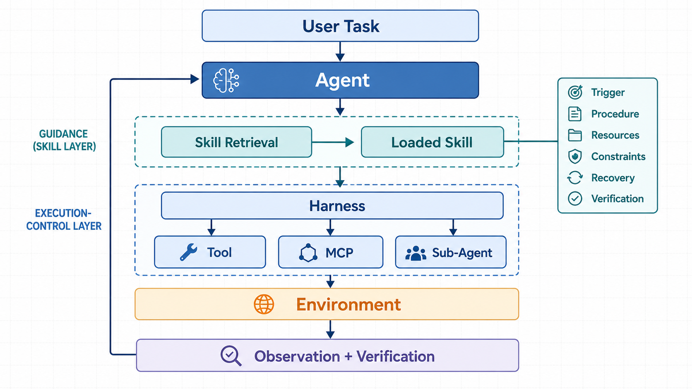

# Agent Skill：可复用的程序性知识与工程化运行机制

## 今天学习的是什么

在传统的大语言模型应用中，用户给出问题，模型生成答案；进入 Agent 阶段后，模型还要连续选择动作、调用工具、读取环境反馈并判断任务是否完成。问题因此从“模型是否知道答案”变成了“模型能否在很长的执行链中持续做对”。

Agent Skill 正是为这类问题出现的一层工程抽象。它把完成某类任务的方法组织为可复用、可发现、可加载的程序性知识，使 Agent 不必每次都从巨大的行动空间中重新摸索流程。

本文沿着一条完整主线展开：先定义 Skill，说明它为什么能提高长任务的稳定性；再区分 Prompt、Tool、MCP、Agent、Memory 与 Harness；随后解释 Skill 的加载和运行过程、目录结构、检索难题与生命周期；最后给出设计和评估一个 Skill 的方法。

## 从“知道”到“稳定做到”

知识可以分为两类：

- **陈述性知识**回答“是什么”。例如 Redis 的默认端口是 6379。
- **程序性知识**回答“应该怎样做”。例如线上 Redis 连接失败时，应依次检查进程、端口、网络、认证、连接池和日志，并在修复后重新执行健康检查。

模型可能已经知道排障涉及的每一项知识，却仍会在执行中跳步、过早修改代码、忘记验证，或者在一次失败后任意转向。Skill 的核心价值不是简单增加事实，而是给执行过程提供一条经过组织的路径。

可以把它定义为：

> **Agent Skill 是面向一类任务的可复用程序性知识包。它描述适用条件、执行步骤、所需资源、行为约束、失败处理和完成标准。**

这一定义中的“一类任务”很重要。一次性的具体要求通常属于 Prompt；能够在多个相似任务上重复使用的做事方法，才适合沉淀为 Skill。

## Skill 在 Agent 系统中的位置



*AI 生成示意图：图中把 Skill 放在指导层，把 Harness 放在执行控制层。阅读重点是：Skill 影响 Agent 的决策路径，但真正的工具调用、权限、超时和环境交互仍由 Harness 承载。*

这套分层可以用几个问题来区分：

| 概念 | 它回答的问题 | 主要职责 |
|---|---|---|
| LLM | 我能够推理出什么？ | 语言理解、推理与生成 |
| Agent | 下一步应该做什么？ | 根据目标与反馈进行动态决策 |
| Skill | 这类任务通常应该怎样做？ | 提供可复用的局部流程和约束 |
| Tool | 我能够执行什么动作？ | 暴露搜索、计算、读写或调用等具体能力 |
| MCP | 怎样用统一协议访问外部能力与上下文？ | 标准化工具、资源和提示的连接方式 |
| Memory | 以前发生过什么？ | 保存历史事实、状态或经历 |
| RAG | 当前需要找回什么信息？ | 检索与任务相关的知识片段 |
| Harness | 怎样让执行安全、可靠地运行？ | 工具调度、权限、沙箱、超时、上下文与生命周期 |
| Evaluator | 结果是否真的成功？ | 检查产物、测试结果和完成条件 |

这些概念不是互相替代的关系。一个排查线上 API 延迟的 Skill 可以规定先确认异常时间，再比较延迟分位数、部署记录、错误率、数据库和外部依赖；它会调用日志、监控、数据库等 Tool，而这些 Tool 可能通过 MCP 暴露。Agent 根据观察结果决定是否调整计划，Harness 则负责实际调用与安全边界。

因此可以记住四句话：

> Agent 是决策主体；Skill 是程序性指导；Tool 与 MCP 提供可执行能力；Harness 保障执行过程。

## Skill 不等于高级 Prompt

Skill 和 Prompt 都可能包含自然语言，但二者的工程边界不同。

| Prompt | Skill |
|---|---|
| 针对当前一次任务 | 针对一类可重复任务 |
| 主要描述当前目标和上下文 | 主要描述适用范围与执行方法 |
| 通常由用户临时提供 | 可以由系统发现并按需加载 |
| 生命周期较短 | 需要测试、版本管理和维护 |
| 通常只有文本 | 可以附带脚本、参考资料和模板 |
| 不一定定义完成条件 | 应明确验证方式和停止条件 |

从当前 OpenAI 的实现来看，Skill 是一个包含 `SKILL.md` 的目录，还可以包含 `scripts/`、`references/`、`assets/` 和可选的界面或依赖元数据。系统先看到 Skill 的名称与描述，匹配到任务后再读取完整说明，这是一种渐进式披露机制。Skill 可以被用户显式选择，也可以通过清晰的 `description` 隐式触发。

这说明 Skill 不是“更长的提示词”，而是一个具有作用域、资源、触发方式和生命周期的行为模块。

## 一个 Skill 应包含什么

一个常见的目录可以是：

```text
api-debugging/
├── SKILL.md
├── scripts/
│   ├── health_check.py
│   └── inspect_logs.py
├── references/
│   ├── api_conventions.md
│   └── error_codes.md
└── assets/
    └── incident_report.md
```

`SKILL.md` 至少需要说明名称、用途和工作流程。对于需要可靠执行的任务，还应覆盖下面六个组成部分：

| 组成部分 | 要回答的问题 |
|---|---|
| Trigger | 什么任务应该使用它，什么任务不应该使用它？ |
| Procedure | 正常情况下按什么顺序推进？ |
| Resources | 需要哪些工具、脚本、模板或参考资料？ |
| Constraints | 哪些动作禁止执行，哪些动作需要授权？ |
| Recovery | 无法复现、工具失败或前提不成立时怎么办？ |
| Verification | 什么证据出现后才算完成？ |

可以把这个结构抽象为：

$$\mathrm{Skill}=\mathrm{Trigger}+\mathrm{Procedure}+\mathrm{Resources}+\mathrm{Constraints}+\mathrm{Recovery}+\mathrm{Verification}$$

其中 Verification 不能省略。Agent 常见的失败并不是完全不会做，而是把“已经采取动作”误认为“任务已经完成”。例如修改代码之后，还需要运行相关测试、检查预期输出、确认没有回归；服务启动之后，还需要健康检查，而不能仅凭进程存在就宣布成功。

## Skill 如何影响一次任务

一条完整的运行链可以拆成八个阶段：

1. **识别任务**：Agent 从用户目标和当前上下文判断任务属于哪一类工作。
2. **发现候选项**：系统根据名称、描述、作用域和依赖找到可能适用的 Skill。
3. **适用性判断**：检查触发条件和排除条件，避免只因关键词相似就加载。
4. **加载上下文**：读取 `SKILL.md`，再按需读取相关脚本、资料或模板，而不是一次性注入全部内容。
5. **约束规划**：Skill 缩小可选行动范围，Agent 在流程与约束内制定当前计划。
6. **执行与观察**：Harness 调用 Tool、MCP 或子 Agent，并把环境反馈交还给 Agent。
7. **失败恢复**：Agent 根据 Skill 中的诊断分支、重试上限和授权边界调整下一步。
8. **验证与退出**：Evaluator 或明确的完成标准确认结果；验证失败则回到规划阶段。

Skill 并不直接替 Agent 完成动态决策。它更像一个行为先验：在状态 $s_t$ 下，原本分散的动作选择 $P(a_t \mid s_t)$ ，在加载相关 Skill 后变为 $P(a_t \mid s_t, \mathrm{Skill})$ ，经验上更合适的动作获得更高优先级。这里的概率表达只是理解模型，并不意味着 Skill 等同于强化学习中的策略。

## 为什么 Skill 能提高稳定性

Agent 的长执行链存在错误累积。若一个流程有 $n$ 个关键步骤，并把每一步正确完成的概率简化为 $p$ ，那么全部步骤都成功的近似概率为：

$$P(\mathrm{success})\approx p^n$$

当 $p=0.95$ 时，10 个步骤全部成功的概率约为 59.9%，20 个步骤约为 35.8%。这个简化计算忽略了步骤相关性，却直观说明：模型“单步大多会做”并不等于“长流程能够稳定完成”。

Skill 通过以下方式减少执行漂移：

- 把必要步骤和关键顺序显式化；
- 在分叉处提供判断依据，减少无目的探索；
- 规定失败后的恢复路径和重试边界；
- 把安全约束放进任务流程，而不是依赖临场记忆；
- 用完成标准限制过早停止。

2026 年 8 月的预印本《Demystifying Agent Skills: Why They Work—Until They Don't》对 8,135 条受控实验记录进行了归一化分析，并对 240 条开放编码记录形成 238 个有效唯一标签。论文报告，在观察到的 Skill 有效案例中，程序性锚定占 65.7%，显式知识注入占 4.5%；在匹配比较中，Skill 相对直接使用 Workflow Memory 提高了 6.06 个百分点。

这组结果支持一个重要区分：**保存经历不等于获得可执行经验**。Memory 可以保存过去发生了什么，Skill 则把成功与失败轨迹提炼为今后应该怎样做。更合理的改进闭环是“执行轨迹 → 结果评估 → 原因提炼 → 流程抽象 → Skill → 再验证”，而不是把原始日志不加处理地全部塞回上下文。

不过，这些数字来自一篇较新的预印本和特定实验设置，不能直接外推为所有 Agent、模型和任务上的固定收益。它们提供的是机制证据与工程线索，而不是普遍保证。

## Skill 越多，选择反而可能越难

Skill 解决了行动搜索空间的问题，却会引入新的 Skill 搜索问题。名称和描述相近的 Skill 越多，检索器越难判断真正适用的一个。例如 `api-debugging`、`backend-api-debugging` 和 `production-api-debugging` 在语义上高度相似，仅靠向量相似度很容易混淆。

上述预印本报告，候选池从 5 个增长到 100 个时，Skill 的实际使用精度从 29.6% 下降到 3.3%。但论文同时指出，下游任务成功率可以保持稳定，精确命中人工标注的“标准 Skill”既不是成功的充分条件，也不是必要条件。这提醒我们：检索指标和任务结果必须分开评估，不能把“没有选中唯一标准答案”自动判为任务失败。

大规模 Skill 库更适合采用分层路由：

```text
任务
└── 领域路由：backend / frontend / data / security
    └── 子领域：API / database / cache / deployment
        └── 触发条件与排除条件检查
            └── 加载最小必要 Skill
```

除了分层检索，还应主动减少语义重叠：合并边界重复的 Skill，在描述开头写清触发词与禁止触发的场景，并用真实任务测试“该触发时是否触发、不该触发时是否误触发”。

## Skill 是生命周期问题

把一个 Markdown 文件保存下来只是起点。成熟的 Skill 需要完整生命周期：

1. **提取**：从多次成功与失败轨迹中识别稳定做法，而不是照抄单次操作日志。
2. **设计**：确定单一职责、适用边界、输入、输出、依赖和验证证据。
3. **实现**：优先用清晰指令表达；只有在需要确定性处理或外部工具时才加入脚本。
4. **测试**：同时测试正常案例、边界案例、误触发、依赖缺失和恢复分支。
5. **发布**：根据使用范围放在项目、个人、组织或系统层，并记录版本。
6. **观测**：记录是否被发现、是否实际采用、任务是否成功以及失败发生在哪一层。
7. **更新**：当工具接口、目录结构、政策或环境变化时修正过时假设。
8. **合并或淘汰**：删除重复、低价值或长期失效的 Skill，避免库规模只增不减。

因此 Skill Engineering 已经接近软件工程：它同样关心模块边界、依赖、异常处理、测试、版本、兼容性和维护成本。

## 贯穿示例：API 故障排查 Skill

假设目标是诊断“线上 API 出现 `Connection refused`”。一个聚焦的 Skill 不应堆积网络协议百科，而应提供可执行路径：

```markdown
---
name: api-connectivity-debugging
description: Diagnose API connection-refused failures. Do not use for slow responses without connection errors.
---

# Goal

Locate the failing network boundary and verify recovery.

# Workflow

1. Reproduce the exact request and record target host, port, time, and error.
2. Check whether the target process exists and is healthy.
3. Check whether the expected address and port are listening.
4. Test connectivity from the caller's actual network boundary.
5. Compare recent deployment and configuration changes.
6. Form one hypothesis and run the smallest discriminating check.
7. Apply only an authorized, minimal fix.

# Constraints

- Do not restart production services without approval.
- Do not change firewall rules before identifying the blocked boundary.

# Recovery

- If the failure cannot be reproduced, collect environment differences and recent timestamps.
- If required observability is unavailable, report the missing evidence instead of guessing.

# Verification

- The original request succeeds from the original caller boundary.
- Health checks pass.
- Error logs show no new recurrence during the observation window.
```

这个例子体现了 Skill 的真正作用：它没有代替日志工具、网络工具或 Agent 决策，而是规定了如何把已有能力组合成稳定的诊断过程。

## 设计与评估清单

### 设计时

- 是否只解决一个边界清楚的任务？
- `description` 是否同时写明适用与不适用场景？
- 是否明确输入、预期产物和完成标准？
- 步骤是否表达关键依赖，而不是机械限制 Agent 的所有判断？
- 约束是否与 Harness 的真实权限和确认机制一致？
- 失败路径是否给出下一步证据，而不是无限重试？
- 资料和脚本是否按需加载，避免上下文膨胀？

### 评估时

- **发现率**：需要时是否进入候选集合？
- **选择精度**：实际加载的 Skill 是否适用？
- **采用率**：加载后 Agent 是否真正遵循关键步骤？
- **任务成功率**：最终结果是否通过确定性或人工验证？
- **安全性**：是否遵守权限、数据和副作用边界？
- **迁移性**：换模型、Harness 或环境后是否仍成立？
- **维护成本**：收益是否足以抵消检索、测试和更新成本？

不能只看其中一个指标。检索选错但任务成功、选中标准 Skill 但执行失败、流程完成但违反权限边界，分别属于不同层次的问题。

## 局限与边界

- Skill 是指导，不是强制执行器。超时、权限、沙箱和副作用控制仍需 Harness 提供硬约束。
- Skill 会继承编写者的假设。环境、工具版本或组织流程变化后，旧流程可能变得脆弱。
- 过度具体会降低迁移性，过度抽象又无法约束行动；粒度需要通过真实任务调试。
- 自动从单次成功轨迹生成 Skill 可能把偶然步骤误认为必要步骤，必须经过对照案例验证。
- 相关性不等于适用性。大规模 Skill 库需要路由、排除条件和治理机制。
- Skill 不能弥补缺失的底层能力。没有所需 Tool、权限或可观察性时，再好的流程也无法完成任务。

## 结论

Agent Skill 要解决的核心矛盾是：模型可能具备完成任务所需的知识和工具，却无法在长执行链中持续选择正确动作并可靠收尾。Skill 通过把经验组织为可发现、可加载、可验证的程序性知识，缩小行动搜索空间，并把流程、约束、恢复和完成标准带入 Agent 的决策过程。

它既不是一次性 Prompt，也不是 Tool、MCP、Agent 或 Harness 的替代品。准确的系统边界是：Agent 决策，Skill 指导，Tool 与 MCP 提供能力，Harness 执行并施加硬约束，Evaluator 根据证据判断是否完成。

真正困难的部分也由此显现：当 Skill 库扩大后，触发、检索、语义冲突、环境兼容、版本和淘汰都会成为一等工程问题。Skill 的价值不取决于数量或篇幅，而取决于它能否让真实任务以更高的一致性、安全性和可验证性完成。

## 后续学习建议

1. 选一个自己每周都会重复的任务，写出最小 `SKILL.md`，只包含触发条件、主流程、失败处理和完成标准。
2. 用三组请求测试它：明确应该触发、明确不应触发、语义相似但边界模糊；据此修改 `description`。
3. 画出一次完整运行时序：用户输入 → Skill 发现 → 加载 → Agent 规划 → Tool/MCP 调用 → 环境反馈 → 验证 → 退出。
4. 对比“原始执行日志”“日志检索 Memory”和“提炼后的 Skill”，观察哪一种更能减少跳步和过早停止。
5. 实现一个小型分层 Skill Router，再测试候选池扩大时的误选率和最终任务成功率。

## 正式资料

- OpenAI, [Skills & Plugins](https://learn.chatgpt.com/docs/skills-and-plugins)，访问于 2026-09-02。
- OpenAI, [Build skills](https://learn.chatgpt.com/docs/build-skills)，访问于 2026-09-02。
- Jiang et al., [Demystifying Agent Skills: Why They Work—Until They Don't](https://arxiv.org/abs/2608.14036), arXiv:2608.14036, 2026。
- Li et al., [SkillsBench: Benchmarking How Well Agent Skills Work Across Diverse Tasks](https://arxiv.org/abs/2602.12670), arXiv:2602.12670, 2026。
