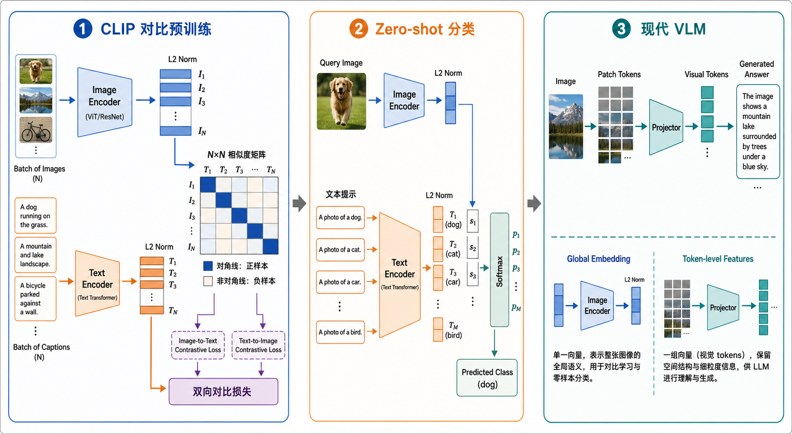

# CLIP 详解：从图文对比学习到现代视觉语言模型

> 本笔记整理自一次围绕 CLIP 的学习对话，并以原始论文与 OpenAI 官方实现交叉核对。阅读前建议先掌握 [[Vision Transformer]] 中的 Patch Embedding、CLS token、Transformer Encoder 与位置编码。

## 一句话结论

CLIP（Contrastive Language–Image Pre-training）的核心不是“用文本生成图像”，而是训练两个编码器，把一批图像与文本映射到同一个可比较的向量空间：正确图文对的相似度应高于同一批次中的错误组合。训练完成后，类别名也可以写成自然语言提示并充当分类器，因此 CLIP 能进行零样本分类、图文检索和表示迁移。

现代视觉语言模型继承了 CLIP 的视觉表示能力，但通常不只向 LLM 提供一个全局向量，而会保留多个 patch-level visual tokens，以减少局部细节与空间关系在压缩过程中的损失。

## 1. CLIP 要解决什么问题

传统监督图像分类学习的是固定映射：

$$\mathrm{Image}\rightarrow\mathrm{Encoder}\rightarrow\mathrm{Fixed\ Classifier}\rightarrow\mathrm{Class\ ID}$$

分类器的输出维度和训练时预先定义的类别绑定。若要识别一个新概念，通常需要重新收集标注数据并训练或微调分类头。

CLIP 改为学习图像和自然语言之间的匹配关系：

$$\mathrm{Image}\leftrightarrow\mathrm{Natural\ Language}$$

这把“类别是什么”从固定权重变成了可输入的文本。推理时，`a photo of a dog`、`a photo of a cat` 等文本提示经过文本编码器后，就形成了随任务动态构造的候选类别表示。

需要特别区分：

- 图像编码器与文本编码器处理的是不同模态，参数不共享，输入结构也不同。
- 两侧的最终投影向量具有相同维度，因此能计算点积或余弦相似度。
- “共享语义空间”不代表图像和文本变成了同一种原始数据，只代表它们的最终表示使用同一套相似度坐标系。

## 2. 整体架构与三种工作方式



> 图：AI 生成示意图。左侧表示 CLIP 用批内图文对构造相似度矩阵并计算双向对比损失；中间表示零样本分类把自然语言提示当作候选类别；右侧表示现代 VLM 常保留 patch-level features，经 Projector 映射为 LLM 可接收的 visual tokens。图中的具体图片和文字仅用于解释数据流，不是论文实验结果。

三条数据流的目标不同：

1. **对比预训练**：学习两个编码器、投影层和相似度尺度。
2. **零样本分类**：冻结模型，用文本提示动态构造分类器。
3. **现代 VLM 扩展**：使用视觉编码器的 token-level features，而非只使用 CLIP 的单一全局 embedding。

## 3. 输入、编码器与张量形状

设一个 batch 含有 $N$ 个配对样本：

$$\{(x_i,y_i)\}_{i=1}^{N}$$

其中 $x_i$ 是第 $i$ 张图像，$y_i$ 是与其配对的文本。

### 3.1 图像侧

图像编码器可以是改造后的 ResNet，也可以是 Vision Transformer。以 ViT 为例，输入形状为：

$$X\in\mathbb{R}^{N\times C\times H\times W}$$

若图像为 $224\times224$、patch size 为 $16\times16$，空间 patch 数为：

$$L_v=\frac{224}{16}\times\frac{224}{16}=14\times14=196$$

注意，patch 数量只由空间划分决定；每个 patch 内仍包含全部 $C=3$ 个 RGB 通道。每个 patch 展平后经线性投影成为一个 $D_v$ 维 token。加入 CLS token 后，ViT 的输入序列长度为 $197$。

最后一层 CLS hidden state 可看作全局视觉表示 $h_i^I$，再由图像投影矩阵映射到共同维度 $D$：

$$v_i=h_i^I W_I,\qquad v_i\in\mathbb{R}^{D}$$

### 3.2 文本侧

文本先经过 BPE 类 tokenizer，形成长度不超过上下文上限的 token 序列：

$$Y\in\mathbb{N}^{N\times L_t}$$

原始 CLIP 的文本编码器是 Transformer。它取结束文本 token（EOT）位置的最终 hidden state $h_i^T$ 作为句子级表示，再投影到同一个 $D$ 维空间：

$$t_i=h_i^T W_T,\qquad t_i\in\mathbb{R}^{D}$$

两个投影层的职责不是让编码器内部结构相同，而是把不同宽度的全局表示变换到共同的比较空间。例如，视觉侧内部宽度可以是 $D_v$，文本侧内部宽度可以是 $D_t$，但投影后的 $v_i$ 与 $t_i$ 都是 $D$ 维。

### 3.3 L2 归一化

CLIP 对投影向量做单位化：

$$\hat v_i=\frac{v_i}{\|v_i\|_2},\qquad \hat t_i=\frac{t_i}{\|t_i\|_2}$$

此时点积就是余弦相似度：

$$\hat v_i^\top\hat t_j=\cos(\theta_{ij})$$

归一化使相似度主要反映方向而非向量长度，避免编码器仅通过无限放大范数来提高 logit。

## 4. 相似度矩阵：一次比较所有图文组合

把单位化后的图像向量和文本向量堆叠为：

$$V=[\hat v_1;\ldots;\hat v_N]\in\mathbb{R}^{N\times D},\qquad T=[\hat t_1;\ldots;\hat t_N]\in\mathbb{R}^{N\times D}$$

全体组合的相似度矩阵为：

$$S=VT^\top\in\mathbb{R}^{N\times N}$$

$S_{ij}$ 表示第 $i$ 张图像与第 $j$ 条文本的余弦相似度。按配对顺序构造 batch 时：

- 对角线 $S_{ii}$ 是正样本；
- 同一行其余位置是该图像对应的批内负文本；
- 同一列其余位置是该文本对应的批内负图像。

因此一个包含 $N$ 对数据的 batch 不只给出 $N$ 个正匹配，还隐式提供大量错误组合。若只要求正样本相似，模型可以把所有输入都映射到同一个向量；而在 $N\times N$ 比较中，这种坍塌会使每一行和每一列都无法区分正确配对，交叉熵会很高。

## 5. Temperature：相似度差异应被放大多少

余弦相似度范围有限：

$$\cos(\theta)\in[-1,1]$$

若直接送入 Softmax，相近候选之间的概率差异可能过小。CLIP 引入可学习尺度 $a$：

$$a=\exp(\alpha)=\frac{1}{\tau}>0$$

最终 logits 为：

$$L_{ij}=aS_{ij}=\frac{\hat v_i^\top\hat t_j}{\tau}$$

其中：

- $\tau$ 是 temperature；
- $\alpha$ 是实际学习的对数尺度参数；
- 使用指数函数保证 $a$ 始终为正，不会把相似度排序反转。

当 $\tau$ 变小时，$a$ 变大，Softmax 更尖锐，模型更在意候选之间的细小排名差距，梯度通常也会更强；但过小的 temperature 会放大噪声、错误配对和难负样本的影响，降低训练稳定性。因此它不是单纯“越小越好”，而是在区分能力与稳定性之间调节训练压力。

原始 CLIP 将尺度初始化为 $1/0.07$ 附近并让其参与学习。实际实现常额外限制最大尺度，以避免极端 logits；这是数值稳定措施，不改变对比目标本身。

## 6. 双向对比损失

目标标签是：第 $i$ 张图像应匹配第 $i$ 条文本。因此标签向量为：

$$c=[0,1,\ldots,N-1]$$

### 6.1 Image-to-Text

固定一张图像，在该行的 $N$ 条文本中分类：

$$p_{i\rightarrow t}(j)=\frac{\exp(L_{ij})}{\sum_{k=1}^{N}\exp(L_{ik})}$$

图像到文本的损失为：

$$\mathcal{L}_{I\rightarrow T}=-\frac{1}{N}\sum_{i=1}^{N}\log p_{i\rightarrow t}(i)$$

### 6.2 Text-to-Image

固定一条文本，在该列的 $N$ 张图像中分类：

$$p_{t\rightarrow i}(j)=\frac{\exp(L_{ji})}{\sum_{k=1}^{N}\exp(L_{ki})}$$

文本到图像的损失为：

$$\mathcal{L}_{T\rightarrow I}=-\frac{1}{N}\sum_{i=1}^{N}\log p_{t\rightarrow i}(i)$$

最终使用两者平均：

$$\mathcal{L}_{\mathrm{CLIP}}=\frac{1}{2}\left(\mathcal{L}_{I\rightarrow T}+\mathcal{L}_{T\rightarrow I}\right)$$

双向损失要求“每张图找到自己的文本”和“每条文本找到自己的图像”同时成立。实现上，第二项就是对 $L^\top$ 再做一次按行交叉熵。

## 7. 对齐为什么会形成语义结构

“拉近正样本、推远负样本”只是表面描述。更准确的理解是：模型在共享参数下同时满足海量相对排序约束。

对于一张狗的图片，优化目标不只是提高它与 `a dog` 的绝对相似度，而是让这一相似度高于同批次内 `a cat`、`a car` 等候选。反向传播会同时调整：

- 图像编码器提取哪些视觉模式；
- 文本编码器保留哪些语言语义；
- 两个投影层如何选择共同坐标；
- 相似度尺度应把差异放大到什么程度。

当不同样本共享毛发、四肢、犬科、户外等统计结构时，编码器无法只为每个样本创建互不相关的规则；共享网络参数会复用这些模式。大量跨样本约束共同塑造出连续的表示空间，使语义相关概念往往靠近。

不过，“语义”是训练数据、模型容量和目标函数共同诱导出的统计结构，不等于人类概念体系的完整复刻。错误字幕、数据偏差和长尾缺失都会进入表示空间。

## 8. 一次训练步骤的完整形状流

设 batch size 为 $N$，共同投影维度为 $D$：

| 阶段         | 张量形状         | 含义                              |
| ---------- | ------------ | ------------------------------- |
| 图像输入       | $[N,C,H,W]$  | 一批图像                            |
| 文本 token   | $[N,L_t]$    | 一批配对文本                          |
| 图像全局特征     | $[N,D_v]$    | ViT CLS 或 ResNet pooled feature |
| 文本全局特征     | $[N,D_t]$    | EOT 位置 hidden state             |
| 投影并归一化     | 两侧均为 $[N,D]$ | 进入共享比较空间                        |
| 相似度 logits | $[N,N]$      | 所有图文组合                          |
| 标签         | $[N]$        | `0, 1, ..., N-1`                |
| 标量损失       | $[]$         | 两个方向交叉熵的平均                      |

这里的 $N$ 是 batch 轴，$L_t$ 是文本序列轴，$D$ 是 embedding 维。相似度矩阵的两个 $N$ 分别对应图像候选轴和文本候选轴，不是 token 序列长度。

## 9. Zero-shot 分类如何出现

假设下游任务的类别为 `dog`、`cat`、`car`。先把类别名放进自然语言模板：

```text
a photo of a dog
a photo of a cat
a photo of a car
```

每个文本提示经过文本编码器，得到候选类别向量。待分类图像得到图像向量后，与所有候选文本计算相似度：

$$q_j=\frac{\exp(a\hat v^\top\hat t_j)}{\sum_k\exp(a\hat v^\top\hat t_k)}$$

选择概率最大的文本对应类别：

$$\hat y=\mathop{\mathrm{argmax}}_j q_j$$

这不是传统意义上预先训练好的固定线性分类头。类别权重由文本编码器按提示动态生成，所以替换文本列表就能定义新的分类任务。

使用 `a photo of a {class}` 往往优于孤立的类别词，因为训练文本通常是自然语言描述，完整提示更接近预训练时的语言分布。还可以对多个模板的文本向量进行集成，以减小措辞敏感性。

## 10. CLIP、ViT 与现代 VLM 的职责边界

### 10.1 ViT 解决视觉 token 化与视觉建模

ViT 主要回答：怎样把二维图像变成 token 序列，并通过自注意力提取视觉表示。它本身不要求表示与自然语言处于同一个坐标系。

### 10.2 CLIP 解决跨模态全局匹配

CLIP 在视觉编码器之外增加文本编码器、模态投影与对比目标，主要回答：一张图和一句话是否在整体语义上匹配。

对 ViT 版本，典型链路是：

$$\mathrm{Image}\rightarrow\mathrm{Patch\ Tokens}\rightarrow\mathrm{ViT}\rightarrow\mathrm{CLS}\rightarrow\mathrm{Projection}\rightarrow\mathrm{Global\ Embedding}$$

### 10.3 现代 VLM 需要 token-level 视觉信息

一张 $224\times224\times3$ 图像被压成一个全局向量，是很强的信息瓶颈。对检索、粗粒度分类和整体匹配，它通常够用；但以下任务依赖局部细节：

- 物体计数；
- 左右、前后、遮挡等空间关系；
- OCR 与小文字读取；
- 局部属性和细粒度描述；
- 基于多个区域的视觉问答。

ViT 在得到 CLS 之前已经产生多个 patch tokens。现代 VLM 常取这些 token-level features，经 Projector 映射到 LLM 的 hidden width：

$$Z_v\in\mathbb{R}^{N\times L_v\times D_v}\rightarrow P(Z_v)\in\mathbb{R}^{N\times L_v\times D_{\mathrm{LLM}}}$$

其中 Projector 的职责是做维度与表示接口转换；视觉编码器负责从像素提取结构化视觉特征，LLM 负责在语言 token 与 visual tokens 上进行融合、推理和生成。visual token 与文字 token 都是向量，但来源、位置结构和训练语义仍不同。

因此，更准确的演化关系是：

$$\mathrm{ViT}\rightarrow\mathrm{CLIP\ Alignment}\rightarrow\mathrm{Vision\ Encoder+Projector+LLM}$$

它不表示所有 VLM 都直接使用原始 CLIP 架构，而是表达三次能力升级：视觉 token 化、视觉语言对齐、细粒度视觉 token 参与语言推理。

## 11. 与公式一致的 PyTorch 核心代码

下面的实现刻意把图像编码器和文本编码器当作可替换模块，只保留 CLIP 最核心的职责：全局特征、模态投影、L2 归一化、可学习温度、$N\times N$ logits 与双向交叉熵。

接口约定：

- `image_encoder(images)` 返回 `[B, image_width]`；
- `text_encoder(text_tokens)` 返回 `[B, text_width]`；
- 第 $i$ 张图像必须与第 $i$ 条文本配对；
- `embed_dim` 对应公式中的共同维度 $D$。

```python
import math
from dataclasses import dataclass

import torch
import torch.nn as nn
import torch.nn.functional as F


@dataclass
class CLIPOutput:
    loss: torch.Tensor           # []
    logits_per_image: torch.Tensor  # [B, B]
    logits_per_text: torch.Tensor   # [B, B]
    image_features: torch.Tensor    # [B, D]
    text_features: torch.Tensor     # [B, D]


class CLIPCore(nn.Module):
    def __init__(
        self,
        image_encoder: nn.Module,
        text_encoder: nn.Module,
        image_width: int,
        text_width: int,
        embed_dim: int,
        init_temperature: float = 0.07,
    ) -> None:
        super().__init__()
        self.image_encoder = image_encoder
        self.text_encoder = text_encoder

        # W_I: [image_width, D], W_T: [text_width, D]
        self.image_projection = nn.Linear(image_width, embed_dim, bias=False)
        self.text_projection = nn.Linear(text_width, embed_dim, bias=False)

        # alpha = log(1 / tau); exp(alpha) is always positive.
        self.logit_scale = nn.Parameter(
            torch.tensor(math.log(1.0 / init_temperature))
        )

    def encode_image(self, images: torch.Tensor) -> torch.Tensor:
        h_i = self.image_encoder(images)          # [B, image_width]
        v = self.image_projection(h_i)            # [B, D]
        return F.normalize(v, dim=-1)              # unit vectors

    def encode_text(self, text_tokens: torch.Tensor) -> torch.Tensor:
        h_t = self.text_encoder(text_tokens)       # [B, text_width]
        t = self.text_projection(h_t)              # [B, D]
        return F.normalize(t, dim=-1)              # unit vectors

    def forward(
        self,
        images: torch.Tensor,       # [B, C, H, W]
        text_tokens: torch.Tensor,  # [B, L_t]
    ) -> CLIPOutput:
        image_features = self.encode_image(images)       # [B, D]
        text_features = self.encode_text(text_tokens)    # [B, D]

        # Teaching implementation: cap the scale for numerical stability.
        scale = self.logit_scale.exp().clamp(max=100.0)  # scalar
        logits_per_image = scale * image_features @ text_features.T
        logits_per_text = logits_per_image.T

        batch_size = images.shape[0]
        labels = torch.arange(batch_size, device=images.device)

        loss_i2t = F.cross_entropy(logits_per_image, labels)
        loss_t2i = F.cross_entropy(logits_per_text, labels)
        loss = 0.5 * (loss_i2t + loss_t2i)

        return CLIPOutput(
            loss=loss,
            logits_per_image=logits_per_image,
            logits_per_text=logits_per_text,
            image_features=image_features,
            text_features=text_features,
        )


@torch.no_grad()
def zero_shot_predict(
    model: CLIPCore,
    images: torch.Tensor,       # [B, C, H, W]
    prompt_tokens: torch.Tensor # [M, L_t], M candidate classes
) -> torch.Tensor:
    image_features = model.encode_image(images)          # [B, D]
    class_features = model.encode_text(prompt_tokens)    # [M, D]
    scale = model.logit_scale.exp().clamp(max=100.0)
    logits = scale * image_features @ class_features.T   # [B, M]
    return logits.softmax(dim=-1)                        # [B, M]
```

这段代码没有重复实现 ViT 与文本 Transformer，因为它们属于编码器内部；真正决定 CLIP 训练方式的是两个编码器输出之后的投影、归一化、相似度矩阵和双向损失。

若使用分布式训练，负样本通常不应只来自单张设备的局部 batch；需要先跨设备收集两侧特征，再构造全局相似度矩阵，同时正确处理各进程的标签偏移。这是生产训练实现与上面单设备教学代码之间最重要的边界之一。

## 12. 常见误解

### 误解一：CLIP 是图像生成模型

不是。原始 CLIP 的直接输出是图文 embedding 及其相似度。它可作为其他生成系统的条件或评价信号，但自身目标不是逐 token 生成文字或逐像素生成图像。

### 误解二：只要把正样本拉近就会得到语义空间

不充分。关键是正样本必须相对批内其他候选更相似；$N\times N$ 比较与双向交叉熵共同阻止所有样本坍塌到同一点。

### 误解三：共享空间意味着两种模态完全相同

不是。共享的是最终 embedding 的维度和相似度几何；编码器输入、内部特征和归纳偏置仍不同。

### 误解四：Temperature 只是推理时的概率美化

不是。训练时它直接缩放 logits，影响 Softmax 分布、梯度强度、难负样本压力与稳定性；而且在 CLIP 中是可学习参数。

### 误解五：CLIP 的全局向量包含全部图像细节

不能这样保证。训练目标只奖励对整体图文匹配有用的信息。局部计数、精确位置和小文字可能在全局压缩中丢失，因此复杂 VLM 通常保留多个视觉 token。

## 13. 局限性与适用边界

- **依赖批内负样本**：batch 的规模与组成会影响训练信号；语义上其实匹配但未配对的样本可能成为假负样本。
- **数据质量与偏差**：网页图文对含有噪声、社会偏差和长尾缺失，模型会学习并可能放大这些问题。
- **提示敏感性**：零样本分类结果依赖模板与类别措辞，提示集成可以缓解但不能完全消除。
- **全局目标的细粒度限制**：强大的检索或分类能力不等于可靠的定位、计数、OCR 和关系推理能力。
- **相似度不是事实验证**：高相似度表示训练分布下的匹配程度，不等于文本陈述在现实中必然为真。
- **分布外泛化并非无限**：自然语言监督扩大了任务接口，但视觉域、文化背景或罕见概念明显偏离训练分布时仍会失败。

## 14. 复习主线

可以按下面的顺序重建 CLIP：

1. ViT 或 ResNet 把图像压成全局特征，文本 Transformer 把句子压成全局特征。
2. 两个投影层把不同内部宽度映射到共同维度 $D$。
3. L2 归一化后，矩阵乘法一次得到 $N\times N$ 余弦相似度。
4. 可学习的 $1/\tau$ 调整 Softmax 对相似度差异的敏感程度。
5. 行方向和列方向各做一次交叉熵，使正确图文对在两个检索方向上都胜出。
6. 海量配对数据和共享参数把这些相对匹配约束组织成跨模态语义空间。
7. 推理时把类别写成文本提示，文本 embedding 就成为动态分类器。
8. 现代 VLM 为保留局部细节，进一步把多个 patch features 经 Projector 送入 LLM。

## 资料与来源

- 学习对话共享页：[学习 CLIP 基础原理](https://chatgpt.com/share/6a8d7b32-8ccc-83e8-b5fc-060f38ea5923)
- Radford et al., 2021：[Learning Transferable Visual Models From Natural Language Supervision](https://arxiv.org/abs/2103.00020)
- OpenAI 官方介绍：[CLIP: Connecting text and images](https://openai.com/index/clip/)
- OpenAI 官方代码：[openai/CLIP](https://github.com/openai/CLIP)
