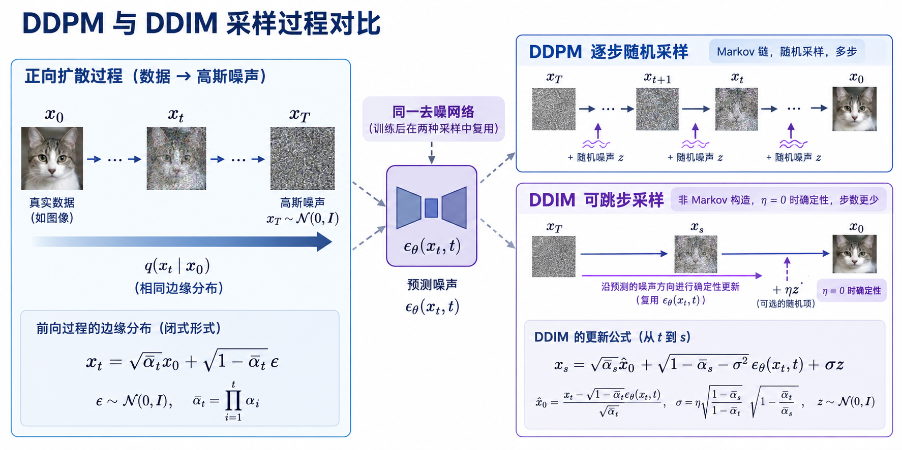

# DDIM 去噪扩散隐式模型详解

> 本文学习 **DDIM（Denoising Diffusion Implicit Models）**：它并未更换 DDPM 的去噪网络，而是重新设计采样时不同噪声等级之间的连接方式。其结果是：同一个已训练的噪声预测器可以采用更少步数、甚至完全确定性的轨迹生成样本。

## 先建立全局认识

DDPM 的主要代价在采样阶段。若训练时有 $T=1000$ 个噪声等级，传统反向链通常要让 U-Net 依次运行约 1000 次。DDIM 的问题是：**既然模型已经能在任意时刻估计干净样本和噪声方向，是否必须只从 $t$ 走到 $t-1$ ？**

DDIM 的答案是否定的。它保持训练真正使用的单时刻边缘分布 $q(x_t\mid x_0)$ 不变，却允许不同时间点之间的联合依赖关系改变。于是，采样器可以从 $t$ 直接走到任意更小的 $s$ ，并用参数 $\eta$ 在随机与确定性之间连续调节。

读完本文，应能回答四个问题：

- DDIM 为什么能复用 DDPM 的训练结果；
- 更新公式里的三项各代表什么；
- 系数 $\sqrt{1-\bar\alpha_s-\sigma_{t\to s}^2}$ 为什么必然出现；
- 跳步为什么合理、又为什么步数过少会损伤质量。

## 1. 前置知识：DDPM 在每个时刻提供了什么

令噪声日程为 $\beta_t$ ，并定义：

$$\alpha_t=1-\beta_t,\qquad \bar\alpha_t=\prod_{i=1}^{t}\alpha_i$$

DDPM 的前向过程有一个比逐步加噪更重要的闭式边缘分布：

$$q(x_t\mid x_0)=\mathcal N\left(\sqrt{\bar\alpha_t}x_0,\,(1-\bar\alpha_t)I\right)$$

等价地，可以一次采样得到任意噪声等级：

$$x_t=\sqrt{\bar\alpha_t}x_0+\sqrt{1-\bar\alpha_t}\,\epsilon,\qquad \epsilon\sim\mathcal N(0,I)$$

这说明 $x_t$ 由两部分线性组合而成：缩小后的干净信号 $x_0$ ，以及一个高斯噪声方向 $\epsilon$ 。随着 $t$ 增大，信号系数变小、噪声系数变大；对应的信噪比为：

$$\mathrm{SNR}(t)=\frac{\bar\alpha_t}{1-\bar\alpha_t}$$

实践中，DDPM 常训练网络预测加入的噪声：

$$\mathcal L_{\mathrm{simple}}=\mathbb E_{x_0,t,\epsilon}\left[\left\lVert\epsilon-\epsilon_\theta(x_t,t)\right\rVert^2\right]$$

由网络输出可得到当前时刻对干净样本的估计：

$$\hat x_0=\frac{x_t-\sqrt{1-\bar\alpha_t}\,\epsilon_\theta(x_t,t)}{\sqrt{\bar\alpha_t}}$$

这一步是 DDIM 的支点：采样器不只是“从 $x_t$ 减一点噪声”，而是先从 $x_t$ 估计 $\hat x_0$ 和噪声方向，再把它们重新混合为目标噪声等级的状态。

## 2. DDPM 与 DDIM：改变的是路径，不是单点分布

DDPM 的前向联合分布是马尔可夫链：

$$q_{\mathrm{DDPM}}(x_{1:T}\mid x_0)=\prod_{t=1}^{T}q(x_t\mid x_{t-1})$$

其中每一步仅依赖上一步，并注入新的独立噪声。DDIM 则构造一类非马尔可夫前向过程：相邻状态的关系可以显式依赖 $x_0$ ，或等价地让整条轨迹共享更强的潜在噪声关联。

关键约束并不是保持完整路径的联合分布相同，而是对每个 $t$ 保持：

$$q_{\mathrm{DDIM}}(x_t\mid x_0)=q_{\mathrm{DDPM}}(x_t\mid x_0)$$

因此，以随机 $t$ 和随机 $\epsilon$ 构造训练对 $(x_t,t,\epsilon)$ 时，常用的噪声预测目标看到的是同样的数据分布；已训练的 $\epsilon_\theta$ 可以直接被 DDIM 采样器复用。

这里有一条重要边界：这不等于“任意改变 joint distribution 后，原始完整 ELBO 的每一项都不变”。完整变分下界确实涉及联合分布的分解。DDIM 能复用模型的实际依据，是保持边缘分布，并与实践中常用的简化去噪/噪声预测训练目标相容。



图：DDPM 和 DDIM 在每个噪声等级共享相同的 $q(x_t\mid x_0)$ 与同一去噪网络；差别在于反向采样路径。DDPM 通常逐步且随机，DDIM 可使用稀疏时间序列，并在 $\eta=0$ 时成为确定性路径。AI 生成示意图，用于解释组件关系，不代表论文原图或实验结果。

## 3. DDIM 的统一更新式

设当前状态为 $x_t$ ，下一目标噪声等级是任意 $s<t$ 。DDIM 先从当前状态得到 $\hat x_0$ 和 $\epsilon_\theta(x_t,t)$ ，再构造：

$$x_s=\sqrt{\bar\alpha_s}\,\hat x_0+\sqrt{1-\bar\alpha_s-\sigma_{t\to s}^2}\,\epsilon_\theta(x_t,t)+\sigma_{t\to s}z,\qquad z\sim\mathcal N(0,I)$$

它有三个角色明确的部分：

1. $\sqrt{\bar\alpha_s}\,\hat x_0$ 是目标时刻应保留的信号部分。
2. $\sqrt{1-\bar\alpha_s-\sigma_{t\to s}^2}\,\epsilon_\theta$ 沿用从当前状态识别出的**已有噪声方向**；它不是新随机噪声。
3. $\sigma_{t\to s}z$ 是新注入的随机性。

### 3.1 噪声方向系数为何是这个形式

先假设模型完美，即 $\hat x_0=x_0$ 且 $\epsilon_\theta=\epsilon$ 。为了使目标状态仍满足正确的边缘分布，必须有：

$$x_s\mid x_0\sim\mathcal N\left(\sqrt{\bar\alpha_s}x_0,(1-\bar\alpha_s)I\right)$$

信号项已经给出正确均值。其余两项独立且均值为零，因此条件方差应满足：

$$\left(1-\bar\alpha_s-\sigma_{t\to s}^2\right)+\sigma_{t\to s}^2=1-\bar\alpha_s$$

所以，旧噪声方向只能分配到剩余的方差预算：

$$\boxed{\sqrt{1-\bar\alpha_s-\sigma_{t\to s}^2}}$$

这不是经验系数，而是“目标总噪声方差 = 旧方向承担的方差 + 新随机噪声方差”的直接结果。

## 4. 参数 eta：DDPM 与确定性 DDIM 之间的连续谱

相邻时间步 $s=t-1$ 时，DDIM 常取：

$$\sigma_t=\eta\sqrt{\frac{1-\bar\alpha_{t-1}}{1-\bar\alpha_t}}\sqrt{1-\frac{\bar\alpha_t}{\bar\alpha_{t-1}}}$$

括号中的量正是 DDPM 后验方差 $\tilde\beta_t$ 的平方根，因此 $\sigma_t^2=\eta^2\tilde\beta_t$ 。

- 当 $\eta=0$ 时， $\sigma_t=0$ 。没有新随机噪声；给定初始 $x_T$ 和网络，整条轨迹唯一确定。这是最常说的 deterministic DDIM。
- 当 $\eta=1$ 且使用相邻时间步时，随机方差恢复为 DDPM 后验方差的尺度，可看作保留 DDPM 式随机性的端点。
- 当 $0<\eta<1$ 时，在可复现性与随机性之间折中。

因此， $\eta$ 不只是一个笼统的“随机程度旋钮”，更准确地说，它控制保留多少 DDPM 后验随机性。

## 5. 为什么可以跳步

DDIM 不要求目标一定是 $t-1$ 。如果想从 $t$ 跳到任意 $s<t$ ，只需在统一更新式中使用目标时刻的 $\bar\alpha_s$ 。在确定性情形，这尤其直观：

$$x_s=\sqrt{\bar\alpha_s}\,\hat x_0+\sqrt{1-\bar\alpha_s}\,\epsilon_\theta(x_t,t)$$

当前状态可被理解为模型估计出的两个“组成方向” $\hat x_0$ 与 $\epsilon_\theta$ 的混合。前往不同 $s$ 时，只是把两者重新赋予目标时刻所需的信号/噪声比例；概率论并不要求中间必须经过 $t-1,t-2,\ldots,s+1$ 。

实际采样会从训练时间轴中选一个递减子序列，例如 $\tau=(999,979,\ldots,0)$ ，而不是把原始 DDPM 的若干代码步骤简单删掉。每一次转移都要按新旧两个时间点的累计噪声日程重新计算系数。

## 6. 加速为什么会有质量边界

若网络完美，任意大跳步都能保持正确方向。但真实网络有预测误差： $\hat x_0\neq x_0$ 、 $\epsilon_\theta\neq\epsilon$ 。一次跨度很大的更新会把当前误差带到较低噪声等级；后续可用于修正的机会更少。

这解释了采样步数的核心权衡：

| 选择 | 网络调用次数 | 局部误差修正机会 | 常见结果 |
| --- | --- | --- | --- |
| 较多步 | 更多 | 更多 | 更慢，通常更稳健 |
| 较少步 | 更少 | 更少 | 更快，但质量更依赖模型与时间步日程 |

因此，DDIM 的价值不是让扩散模型“无代价一步生成”，而是让采样器能在计算成本和近似误差之间主动选择时间离散化。

## 7. 与 ODE / SDE 视角的联系

DDPM 的逐步随机注入使其自然接近随机微分方程（SDE）的直觉。DDIM 在 $\eta=0$ 时给出确定性离散映射：

$$x_s=f(x_t,t,s)$$

当时间离散越来越细时，这种确定性轨迹与概率流 ODE 的视角紧密相关。这也解释了 DDIM 的历史位置：它把扩散模型从“必须逐级反转的随机链”推进到“可沿时间相关向量场进行数值求解”的理解方式，后续的 Score-SDE、DPM-Solver、Euler/Heun 采样器等都沿着这条方向发展。

需要注意，DDIM 的离散更新与连续 ODE 不是只凭 $\eta=0$ 就自动严格等同；二者的严格对应还取决于连续时间参数化与所使用的概率流方程。这里的联系是理解采样器家族的结构性视角。

## 8. 最小采样伪代码

下面的伪代码强调数据流而非具体框架实现。`timesteps` 是从大到小的稀疏时间序列，`prev_t` 表示其中紧邻的下一个目标时刻。

```python
x = standard_normal_like_shape()

for t, prev_t in consecutive_pairs(timesteps):
    eps = model(x, t)
    x0_hat = (x - sqrt(1 - alpha_bar[t]) * eps) / sqrt(alpha_bar[t])

    sigma = eta * sqrt((1 - alpha_bar[prev_t]) / (1 - alpha_bar[t])) \
                  * sqrt(1 - alpha_bar[t] / alpha_bar[prev_t])
    direction = sqrt(1 - alpha_bar[prev_t] - sigma**2) * eps
    noise = sigma * standard_normal_like(x) if eta > 0 else 0
    x = sqrt(alpha_bar[prev_t]) * x0_hat + direction + noise
```

实现时要额外确认：时间步索引与噪声日程数组是否对齐、最后一步如何处理 $s=0$ 、是否对 $\hat x_0$ 做裁剪，以及模型训练时采用的是预测噪声、预测 $x_0$ 还是 $v$ 参数化。它们都会改变实现中的换算式，但不改变本文的核心逻辑。

## 9. 常见误解与复习主线

**误解一：DDIM 只是把 DDPM 的随机噪声删掉。** 不完整。它本质上是在相同单时刻边缘分布下，选择了不同的跨时间依赖与采样转移；去掉随机项只是 $\eta=0$ 的特殊情形。

**误解二：跳步就是跳过原算法中的若干迭代。** 不准确。跳步使用的是针对目标时间 $s$ 重新构造的转移式，而不是忽略中间计算后沿用原系数。

**误解三：相同边缘分布意味着所有训练目标都完全一样。** 不严谨。可直接复用的核心依据是常用简化噪声预测目标依赖于 $q(x_t\mid x_0)$ ；完整 ELBO 的关系需要按具体构造分析。

可以把 DDIM 压缩成一条复习链：

> DDPM 训练让网络学会在任意 $x_t$ 估计噪声；DDIM 保持这些 $x_t$ 的边缘分布不变，却改变整条路径的相关结构；于是用 $\hat x_0$ 与预测噪声重新组合即可直接到达任意更低噪声等级，并通过 $\eta$ 选择随机或确定性采样。

## 参考资料

- Song, J., Meng, C., Ermon, S. *Denoising Diffusion Implicit Models*. ICLR 2021.
- Ho, J., Jain, A., Abbeel, P. *Denoising Diffusion Probabilistic Models*. NeurIPS 2020.
