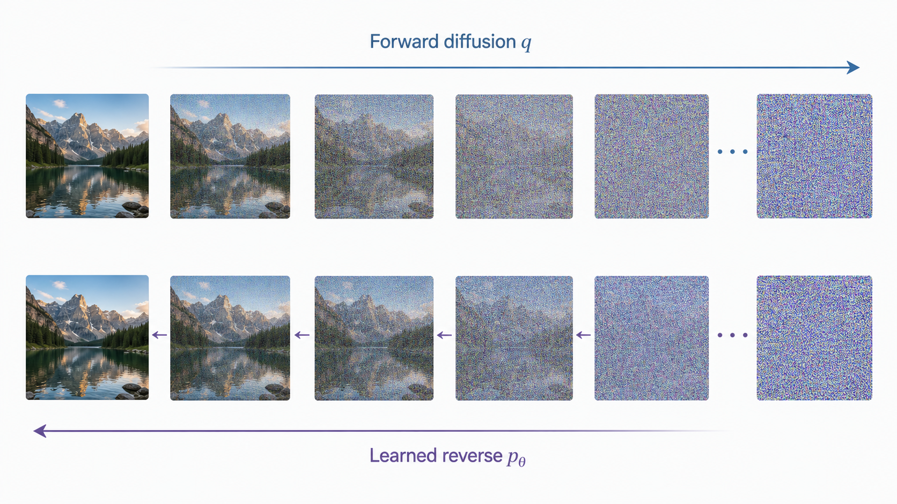

# DDPM 扩散概率模型详解

> 主题：Denoising Diffusion Probabilistic Models（DDPM）  
> 核心问题：前向扩散为何有闭式解、真实一步反向后验如何推导、ELBO 如何拆成 KL、KL 又如何变成预测噪声的 MSE。  
> 阅读目标：不仅记住公式，还能说清每一次代入、配方、约去常数和符号切换的理由。

## 资料与范围

- 学习材料：[与 ChatGPT 的 DDPM 学习对话](https://chatgpt.com/share/6a8fefe7-9a60-83e8-8013-f69e0d67e002)
- 原始论文：Jonathan Ho, Ajay Jain, Pieter Abbeel, [Denoising Diffusion Probabilistic Models](https://arxiv.org/abs/2006.11239), NeurIPS 2020
- 本文只解释 DDPM 的概率模型、前向过程、反向过程、ELBO 与训练/采样算法。

## 先看完整主线

DDPM 的逻辑可以压缩为四层，但每一层的对象不同：

1. 人为规定一个前向马尔可夫链 $q$，逐步把数据变成高斯噪声。
2. 利用线性高斯结构，解析求出训练时可用的真实一步反向后验。
3. 用神经网络定义反向模型 $p_\theta$，让它逼近真实后验。
4. 从最大似然得到 ELBO，再由高斯 KL 得到加权噪声 MSE，最后采用简化噪声 MSE 训练。



*图：上方表示人为规定的前向扩散 $q$，下方表示模型学习的反向过程 $p_\theta$。图片只表达总体方向，不代表某一次真实实验的中间结果。AI 生成示意图。*

整条推导链为：

$$\mathrm{Maximum\ Likelihood}\rightarrow \mathrm{ELBO}\rightarrow D_{\mathrm{KL}}\bigl(q\|p_\theta\bigr)\rightarrow \text{weighted noise MSE}\rightarrow L_{\mathrm{simple}}$$

最后一个箭头是训练目标的重新加权简化，不是恒等变形。这一点后文会严格说明。

## 最重要的阅读约定：取值与分布不是一回事

推导中经常在下面两种表达之间切换：

- 条件分布：$q(x_t\mid x_{t-1})=\mathcal N(\sqrt{\alpha_t}x_{t-1},\beta_t I)$；
- 从该分布得到样本的表达式：$x_t=\sqrt{\alpha_t}x_{t-1}+\sqrt{\beta_t}\epsilon_t$。

第一行回答“随机变量服从什么分布”，第二行回答“怎样用标准高斯噪声构造一个该分布的样本”。二者依靠高斯重参数化相连，但不能把条件分布 $q(\cdot)$ 和随机变量 $x_t$ 当成同一个对象。

下文每次出现“分布式”和“采样式”都会主动说明。

## 符号表与责任边界

| 符号 | 含义 | 是否学习 | 属于哪个过程 |
|---|---|---:|---|
| $x_0\in\mathbb R^d$ | 一条真实数据，例如展平后的图像 | 否 | 数据分布 |
| $x_t\in\mathbb R^d$ | 第 $t$ 步的带噪变量 | 否 | 前向或反向链中的状态 |
| $T$ | 总扩散步数 | 否 | 超参数 |
| $\beta_t\in(0,1)$ | 第 $t$ 步前向噪声方差 | 通常否 | 前向过程 $q$ |
| $\alpha_t=1-\beta_t$ | 第 $t$ 步信号保留系数 | 否 | 前向过程 $q$ |
| $\bar\alpha_t=\prod_{s=1}^t\alpha_s$ | 前 $t$ 步累计信号系数 | 否 | 前向过程 $q$ |
| $\epsilon_t\sim\mathcal N(0,I)$ | 第 $t$ 个前向转移中新采样的噪声 | 否 | 单步采样式 |
| $\epsilon\sim\mathcal N(0,I)$ | 把前 $t$ 步所有独立噪声合并后的等价标准噪声 | 否 | 闭式采样式 |
| $q$ | 人为规定的前向过程及由它推出的后验 | 否 | 已知过程 |
| $\tilde\mu_t$ | 真实一步反向后验的均值 | 否 | 解析后验 $q$ |
| $\tilde\beta_t$ | 真实一步反向后验的方差系数 | 否 | 解析后验 $q$ |
| $p_\theta$ | 神经网络参数化的反向生成过程 | 是 | 学习过程 |
| $\mu_\theta(x_t,t)$ | 模型反向分布的均值 | 是 | 模型 $p_\theta$ |
| $\sigma_t^2$ | 模型反向分布采用的方差 | 固定或学习 | 模型 $p_\theta$ |
| $\epsilon_\theta(x_t,t)$ | 网络对闭式采样噪声 $\epsilon$ 的预测 | 是 | 噪声参数化 |

必须特别区分：$\tilde\beta_t$ 是由前向过程解析推出的真实后验方差；$\sigma_t^2$ 是反向模型采用的方差设定。它们可以被设成相同，但概念上不是同一个量。

## 预备数学一：连乘与累计系数

连乘符号的定义是：

$$\prod_{s=1}^{t}\alpha_s=\alpha_1\alpha_2\cdots\alpha_t$$

DDPM 定义：

$$\bar\alpha_t:=\prod_{s=1}^{t}\alpha_s$$

这里的横线不是求平均，而只是“累计乘积”的约定记号。因此：

$$\bar\alpha_t=\alpha_t\bar\alpha_{t-1}$$

由于每个 $\alpha_t\in(0,1)$，累计乘积通常随 $t$ 增大而减小。

## 预备数学二：高斯变量的仿射变换

这一节要回答的不是“记住一个结论”，而是四个更具体的问题：

1. 为什么 $z$ 经过线性变换和整体平移以后仍然是高斯变量？
2. 为什么新变量的均值是 $\mu$？
3. 为什么新变量的协方差是 $LL^\top$，而不是简单的 $L$？
4. 为什么 DDPM 公式里噪声前面乘的是标准差的平方根？

### 先固定符号和维度

设：

- $z\in\mathbb R^k$ 是标准多元高斯随机变量；
- $z\sim\mathcal N(0,I_k)$ 表示 $\mathbb E[z]=0$、$\mathrm{Cov}(z)=I_k$；
- $L\in\mathbb R^{d\times k}$ 是一个确定的矩阵；
- $\mu\in\mathbb R^d$ 是一个确定的平移向量；
- $x\in\mathbb R^d$ 由 $x=\mu+Lz$ 定义。

维度可以直接检查：

$$Lz\in\mathbb R^d,\qquad \mu+Lz\in\mathbb R^d$$

因此 $x$ 与 $\mu$ 都是 $d$ 维向量，而 $x$ 的协方差必须是 $d\times d$ 矩阵。$LL^\top$ 的维度恰好是：

$$LL^\top\in\mathbb R^{d\times k}\mathbb R^{k\times d}=\mathbb R^{d\times d}$$

### 为什么变换后仍然是高斯变量

先看一维直觉。若 $z\sim\mathcal N(0,1)$，那么：

$$x=\mu+\sigma z$$

只是对高斯曲线做两件事：乘 $\sigma$ 会拉伸或压缩横轴，加 $\mu$ 会把整条曲线平移到以 $\mu$ 为中心的位置。这两种操作都不会把钟形曲线变成另一类分布。

多维情形可以用多元高斯的一个等价定义严格说明：如果对任意确定向量 $a\in\mathbb R^d$，标量 $a^\top x$ 都服从一维高斯分布，那么 $x$ 就是多元高斯变量。

对 $x=\mu+Lz$ 做任意线性投影：

$$a^\top x=a^\top\mu+a^\top Lz=a^\top\mu+(L^\top a)^\top z$$

$L^\top a$ 是一个确定向量，而标准多元高斯 $z$ 的任意线性组合仍是一维高斯。因此 $a^\top x$ 对任意 $a$ 都是一维高斯，进而 $x$ 是多元高斯。

这一步证明了“类型没有改变”，接下来再分别计算它的均值和协方差。

### 为什么均值变成了平移量

从定义开始：

$$x=\mu+Lz$$

两边取期望。期望具有线性性质，而且 $\mu$、$L$ 都是确定量：

$$\mathbb E[x]=\mathbb E[\mu+Lz]=\mu+L\mathbb E[z]$$

标准高斯的均值是零，即 $\mathbb E[z]=0$，所以：

$$\mathbb E[x]=\mu+L\cdot0=\mu$$

直觉上，$Lz$ 仍然以零为中心；加上 $\mu$ 后，整个随机云团的中心被平移到了 $\mu$。

### 为什么协方差是矩阵乘积

协方差的定义为：

$$\mathrm{Cov}(x)=\mathbb E\left[(x-\mathbb E[x])(x-\mathbb E[x])^\top\right]$$

刚刚已经得到 $\mathbb E[x]=\mu$，所以：

$$x-\mathbb E[x]=x-\mu=Lz$$

代回协方差定义：

$$\mathrm{Cov}(x)=\mathbb E\left[(Lz)(Lz)^\top\right]$$

转置乘积满足 $(Lz)^\top=z^\top L^\top$，因此：

$$\mathrm{Cov}(x)=\mathbb E\left[Lzz^\top L^\top\right]$$

$L$ 和 $L^\top$ 不是随机变量，可以移到期望外面：

$$\mathrm{Cov}(x)=L\mathbb E[zz^\top]L^\top$$

因为 $z$ 的均值为零，所以它的二阶矩就是协方差：

$$\mathbb E[zz^\top]=\mathrm{Cov}(z)=I_k$$

于是：

$$\mathrm{Cov}(x)=LI_kL^\top=LL^\top$$

最终得到完整分布：

$$x=\mu+Lz\sim\mathcal N(\mu,LL^\top)$$

这里不能把协方差直接写成 $L$，至少有三个原因：

- $L$ 不一定是方阵，而协方差一定是 $d\times d$ 方阵；
- 协方差矩阵必须对称，而一般的 $L$ 不一定对称；
- 随机变量的缩放系数作用在“标准差”上，方差会按照系数的平方缩放。

若 $L$ 的秩小于 $d$，则 $LL^\top$ 是半正定但不可逆的，此时得到的是退化高斯分布：随机样本只落在某个低维子空间中。DDPM 的单步噪声矩阵通常是正数乘单位矩阵，不会遇到这个退化问题。

### 特殊情况：各方向使用相同噪声尺度

现在令 $k=d$，并取：

$$L=\sigma I_d$$

这里通常约定 $\sigma\geq0$，它表示每个坐标方向上的标准差。将它代入协方差：

$$LL^\top=(\sigma I_d)(\sigma I_d)^\top$$

单位矩阵转置后不变，即 $I_d^\top=I_d$，所以：

$$LL^\top=(\sigma I_d)(\sigma I_d)=\sigma^2I_d$$

因此：

$$x=\mu+\sigma z\sim\mathcal N(\mu,\sigma^2I_d)$$

注意：采样式里的系数是标准差 $\sigma$，分布式协方差里的系数是方差 $\sigma^2$。平方正是从 $(\sigma z)(\sigma z)^\top$ 中产生的。

### 用一维数字例子检查

设：

$$z\sim\mathcal N(0,1),\qquad x=2+3z$$

均值为：

$$\mathbb E[x]=2+3\mathbb E[z]=2$$

方差为：

$$\mathrm{Var}(x)=\mathrm{Var}(3z)=3^2\mathrm{Var}(z)=9$$

因此：

$$x\sim\mathcal N(2,9)$$

这里的 $3$ 是标准差，$9$ 才是方差。比如一次采样得到 $z=0.5$ 时，会算出一个具体取值 $x=3.5$；但“$x\sim\mathcal N(2,9)$”描述的是反复采样所形成的整体分布，不是在说单个数值 $3.5$ 本身是一个分布。

### 对应到 DDPM 的单步加噪

DDPM 的单步条件分布是：

$$q(x_t\mid x_{t-1})=\mathcal N\bigl(x_t;\sqrt{\alpha_t}x_{t-1},\beta_tI\bigr)$$

在这个条件分布中，一旦给定 $x_{t-1}$，就暂时把它看成确定值。因此可以逐项对应：

| 仿射变换通式 | DDPM 单步加噪中的对象 |
|---|---|
| $z$ | $\epsilon_t\sim\mathcal N(0,I)$ |
| $\mu$ | $\sqrt{\alpha_t}x_{t-1}$ |
| $L$ | $\sqrt{\beta_t}I$ |
| $LL^\top$ | $\beta_tI$ |

因为：

$$LL^\top=(\sqrt{\beta_t}I)(\sqrt{\beta_t}I)^\top=\beta_tI$$

所以对应的采样式必须写为：

$$x_t=\sqrt{\alpha_t}x_{t-1}+\sqrt{\beta_t}\epsilon_t$$

为什么噪声前面是 $\sqrt{\beta_t}$ 而不是 $\beta_t$？因为条件分布要求噪声方差为 $\beta_tI$。若错误地写成 $\beta_t\epsilon_t$，实际协方差会变成：

$$\mathrm{Cov}(\beta_t\epsilon_t)=\beta_t^2I$$

这就不再等于目标中的 $\beta_tI$。

同理，前向闭式分布：

$$q(x_t\mid x_0)=\mathcal N\bigl(x_t;\sqrt{\bar\alpha_t}x_0,(1-\bar\alpha_t)I\bigr)$$

对应的采样式为：

$$x_t=\sqrt{\bar\alpha_t}x_0+\sqrt{1-\bar\alpha_t}\epsilon$$

这就是“分布式”与“采样式”之间完整的桥梁：先从目标协方差中找出一个矩阵平方根 $L$，再对标准高斯噪声做 $Lz$ 变换并加上目标均值。

## 预备数学三：独立高斯噪声为何能够合并

令 $u,v\sim\mathcal N(0,I)$ 且相互独立。对标量 $a,b$：

$$au+bv\sim\mathcal N\bigl(0,(a^2+b^2)I\bigr)$$

均值为零，因为：

$$\mathbb E[au+bv]=a\mathbb E[u]+b\mathbb E[v]=0$$

协方差逐步展开为：

$$\mathrm{Cov}(au+bv)=a^2\mathrm{Cov}(u)+b^2\mathrm{Cov}(v)+ab\mathrm{Cov}(u,v)+ab\mathrm{Cov}(v,u)$$

独立意味着交叉协方差为零，而 $\mathrm{Cov}(u)=\mathrm{Cov}(v)=I$，所以：

$$\mathrm{Cov}(au+bv)=(a^2+b^2)I$$

反过来，若某个零均值高斯变量的协方差是 $cI$，便可在分布意义上写成 $\sqrt c\,\epsilon$，其中 $\epsilon\sim\mathcal N(0,I)$。

注意“在分布意义上”等价不表示原来的多个噪声样本在数值上突然变成了同一个旧样本；它表示可以定义一个新的标准高斯变量 $\epsilon$，使两边同分布。

## 第一部分：前向扩散过程

### 先补充：什么是马尔可夫链

马尔可夫链是一组按照顺序连接的随机变量：

$$x_0\rightarrow x_1\rightarrow x_2\rightarrow\cdots\rightarrow x_T$$

它的核心假设称为马尔可夫性质：在已经知道当前状态 $x_{t-1}$ 的条件下，下一状态 $x_t$ 的分布不再需要额外依赖更早的历史 $x_0,x_1,\ldots,x_{t-2}$。用公式表示为：

$$q(x_t\mid x_0,x_1,\ldots,x_{t-1})=q(x_t\mid x_{t-1})$$

这句话可以理解为：$x_{t-1}$ 已经包含了从过去传递到当前、并且用于生成下一步的全部状态信息。

例如，对于：

$$x_0\rightarrow x_1\rightarrow x_2\rightarrow x_3$$

如果已经给定 $x_2$，那么生成 $x_3$ 时只需要使用 $q(x_3\mid x_2)$，不需要再把 $x_0$ 和 $x_1$ 作为额外条件：

$$q(x_3\mid x_0,x_1,x_2)=q(x_3\mid x_2)$$

但这不表示 $x_3$ 与 $x_0$ 完全无关。不给定中间状态时，$x_0$ 仍然会通过 $x_1$、$x_2$ 间接影响 $x_3$。因此必须区分：

- **条件独立**：给定 $x_2$ 后，$x_3$ 不再额外依赖 $x_0,x_1$；
- **边缘相关**：没有给定 $x_2$ 时，$x_3$ 通常仍然与 $x_0$ 相关。

### 为什么联合分布能够写成连乘形式

对任意一组按顺序排列的随机变量，概率链式法则先给出：

$$q(x_{1:T}\mid x_0)=q(x_1\mid x_0)q(x_2\mid x_0,x_1)\cdots q(x_T\mid x_0,x_1,\ldots,x_{T-1})$$

再使用马尔可夫性质，把每一项的长历史条件缩短为前一个状态：

$$q(x_2\mid x_0,x_1)=q(x_2\mid x_1)$$

$$q(x_3\mid x_0,x_1,x_2)=q(x_3\mid x_2)$$

一直推广到第 $T$ 步，就得到：

$$q(x_{1:T}\mid x_0)=\prod_{t=1}^{T}q(x_t\mid x_{t-1})$$

所以这个连乘式不是额外规定出来的简写，而是“概率链式法则 + 马尔可夫性质”的结果。

DDPM 采用这种结构有三个直接好处：

1. 每一步只需定义一个局部的高斯加噪规则；
2. 给定 $x_0$ 后，可以按照 $x_1,x_2,\ldots,x_T$ 的顺序逐步采样；
3. 整条轨迹的概率可以分解成单步条件概率，方便后续推导反向后验与 ELBO。

需要注意，前向过程是马尔可夫链，并不意味着它的反向条件分布已经自动可用。DDPM 后面仍然需要先解析计算训练时的 $q(x_{t-1}\mid x_t,x_0)$，再用神经网络学习生成时可用的 $p_\theta(x_{t-1}\mid x_t)$。

### 单步条件分布

DDPM 人为规定前向马尔可夫链：

$$q(x_{1:T}\mid x_0)=\prod_{t=1}^{T}q(x_t\mid x_{t-1})$$

每一步的条件分布为：

$$q(x_t\mid x_{t-1})=\mathcal N\bigl(x_t;\sqrt{\alpha_t}x_{t-1},\beta_t I\bigr)$$

分号前的 $x_t$ 表示这个高斯密度正在评价的变量；分号后的两项分别是均值与协方差。等价的采样式为：

$$x_t=\sqrt{\alpha_t}x_{t-1}+\sqrt{\beta_t}\epsilon_t,\qquad \epsilon_t\sim\mathcal N(0,I)$$

因为 $\alpha_t=1-\beta_t$，也可写成：

$$x_t=\sqrt{\alpha_t}x_{t-1}+\sqrt{1-\alpha_t}\epsilon_t$$

### 从第一步展开到第二步

第一步：

$$x_1=\sqrt{\alpha_1}x_0+\sqrt{1-\alpha_1}\epsilon_1$$

第二步原式：

$$x_2=\sqrt{\alpha_2}x_1+\sqrt{1-\alpha_2}\epsilon_2$$

把 $x_1$ 代入：

$$x_2=\sqrt{\alpha_2}\left(\sqrt{\alpha_1}x_0+\sqrt{1-\alpha_1}\epsilon_1\right)+\sqrt{1-\alpha_2}\epsilon_2$$

分配 $\sqrt{\alpha_2}$：

$$x_2=\sqrt{\alpha_1\alpha_2}x_0+\sqrt{\alpha_2(1-\alpha_1)}\epsilon_1+\sqrt{1-\alpha_2}\epsilon_2$$

信号项已经是：

$$\sqrt{\alpha_1\alpha_2}x_0=\sqrt{\bar\alpha_2}x_0$$

后两项是两个独立零均值高斯变量之和。它们的总协方差系数为：

$$\alpha_2(1-\alpha_1)+(1-\alpha_2)=\alpha_2-\alpha_1\alpha_2+1-\alpha_2=1-\alpha_1\alpha_2$$

因为 $\bar\alpha_2=\alpha_1\alpha_2$，所以可定义新的 $\epsilon\sim\mathcal N(0,I)$，在分布意义上写为：

$$x_2=\sqrt{\bar\alpha_2}x_0+\sqrt{1-\bar\alpha_2}\epsilon$$

### 用归纳法推广到任意时刻

假设在 $t-1$ 时结论成立：

$$x_{t-1}=\sqrt{\bar\alpha_{t-1}}x_0+\sqrt{1-\bar\alpha_{t-1}}\epsilon',\qquad \epsilon'\sim\mathcal N(0,I)$$

第 $t$ 步为：

$$x_t=\sqrt{\alpha_t}x_{t-1}+\sqrt{1-\alpha_t}\epsilon_t$$

代入归纳假设：

$$x_t=\sqrt{\alpha_t\bar\alpha_{t-1}}x_0+\sqrt{\alpha_t(1-\bar\alpha_{t-1})}\epsilon'+\sqrt{1-\alpha_t}\epsilon_t$$

由 $\bar\alpha_t=\alpha_t\bar\alpha_{t-1}$，信号项变为：

$$\sqrt{\alpha_t\bar\alpha_{t-1}}x_0=\sqrt{\bar\alpha_t}x_0$$

两个独立噪声项的总方差系数为：

$$\alpha_t(1-\bar\alpha_{t-1})+(1-\alpha_t)=1-\alpha_t\bar\alpha_{t-1}=1-\bar\alpha_t$$

因此可再次用一个新的标准高斯变量 $\epsilon$ 表示合并后的噪声：

$$x_t=\sqrt{\bar\alpha_t}x_0+\sqrt{1-\bar\alpha_t}\epsilon,\qquad \epsilon\sim\mathcal N(0,I)$$

这是一条“样本构造式”。对应的“条件分布式”为：

$$q(x_t\mid x_0)=\mathcal N\bigl(x_t;\sqrt{\bar\alpha_t}x_0,(1-\bar\alpha_t)I\bigr)$$

### 闭式解为什么重要

训练时不需要真的依次生成 $x_1,x_2,\ldots,x_t$。只需：

1. 从数据集中取 $x_0$；
2. 随机抽取 $t$；
3. 抽取一次 $\epsilon\sim\mathcal N(0,I)$；
4. 用闭式公式直接构造 $x_t$。

这使不同训练样本和不同时间步可以并行生成。

### 终点为什么只是近似标准高斯

由闭式分布：

$$q(x_T\mid x_0)=\mathcal N\bigl(\sqrt{\bar\alpha_T}x_0,(1-\bar\alpha_T)I\bigr)$$

若噪声日程使 $\bar\alpha_T\approx 0$，则：

$$q(x_T\mid x_0)\approx\mathcal N(0,I)$$

这里通常是近似关系，不应在有限 $T$ 下无条件写成严格相等。

## 第二部分：真实一步反向后验

### 为什么求的是带有原始数据条件的后验

生成时真正希望知道 $q(x_{t-1}\mid x_t)$，但该分布需要对未知数据分布积分，一般没有可直接使用的解析式。

训练时 $x_0$ 已知，因此可以精确计算：

$$q(x_{t-1}\mid x_t,x_0)$$

它是“前向过程诱导出的真实一步反向后验”，不是神经网络模型。

### 从条件 Bayes 公式开始

条件 Bayes 公式给出严格等式：

$$q(x_{t-1}\mid x_t,x_0)=\frac{q(x_t\mid x_{t-1},x_0)q(x_{t-1}\mid x_0)}{q(x_t\mid x_0)}$$

前向过程具有马尔可夫性质：给定 $x_{t-1}$ 后，$x_t$ 与更早的 $x_0$ 条件独立，因此：

$$q(x_t\mid x_{t-1},x_0)=q(x_t\mid x_{t-1})$$

代回仍然是严格等式：

$$q(x_{t-1}\mid x_t,x_0)=\frac{q(x_t\mid x_{t-1})q(x_{t-1}\mid x_0)}{q(x_t\mid x_0)}$$

现在把 $x_t$ 和 $x_0$ 当作已经给定的条件，只把 $x_{t-1}$ 当作待研究变量。分母 $q(x_t\mid x_0)$ 不随 $x_{t-1}$ 改变，所以在求关于 $x_{t-1}$ 的分布形状时，可吸收到归一化常数中：

$$q(x_{t-1}\mid x_t,x_0)\propto q(x_t\mid x_{t-1})q(x_{t-1}\mid x_0)$$

这里从 $=$ 变成 $\propto$，丢掉的不是“数值上为零的项”，而是所有与当前待求变量 $x_{t-1}$ 无关的正比例因子。最后仍需归一化，才能重新成为概率密度。

### 写出两个高斯因子

为缩短记号，暂令 $y=x_{t-1}$。第一个因子为：

$$q(x_t\mid y)=\mathcal N\bigl(x_t;\sqrt{\alpha_t}y,\beta_t I\bigr)$$

第二个因子由前向闭式解得到：

$$q(y\mid x_0)=\mathcal N\bigl(y;\sqrt{\bar\alpha_{t-1}}x_0,(1-\bar\alpha_{t-1})I\bigr)$$

从多元高斯密度的完整表达式开始代入。

#### 第一步：写出多元高斯密度公式

若 $u\in\mathbb R^d$ 且：

$$u\sim\mathcal N(m,\Sigma)$$

那么 $u$ 的概率密度为：

$$\mathcal N(u;m,\Sigma)=\frac{1}{(2\pi)^{d/2}|\Sigma|^{1/2}}\exp\left[-\frac{1}{2}(u-m)^\top\Sigma^{-1}(u-m)\right]$$

如果协方差是各向同性形式 $\Sigma=s^2I$，则：

$$|s^2I|=(s^2)^d,\qquad (s^2I)^{-1}=\frac{1}{s^2}I$$

所以密度简化为：

$$\mathcal N(u;m,s^2I)=\frac{1}{(2\pi s^2)^{d/2}}\exp\left[-\frac{\|u-m\|^2}{2s^2}\right]$$

这个公式由两部分组成：

- 前面的 $1/(2\pi s^2)^{d/2}$ 是归一化系数，保证密度对变量 $u$ 的积分等于 1；
- 后面的指数项决定密度随 $u$ 如何变化。

归一化系数只由维度 $d$ 和协方差 $s^2I$ 决定，不依赖均值 $m$。移动高斯分布的中心不会改变曲线下面积，因此归一化系数不需要随均值变化。

#### 第二步：展开第一个高斯因子

第一个因子是：

$$q(x_t\mid y)=\mathcal N\bigl(x_t;\sqrt{\alpha_t}y,\beta_tI\bigr)$$

在通用公式中逐项对应：

$$u=x_t,\qquad m=\sqrt{\alpha_t}y,\qquad s^2=\beta_t$$

代入完整密度公式：

$$q(x_t\mid y)=\frac{1}{(2\pi\beta_t)^{d/2}}\exp\left[-\frac{\|x_t-\sqrt{\alpha_t}y\|^2}{2\beta_t}\right]$$

这里均值 $\sqrt{\alpha_t}y$ 确实依赖 $y$，所以指数项依赖 $y$；但归一化系数：

$$K_1:=\frac{1}{(2\pi\beta_t)^{d/2}}$$

只含 $d$ 和 $\beta_t$，不含 $y$。因此在研究整个表达式随 $y$ 的变化时，$K_1$ 是常数。

还要注意：$q(x_t\mid y)$ 原本是关于 $x_t$ 归一化的条件密度。现在将已观测的 $x_t$ 固定、把它看成 $y$ 的函数时，它本身不要求对 $y$ 的积分等于 1；真正关于 $y$ 的归一化会由完整的 Bayes 公式保证。

#### 第三步：展开第二个高斯因子

第二个因子是：

$$q(y\mid x_0)=\mathcal N\bigl(y;\sqrt{\bar\alpha_{t-1}}x_0,(1-\bar\alpha_{t-1})I\bigr)$$

这次对应关系为：

$$u=y,\qquad m=\sqrt{\bar\alpha_{t-1}}x_0,\qquad s^2=1-\bar\alpha_{t-1}$$

代入后得到：

$$q(y\mid x_0)=\frac{1}{\left[2\pi(1-\bar\alpha_{t-1})\right]^{d/2}}\exp\left[-\frac{\|y-\sqrt{\bar\alpha_{t-1}}x_0\|^2}{2(1-\bar\alpha_{t-1})}\right]$$

把第二个归一化系数记为：

$$K_2:=\frac{1}{\left[2\pi(1-\bar\alpha_{t-1})\right]^{d/2}}$$

$K_2$ 同样不含 $y$。

#### 第四步：代回完整 Bayes 公式

前面已经得到严格等式：

$$q(y\mid x_t,x_0)=\frac{q(x_t\mid y)q(y\mid x_0)}{q(x_t\mid x_0)}$$

在当前推导中，$x_t$ 和 $x_0$ 都已经给定，因此分母 $q(x_t\mid x_0)$ 也不随 $y$ 改变。记：

$$K_0:=\frac{1}{q(x_t\mid x_0)}$$

将两个完整高斯密度代入，暂时保留所有系数：

$$q(y\mid x_t,x_0)=K_0K_1K_2\exp\left[-\frac{\|x_t-\sqrt{\alpha_t}y\|^2}{2\beta_t}\right]\exp\left[-\frac{\|y-\sqrt{\bar\alpha_{t-1}}x_0\|^2}{2(1-\bar\alpha_{t-1})}\right]$$

使用指数乘法规则：

$$\exp(A)\exp(B)=\exp(A+B)$$

得到仍然保持严格相等的表达式：

$$q(y\mid x_t,x_0)=K_0K_1K_2\exp\left[-\frac{\|x_t-\sqrt{\alpha_t}y\|^2}{2\beta_t}-\frac{\|y-\sqrt{\bar\alpha_{t-1}}x_0\|^2}{2(1-\bar\alpha_{t-1})}\right]$$

#### 第五步：从严格等号变成正比号

现在定义：

$$K:=K_0K_1K_2$$

$K$ 可能依赖 $x_t,x_0,t$ 和噪声日程，但不依赖当前待研究变量 $y$。因此：

$$q(y\mid x_t,x_0)=K\cdot f(y)$$

如果当前目的只是通过配方找出后验关于 $y$ 的均值和协方差，就可以暂时不计算这个整体常数，写成：

$$q(y\mid x_t,x_0)\propto\exp\left[-\frac{\|x_t-\sqrt{\alpha_t}y\|^2}{2\beta_t}-\frac{\|y-\sqrt{\bar\alpha_{t-1}}x_0\|^2}{2(1-\bar\alpha_{t-1})}\right]$$

所以这里的 $\propto$ 精确表示：左右两边只相差一个与 $y$ 无关的正数 $K$，而不是把若干项近似为零，也不是认为这些归一化系数在数值上等于 1。

后面完成平方后，我们会识别出这个核对应均值 $B_t/A_t$、协方差 $A_t^{-1}I$ 的高斯分布。届时完整的、关于 $y$ 归一化的密度可以重新写为：

$$q(y\mid x_t,x_0)=\frac{A_t^{d/2}}{(2\pi)^{d/2}}\exp\left[-\frac{A_t}{2}\left\|y-\frac{B_t}{A_t}\right\|^2\right]$$

因此，暂时省略常数只是为了更容易识别分布形状；完整后验仍然必须归一化。

### 逐项展开平方

第一项的平方为：

$$\|x_t-\sqrt{\alpha_t}y\|^2=x_t^\top x_t-2\sqrt{\alpha_t}x_t^\top y+\alpha_t y^\top y$$

第二项的平方为：

$$\|y-\sqrt{\bar\alpha_{t-1}}x_0\|^2=y^\top y-2\sqrt{\bar\alpha_{t-1}}x_0^\top y+\bar\alpha_{t-1}x_0^\top x_0$$

把与 $y$ 无关的对数常数记为 $C_0$，从下面的表达式开始收集各项：

$$\log q(y\mid x_t,x_0)=C_0-\frac{\|x_t-\sqrt{\alpha_t}y\|^2}{2\beta_t}-\frac{\|y-\sqrt{\bar\alpha_{t-1}}x_0\|^2}{2(1-\bar\alpha_{t-1})}$$

#### 第一步：把两个平方完整代回

将上面的两个平方展开式代入：

$$\log q(y\mid x_t,x_0)=C_0-\frac{x_t^\top x_t-2\sqrt{\alpha_t}x_t^\top y+\alpha_ty^\top y}{2\beta_t}-\frac{y^\top y-2\sqrt{\bar\alpha_{t-1}}x_0^\top y+\bar\alpha_{t-1}x_0^\top x_0}{2(1-\bar\alpha_{t-1})}$$

#### 第二步：逐项展开

将分母和外面的负号分配到各项，得到：

$$\log q(y\mid x_t,x_0)=C_0-\frac{x_t^\top x_t}{2\beta_t}+\frac{\sqrt{\alpha_t}}{\beta_t}x_t^\top y-\frac{\alpha_t}{2\beta_t}y^\top y-\frac{y^\top y}{2(1-\bar\alpha_{t-1})}+\frac{\sqrt{\bar\alpha_{t-1}}}{1-\bar\alpha_{t-1}}x_0^\top y-\frac{\bar\alpha_{t-1}}{2(1-\bar\alpha_{t-1})}x_0^\top x_0$$

#### 第三步：先收集与当前变量无关的常数项

当前待研究变量是 $y$。下面两项只含已经给定的 $x_t$、$x_0$ 和时间参数，因此不含 $y$：

$$-\frac{x_t^\top x_t}{2\beta_t},\qquad -\frac{\bar\alpha_{t-1}}{2(1-\bar\alpha_{t-1})}x_0^\top x_0$$

将它们连同 $C_0$ 合并成一个新的常数 $C$：

$$C:=C_0-\frac{x_t^\top x_t}{2\beta_t}-\frac{\bar\alpha_{t-1}}{2(1-\bar\alpha_{t-1})}x_0^\top x_0$$

这里并不是把这两项设为零，而只是重新命名。它们会影响完整密度的归一化数值，但不会影响关于 $y$ 的二次曲线中心和宽度。

去掉已经并入 $C$ 的两项后：

$$\log q(y\mid x_t,x_0)=C-\frac{\alpha_t}{2\beta_t}y^\top y-\frac{1}{2(1-\bar\alpha_{t-1})}y^\top y+\frac{\sqrt{\alpha_t}}{\beta_t}x_t^\top y+\frac{\sqrt{\bar\alpha_{t-1}}}{1-\bar\alpha_{t-1}}x_0^\top y$$

#### 第四步：收集所有二次项

含 $y^\top y$ 的两项是：

$$-\frac{\alpha_t}{2\beta_t}y^\top y-\frac{1}{2(1-\bar\alpha_{t-1})}y^\top y$$

提取公共因子 $-\frac12y^\top y$：

$$-\frac{1}{2}\left(\frac{\alpha_t}{\beta_t}+\frac{1}{1-\bar\alpha_{t-1}}\right)y^\top y$$

因此定义标量：

$$A_t:=\frac{\alpha_t}{\beta_t}+\frac{1}{1-\bar\alpha_{t-1}}$$

二次项便可写为：

$$-\frac{A_t}{2}y^\top y$$

这里 $A_t$ 是标量精度系数。因为当前两个高斯的协方差都是某个标量乘 $I$，所以二次项只需要一个标量 $A_t$；若使用一般协方差，当前位置会出现精度矩阵。

#### 第五步：收集所有线性项

两个线性项是：

$$\frac{\sqrt{\alpha_t}}{\beta_t}x_t^\top y+\frac{\sqrt{\bar\alpha_{t-1}}}{1-\bar\alpha_{t-1}}x_0^\top y$$

利用向量分配律，可以把它们写成一个向量与 $y$ 的内积：

$$\frac{\sqrt{\alpha_t}}{\beta_t}x_t^\top y+\frac{\sqrt{\bar\alpha_{t-1}}}{1-\bar\alpha_{t-1}}x_0^\top y=\left(\frac{\sqrt{\alpha_t}}{\beta_t}x_t+\frac{\sqrt{\bar\alpha_{t-1}}}{1-\bar\alpha_{t-1}}x_0\right)^\top y$$

因此定义向量：

$$B_t:=\frac{\sqrt{\alpha_t}}{\beta_t}x_t+\frac{\sqrt{\bar\alpha_{t-1}}}{1-\bar\alpha_{t-1}}x_0$$

线性项便是：

$$B_t^\top y$$

#### 第六步：合并二次项和线性项

到这里，表达式已经变成：

$$\log q(y\mid x_t,x_0)=C-\frac{A_t}{2}y^\top y+B_t^\top y$$

为了下一步完成平方，把最后两项统一放进 $-\frac12$ 中。注意：

$$-\frac{1}{2}\left(-2B_t^\top y\right)=B_t^\top y$$

因此：

$$\log q(y\mid x_t,x_0)=C-\frac{1}{2}\left[A_ty^\top y-2B_t^\top y\right]$$

所以红框中的形式并不是一个新的概率结论，而只是把同一个二次多项式重新组织成适合配方的记号。各对象的维度为：$C$ 是标量，$A_t$ 是标量，$y^\top y$ 是标量，$B_t\in\mathbb R^d$，$B_t^\top y$ 也是标量。

特意保留 $-2B_t^\top y$ 的原因，是下一步将使用：

$$A_t\left\|y-\frac{B_t}{A_t}\right\|^2=A_ty^\top y-2B_t^\top y+\frac{B_t^\top B_t}{A_t}$$

这样可以直接读出平方中心为 $B_t/A_t$。

### 完成平方

向量形式的配方恒等式为：

$$A_ty^\top y-2B_t^\top y=A_t\left\|y-\frac{B_t}{A_t}\right\|^2-\frac{B_t^\top B_t}{A_t}$$

最后一项不含 $y$，继续并入常数。于是后验一定是高斯：

$$q(y\mid x_t,x_0)=\mathcal N\left(y;\frac{B_t}{A_t},A_t^{-1}I\right)$$

这就严格解释了“两个关于同一变量的高斯密度相乘，归一化后仍是高斯”：二者的负对数都是二次函数，相加后仍是二次函数，配方后仍具有高斯核的形式。

### 计算真实后验方差

先对 $A_t$ 通分：

$$A_t=\frac{\alpha_t(1-\bar\alpha_{t-1})+\beta_t}{\beta_t(1-\bar\alpha_{t-1})}$$

利用 $\beta_t=1-\alpha_t$：

$$\alpha_t(1-\bar\alpha_{t-1})+\beta_t=\alpha_t-\alpha_t\bar\alpha_{t-1}+1-\alpha_t=1-\bar\alpha_t$$

因此：

$$A_t=\frac{1-\bar\alpha_t}{\beta_t(1-\bar\alpha_{t-1})}$$

取倒数得到后验方差系数：

$$\tilde\beta_t:=A_t^{-1}=\frac{1-\bar\alpha_{t-1}}{1-\bar\alpha_t}\beta_t$$

### 计算真实后验均值

后验均值为 $B_t/A_t=\tilde\beta_tB_t$：

$$\tilde\mu_t(x_t,x_0)=\tilde\beta_t\left(\frac{\sqrt{\alpha_t}}{\beta_t}x_t+\frac{\sqrt{\bar\alpha_{t-1}}}{1-\bar\alpha_{t-1}}x_0\right)$$

分别化简 $x_t$ 和 $x_0$ 的系数：

$$\tilde\beta_t\frac{\sqrt{\alpha_t}}{\beta_t}=\frac{\sqrt{\alpha_t}(1-\bar\alpha_{t-1})}{1-\bar\alpha_t}$$

$$\tilde\beta_t\frac{\sqrt{\bar\alpha_{t-1}}}{1-\bar\alpha_{t-1}}=\frac{\sqrt{\bar\alpha_{t-1}}\beta_t}{1-\bar\alpha_t}$$

所以：

$$\tilde\mu_t(x_t,x_0)=\frac{\sqrt{\bar\alpha_{t-1}}\beta_t}{1-\bar\alpha_t}x_0+\frac{\sqrt{\alpha_t}(1-\bar\alpha_{t-1})}{1-\bar\alpha_t}x_t$$

最终真实一步反向后验为：

$$q(x_{t-1}\mid x_t,x_0)=\mathcal N\bigl(x_{t-1};\tilde\mu_t(x_t,x_0),\tilde\beta_t I\bigr)$$

## 第三部分：从真实后验到学习到的反向模型

### 为什么不能直接拿真实后验生成

$\tilde\mu_t(x_t,x_0)$ 依赖真实数据 $x_0$。训练时我们从数据集中拿到了 $x_0$，但生成时从 $x_T\sim\mathcal N(0,I)$ 出发，根本没有真实 $x_0$ 可用。

因此 DDPM 定义一个神经网络参数化的反向马尔可夫链：

$$p_\theta(x_{0:T})=p(x_T)\prod_{t=1}^{T}p_\theta(x_{t-1}\mid x_t)$$

其中：

$$p(x_T)=\mathcal N(0,I)$$

$$p_\theta(x_{t-1}\mid x_t)=\mathcal N\bigl(x_{t-1};\mu_\theta(x_t,t),\sigma_t^2I\bigr)$$

此处发生了对象切换：

- $q(x_{t-1}\mid x_t,x_0)$ 是已知前向过程诱导出的真实后验；
- $p_\theta(x_{t-1}\mid x_t)$ 是生成时实际使用、需要学习的模型分布；
- $\tilde\beta_t$ 是前者的解析方差；
- $\sigma_t^2$ 是后者选择或学习的方差。

### 用闭式采样式消去原始数据

前向闭式采样式为：

$$x_t=\sqrt{\bar\alpha_t}x_0+\sqrt{1-\bar\alpha_t}\epsilon$$

先移项：

$$\sqrt{\bar\alpha_t}x_0=x_t-\sqrt{1-\bar\alpha_t}\epsilon$$

再除以 $\sqrt{\bar\alpha_t}$：

$$x_0=\frac{x_t-\sqrt{1-\bar\alpha_t}\epsilon}{\sqrt{\bar\alpha_t}}$$

把它代入 $\tilde\mu_t(x_t,x_0)$。为避免跳步，先只代入而不整理：

$$\tilde\mu_t=\frac{\sqrt{\bar\alpha_{t-1}}\beta_t}{1-\bar\alpha_t}\frac{x_t-\sqrt{1-\bar\alpha_t}\epsilon}{\sqrt{\bar\alpha_t}}+\frac{\sqrt{\alpha_t}(1-\bar\alpha_{t-1})}{1-\bar\alpha_t}x_t$$

由 $\bar\alpha_t=\alpha_t\bar\alpha_{t-1}$：

$$\frac{\sqrt{\bar\alpha_{t-1}}}{\sqrt{\bar\alpha_t}}=\frac{1}{\sqrt{\alpha_t}}$$

所以第一大项变成：

$$\frac{\beta_t}{\sqrt{\alpha_t}(1-\bar\alpha_t)}x_t-\frac{\beta_t}{\sqrt{\alpha_t}\sqrt{1-\bar\alpha_t}}\epsilon$$

现在合并两个 $x_t$ 系数。提取公共分母 $\sqrt{\alpha_t}(1-\bar\alpha_t)$：

$$\frac{\beta_t+\alpha_t(1-\bar\alpha_{t-1})}{\sqrt{\alpha_t}(1-\bar\alpha_t)}$$

分子化简为：

$$\beta_t+\alpha_t(1-\bar\alpha_{t-1})=1-\alpha_t+\alpha_t-\alpha_t\bar\alpha_{t-1}=1-\bar\alpha_t$$

所以 $x_t$ 的总系数就是 $1/\sqrt{\alpha_t}$。最终：

$$\tilde\mu_t(x_t,\epsilon)=\frac{1}{\sqrt{\alpha_t}}\left(x_t-\frac{\beta_t}{\sqrt{1-\bar\alpha_t}}\epsilon\right)$$

这不是把 $x_0$ “随意改名”为 $x_t$，而是先利用前向闭式关系把 $x_0$ 解出来，再做一次严格代入和代数化简。

生成时真实 $\epsilon$ 未知，因此网络预测：

$$\epsilon_\theta(x_t,t)\approx\epsilon$$

并据此参数化模型均值：

$$\mu_\theta(x_t,t):=\frac{1}{\sqrt{\alpha_t}}\left(x_t-\frac{\beta_t}{\sqrt{1-\bar\alpha_t}}\epsilon_\theta(x_t,t)\right)$$

因此“预测噪声”并不是一句经验性的“预测后把噪声减掉”，而是因为真实后验均值能够被精确改写为 $x_t$ 与噪声 $\epsilon$ 的函数。

## 第四部分：ELBO 从哪里来

### 最大似然目标

生成模型希望给真实数据较高概率，因此目标是最大化：

$$\log p_\theta(x_0)$$

但 DDPM 的中间变量 $x_{1:T}$ 没有被观测，需要积分掉：

$$p_\theta(x_0)=\int p_\theta(x_{0:T})\,dx_{1:T}$$

这是高维积分，通常无法直接求值。

### 一般隐变量模型中的 Jensen 推导

先考虑一般隐变量 $z$。在 $q(z\mid x)>0$ 覆盖目标联合分布所需区域的条件下：

$$\log p_\theta(x)=\log\int p_\theta(x,z)\,dz$$

在积分内乘除同一个辅助分布 $q(z\mid x)$：

$$\log p_\theta(x)=\log\int q(z\mid x)\frac{p_\theta(x,z)}{q(z\mid x)}\,dz$$

积分正是关于 $q$ 的期望：

$$\log p_\theta(x)=\log\mathbb E_{q(z\mid x)}\left[\frac{p_\theta(x,z)}{q(z\mid x)}\right]$$

$\log$ 是凹函数，Jensen 不等式给出：

$$\log\mathbb E_q[Y]\geq\mathbb E_q[\log Y]$$

令 $Y=p_\theta(x,z)/q(z\mid x)$，得到：

$$\log p_\theta(x)\geq\mathbb E_{q(z\mid x)}\left[\log p_\theta(x,z)-\log q(z\mid x)\right]$$

右侧定义为证据下界：

$$\mathcal L_{\mathrm{ELBO}}:=\mathbb E_{q(z\mid x)}\left[\log p_\theta(x,z)-\log q(z\mid x)\right]$$

### 下界与真实似然之间为何是 KL

由 Bayes 关系：

$$p_\theta(x,z)=p_\theta(z\mid x)p_\theta(x)$$

代入 ELBO：

$$\mathcal L_{\mathrm{ELBO}}=\mathbb E_q\left[\log p_\theta(z\mid x)+\log p_\theta(x)-\log q(z\mid x)\right]$$

$\log p_\theta(x)$ 不依赖 $z$，所以其期望仍是自身：

$$\mathcal L_{\mathrm{ELBO}}=\log p_\theta(x)-\mathbb E_q\left[\log\frac{q(z\mid x)}{p_\theta(z\mid x)}\right]$$

括号中的期望正是 KL 散度：

$$\log p_\theta(x)=\mathcal L_{\mathrm{ELBO}}+D_{\mathrm{KL}}\bigl(q(z\mid x)\|p_\theta(z\mid x)\bigr)$$

由于 KL 非负，ELBO 不超过对数似然。只有当辅助后验与模型真实后验几乎处处相等时，KL 为零、下界变紧。

## 第五部分：DDPM 的 ELBO 如何拆开

### 把整条前向轨迹当作隐变量

在 DDPM 中令 $z=x_{1:T}$，辅助分布就是已知的前向链 $q(x_{1:T}\mid x_0)$。负 ELBO 写为：

$$L_{\mathrm{VLB}}=\mathbb E_q\left[\log\frac{q(x_{1:T}\mid x_0)}{p_\theta(x_{0:T})}\right]$$

它是负对数似然的上界：

$$-\log p_\theta(x_0)\leq L_{\mathrm{VLB}}$$

反向模型联合分布已知：

$$p_\theta(x_{0:T})=p(x_T)\prod_{t=1}^{T}p_\theta(x_{t-1}\mid x_t)$$

接下来需要把前向链也改写成适合逐步比较的反向后验乘积。

### 前向链的反向后验分解

对任意 $t\geq2$，条件 Bayes 给出：

$$q(x_t\mid x_{t-1})q(x_{t-1}\mid x_0)=q(x_{t-1}\mid x_t,x_0)q(x_t\mid x_0)$$

整理：

$$q(x_t\mid x_{t-1})=q(x_{t-1}\mid x_t,x_0)\frac{q(x_t\mid x_0)}{q(x_{t-1}\mid x_0)}$$

把 $t=2$ 到 $T$ 的这些比值连乘时，中间的边缘分布会望远镜式消去，最终得到：

$$q(x_{1:T}\mid x_0)=q(x_T\mid x_0)\prod_{t=2}^{T}q(x_{t-1}\mid x_t,x_0)$$

将 $q$ 与 $p_\theta$ 的两个分解代入负 ELBO：

$$L_{\mathrm{VLB}}=\mathbb E_q\left[\log\frac{q(x_T\mid x_0)}{p(x_T)}+\sum_{t=2}^{T}\log\frac{q(x_{t-1}\mid x_t,x_0)}{p_\theta(x_{t-1}\mid x_t)}-\log p_\theta(x_0\mid x_1)\right]$$

于是可以写成三类项：

$$L_{\mathrm{VLB}}=L_T+\sum_{t=2}^{T}L_{t-1}+L_0$$

终点先验匹配项：

$$L_T=D_{\mathrm{KL}}\bigl(q(x_T\mid x_0)\|p(x_T)\bigr)$$

中间每一步的反向匹配项：

$$L_{t-1}=D_{\mathrm{KL}}\bigl(q(x_{t-1}\mid x_t,x_0)\|p_\theta(x_{t-1}\mid x_t)\bigr)$$

最后的数据重建项：

$$L_0=-\log p_\theta(x_0\mid x_1)$$

这说明 DDPM 中的 KL 不是凭空添加的正则项。它来自整条隐变量生成链的负 ELBO 分解，要求模型的一步反向分布逼近由前向过程解析得到的真实一步后验。

## 第六部分：从高斯 KL 到噪声 MSE

### 两个反向分布各自是什么

真实后验：

$$q(x_{t-1}\mid x_t,x_0)=\mathcal N(\tilde\mu_t,\tilde\beta_t I)$$

模型分布：

$$p_\theta(x_{t-1}\mid x_t)=\mathcal N(\mu_\theta,\sigma_t^2I)$$

当模型方差 $\sigma_t^2$ 被固定、不依赖 $\theta$ 时，高斯 KL 中所有与均值网络参数有关的部分为：

$$L_{t-1}=\mathbb E_q\left[\frac{1}{2\sigma_t^2}\|\tilde\mu_t(x_t,x_0)-\mu_\theta(x_t,t)\|^2\right]+C$$

$C$ 可以依赖时间步和既定方差，但不依赖均值网络参数 $\theta$，因此优化均值网络时可忽略。

### 两个均值都写成噪声参数化

真实后验均值：

$$\tilde\mu_t=\frac{1}{\sqrt{\alpha_t}}\left(x_t-\frac{\beta_t}{\sqrt{1-\bar\alpha_t}}\epsilon\right)$$

模型均值：

$$\mu_\theta=\frac{1}{\sqrt{\alpha_t}}\left(x_t-\frac{\beta_t}{\sqrt{1-\bar\alpha_t}}\epsilon_\theta(x_t,t)\right)$$

两式相减时 $x_t$ 精确抵消：

$$\tilde\mu_t-\mu_\theta=-\frac{\beta_t}{\sqrt{\alpha_t}\sqrt{1-\bar\alpha_t}}\left(\epsilon-\epsilon_\theta(x_t,t)\right)$$

取平方范数：

$$\|\tilde\mu_t-\mu_\theta\|^2=\frac{\beta_t^2}{\alpha_t(1-\bar\alpha_t)}\|\epsilon-\epsilon_\theta(x_t,t)\|^2$$

代回 KL 的均值项：

$$L_{t-1}=\mathbb E_q\left[w_t\|\epsilon-\epsilon_\theta(x_t,t)\|^2\right]+C$$

其中：

$$w_t=\frac{\beta_t^2}{2\sigma_t^2\alpha_t(1-\bar\alpha_t)}$$

到这里为止，噪声 MSE 是带有时间权重 $w_t$ 的。

### 简化损失与完整变分目标的关系

经典 DDPM 常使用：

$$L_{\mathrm{simple}}=\mathbb E_{x_0,t,\epsilon}\left[\|\epsilon-\epsilon_\theta(x_t,t)\|^2\right]$$

其中：

$$x_t=\sqrt{\bar\alpha_t}x_0+\sqrt{1-\bar\alpha_t}\epsilon$$

$L_{\mathrm{simple}}$ 去掉了完整变分目标中随时间变化的权重。因此更准确的表述是：

- 完整负 ELBO 严格导出的是带权噪声 MSE，以及终点项和重建项；
- $L_{\mathrm{simple}}$ 是作者采用的重新加权简化目标；
- 它与完整 ELBO 有紧密理论联系，但二者不能在省略权重后仍写成严格相等。

## 第七部分：训练算法逐步对应公式

一次训练迭代可以写成：

1. 采样真实数据 $x_0\sim q_{\mathrm{data}}$。
2. 均匀采样时间步 $t\sim\mathrm{Uniform}\{1,\ldots,T\}$。
3. 采样 $\epsilon\sim\mathcal N(0,I)$。
4. 用闭式前向公式构造 $x_t$。
5. 网络接收 $(x_t,t)$ 并输出 $\epsilon_\theta(x_t,t)$。
6. 计算真实噪声与预测噪声的平方误差并更新 $\theta$。

对应的伪代码为：

```text
repeat
    x0  <- sample_data()
    t   <- random_integer(1, T)
    eps <- standard_normal(shape(x0))

    xt <- sqrt(alpha_bar[t]) * x0
          + sqrt(1 - alpha_bar[t]) * eps

    eps_pred <- network(xt, t)
    loss <- mean_squared_error(eps, eps_pred)
    update_theta(loss)
until convergence
```

网络学习的是“给定当前带噪状态和噪声等级，估计产生该状态的等价噪声”。时间步 $t$ 必须作为条件输入，因为相同的像素值在不同噪声强度下应采用不同的去噪策略。

## 第八部分：采样算法逐步对应公式

生成从标准高斯开始：

$$x_T\sim\mathcal N(0,I)$$

对 $t=T,T-1,\ldots,1$，先计算模型均值：

$$\mu_\theta(x_t,t)=\frac{1}{\sqrt{\alpha_t}}\left(x_t-\frac{\beta_t}{\sqrt{1-\bar\alpha_t}}\epsilon_\theta(x_t,t)\right)$$

再从模型反向条件分布采样：

$$x_{t-1}=\mu_\theta(x_t,t)+\sigma_tz,qquad z\sim\mathcal N(0,I)$$

在最后一步通常不再额外注入随机噪声，即令 $t=1$ 时的 $z=0$。伪代码为：

```text
x <- standard_normal(data_shape)

for t = T, T-1, ..., 1
    eps_pred <- network(x, t)
    mean <- (x - beta[t] / sqrt(1 - alpha_bar[t]) * eps_pred)
            / sqrt(alpha[t])

    if t > 1
        z <- standard_normal(shape(x))
    else
        z <- 0

    x <- mean + sigma[t] * z

return x
```

这里的随机项并非“模型又把刚去掉的噪声加回去”。它来自模型对 $p_\theta(x_{t-1}\mid x_t)$ 的概率分布建模，用来表达同一个 $x_t$ 可能对应多个合理的较干净状态。

## 常见混淆逐项澄清

### 当前步噪声与累计等价噪声

$\epsilon_t$ 是从 $x_{t-1}$ 到 $x_t$ 的单步新噪声；闭式公式中的 $\epsilon$ 是前 $t$ 步所有独立噪声线性组合后重新标准化得到的等价噪声。二者都服从标准高斯，但语义不同。

### 真实后验与模型分布

$q(x_{t-1}\mid x_t,x_0)$ 在训练时可解析计算；$p_\theta(x_{t-1}\mid x_t)$ 不使用真实 $x_0$，是生成时实际运行的模型。训练的目标是让后者逼近前者，而不是把二者视为同一个分布。

### 后验方差与模型方差

$\tilde\beta_t$ 由 $\alpha_t,\beta_t,\bar\alpha_{t-1},\bar\alpha_t$ 唯一确定；$\sigma_t^2$ 是模型设计。把 $\sigma_t^2$ 设为 $\tilde\beta_t$ 是一种选择，不是符号改名。

### 等号与正比号

写 $f(y)\propto g(y)$ 时，只能丢掉与待研究变量 $y$ 无关的乘法因子。依赖 $y$ 的项无论看起来多麻烦都不能丢。恢复完整概率密度时还必须补回归一化常数。

### 预测噪声不等于直接做减法

反向更新不是简单的 $x_{t-1}=x_t-\epsilon_\theta$。噪声预测首先通过由噪声日程决定的系数进入 $\mu_\theta$，然后还可能根据 $\sigma_t^2$ 采样随机项。

### 累计系数不是平均值

$\bar\alpha_t$ 是乘积 $\prod_{s=1}^t\alpha_s$，不是 $\alpha_1,\ldots,\alpha_t$ 的算术平均。

### 简化损失不是完整 ELBO 的原样复制

从负 ELBO 到带权噪声 MSE 是参数化后的严格结果；把 $w_t$ 去掉得到 $L_{\mathrm{simple}}$ 是重新加权。工程上常说“DDPM 就是噪声 MSE”时，省略了这层区别。

## 假设、边界与局限

- 前向闭式解和解析后验依赖线性高斯转移；更换破坏过程后不一定保留相同公式。
- 真实一步后验可解析，并不意味着边缘逆分布 $q(x_{t-1}\mid x_t)$ 可直接计算；后者还涉及未知数据分布。
- $x_T\sim\mathcal N(0,I)$ 通常依靠 $\bar\alpha_T$ 足够小来近似成立。
- 噪声方差日程、反向方差选择和时间步数都会影响似然、样本质量与采样成本。
- 本文解释经典离散时间 DDPM，不把后续变体的结论自动套回原始模型。

## 最终总结

DDPM 先规定一个逐步加高斯噪声的前向链。因为每一步都是线性高斯变换，任意 $x_t$ 都能从 $x_0$ 一步采样，同时训练条件下的真实一步反向后验也能用 Bayes 公式和配方法精确求出。

生成时没有真实 $x_0$，因此用网络定义 $p_\theta(x_{t-1}\mid x_t)$。真实后验均值可重写为 $x_t$ 与累计等价噪声 $\epsilon$ 的函数，所以网络可以通过预测噪声来参数化反向均值。

概率论目标仍是最大化数据似然。由于中间轨迹难以积分，DDPM 优化 ELBO；ELBO 的分解产生逐时间步的真实后验与模型分布之间的 KL。固定模型方差后，高斯 KL 的可学习部分化为带权噪声 MSE；经典训练再将其简化为无权的 $L_{\mathrm{simple}}$。

因此最准确的一句话是：DDPM 人为构造一个可解析的数据破坏过程，再用变分学习得到它的概率逆过程；预测噪声是这个概率建模问题经过高斯后验、均值重参数化与目标简化后得到的训练接口。
