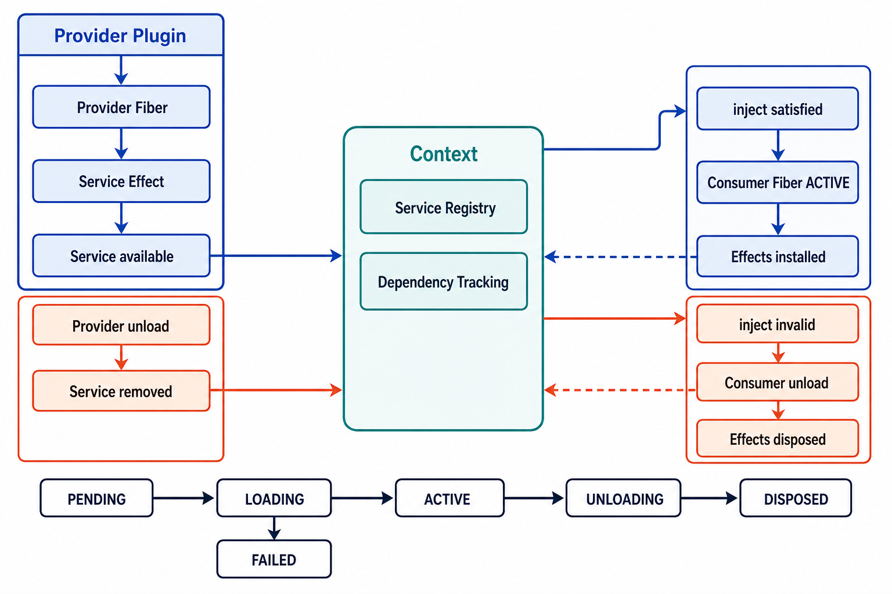

# DeepSeek Harness 与 Cordis 响应式生命周期详解

## 资料信息

- 核对资料：[DeepSeek Harness Architecture](https://deepseek-harness.github.io/deepseek-harness/en/reference/)
- 核对资料：[Cordis Primer](https://deepseek-harness.github.io/deepseek-harness/en/reference/cordis-primer)
- 核对资料：[Plugins and lifecycle](https://deepseek-harness.github.io/deepseek-harness/en/develop/framework/)
- 核对资料：[Services and dependencies](https://deepseek-harness.github.io/deepseek-harness/en/develop/framework/service)
- 核对资料：[Lifecycle and effects](https://deepseek-harness.github.io/deepseek-harness/en/develop/cordis-tutorial/02-lifecycle-and-effects)
- 核对资料：[Cordis API：Context](https://deepseek-harness.github.io/deepseek-harness/en/reference/cordis-api/context)
- 核对资料：[Cordis API：Fiber](https://deepseek-harness.github.io/deepseek-harness/en/reference/cordis-api/fiber)

> [!important]
> 这里的 Harness 指 DeepSeek 开源的 Agent Harness，而不是 DeepSeek 模型本身的注意力结构或推理算法。本文讨论的是它底层 Cordis 插件运行时的组合、依赖与生命周期管理。

## 一、问题背景：动态 Agent Runtime 为什么需要生命周期管理

DeepSeek Harness 不是一个只在启动时装配一次、随后结构保持不变的普通程序。它允许模型适配器、Tool、Session、Agent Loop、Sandbox 等能力以插件形式组合；运行期间还可能发生配置修改、Provider 替换、子 Agent 创建与结束以及插件热更新。

这会带来两个彼此关联的问题。

第一个问题是**依赖何时满足**。例如 Agent Plugin 依赖 LLM Service：如果 LLM 尚未加载，Agent 不应提前运行；如果 LLM 在运行期间消失，Agent 也不应继续持有旧实例。

第二个问题是**插件创建的外部状态如何撤销**。Agent 启动时可能注册 Tool、添加事件监听器、开启定时器或创建子插件。如果 Agent 已经停止，而这些状态仍留在系统里，就会形成幽灵 Tool、重复监听器、泄漏的定时器或孤儿子插件。

因此，一个动态 Harness 不能只回答“如何调用插件的 `apply()`”，还必须回答：

```text
插件什么时候可以启动？
依赖变化时，哪些插件需要停止或重启？
某次运行创建了哪些外部状态？
停止时，如何完整撤销这些状态？
父插件消失时，子插件如何一起退出？
```

Cordis 的解决方案不是给每个插件维护一份静态的“卸载脚本”，而是把依赖、一次插件运行和可撤销操作组织成一个运行时闭环：

```text
Context 中的 Service 状态
          ↓
inject 依赖是否满足
          ↓
Fiber 应处于什么状态
          ↓
建立或撤销该 Fiber 拥有的 Effects
          ↓
Effects 又可能改变 Context 中的 Service 状态
```

本文接下来先用一个贯穿示例观察这个闭环，再分别解释 Context、Service、inject、Fiber 与 Effect。

## 二、先建立总图：两个相反方向的传播链

先假设系统里有两个插件：

- `LLMPlugin` 是 Provider，向 Context 提供名为 `llm` 的 Service。
- `AgentPlugin` 是 Consumer，通过 `inject = ['llm', 'tools']` 声明必需依赖；启动后注册一个模型可调用的 Tool，并开启一个 heartbeat timer。

我们希望运行时自动保证：

```text
llm 不存在
→ AgentPlugin 不启动

llm 出现
→ AgentPlugin 启动
→ Tool 与 timer 建立

llm 消失
→ AgentPlugin 停止
→ Tool 被注销，timer 被清除

llm 再次出现
→ AgentPlugin 重新运行
→ 使用新的 llm 实例建立一套新状态
```

下面的图展示的正是这个一般化过程。图中的 Provider 可以是 LLM Provider，也可以是 Shell、Storage 或其他 Service Provider；Consumer 则是任何把该 Service 声明为必需依赖的插件。



*图：AI 生成示意图。蓝色路径表示 Provider 激活后提供 Service，满足 `inject` 并启动 Consumer；橙色路径表示 Provider 卸载后撤销 Service，使 Consumer 依赖失效并清理其 Effects。底部是 Fiber 的主要状态流转。图用于解释运行时关系，不代表源码类图。*

这张图包含两条互为镜像的传播链。

### 2.1 能力建立链

```text
Provider Fiber ACTIVE
        ↓
注册 Service 的 Effect 生效
        ↓
Service 在当前 Context 中可用
        ↓
Consumer 的 inject 全部满足
        ↓
Consumer Fiber 加载并进入 ACTIVE
        ↓
Consumer Effects 被建立
```

### 2.2 能力撤销链

```text
Provider Fiber 卸载
        ↓
Service 注册 Effect 被撤销
        ↓
Service 从当前 Context 中消失
        ↓
Consumer 的 inject 不再满足
        ↓
Consumer Fiber 卸载
        ↓
Consumer Effects 被撤销
```

如果 Consumer 自己又提供了下游 Service，这个变化还会继续向下游传播，形成级联卸载；Provider 恢复后，依赖则沿相反方向逐层恢复。

## 三、五个核心概念及其边界

### 3.1 Context：带作用域的运行环境

最初可以把 Context 理解为“插件共同生活的世界”，但这个说法不够精确。官方 API 表明，Context 是 Cordis 的核心对象，Service、事件和生命周期 API 都通过 `ctx` 到达；它还是一个代理对象，普通属性读取会进入 Service Resolver。

一个更实用的心智模型是：

```text
Context
├── Service 解析入口
├── 插件与 Fiber 注册入口
├── Effect 与事件 API
├── 当前作用域信息
└── 父子 Context / Service 隔离关系
```

`ctx.extend()` 可以创建继承父 Context 的子环境，`ctx.isolate()` 可以让某个 Service 名称进入独立作用域。因此，同名 `shell` 或 `llm` 可以在不同插件组中解析到不同实例。

需要区分两个问题：

- **Service Resolution**：当前 Context 读取 `ctx.llm` 时应该返回哪个实例？
- **Dependency Tracking**：`llm` 发生变化时，哪些 Fiber 的依赖状态需要重新计算？

两者相关，但不是同一个职责。

### 3.2 Service：具名、可替换、具有生命周期的能力

Service 不是单纯放进 Map 的对象，而是一个插件向 Context 提供的具名能力。在 Harness 中，`tools`、`llm`、`agents` 等都是 Service。

```ts
ctx.tools
ctx.llm
ctx.agents
```

Consumer 依赖的是能力名称，而不是具体 Provider 类。因此配置可以替换 LLM、Shell 或 Storage 的实现，而 Consumer 无需改动导入路径。

使用 `ctx.provide(name, value)` 注册的 Service 由当前 Fiber 拥有。官方 Context API 明确说明：当 disposer 被调用或 Provider Fiber 卸载时，这项 Service 会被注销，并唤醒依赖方重新计算。

### 3.3 inject：不是取参数，而是声明存在条件

```ts
export const inject = ['llm', 'tools']
```

这不只是说“插件代码里会用到 `llm` 和 `tools`”，而是说：只有当前 Context 中这两个必需 Service 都已准备好，这个 Fiber 才有资格加载并保持 ACTIVE。

设 Fiber 为 $F$ ，其必需 Service 集合为 $D_F$ ，Service $s$ 的可用性为 $A(s) \in \{0, 1\}$ ，则可以把这个条件写成：

$$\mathrm{Ready}(F) = \bigwedge_{s \in D_F} A(s)$$

这个公式是帮助理解的逻辑表达，不是对 Cordis 源码实现的逐字翻译。

- 若 $\mathrm{Ready}(F)=0$ ，Fiber 保持 PENDING，`apply()` 不执行。
- 若 $\mathrm{Ready}(F)$ 从 $0$ 变为 $1$ ，Fiber 可以从 PENDING 进入 LOADING。
- 若 ACTIVE 期间 $\mathrm{Ready}(F)$ 从 $1$ 变为 $0$ ，Fiber 会卸载。
- Service 恢复后，插件会再次加载，重新获取新 Service，并建立新 Effects。

因此 `inject` 不是一次性的启动前检查。它把 Consumer 的生命周期持续绑定到必需 Service 的可用性。

### 3.4 Fiber：一次插件运行的生命周期记录

Plugin 是代码定义，Fiber 是这段 Plugin 在某个 Context 中的一次运行实例。可以类比：

```text
Program  → Process
Plugin   → Fiber
```

Fiber 需要跟踪的内容包括插件定义、Context、配置、依赖状态、当前生命周期状态、注册的 Effects 以及子 Fiber。官方状态机为：

```text
PENDING → LOADING → ACTIVE → UNLOADING → DISPOSED
                    ↘ FAILED
```

| 状态 | 含义 |
| --- | --- |
| `PENDING` | 插件已经声明，但必需 Service 尚未全部准备好 |
| `LOADING` | 依赖已满足，正在执行 `apply()` 并建立资源 |
| `ACTIVE` | `apply()` 成功完成，插件处于运行状态 |
| `FAILED` | `apply()` 或配置校验抛出错误 |
| `UNLOADING` | 正在运行 disposer、撤销注册并释放资源 |
| `DISPOSED` | 此次插件运行已完全卸载 |

Fiber 不是长期不变的“插件身份”。Service 消失后旧运行会被卸载；Service 恢复时会重新加载，并建立一套新的运行状态与 Effects。

### 3.5 Effect：Acquire 与 Release 的配对

Effect 不是泛指“产生了副作用”，而是要求把外部状态的建立与撤销交给运行时管理：

```ts
ctx.effect(() => {
  const timer = setInterval(() => console.log('tick'), 1000)

  return () => {
    clearInterval(timer)
  }
})
```

可以把结构抽象成：

```text
Acquire resource
       ↓
return disposer
       ↓
Fiber stores disposer
       ↓
Fiber unloads
       ↓
run disposer
```

常见配对如下：

| Acquire | Release / disposer |
| --- | --- |
| `setInterval()` | `clearInterval()` |
| `addListener()` | `removeListener()` |
| `openConnection()` | `closeConnection()` |
| `registerTool()` | `unregisterTool()` |
| `ctx.plugin(child)` | `child.dispose()` |
| `ctx.provide('llm', value)` | 注销 `llm` Service |

Cordis 已经管理的注册通常本身就是 Effect，例如 Service 注册、`ctx.on()`、`ctx.plugin(child)`，以及 Harness 的 Tool 注册。只有 Cordis 不认识的外部资源，才需要插件作者显式包进 `ctx.effect()`。

## 四、贯穿示例：Agent Plugin 的一次完整运行

现在把前面的五个概念放回第二节的场景。下面的 Agent 同时依赖 `llm` 和 `tools`，启动后注册一个 `ask_llm` Tool，并建立一个 heartbeat timer：

```ts
export const inject = ['llm', 'tools']

export function apply(ctx: Context) {
  const llm = ctx.llm

  ctx.tools.register({
    name: 'ask_llm',
    async execute(prompt: string) {
      return llm.generate(prompt)
    },
  })

  ctx.effect(() => {
    const timer = setInterval(() => console.log('heartbeat'), 1000)
    return () => clearInterval(timer)
  })
}
```

这段代码应按生命周期顺序理解。

### 4.1 依赖尚未满足

Cordis 为 `AgentPlugin` 创建 Fiber，但如果 `llm` 或 `tools` 中任意一项不存在，Fiber 就保持 PENDING。此时 `apply()` 根本不会执行，因此 Tool 和 timer 都尚未建立。

### 4.2 依赖满足并开始加载

当两个 Service 都可用时，Fiber 从 PENDING 进入 LOADING，`apply()` 开始执行。`const llm = ctx.llm` 取得当前作用域中解析到的 LLM 实例。

接着，`ctx.tools.register(...)` 把 `ask_llm` 加入 Tool Registry。这是一次外部状态变化，但 Harness 的 Tool Registry 已经把注册设计成 Cordis 管理的 Effect：注册所对应的撤销逻辑会归属于当前 Fiber。因此这里不需要为了“可清理”而再机械地套一层 `ctx.effect()`。

timer 不属于 Cordis 的内置注册 API，所以插件显式使用 `ctx.effect()` 配对建立与清理动作：

```text
setInterval()  →  clearInterval()
```

`apply()` 成功结束后，Fiber 进入 ACTIVE。此时这次 Fiber 运行所拥有的状态可以概念化为：

```text
Agent Fiber ACTIVE
├── 使用当前 llm Service
├── Effect：注册 ask_llm Tool
└── Effect：启动 heartbeat timer
```

### 4.3 依赖消失并触发清理

如果 LLM Provider 被卸载，`llm` Service 从 Context 中消失，`AgentPlugin` 的必需依赖不再满足。Fiber 随即进入 UNLOADING，运行它拥有的 disposer：timer 被清除，`ask_llm` 从 Tool Registry 中移除。清理结束后，此次 Fiber 进入 DISPOSED。

这里的关键不在于具体注册了哪个 Tool，而在于下面的一般规律：

> 插件通过生命周期感知的 API 建立注册时，运行时把对应的撤销操作归属于当前 Fiber；Fiber 离开时，这次运行建立的状态也随之离开。

如果稍后新的 LLM Provider 出现，依赖再次满足，插件会重新运行并取得新的 LLM 实例，再建立一套新的 Tool 注册和 timer。至此，五个概念已经形成完整闭环，下面再深入清理顺序、失败回滚和父子生命周期。

## 五、为什么 Effect 通常逆序清理

在贯穿示例中，Agent 先注册 Tool，后启动 timer；卸载时则应先停止 timer，再撤销 Tool。这个顺序来自 Effect 的依赖关系，而不是某个 Tool API 的特殊规则。

假设加载顺序是：

```text
1. 打开 Database
2. 基于 Database 创建 Repository
3. 基于 Repository 启动 Worker
```

后建立的资源依赖先建立的资源，因此卸载必须按相反方向进行：

```text
Worker → Repository → Database
```

这就是 LIFO：后注册的 disposer 先启动。官方文档确认，Fiber 卸载时 disposer 按注册顺序的逆序启动。

但要注意一个重要边界：多个异步 disposer 可能并发运行。“逆序启动”不等于“前一个完全结束后才启动下一个”。如果清理步骤必须严格串行，应把它们放进同一个 disposer：

```ts
ctx.effect(() => {
  return async () => {
    await stopWorker()
    await closeDatabase()
  }
})
```

## 六、加载失败为何不会留下半个插件

假设 `apply()` 的执行过程是：

```text
注册 Tool ✓
启动 Timer ✓
打开 Connection ✗
```

如果失败后不清理，模型仍可能看到已经注册的 Tool，但真正执行 Tool 所需的连接不存在。这种 partial initialization 比直接启动失败更危险。

因此，Fiber 在 LOADING 期间也收集已经成功建立的 Effects。后续步骤失败时，需要撤销此前已经建立的资源，再进入 FAILED。可以用“生命周期事务”帮助理解：

```text
BEGIN LOAD
  Effect A ✓
  Effect B ✓
  Effect C ✗
ROLLBACK
  Dispose B
  Dispose A
```

“事务”是解释模型，不意味着 Cordis 提供数据库式 ACID 保证；它强调的是失败时不应遗留半安装状态。

## 七、父子 Fiber 与结构化生命周期

`ctx.plugin(childPlugin)` 创建的是一个独立的子 Fiber，但它的生命周期归属于父 Fiber：

```text
Agent Fiber
├── Planner Fiber
├── Memory Fiber
└── Subagent Fiber
```

父 Fiber 卸载时，子 Fiber 会被递归卸载，异步 cleanup 完成后 `fiber.dispose()` 才结束。这个结构防止父组件已经消失而子插件仍留在系统里，成为孤儿组件。

其原则类似结构化并发：子任务可以有独立状态，但不应无意中活得比父作用域更久。

## 八、必需依赖与可选依赖不要混用

必需依赖：没有该 Service，插件整体就不应该运行。

```ts
export const inject = ['tools']
```

可选依赖：没有该 Service，插件仍能完成主要功能。

```ts
export function apply(ctx: Context) {
  const metrics = ctx.get('metrics')
  metrics?.record('plugin_loaded', 1)
}
```

如果把可选的 `metrics` 错写进 `inject`，那么 `metrics` Provider 一旦消失，整个插件都会卸载。这不是普通的空值处理差异，而是生命周期语义差异。

## 九、Service 替换为什么需要重跑消费者

假设 Consumer 在 `apply()` 中捕获了旧实例：

```ts
const llm = ctx.llm

ctx.on('message', async (message) => {
  await llm.generate(message)
})
```

即使 Context 后来能解析到新 Provider，这个闭包里的 `llm` 仍指向旧实例。如果不重启 Consumer，就可能出现一部分代码使用旧 Service、另一部分使用新 Service 的撕裂状态。

Cordis 的策略更彻底：

```text
required Service changed
        ↓
Consumer unload
        ↓
撤销旧 Effects 和旧闭包
        ↓
重新 apply
        ↓
获取新 Service 并建立新 Effects
```

HMR 由此不需要为每种插件单独发明热切换协议：旧 Provider 卸载、注册清理、新 Provider 挂载、依赖消费者重新加载，都沿用同一套生命周期机制。

## 十、从生命周期机制推导时间组合性

前面已经依次看到：必需依赖决定 Fiber 能否存在，Effect 记录 Fiber 创建的外部状态，父子 Fiber 形成结构化生命周期，Service 替换则通过卸载和重载让消费者切换到新实例。有了这些机制，才能准确理解“时间组合性”。

时间组合性不只是“插件可以干净卸载”，而是：

> 组件可以在任意时刻进入或离开系统，运行时保证它在存活区间中建立的外部状态与其生命周期保持一致。

设 Fiber 的存活区间为 $L_F$ ，某个 Effect 的存活区间为 $L_E$ ，则应满足：

$$L_E \subseteq L_F$$

默认情况下，Effect 随 Fiber 建立并随 Fiber 撤销，可以近似理解为：

$$L_E = L_F$$

如果插件提前调用 `ctx.effect()` 返回的 disposer，则 Effect 可以比 Fiber 更早结束：

$$L_E \subset L_F$$

`ctx.effect()` 返回的 disposer 支持提前释放；官方 API 还明确说明，重复调用该 disposer 是 no-op。这避免了“手动提前释放一次，Fiber 卸载时又释放一次”造成的重复关闭。

与之对应，空间组合性关注“组件在哪个 Context/Scope 中可见、同名 Service 如何隔离”。二者共同保证：

- 不同 Agent Context 可以使用不同 LLM 或 Shell 实例；
- Tool、Skill、Subagent 和 Session 可以在局部作用域内创建与销毁；
- Provider 热替换时，相关消费者能够清理旧状态并重新绑定；
- Runtime 持续运行，而局部能力可以动态出现、消失、替换和重组。

## 十一、Mini-Cordis：用代码还原核心闭环

下面的代码只演示 `Service → inject → Fiber → Effect` 主线。它不是 Cordis 的源码替代品，也没有实现 Context Scope、Proxy、父子 Fiber、异步 Effect、错误聚合或防重入调度。

```ts
type Disposer = () => void

type Plugin = {
  name: string
  inject?: string[]
  apply: (ctx: PluginContext) => void
}

type PluginContext = {
  provide(name: string, value: unknown): Disposer
  get<T>(name: string): T | undefined
  has(name: string): boolean
  effect(execute: () => void | Disposer): Disposer
}

class Context {
  private services = new Map<string, unknown>()
  private fibers = new Set<Fiber>()
  private refreshing = false
  private refreshRequested = false

  provide(name: string, value: unknown): Disposer {
    this.services.set(name, value)
    this.requestRefresh()

    let disposed = false
    return () => {
      if (disposed) return
      disposed = true
      this.services.delete(name)
      this.requestRefresh()
    }
  }

  get<T>(name: string): T | undefined {
    return this.services.get(name) as T | undefined
  }

  has(name: string): boolean {
    return this.services.has(name)
  }

  plugin(plugin: Plugin): Fiber {
    const fiber = new Fiber(this, plugin)
    this.fibers.add(fiber)
    this.requestRefresh()
    return fiber
  }

  removeFiber(fiber: Fiber): void {
    this.fibers.delete(fiber)
  }

  // 教学版：批量刷新，避免在插件启动期间递归进入刷新逻辑。
  private requestRefresh(): void {
    this.refreshRequested = true
    if (this.refreshing) return

    this.refreshing = true
    try {
      while (this.refreshRequested) {
        this.refreshRequested = false
        for (const fiber of [...this.fibers]) fiber.refresh()
      }
    } finally {
      this.refreshing = false
    }
  }
}

class Fiber {
  private active = false
  private disposed = false
  private disposers: Disposer[] = []

  constructor(
    private readonly ctx: Context,
    private readonly plugin: Plugin,
  ) {}

  refresh(): void {
    if (this.disposed) return

    const ready = (this.plugin.inject ?? [])
      .every((name) => this.ctx.has(name))

    if (!this.active && ready) this.start()
    if (this.active && !ready) this.stop()
  }

  dispose(): void {
    if (this.disposed) return
    this.stop()
    this.disposed = true
    this.ctx.removeFiber(this)
  }

  private start(): void {
    this.active = true
    try {
      this.plugin.apply(this.createPluginContext())
    } catch (error) {
      this.cleanupEffects()
      this.active = false
      throw error
    }
  }

  private stop(): void {
    if (!this.active) return
    this.cleanupEffects()
    this.active = false
  }

  private createPluginContext(): PluginContext {
    const fiber = this
    return {
      provide: this.ctx.provide.bind(this.ctx),
      get: this.ctx.get.bind(this.ctx),
      has: this.ctx.has.bind(this.ctx),
      effect(execute): Disposer {
        const cleanup = execute() ?? (() => {})
        let disposed = false

        const dispose = () => {
          if (disposed) return
          disposed = true
          const index = fiber.disposers.indexOf(dispose)
          if (index >= 0) fiber.disposers.splice(index, 1)
          cleanup()
        }

        fiber.disposers.push(dispose)
        return dispose
      },
    }
  }

  private cleanupEffects(): void {
    for (const dispose of [...this.disposers].reverse()) dispose()
    this.disposers = []
  }
}
```

示例 Provider：

```ts
const llmPlugin: Plugin = {
  name: 'llm-provider',
  apply(ctx) {
    const llm = {
      generate: (prompt: string) => `DeepSeek response to: ${prompt}`,
    }

    ctx.effect(() => ctx.provide('llm', llm))
  },
}
```

示例 Consumer：

```ts
const agentPlugin: Plugin = {
  name: 'agent',
  inject: ['llm'],
  apply(ctx) {
    const llm = ctx.get<{ generate(prompt: string): string }>('llm')!
    console.log(llm.generate('hello'))

    ctx.effect(() => {
      const timer = setInterval(() => console.log('heartbeat'), 1000)
      return () => clearInterval(timer)
    })
  },
}

const ctx = new Context()
ctx.plugin(agentPlugin)       // llm 不存在，Agent 保持 PENDING
const llmFiber = ctx.plugin(llmPlugin)
// llm 出现，Agent 自动启动

llmFiber.dispose()
// llm 消失，Agent 自动停止，heartbeat 被清理
```

### 11.1 这份 Mini-Cordis 展示了什么

- `provide()` 改变 Service 可用性，并触发依赖刷新。
- `inject` 被落实为 Fiber 是否应该 ACTIVE 的谓词。
- `effect()` 立即建立资源，同时把幂等 disposer 记录进当前 Fiber。
- Fiber 停止时按逆序清理 Effects。
- Provider Service 消失会驱动 Consumer 停止。

### 11.2 它没有展示什么

- 每次刷新仍扫描全部 Fiber，复杂度近似为 $O(N)$ ，其中 $N$ 是 Fiber 数量。
- 没有真实 Cordis 的 Service 作用域、隔离与 Proxy 解析。
- 没有父子 Fiber 树和递归异步清理。
- 没有 Promise、异步生成器 Effect、错误聚合与诊断标签。
- 批量刷新只是教学性的防重入处理，不能据此推断真实 Cordis 使用同样的队列结构。

真实运行时可以通过依赖索引减少无关 Fiber 的重算，这是合理的工程方向；但在没有直接查看对应源码前，不应断言它内部一定存在名为 `DependencyIndex` 的 Map，或一定使用某种 microtask/transaction 调度器。

> [!note]
> 本次已对示例的类型关系、Context 方法绑定、依赖刷新、幂等释放和逆序清理进行静态一致性检查；当前环境没有 TypeScript 编译器，因此没有把它标记为已编译或已运行验证。它的定位仍是公式与生命周期主线一致的教学代码。

## 十二、理解边界：五个容易混淆的结论

### 12.1 Fiber 收集的是逐项 disposer，不是静态卸载脚本

Fiber 在插件加载过程中持续收集每个 Effect 的 disposer；内置注册 API 也会把撤销逻辑绑定到当前 Fiber。因此，它更像一个随本次运行动态增长的 cleanup stack，而不是安装时预先写死的一段统一卸载脚本。

### 12.2 inject 不只是依赖注入参数

`inject` 既声明依赖关系，也定义 Fiber 的生命周期前提；运行时在插件加载之后仍会持续跟踪相关 Service 的变化。

### 12.3 Service 消失会驱动依赖方的生命周期变化

对于把 `llm` 声明为必需依赖的 Consumer，Service 消失不只是让一次属性读取返回空值，还会驱动 Consumer 卸载，防止旧闭包继续持有失效实例。

### 12.4 逆序启动不等于异步清理严格串行

官方保证 disposer 按逆注册顺序启动，但多个异步 disposer 仍可能并发。需要严格完成顺序时，应在同一个 disposer 中显式 `await`。

### 12.5 Mini-Cordis 是教学模型，不是真实源码

Mini 版本用于验证心智模型，只保留主循环。真实 Cordis 还处理作用域、隔离、父子 Fiber、异步 Effect、错误、诊断与热更新等问题。

## 十三、为什么这套机制特别适合 Agent Harness

Agent Harness 的运行环境比普通“启动后一直运行”的服务更动态：

- 运行中切换模型 Provider；
- 动态挂载或撤销 Tool 与 Skill；
- 创建和销毁 Subagent；
- 为不同 Session 建立局部运行环境；
- 替换 Sandbox、Shell 或 Storage；
- 热更新插件与配置。

如果每种能力都自己实现一套 `start/stop/reconnect/reload` 协议，组件之间会形成大量隐式耦合。Cordis 把共同问题统一为：

```text
能力是否存在？       → Service
组件何时可以运行？   → inject
这次运行由谁管理？   → Fiber
创建了哪些外部状态？ → Effect
这些状态在哪个范围？ → Context / Scope
```

因此可以把 Cordis 概括为：

> 一个作用域化、依赖驱动、支持可逆 Effect 的插件生命周期 Runtime。

## 十四、对共享对话内容的证据分层

### 官方文档直接确认

- Harness 以 Cordis 为底层插件框架，模型适配器、Tool Registry、Session Log、Agent Loop 等都可作为插件组合。
- Fiber 具有 PENDING、LOADING、ACTIVE、FAILED、UNLOADING、DISPOSED 状态。
- 必需 Service 不可用时插件保持 PENDING；Service 消失时依赖插件自动卸载，恢复后重新加载。
- Service 注册、事件监听、子插件和 Harness Registry 注册属于可逆 Effect。
- disposer 逆注册顺序启动；异步 disposer 可能并发。
- `ctx.plugin(child)` 创建子 Fiber，父 Fiber 卸载时递归清理。
- `ctx.effect()` 返回的 disposer 可提前调用，重复调用是 no-op。
- 可选依赖应在使用点通过 `ctx.get()` 探测，而不是写入 `inject`。

### 有助理解，但属于解释模型

- 把 Fiber 类比为进程或“生命周期事务单元”。
- 用 $\mathrm{Ready}(F)$ 表示 Fiber 的 ACTIVE 条件。
- 把 Effects 看成 cleanup stack。
- 用能力传播链与卸载传播链解释响应式闭环。

### 需要源码证据才能确认的实现细节

- 是否存在某个具体命名和数据结构的 Service-to-Fiber 依赖索引。
- 真实运行时是否通过 microtask、transaction 或 batch 处理所有重入场景。
- 某个版本中 Provider 替换、失败回滚和并发清理的精确调度顺序。

DeepSeek Harness 当前仍处于快速迭代阶段，API 与内部实现可能发生不兼容变化。后续若进入源码学习，应以当前 checkout 的 `vendor/cordis/` 与相应版本文档为准。

## 十五、复习时只记住这条主线

```text
Context 决定能力在哪个作用域中可见
        ↓
Service 表示可动态出现、消失和替换的能力
        ↓
inject 把必需能力变成 Fiber 的运行条件
        ↓
Fiber 管理一次插件运行的状态、子插件和 Effects
        ↓
Effect 把 Acquire 与 Release 配对
        ↓
Service 变化再次驱动 inject 与 Fiber
```

最终，空间组合性回答“组件放在哪里、能看到什么”，时间组合性回答“组件在何时存在、离开时留下的状态能否一起消失”。Cordis 用 Context、Service、inject、Fiber 与 Effect 把这两个问题统一进同一个运行时模型。

## 后续学习建议

建议下一阶段从教学心智模型转向当前代码版本中的可验证行为：

1. **沿一条真实插件调用链阅读源码**：从 Service 注册开始，追踪依赖满足、Fiber 状态迁移、Effect 登记、卸载与 disposer 执行，记录每个结论对应的文件和测试。
2. **为 Mini-Cordis 增加失败测试**：覆盖加载中抛错、依赖突然消失、Service 替换、父子 Fiber 递归清理和 disposer 重复调用，验证回滚与幂等性。
3. **研究异步清理和重入语义**：通过可控延迟与事件日志观察多个异步 disposer、快速 Service 抖动和插件重载的顺序，区分文档保证与实现细节。
4. **比较其他生命周期模型**：将 Cordis 与普通依赖注入容器、React Effect、结构化并发和 Actor 生命周期对照，明确相似类比在哪里成立、在哪里失效。
5. **连接 Agent 的实际能力层**：选取 LLM Provider、Tool Registry 或 MCP Client 插件，画出其 Service、inject、Fiber 和 Effect，检验生命周期机制如何防止连接、计时器或工具注册泄漏。
