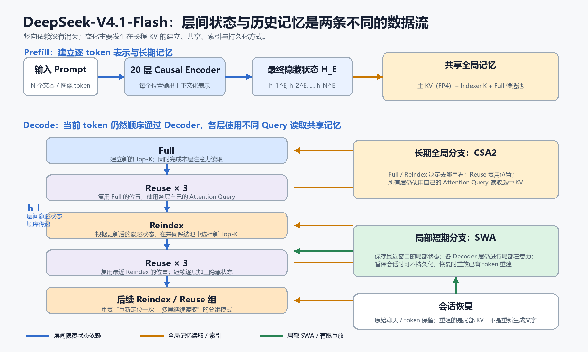

# DeepSeek-V4.1-Flash 架构与 KV Cache 优化详解

## 1. 这篇笔记要解决什么问题

DeepSeek-V4.1-Flash 的核心价值，不只是把某个张量从 FP8 改成 FP4，而是重新设计了长上下文推理中三个相互关联的问题：输入如何编码、Decoder 如何读取历史，以及暂停会话时哪些中间状态值得保存。

传统 decoder-only Transformer 通常让每一层维护自己的历史 KV Cache。上下文越长、层数越多、并发会话越多，这些缓存占用的 HBM 和持久化空间就越大。V4.1-Flash 通过 Causal Encoder-Decoder（CED）、Compressed Sparse Attention 2（CSA2）、Sliding-Window Attention（SWA）的 Bounded Replay，以及 FP4 KV Cache，将全局 KV Cache 压缩到官方公布的 890 bytes/token，并将持久化缓存降到上一代 V4-Flash 的约八分之一。

可以先把整套设计理解为一条分工链：CED 决定“谁负责编码输入、谁负责生成输出”，CSA2 决定“从很长的历史中查看哪些位置”，SWA 保留“眼前最近的一小段上下文”，FP4 与 Bounded Replay 则继续减少长期保存这些状态的成本。它们不是四个互不相关的小技巧，而是在共同回答一个问题：**怎样让长上下文模型保留可用的历史，同时避免缓存成本随层数和序列长度失控。**

本文沿着“一个 token 如何穿过模型”的主线展开，重点澄清以下容易混淆的边界：

- 总参数量、激活参数量、模型权重与 KV Cache 不是同一个概念；
- Decoder 层间的纵向依赖，与当前层读取历史的横向依赖不是同一条数据流；
- 共享全局 KV 不等于所有 Decoder 层执行相同计算；
- Full、Reindex、Reuse 复用的对象不同；
- 后一个 Reindex 依赖前层输出，不代表它的检索结果必须是前一个 Reindex 结果的子集；
- Bounded Replay 重建的是局部 KV 张量，不是重新生成聊天原文。

## 2. 阅读前的最小词典与四种“大小”

在比较架构之前，先给几个会反复出现的词一个直观定义：

| 术语 | 新手可以先怎样理解 |
| --- | --- |
| token | 模型处理文本的基本单位，可能是一个字、词的一部分、标点或代码片段；它不一定等于一个完整汉字或单词 |
| 向量 | 一组有顺序的数字；模型用它表示一个 token 当前包含的信息 |
| 隐藏状态 | token 经过若干层计算后的向量表示，记作 $h_t^{(l)}$ ，其中 $t$ 表示 token 位置， $l$ 表示已经经过的层数 |
| 层 | Transformer 中重复堆叠的计算模块；后一层接收前一层产生的隐藏状态 |
| Transformer | 以注意力和前馈网络为核心、通过多层堆叠逐步加工 token 表示的神经网络架构 |
| decoder-only | 只使用因果 Decoder 堆栈的生成式架构；每个位置只能读取自己以及更早的位置 |
| Prompt | 模型开始生成前已经给出的输入，包括用户文字、系统指令、代码、图片表示和工具结果等 |
| 参数 | 训练后保存在模型中的数值，决定模型怎样变换输入；推理时通常不会随当前对话改变 |
| 激活值 | 当前请求经过模型时临时产生的中间结果，隐藏状态和 KV Cache 都属于这一大类 |
| HBM | GPU 上的高带宽显存，速度快但容量昂贵且有限 |
| 持久化存储 | SSD 等能在会话暂停后长期保存数据的介质，容量较大但访问更慢 |

有了这些概念，再讨论模型效率时，还必须把下面四种“大小”分开。这里的 B 表示十亿，例如 8B 参数约等于 80 亿个参数。

### 2.1 总参数量

总参数量描述模型拥有多大的参数容量。DeepSeek-V4.1-Flash 的 Transformer 主干为 552B 参数，此外还有 196B Engram（由 DeepSeek 与北京大学共同提出并开源的一种大语言模型[条件记忆模块](https://zhuanlan.zhihu.com/p/1994872726192677278)） 条件记忆，以及视觉编码器、投影器和推测解码组件等辅助部分。不同资料出现 552B、748B 或约 763B，通常来自统计口径不同：552B 指主干，后两个数字还计入 Engram 或更多辅助组件。

总参数量影响完整权重的存储和部署规模，但不等于每处理一个 token 都会运行全部参数。

### 2.2 激活参数量

V4.1-Flash 是 Mixture-of-Experts（MoE，混合专家）模型。所谓“专家”，可以先理解为层内多个并列的前馈网络分支；路由器会根据当前 token 的状态，只选择少数分支参与计算。每个 MoE 层包含 1 个共享专家和 384 个路由专家，每个 token 只选择 6 个路由专家。其简化形式为：

$$y(x)=E_{\mathrm{shared}}(x)+\sum_{i\in\mathrm{TopK}(g(x))}p_iE_i(x)$$

其中， $g(x)$ 是路由器， $E_i$ 是第 $i$ 个专家， $p_i$ 是专家权重。官方给出的激活规模是输入阶段约 8B 参数、输出阶段约 16B 参数。这里的 8B 或 16B 表示单个 token 实际经过的稀疏计算路径，不表示整个 Prompt 永远只由一组固定参数处理。

可以把它类比为一家拥有许多科室的医院：一名患者不需要全院医生同时会诊，但不同患者会去不同科室。类似地，代码 token、中文说明和数据库字段可以路由到不同专家；单个 token 只使用少量专家，一个长 Prompt 在整体上却可能先后使用模型中的大量专家。

### 2.3 模型权重占用

即使每个 token 只激活少量专家，部署系统仍需保存或能够访问完整权重。因此“16B active”不等于模型可以按照普通 16B Dense 模型的资源需求部署。总权重仍可能分布在多张 GPU、主机内存或分层存储中，并涉及专家并行和设备间通信。

### 2.4 KV Cache 占用

模型权重可以被多个请求共享，KV Cache 则主要属于具体会话。长上下文 Agent 会持续积累代码、文档、对话、检索结果和工具输出；当并发会话增加时，每条会话都要携带自己的缓存，KV Cache 往往比权重更早成为 HBM 和存储瓶颈。

因此需要记住：

| 概念 | 回答的问题 |
| --- | --- |
| 总参数量 | 模型一共拥有多少参数容量？ |
| 激活参数量 | 当前 token 实际运行多少参数？ |
| 权重占用 | 完整模型需要保存多少权重数据？ |
| KV Cache | 当前会话为了复用历史计算，需要保存多少中间状态？ |

## 3. 前置知识：传统 decoder-only Transformer 如何维护历史

理解 V4.1 的改动前，必须先理解传统结构为什么会为每一层保存不同的 KV。

### 3.1 Q、K、V 分别在做什么

自注意力要解决的问题是：**当前 token 应该从其他 token 中读取哪些信息？** 为此，每个位置的隐藏状态会被投影成三种向量：

- Query（Q）：当前 token 正在寻找什么；
- Key（K）：这个历史位置可以用什么特征被找到；
- Value（V）：一旦这个位置被关注，应该取出什么内容。

设一组 token 的隐藏状态组成矩阵 $H$ ，通过三个训练得到的投影矩阵可以得到：

$$Q=HW_Q,\qquad K=HW_K,\qquad V=HW_V$$

注意力先用 Query 与所有 Key 计算匹配分数，再把分数归一化为权重，最后对 Value 做加权汇总：

$$\mathrm{Attention}(Q,K,V)=\mathrm{softmax}\left(\frac{QK^\top}{\sqrt{d_{\mathrm{head}}}}\right)V$$

这里可以暂时把它理解为一次“检索再阅读”：

1. $QK^\top$ 比较当前问题与各历史位置的匹配程度；
2. softmax 把匹配分数转换为总和为 1 的注意力权重；
3. 用这些权重对历史 Value 加权，得到当前 token 读取到的上下文信息。

Q、K、V 都不是可读文字，而是由隐藏状态计算出的数值向量。后文的“共享 KV”共享的是这些历史中间表示，不是让所有层共享同一个 Query，也不是把整段 Prompt 压缩成一个向量。

### 3.2 Prefill、Decode 与 KV Cache

自回归模型的一次推理通常分为两个阶段：

1. **Prefill（输入填充）**：模型一次处理用户已经给出的 Prompt，为所有输入位置计算隐藏状态，并建立后续生成需要的缓存。
2. **Decode（逐 token 解码）**：模型每次只生成一个新 token。新 token 的 Query 需要读取此前所有可见位置的 Key 和 Value，然后才能预测下一个 token。

如果 Decode 时每生成一个 token 都重新计算整段历史，长度为 $N$ 的上下文会被反复计算。KV Cache 的作用，就是保存历史 token 已经计算好的 Key 和 Value。生成下一个 token 时，模型只需计算新位置的 Q、K、V，并让新 Query 读取缓存中的历史 K、V。

因此，KV Cache 保存的不是聊天文字本身，也不是模型参数，而是**由聊天 token 和模型权重共同计算出的中间张量**。

### 3.3 每层的 KV 为什么不相同

设位置 $t$ 的初始表示为 $h_t^{(0)}$ 。式子中的 Norm 表示归一化，用来让数值尺度更稳定； $W_Q$ 、 $W_K$ 和 $W_V$ 是该层训练得到的投影矩阵。第一层计算：

$$Q_t^{(1)}=\mathrm{Norm}(h_t^{(0)})W_Q^{(1)}$$

$$K_t^{(1)}=\mathrm{Norm}(h_t^{(0)})W_K^{(1)},\qquad V_t^{(1)}=\mathrm{Norm}(h_t^{(0)})W_V^{(1)}$$

第一层完成注意力和前馈计算后得到 $h_t^{(1)}$ 。第二层再以它为输入：

$$Q_t^{(2)}=\mathrm{Norm}(h_t^{(1)})W_Q^{(2)}$$

$$K_t^{(2)}=\mathrm{Norm}(h_t^{(1)})W_K^{(2)},\qquad V_t^{(2)}=\mathrm{Norm}(h_t^{(1)})W_V^{(2)}$$

不同层的输入隐藏状态不同，投影矩阵也不同，因此 $K^{(1)},V^{(1)}$ 与 $K^{(2)},V^{(2)}$ 通常不相同。浅层、中层和深层的 KV 可以看作同一段历史在不同抽象层次上的表示：它们对应相同的 token 位置，却不是相同的数值副本。

### 3.4 最后一层输出，但所有层共同决定结果

生成 token 时，当前表示必须顺序经过全部层：

1. 当前 token 的初始表示进入第 1 层；
2. 第 1 层读取第 1 层的历史 KV，产生 $h_t^{(1)}$ ；
3. 第 2 层以 $h_t^{(1)}$ 为输入，读取第 2 层的历史 KV，产生 $h_t^{(2)}$ ；
4. 这一过程逐层重复，直到第 $L$ 层产生 $h_t^{(L)}$ ；
5. LM Head 将 $h_t^{(L)}$ 转换为下一个 token 的概率分布。

LM Head 可以理解为模型最后的“词表打分器”：它为词表中的每个候选 token 产生一个分数，softmax 再将这些分数转换为概率。

最终概率来自最后一层：

$$P(y_t)=\mathrm{softmax}(W_{\mathrm{LM}}h_t^{(L)})$$

但 $h_t^{(L)}$ 是前面所有层逐层加工的结果。因此“最后一层决定输出”和“所有层共同参与计算”并不矛盾：各层不是投票，而是串行变换。

### 3.5 KV Cache 为什么随层数和上下文增长

传统缓存大小可粗略写为：

$$M_{\mathrm{KV}}\propto L\times N\times H_{\mathrm{KV}}\times d_{\mathrm{head}}\times 2\times b$$

其中， $L$ 是独立缓存层数， $N$ 是上下文长度， $H_{\mathrm{KV}}$ 是 KV head 数量， $d_{\mathrm{head}}$ 是每个 head 的维度， $2$ 表示 Key 和 Value 两份， $b$ 是每个数值的字节数。

“head”可以理解为并行观察信息的一组注意力通道。多个 head 可以学习不同的匹配方式； $H_{\mathrm{KV}}$ 表示需要保存多少组 K/V 通道， $d_{\mathrm{head}}$ 表示每组通道包含多少个数值。这里不需要记住具体实现，只需看出缓存还会随着 head 数量、每个 head 的宽度和数值精度增加。

这个式子揭示了两个独立的放大因素：上下文每增加一个 token，所有缓存层都要新增一份 KV；模型每增加一个独立缓存层，同一段历史又要多保存一份表示。V4.1-Flash 的优化重点正是削弱第二个放大因素，并压低每个全局 KV 条目的存储位宽。

## 4. 两条正交的数据流：层间传递与历史读取

理解 CED 的关键，是把两个方向分开。

### 4.1 层方向：当前 token 逐层加工

第 $l$ 层输出 $h_t^{(l)}$ ，仍然会成为第 $l+1$ 层的输入。严格说，上一层输出不是下一层的 Query 本身，而是经过归一化和本层投影后形成 Query：

$$Q_t^{(l+1)}=\mathrm{Norm}(h_t^{(l)})W_Q^{(l+1)}$$

V4.1 并没有取消这种纵向依赖。20 个 Decoder 层不是相互独立、并行查询 Encoder 的 20 个模块。

### 4.2 时间方向：当前层读取历史

当前层的 Query 需要读取过去 token 的 Key 和 Value。传统结构让每一层拥有自己的完整长期 KV；V4.1 则让大量 Decoder 层共享由 Encoder 最终表示投影得到的全局主 KV。

因此 V4.1 的 Decoder 同时存在两条正交的数据流：

| 方向 | 传递的对象 | 作用 |
| --- | --- | --- |
| 纵向的层间传递 | 上一 Decoder 层产生的当前隐藏状态 | 让当前 token 继续接受更深层的非线性加工 |
| 横向的历史读取 | Encoder 派生的共享全局 KV，以及最近窗口的局部状态 | 让当前层获取过去 token 中与当前计算有关的信息 |

这两个方向不能互相替代。共享历史记忆不会取消 Decoder 的逐层推理。

*图 1：DeepSeek-V4.1-Flash 推理数据流示意。竖向箭头表示当前 token 在 Decoder 层间顺序传递，横向箭头表示各层从共享全局 KV 和局部 SWA 状态中读取历史。Full/Reindex/Reuse 改变的是全局历史的建立、检索和复用方式，不会取消层间依赖。AI 生成示意图。*

## 5. Causal Encoder-Decoder 如何改变 Prefill

V4.1-Flash 的 40 层主干由 20 层 Causal Encoder 和 20 层 Decoder 组成。这里的 Encoder 仍遵守因果遮罩，位置 $t$ 只能看到位置 $1$ 到 $t$ ，不是 BERT 式双向编码器。

对新手来说，最重要的是先看清“什么改变了、什么没有改变”：

| 问题 | 传统 decoder-only | V4.1-Flash 的教学性概括 |
| --- | --- | --- |
| 输入怎样逐层处理？ | Prompt 经过统一的 Decoder 堆栈 | Causal Encoder 主要负责大规模输入编码 |
| 长期历史 KV 从哪里来？ | 每个 Decoder 层根据自己的层输入建立一份 | 由 Encoder 最终表示派生出可跨多个 Decoder 层共享的全局主 KV |
| 生成 token 是否仍逐层传递？ | 是 | 是，20 个 Decoder 层仍然串行依赖 |
| 各 Decoder 层的 Query 是否相同？ | 不同 | 仍然不同，来自各层当前隐藏状态和各自投影 |
| 是否还存在局部逐层状态？ | 存在 | 仍存在层间隐藏状态、局部 SWA 状态和每层非线性计算 |

因此，CED 不是“Encoder 算完以后，20 个 Decoder 层彼此独立地查询一次数据库”。它改变的是长期历史如何建立和共享，不会切断当前 token 在 Decoder 层之间的加工链。

### 5.1 Encoder 最终输出是一组逐 token 隐藏状态

若输入长度为 $N$ ，Encoder 最终输出为：

$$H_E=[h_1^E,h_2^E,\ldots,h_N^E]$$

它不是把整个 Prompt 压成一个固定向量，也不是只输出单独一对 KV。每个输入位置仍有自己的上下文化表示： $h_i^E$ 对应第 $i$ 个位置，但已经融合了位置 $1$ 到 $i$ 的因果历史。

例如输入有 300,000 个 token，Encoder 最终仍会产生 300,000 个按位置排列的隐藏向量。这里的“全局”表示这些条目共同覆盖整段可见历史，不表示整段历史被合并成一个固定大小的向量。Decoder 所需的全局 KV 由这些表示投影得到：

$$K_G=H_EW_K,\qquad V_G=H_EW_V$$

更严谨地说，官方架构还会对主 KV 条目、压缩权重和索引器状态进行专门投影；上式只是帮助理解“所有全局条目来自同一组 Encoder 最终表示”的教学简化。

传统 decoder-only 结构可以理解为“每一层都为整段历史制作自己的索引卡片”；CED 则先让 Causal Encoder 为每个历史位置制作一套公共的上下文化索引卡片，再让多个 Decoder 层从这套公共记忆中读取信息。公共记忆仍然按 token 保留条目，因此它减少的是**层间重复**，而不是把序列长度压缩为常数。

### 5.2 共享全局 KV 不等于各层结果相同

即使两层读取相同的 $K_G,V_G$ ，它们的 Query 也不同：

$$A_t^{(l)}=\mathrm{softmax}(Q_t^{(l)}K_G^\top)V_G$$

$$A_t^{(l+1)}=\mathrm{softmax}(Q_t^{(l+1)}K_G^\top)V_G$$

由于 $Q_t^{(l)}\neq Q_t^{(l+1)}$ ，两层对历史位置分配的权重和读取结果通常不同。即使两个人查阅同一个资料库，只要提出的问题不同，最终找到的重点也会不同。这里的共享 KV 类似共同的资料库，而每一层的 Query 类似该层根据当前推理状态提出的问题。

各层还拥有不同的隐藏状态、投影参数、MoE/FFN 计算和残差变换。FFN（前馈网络）负责对每个位置做进一步的非线性变换；残差连接则把进入该子模块的原状态加回输出，避免新计算完全覆盖此前已经形成的信息。因此，一层的输出不只是“从 KV 中取出的内容”，而是旧状态、注意力读取结果和本层变换共同形成的新隐藏状态。

所谓“不同层用自己的内部状态解释共享记忆”，指的是各层当前隐藏向量 $h_t^{(l)}$ 不同，从而产生不同 Query。隐藏状态是一组数值，不是模型内部写着“现在查询函数”的可读标签。某层查函数、下一层查约束，只是我们对逐层变化的 Query 所做的语义化教学解释，并非人为指定的固定分工。

### 5.3 为什么共享全局 KV 可能成立

传统模型让每层保存自己的历史表示，表达自由度更高。V4.1 将长期历史压入公共表示，确实形成信息瓶颈，理论上可能损失某些层专属的细节。它不是无损压缩。

这套结构能够工作，依赖于模型从头端到端训练：Encoder 学习生成可供多个 Decoder 层读取的公共记忆，Decoder 学习通过各自 Query 从公共记忆中提取所需信息。共享全局 KV 只替代长期历史副本；最近窗口的 SWA 状态、层间隐藏状态和每层非线性计算仍提供表示能力。

## 6. 为什么输入每个 token 只激活 8B 参数

“输入 token 更多”与“每个输入 token 应激活更多参数”不是同一个问题。若输入为 300,000 tokens、输出为 2,000 tokens，则非常粗略地比较 token 数与激活规模：

$$\frac{300000\times 8}{2000\times 16}=75$$

这个比值只用于建立数量级直觉，并不是精确 FLOPs 计算，因为注意力、MoE 路由和不同算子的成本并不相同。它说明的是：即使单个输入 token 只激活 8B 参数，整个 Prefill 的工作规模仍可能远大于 Decode。V4.1 降低的是每个输入 token 的单位成本，不是声称整个输入阶段计算更少。

输入是已知数据，主要任务是建立上下文化表示；输出 token 是未知决策，生成错误还会影响后续所有 token，因此 Decode 需要更强的逐步推理与检索能力。Prefill 还能在 token 维度上并行，而 Decode 受自回归依赖限制。

少量激活参数仍可能造成信息损失，但不能简单理解成固定的 8B 参数处理整个 Prompt。不同 token 可以路由到不同专家，且每个 token 仍经过多层因果编码和注意力交互。模型优化的目标不是逐 bit 无损恢复输入，而是保留对后续预测有用的信息。

官方基础模型评测也说明这是一种效果与效率折中：V4.1-Flash 在 LongBench-V2 上略高于 V4-Flash，但低于更大的 V4-Pro。不能仅根据缓存缩小就推断其在所有长上下文任务上没有任何能力代价。

## 7. Decoder 的两类记忆：全局 CSA2 与局部 SWA

### 7.1 为什么需要两种记忆

V4.1 的 Decoder 不只依赖共享全局 KV，还保留局部 Sliding-Window Attention 分支。可将每层历史读取教学性地写为：

$$A_t^{(l)}=A_{\mathrm{global},t}^{(l)}+A_{\mathrm{local},t}^{(l)}$$

这里的加法是教学性表达，强调两个分支的结果都会进入当前层；它不等同于官方实现中所有张量必然直接逐元素相加。

全局分支负责遥远历史，局部分支负责最近窗口。对于编程 Agent，全局分支可能找回很早以前的接口定义，局部分支则维持当前函数中的变量名、括号、缩进和最近生成内容。二者互补的原因是：远距离信息需要“先筛选再读取”，最近信息数量有限，可以保留更密集、更直接的注意力。

因此以下两句话必须区分：

- 正确：Decoder 各层共享主要的长程全局 KV；
- 不准确：Decoder 删除了所有逐层状态，只依赖一个总 KV。

### 7.2 用一个编程任务贯穿后续章节

假设历史中分散着下面几类信息：

| 历史位置 | 内容 |
| --- | --- |
| A | 用户要求修改注册功能 |
| B | create_user 函数定义 |
| C | 数据库 email 字段的唯一约束 |
| D | 重复邮箱测试的失败日志 |
| E | HTTP 409 错误规范 |
| F | 当前正在编辑的函数末尾几行代码 |

局部 SWA 可以密集读取最近的 F，用来维持变量名、括号和缩进；全局 CSA2 则负责从更远的 A 到 E 中找到当前真正需要的位置。后文提到的“候选池”“Top-K”“重新索引”和“复用位置”，都可以放回这个例子理解。

## 8. CSA2 的两种 Query

理解 Full、Reindex、Reuse 前，需要区分两种 Query。

CSA2 中有两套容易混淆的对象：

| 对象 | 保存或表示什么 | 用途 |
| --- | --- | --- |
| 索引器 K | 为历史位置准备的检索特征 | 快速判断哪些位置可能相关 |
| 全局主 K/V | Decoder 真正进行注意力读取的历史表示 | 对选中位置分配权重并汇总内容 |
| 候选池 $C$ | Full 层初步召回的一批位置编号 | 限制后续 Reindex 的搜索范围 |
| Top-K 集合 $S_l$ | 第 $l$ 个关键层最终选中的少量位置编号 | 决定该层组真正读取哪些主 K/V |

因此，索引器像目录，主 K/V 像书的正文；候选池和 Top-K 都是“位置集合”，不是已经读取完成的语义结果。

### 8.1 Indexer Query

Indexer Query 用于决定“去哪些历史位置看”。设候选池为 $C$ ，第 $l$ 层的索引 Query 为 $q_{\mathrm{idx}}^{(l)}$ ，则选中的位置集合为：

$$S_l=\mathrm{TopK}(q_{\mathrm{idx}}^{(l)},K_{\mathrm{index}}[C])$$

$S_l$ 是位置编号集合，例如 $\{12,48,103,900\}$ ，不是注意力读取后的语义向量。索引器在这一阶段只回答“哪些位置值得进一步读取”，它不会替代真正的注意力计算。

### 8.2 Attention Query

Attention Query 用于决定“怎样读取已经选中的位置”：

$$A_l=\mathrm{Attention}(q_{\mathrm{attn}}^{(l)},K_G[S_l],V_G[S_l])$$

索引器负责定位，主注意力负责读取。可以把它们类比为数据库的两步操作：Indexer Query 先找出候选记录的行号，Attention Query 再根据当前问题对这些记录分配权重并汇总内容。Reuse 可以复用位置集合 $S_l$ ，但仍会使用自己的 Attention Query 重新计算注意力权重。

## 9. Full、Reindex 与 Reuse

先从成本与复用对象看三种模式：

| 模式 | 是否沿用主 K/V | 是否重新选择 Top-K | 是否重新计算注意力读取 |
| --- | --- | --- | --- |
| Full | 建立或刷新 | 是，并负责较广范围的初始召回 | 是 |
| Reindex | 是 | 是，在共同候选池中重新选择 | 是 |
| Reuse | 是 | 否，继承前面选中的位置 | 是，使用本层自己的 Attention Query |

### 9.1 Full 模式

Full 层负责建立或刷新主 KV、索引器 K，并计算新的 Top-K 位置。在 Decoder 的 Hierarchical Sparse Indexer 中，第一个 Full 层还对较广历史进行块级搜索，建立供后续 Reindex 使用的大候选池。

Full 可以概括为三个动作：建立或刷新共享记忆与索引基础、根据自己的 Indexer Query 选择位置、再根据自己的 Attention Query 读取这些位置。

### 9.2 Reindex 模式

Reindex 层复用已有的主 KV 和索引器 K，但根据当前隐藏状态生成新的 Indexer Query，并在 Full 提供的共同候选池中选择自己的 Top-K：

$$S_A=\mathrm{TopK}(q_A,K_C)$$

$$S_B=\mathrm{TopK}(q_B,K_C)$$

通常只有 $S_A\subseteq C$ 和 $S_B\subseteq C$ ，并不要求 $S_B\subseteq S_A$ 。

从执行顺序看，Reindex A、后续 Reuse 层与 Reindex B 仍然串行：B 的隐藏状态来自前面各层的输出。从集合关系看，A 和 B 又像是对同一个候选池提出两次不同查询，二者结果不必形成逐层缩小的漏斗。这两个视角并不矛盾。

### 9.3 Reuse 模式

Reuse 层不重新运行索引器，而是继承前面 Full 或 Reindex 选中的位置：

$$S_{\mathrm{reuse}}=S_{\mathrm{source}}$$

但它仍根据自己的隐藏状态计算新的 Attention Query：

$$A_{\mathrm{reuse}}=\mathrm{Attention}(q_{\mathrm{attn}}^{(\mathrm{reuse})},K_G[S_{\mathrm{source}}],V_G[S_{\mathrm{source}}])$$

因此 Reuse 复用的是“去哪里看”，不是上一层的注意力输出，也不是上一层的注意力权重。

### 9.4 Decoder 的分组方式

根据官方技术报告，20 个 Decoder 层可概括为五组：

| 层组 | 第 1 层 | 后续 3 层 | 这一组的含义 |
| --- | --- | --- | --- |
| 第 1 组 | Full | Reuse × 3 | 建立共享记忆、候选池和第一组检索位置 |
| 第 2 组 | Reindex | Reuse × 3 | 根据更新后的隐藏状态重新选位置，随后连续读取 |
| 第 3 组 | Reindex | Reuse × 3 | 再次提出新的索引问题，随后连续读取 |
| 第 4 组 | Reindex | Reuse × 3 | 再次提出新的索引问题，随后连续读取 |
| 第 5 组 | Reindex | Reuse × 3 | 最后一次重选位置，随后完成深层加工 |

这使高成本索引工作只在少数层发生，而其余层继续围绕同一批位置逐层加工。一个组内的三个 Reuse 层并不是“空转”：它们虽然不再选择新的位置，但仍生成自己的 Attention Query、计算自己的注意力输出，并执行各自的残差和 MoE/FFN 变换。

## 10. 为什么后一个 Reindex 不必是前一个结果的子集

容易产生的误解是：既然后一个 Reindex 的隐藏状态依赖前一个 Reindex 和中间 Reuse 层，那么后一次检索结果应该只是前一次结果的进一步缩小。

这个推论不成立，因为“隐藏状态依赖”不等于“搜索空间被限制”。Reindex B 的 Query 来自前层输出：

$$q_B=\mathrm{Norm}(h_{B-1})W_{\mathrm{idxQ}}^{(B)}$$

但 Reindex B 仍回到共同候选池 $C$ 中搜索，而不是只在 $S_A$ 中搜索：

$$S_B=\mathrm{TopK}(q_B,K_C)$$

前一次读取的结果会改变后续隐藏状态，进而让模型提出新的问题。例如：

1. Reindex A 找到 **create_user** 函数定义和调用位置；
2. 后续 Reuse 层结合已有状态，识别该函数会执行数据库写入；
3. Reindex B 带着更新后的问题回到共同候选池，转而查找唯一约束、失败测试和 HTTP 409 规范。

第二次查询依赖第一次答案，但第二次文档不必属于第一次文档。这与多跳检索相同：先查“张三在哪家公司”，得到“甲公司”；再查“甲公司的法人”，第二次结果依赖第一次，却不是第一次结果的子集。

中间 Reuse 层的输出也不只是选中 KV 的复制。每层都会把注意力结果与此前残差状态、MoE/FFN 结果结合，因此新的隐藏状态包含持续加工后的高维信息。

## 11. Bounded Replay 重建的不是聊天内容

长期聊天中必须区分源数据和派生缓存。

### 11.1 原始对话是源数据

聊天原文或对应 token IDs 由应用层保存。例如，一轮“用户要求检查数据库模块、助手返回三个问题”的对话，会先作为文本或 token 序列保存在会话记录中。

这些内容不会因为局部 SWA KV 没有持久化而消失。

### 11.2 KV Cache 是派生中间状态

KV Cache 来自一条确定的前向计算链：聊天原文先被分词为 token IDs，token IDs 经过 Transformer 后产生各层或各分支需要的 K/V 张量。

它类似由源代码生成的编译缓存。删除编译缓存不会删除源代码；下次可以用完全相同的源代码重建缓存。

### 11.3 Replay 是重放已有 token，不是重新采样生成

恢复会话时，系统读取原有 token IDs，将最近 $n_{\mathrm{win}}$ 个 token 再执行一次前向计算：

$$K_{\mathrm{SWA}},V_{\mathrm{SWA}}=f_\theta(x_{t-n_{\mathrm{win}}+1:t},\text{global state})$$

这里没有让模型猜测用户过去说了什么，也没有对历史文字重新采样。输入 token 已经确定，被重建的是局部隐藏张量。只要模型权重、token 序列和影响计算的运行条件保持一致，Replay 就是在重复一次缓存构建计算，而不是创造一段新的对话。

### 11.4 为什么称为 Bounded

局部 SWA 只关注最近窗口。设窗口长度为 $W$ ，完整会话长度为 $N$ ，且 $W\ll N$ 。会话暂停时，系统持久化长期全局状态，而不必把全部短期 SWA KV 写入 SSD；恢复时最多围绕最近的 $W$ 个 token 重放，而不是重算完整的 $N$ 个 token 历史。于是恢复计算的规模由局部窗口约束，不再随完整会话长度等比例增长。

恢复流程可以分为四步：

1. 从应用层读取已经保存的原始 token IDs；
2. 从持久化存储读取长期全局状态；
3. 重放最近窗口内的确定 token，重建各层局部 SWA KV；
4. 将全局长期记忆与重建后的局部状态一起交给 Decoder，继续生成。

在多层 SWA 中，上层窗口理论上可能间接依赖更早的下层状态，因此有限重放可以视作工程上的效果与成本折中。这里可能近似的是局部神经网络状态，不是对话文字本身。

## 12. FP4 如何进一步压缩全局 KV

计算机需要用若干 bit 保存一个数。bit 越多，通常能表达的数值范围和精细程度越高，但占用空间也越大。FP8 的主体数值使用 8 bit，FP4 只使用 4 bit；单看主体数据，FP4 的理论占用约为 FP8 的一半，代价是可表示的数值更少、近似误差更大。

V4.1-Flash 使用 E2M1 FP4 保存主 KV，并为每 16 个 channel 使用一个 E4M3 scale。E2M1 表示 FP4 内部用 2 bit 表示指数、1 bit 表示尾数，剩余 1 bit 表示符号。由于单个 FP4 数值表达能力有限，需要让一小组数共享额外的缩放因子，把它们映射到适合 FP4 表示的范围。分组量化可简化写为：

$$x_i\approx s_gq_i$$

其中， $x_i$ 是原始值， $q_i$ 是低精度 FP4 值， $s_g$ 是该组共享的缩放因子。量化时，先根据一组数值的范围确定缩放因子 $s_g$ ，再把每个高精度值映射到有限的 FP4 表示；读取缓存时，使用同一个 $s_g$ 近似恢复原始尺度。

与 FP8 相比，主体数值位宽从 8 bit 降到 4 bit，但每组还要额外保存 scale，工程实现中还可能包含对齐与元数据。因此“每个主体值减半”不等于“最终缓存字节数严格减半”。890 bytes/token 应当视为整套全局缓存布局给出的结果，而不能只用某一个张量的位宽直接推出。

FP4 也会引入量化误差。其难点不在于保存 4 bit，而在于模型经过量化感知训练后，能否在超长上下文和反复稀疏检索中保持足够稳定的注意力质量。

## 13. 一次长上下文 Agent 请求的完整路径

假设一个编程 Agent 的输入包含 300,000 tokens，输出为 2,000 tokens。

1. 文本和图像被转换为 token 表示；图像先经过视觉编码器和投影器。
2. 300,000 个输入 token 主要经过 20 层 Causal Encoder，每个 token 约激活 8B 参数。
3. Encoder 最终隐藏状态投影为 Decoder 使用的共享全局 KV 和索引状态。
4. 最近窗口建立局部 SWA 状态。
5. 当前生成 token 顺序经过 20 个 Decoder 层，每层仍依赖上一层输出。
6. Full 或 Reindex 决定当前组应查看哪些长期历史位置，Reuse 复用这些位置但使用自己的 Attention Query。
7. 每个输出 token 约激活 16B 参数，并把新的状态继续加入因果序列。
8. 会话暂停时，全局长期状态可持久化，局部 SWA KV 可以丢弃。
9. 会话恢复时，读取原始 token 并重放最近窗口，重建局部 KV 后继续生成。

按官方数字估算，V4.1-Flash 的全局 KV 为 890 bytes/token。以十进制单位计算：

$$300000\times 890\ \mathrm{bytes}=267000000\ \mathrm{bytes}\approx 267\ \mathrm{MB}$$

$$1000000\times 890\ \mathrm{bytes}=890000000\ \mathrm{bytes}\approx 890\ \mathrm{MB}$$

这个数字只代表单序列全局 KV，不包含模型权重、局部 SWA 状态、视觉部分、工作区和运行时缓冲。若同时服务 $B$ 条不能共享缓存的序列，这部分容量还会近似乘以 $B$ 。

## 14. 常见误解对照

| 容易产生的理解 | 更准确的理解 |
| --- | --- |
| Encoder 把全部 Prompt 压成一个 KV | Encoder 为每个位置产生隐藏表示，再投影为一组全局 KV 条目 |
| V4.1 删除了所有逐层 KV | 主要共享长程全局主 KV；局部 SWA 状态仍存在 |
| Decoder 各层不再依赖上一层 | 当前 token 仍顺序穿过 Decoder，各层隐藏状态连续传递 |
| 第一层输出就是第二层 Query | 第一层输出是第二层生成 Query 的输入，还需归一化和本层投影 |
| 共享 KV 会让所有层结果相同 | 各层 Query、隐藏状态、投影、MoE 和注意力权重不同 |
| 8B 参数处理整个 Prompt | 每个 token 约激活 8B，且不同 token 可路由到不同专家 |
| Reindex B 只能搜索 Reindex A 的结果 | A 与 B 都在 Full 的共同候选池中用各自 Query 选择 Top-K |
| Reuse 复用上一层注意力输出 | Reuse 复用 Top-K 位置，但用自己的 Attention Query 重新读取 |
| Replay 会重新生成最近聊天 | Replay 用已经保存的原始 token 重建局部 KV 张量 |
| 890 MB 是整个模型占用 | 这是百万 token 单序列的全局 KV 量级，不包含权重和其他状态 |

## 15. 能力边界与代价

这些机制不是无损魔法，而是一组协同设计的工程折中。

- 共享全局 KV 减少层专属历史表示，可能限制部分表达自由度；
- 稀疏索引如果漏掉关键位置，后续注意力无法读取对应信息；
- FP4 会引入量化误差；
- 一百万 token 的最大窗口不等于模型能同等可靠地回忆任意位置；
- 16B active 只描述单 token 稀疏计算，不代表完整模型具有普通 16B 模型的部署门槛；
- Bounded Replay 节省持久化状态，但恢复会话时需要额外计算；
- 官方评测能够说明整体设计有效，但不能证明每类任务都没有压缩代价。

## 16. 复习主线

DeepSeek-V4.1-Flash 的核心可以压缩成四层问题：

| 问题 | 对应机制 | 核心答案 |
| --- | --- | --- |
| 每个 token 运行哪些参数？ | MoE | 只激活少量路由专家与共享专家，降低单 token 计算量 |
| 输入与输出必须做相同计算吗？ | CED | Causal Encoder 负责大规模输入编码，Decoder 负责更强的逐 token 生成 |
| 当前层应该读取哪些历史？ | SWA + CSA2 | SWA 密集读取最近窗口，CSA2 稀疏检索长期历史 |
| 哪些中间状态值得长期保存？ | 共享 FP4 全局 KV + Bounded Replay | 长期状态压缩并持久化，局部 SWA 状态需要时由有限重放重建 |

最重要的判断是：V4.1 共享的是长程历史记忆，不是取消 Decoder 层间推理；Reindex 共享搜索空间但可提出新的问题；Reuse 复用位置而不是复用思考结果；Replay 重建缓存而不是重建聊天内容。

## 17. 参考资料

1. DeepSeek-AI. [DeepSeek-V4.1-Flash: Pushing the Limits of KV Cache Compression](https://huggingface.co/deepseek-ai/DeepSeek-V4.1-Flash/blob/main/DeepSeek_V41_Tech_Report.pdf).
2. DeepSeek-AI. [DeepSeek-V4.1-Flash 模型卡](https://huggingface.co/deepseek-ai/DeepSeek-V4.1-Flash).
3. DeepSeek-AI. [Introducing DeepSeek-V4.1-Flash](https://www.deepseek.com/en/news/deepseek-v4-1-flash/).
4. Sun, Y. et al. [You Only Cache Once: Decoder-Decoder Architectures for Language Models](https://arxiv.org/abs/2405.05254).
5. Chen, D. et al. [PowerAttention: Exponentially Scaling of Receptive Fields for Effective Sparse Attention](https://arxiv.org/abs/2503.03588).
6. DeepSeek-AI. [DeepSeek-V4 Technical Report](https://arxiv.org/abs/2606.19348).
