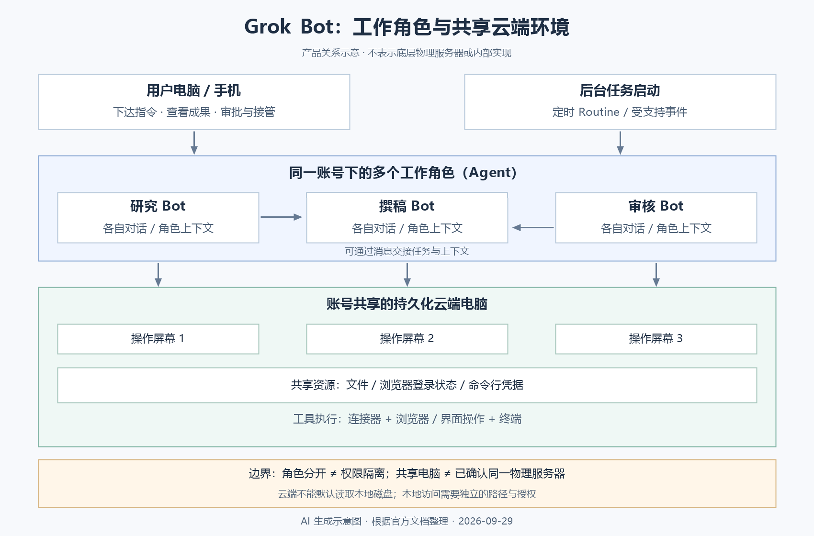

# Grok Bot：云端 Agent 的产品定位与能力边界

> 整理日期：2026-09-29。产品事实依据当日讨论中查阅的官方公告与文档；功能、订阅和开放范围可能变化。本文分析产品定位与概念边界，不代表实际使用测评。

Grok Bot 是一种以长期工作角色为入口的云端 Agent 产品。它将持续工作环境、工具操作、工作上下文、任务调度、技能复用和多个角色之间的协作组织成一个可以直接使用的服务。

理解它的关键问题是：这些能力是否构成新的技术类别，还是既有 Agent 能力的产品化整合？本文先区分 Bot、Agent 与聊天助手，再解释云端运行、Skill 和多 Bot 协作，最后评价其实际价值。Agent 持久化、失败恢复和安全机制只作为相关边界简要提及，不展开实现细节。

## 1. 发布背景与基本定位

官方于 2026 年 8 月 11 日发布 Grok Bot 的 Beta 版本，将其定位为可以接手实际工作的 AI 同事。[1]

这里的“机器人”指软件工作角色，不是具有实体身体的机器人。用户可以为 Bot 设置名字、职责和工作方式，在后续任务中持续使用同一角色，而不必每次重新说明全部背景。[2]

例如，“资料研究员”负责收集来源和整理证据，“费用整理员”负责核对费用和准备报告。这些角色具有各自的对话与工作上下文，但不是彼此完全隔离的工作环境。

产品希望解决的困难是：用户通常需要不断向 AI 提供材料、逐步指挥操作，并将回答搬到实际软件中。Grok Bot 尝试让用户直接委托一个结果，由系统在获得访问和授权后执行多步工作。

这是一种使用关系的变化，但能否完成具体任务仍取决于工具能力、数据可访问性、模型表现与权限范围。

## 2. Bot 与 Agent 的关系

### 2.1 Agent 是运行方式，Bot 是产品中的工作角色

Agent 可以理解为围绕目标形成行动循环的系统：理解任务，调用工具或采取操作，观察结果，再决定下一步。

一种常用工程区分是：Workflow 按预定义路径组织模型与工具；Agent 由模型根据当前情况动态决定过程和工具使用。行业用词并不完全统一，这是一种帮助分析系统的区分。[3]

Grok Bot 的 Bot 仍属于 Agent。它的名字强调持续存在的角色和协作体验，并不表示一种独立于 Agent 的技术原理。

### 2.2 与聊天助手、代码助手的比较

下面比较的是典型形态。这些名称并非互斥类别：代码助手也可以具有 Agent 能力，聊天界面也可以承载后台任务。

| 典型形态 | 主要委托内容 | 常见交付物 | 核心使用关系 |
|---|---|---|---|
| 传统聊天助手 | 问题或提供的材料 | 回答、解释、草稿 | 用户围绕对话获取帮助 |
| 代码补全助手 | 正在编辑的代码 | 补全与修改建议 | 用户主导编辑过程 |
| 编程 Agent | 开发或修复目标 | 文件修改与验证结果 | 系统在开发环境中连续执行 |
| 固定工作流 | 已定义的规则与步骤 | 按流程处理的结果 | 系统沿预设路径运行 |
| 通用 Agent | 需要多步完成的目标 | 工具执行结果与成果 | 系统根据观察决定下一步 |
| Grok Bot | 一次任务或长期职责 | 实际工具中的成果与汇报 | 用户持续向云端工作角色委托任务 |

因此，分析重点应放在运行位置、任务生命周期、执行能力和权限边界，而不是单纯比较产品名称。

## 3. 云端运行与 24/7

### 3.1 24/7 的含义

24/7 是“每天 24 小时、每周 7 天”，通常表示全天候可用。

对 Grok Bot，更准确的理解是：系统可以持续待命，已启动的任务可以在后台继续，例行任务可以在规定时间或受支持事件发生后启动。关闭用户的客户端或笔记本，不会停止云端后台任务。[4]

它不意味着模型每秒都在思考，也不保证所有任务可以无限运行。实际执行仍可能因为额度、登录过期、故障、人工验证或审批而暂停。

### 3.2 访问便利性与执行持续性

这两个优势需要分开理解：

- **访问便利性**：通过手机或电脑发送任务、查看成果和处理审批。
- **执行持续性**：实际工作在云端进行，不依赖用户设备一直开启。

手机能发送指令，并不能单独证明任务可以脱离本机运行。只有工作所需的环境、数据和工具也可独立访问时，用户关机后任务才能继续推进。

### 3.3 共享的是云端工作环境

官方说明，同一账号下的 Bots 共享一台云端电脑，包括文件、浏览器登录状态和命令行凭据；每个 Bot 有自己的操作屏幕。[4]

“共享云端电脑”不等于已经确认它们位于同一台物理服务器。底层物理服务器、虚拟机或其他资源如何分配，不能从这个产品描述推断。

*图 1：AI 生成示意图。根据官方产品文档绘制角色与资源关系：用户设备用于交互，Bot 具有各自的对话与角色上下文，同一账号的 Bots 共享云端文件和登录资源。图中分层仅用于解释产品边界，不表示官方内部部署架构。*

## 4. 工具执行、任务触发与本地数据

### 4.1 工具执行路径

Grok Bot 可以使用连接器访问支持的服务，也可以通过 Computer Use 操作浏览器和界面。后者包括点击、输入和导航。没有专门接口的网站，也可能通过界面操作处理，但网站仍可能阻止自动化或要求人工参与。[4]

相关概念分别解决不同问题：

| 概念 | 作用 |
|---|---|
| API | 软件向外部程序开放可调用的功能 |
| MCP | AI 应用发现和调用工具的一种统一协议 |
| 连接器 | 对具体服务提供集成与授权入口 |
| Computer Use | 在人的操作界面上执行动作 |

多种执行路径可以互补，不能将 Bot 简化为只会模拟点击的软件。

### 4.2 三种任务启动方式

| 启动方式 | 示例 | 对应机制 |
|---|---|---|
| 用户直接委托 | 整理一批材料，完成后汇报 | 一次任务中的连续执行 |
| 定时启动 | 每周五生成报告 | 调度器启动例行任务 |
| 事件触发 | 收到符合条件的通知后处理 | 受支持的事件集成启动任务 |

官方将定时或受支持事件触发的工作安排称为 Routine。[5] 从工程分类看，这些方式属于 Agent 与自动化调度的组合，并不因使用 Bot 名称而形成新原理。

### 4.3 云端与本地数据之间存在访问边界

云端环境不能默认读取本地磁盘。任务涉及本地文件时，需要通过上传、可访问的数据源或获授权的本地能力建立访问路径。官方将本地执行作为与云端工作分开的能力。[4]

例如，报告只依赖云端已保存的资料时，本机关机不影响处理；如果任务需要持续读取本机刚生成的数据，而访问路径依赖本机在线，那么关机后任务仍可能受阻。

因此，“云端 Agent 可以一直运行”与“所有任务都能脱离本机完成”是两个不同结论。

## 5. Skill：保存方法，而不是重新训练模型

在 Grok Bot 中，Skill 是可复用的工作指令，Routine 则指定由哪个 Bot 在什么时间或受支持事件下运行流程。[5]

例如，生成周报的 Skill 可以包含：数据来源、筛选规则、核对步骤、输出格式和审批要求；相应 Routine 安排它每周五执行。

官方支持将成功任务整理成 Skill，也提供逐步开放的演示教学能力：用户展示浏览器操作后，系统生成待审查与测试的技能草稿。[5]

这里需要保留三条边界：

1. **不等于模型参数训练。** 公开描述支持的是记忆与工作方法复用，不能据此认定 Bot 针对每个用户持续修改底层模型参数。
2. **不保证自动提炼出正确方法。** 演示中未出现的异常处理、决策规则和审批边界，需要补充。
3. **不保证执行完全确定。** 自然语言指令仍依赖模型理解，技能可能调用程序，但 Skill 本身不等于确定性代码。

从技术分类看，保存与复用程序性知识是既有 Agent 技术路线的一部分。Grok Bot 的功能描述不足以证明它首次提出这一原理。值得评估的是，它是否降低了技能创建、修正和日常复用的成本。

## 6. 多 Bot 协作就是多 Agent 协作的一种产品形态

多个 Bots 可以围绕同一目标分工，在群聊或直接消息中交接工作。官方支持异步交接，接收方可以被唤起处理请求。[6]

一个资料整理任务可以分为：研究员收集来源，撰稿员组织文章，审核员核查证据，协调员汇总进度。这些角色承担不同职责，但不代表各自拥有完全独立的底层模型或权限环境。

这种组织方式可以减少用户手动转发上下文的工作，也方便独立任务并行执行，但仍面临常见的多 Agent 问题：

- 多个角色重复搜索或重复处理同一材料。
- 交接摘要遗漏约束、证据或未解决问题。
- 对同一文件的修改产生冲突。
- 审核角色沿用上游结论，没有独立核查。
- 角色和消息数量增加，带来额外成本与协调负担。

这些属于可能的工程风险，并非本文实测确认的 Grok Bot 故障。仅凭增加 Bot 数量，不能推导出结果更准确。

## 7. 贯穿示例：每周客户进展报告

以下为解释机制的假想示例，不是实际使用记录。

任务设定为：每周五读取指定客户记录与会议纪要，生成一份带来源的进展报告，列出待决定事项，准备回复草稿，等待人工审核。

一次完整执行可以包含：

1. 例行任务到时间后启动。
2. 从获授权的数据源读取当前记录。
3. 按 Skill 中的规则筛选和核对信息。
4. 需要分工时，由研究 Bot 收集证据、撰稿 Bot 整理报告。
5. 保存报告和草稿，汇报缺失数据与待审核事项。

在这个例子中，模型负责理解与判断，工具负责访问数据，云端环境承载执行，Skill 提供方法，Routine 负责启动，协作机制负责交接。

其直接价值是减少用户逐步指挥和搬运材料的工作。成立条件是资料能够独立访问、职责与输出清晰，并且结果经过有效核查。

## 8. 如何评价其创新与实际价值

### 8.1 技术原理层面

连续执行、定时与事件启动、长期记忆、Skill 复用和多角色协作，都能放回既有 Agent 系统的概念体系理解。

因此，依据当前公开功能，较稳妥的判断是：**Grok Bot 是面向长期工作委托的云端 Agent 产品，现有资料不足以证明一种突破性的 Agent 原理创新。**

不过，“属于已有技术路线”不等于“只是改名”。底层实现是否包含有价值的工程改进，需要更多实现资料或实际测试才能判断。

### 8.2 产品与工程层面

自己搭建同类系统，需要组织执行环境、登录状态、调度、文件保存、消息通知、审批和角色交接。托管产品将这些能力整合起来，可能减少用户的部署、维护和使用成本。

这种价值应通过真实任务验证，而不能只根据“AI 同事”“全天候”等宣传措辞推断。

| 评价维度 | 应观察的问题 |
|---|---|
| 完成质量 | 实际成果是否满足验收要求，而非只声称完成 |
| 人工介入 | 用户需要纠正、补材料或接管多少次 |
| 连续运行 | 多次执行是否稳定，中断后是否正确恢复 |
| 总成本 | 执行用量与人工审核时间是否值得 |
| 协作收益 | 分工是否减少耗时，还是增加重复与沟通 |
| 访问边界 | 数据和工具是否可访问，操作范围是否符合授权 |

本文未进行实际任务测评，不能给出可靠成功率，也不能据此断言其可以普遍替代员工。

## 9. 必要边界与核心结论

长期执行、安全和可靠性是通用 Agent 工程问题，云端部署不会自动解决它们。这里只保留与产品判断直接相关的边界：

- **角色分工不等于权限隔离。** 同账号 Bots 共享工作资源，应将角色边界与实际访问控制分开理解。
- **能持续运行不等于能持续正确完成任务。** 仍需验证结果、处理阻塞与失败。
- **记忆与 Skill 可能过时。** 变化中的事实需要查询当前来源。
- **自主程度与智能水平不同。** 更多执行权限不会自动提高判断质量。
- **实际交付需要证据。** 应保留来源、成果和未验证项，而不只看完成声明。

理解 Grok Bot 的合适视角是：**以持续角色为入口、运行在云端的 Agent 平台，整合了工作环境、上下文、工具、技能、调度和协作能力。**

它的重要优势是执行与用户设备分离，并减少日常组织 Agent 工作的负担。需要关注的是整合后的实际执行质量，而不是 Bot 名称本身是否新颖。

## 参考资料

1. [Introducing Grok Bot：官方发布公告](https://x.ai/news/introducing-grok-bot)
2. [Create and manage Bots：角色与工作记忆](https://docs.x.ai/grok-bot/bots)
3. [Building effective agents：Agent 与 Workflow 的工程区分](https://www.anthropic.com/engineering/building-effective-agents)
4. [Use the computer and apps：共享云端电脑、应用与本地能力](https://docs.x.ai/grok-bot/computer-and-apps)
5. [Skills and routines：工作方法、演示教学与任务调度](https://docs.x.ai/grok-bot/skills-routines-and-automations)
6. [Message and collaborate：群聊与异步工作交接](https://docs.x.ai/grok-bot/chat-and-collaboration)

补充入口：[产品概览](https://docs.x.ai/grok-bot/overview)、[审批、安全与隐私](https://docs.x.ai/grok-bot/approvals-security-and-privacy)、[常见问题与当前访问条件](https://docs.x.ai/grok-bot/faq)。
