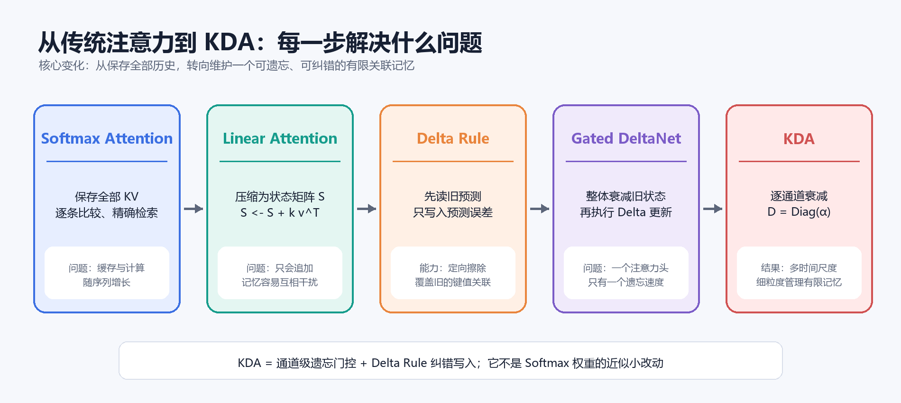
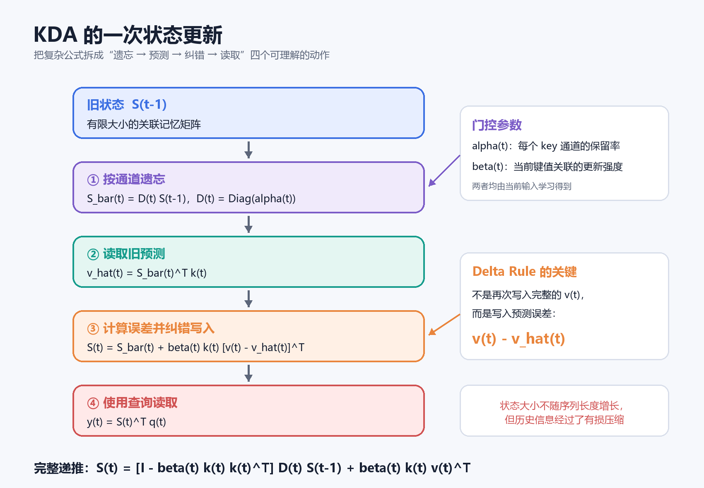

# KDA 注意力机制详解

> 从传统 Softmax 注意力、线性注意力和 Delta Rule 出发，理解 Kimi Delta Attention 如何把注意力转化为一个可遗忘、可纠错的有限关联记忆系统。

## 资料信息

- 核心论文：[Kimi Linear: An Expressive, Efficient Attention Architecture](https://arxiv.org/abs/2510.26692)
- 官方实现：[MoonshotAI/Kimi-Linear](https://github.com/MoonshotAI/Kimi-Linear)
- 基础论文：[Attention Is All You Need](https://arxiv.org/abs/1706.03762)
- 整理日期：2026-08-10

## 一句话结论

传统 Softmax 注意力是“保存全部历史，再逐条查找”；KDA 则是“把历史压缩进一个固定大小的关联记忆矩阵，并通过先遗忘、再纠错写入的方式持续更新”。

*图 1：从 Softmax 注意力到 KDA 的机制演进。AI 生成示意图，依据 Kimi Linear 论文中的递推关系绘制。阅读重点是：KDA 不是对 Softmax 权重的小修改，而是在有限状态线性注意力上组合通道级遗忘与 Delta Rule。*

## 传统 Softmax 注意力

给定输入 $x_t$，模型通过三个线性投影得到：

$$q_t=W_Qx_t,\qquad k_t=W_Kx_t,\qquad v_t=W_Vx_t$$

其中：

- $q_t$（query）表示当前 token 想寻找什么；
- $k_i$（key）表示历史 token 提供的检索标签；
- $v_i$（value）表示历史 token 携带的内容。

在因果语言模型中，第 $t$ 个 token 只能读取当前位置及其之前的信息：

$$y_t=\sum_{i=1}^{t}\frac{\exp(q_t^\top k_i/\sqrt{d})}{\sum_{j=1}^{t}\exp(q_t^\top k_j/\sqrt{d})}v_i$$

它的直觉是：当前查询 $q_t$ 与每个历史键 $k_i$ 计算相似度，经过 Softmax 归一化后，再对所有 $v_i$ 加权求和。

例如模型读到“钥匙被放进抽屉……钥匙在哪里？”，最后一个位置的查询会与“放进抽屉”相关的键产生较高相似度，从而取回“抽屉”对应的值。

### 优点与代价

Softmax 注意力把每条历史键值对分别保存下来，因此具有较强的精确内容寻址能力。但在自回归生成中：

- KV Cache 随上下文长度 $T$ 线性增长；
- 每生成一个 token，都要与大量历史 key 比较；
- 处理完整长序列时，注意力矩阵的计算和存储通常随 $T^2$ 增长。

问题并不在于注意力“无效”，而在于保存和搜索全部历史在长上下文下成本较高。

## 线性注意力：把历史压缩成一个状态

部分线性注意力通过可分解核函数 $\phi$ 改写注意力计算。忽略归一化项时，可以写成：

$$y_t=\phi(q_t)^\top\left(\sum_{i=1}^{t}\phi(k_i)v_i^\top\right)$$

定义状态矩阵：

$$S_t=\sum_{i=1}^{t}\phi(k_i)v_i^\top$$

那么它可以递归更新：

$$S_t=S_{t-1}+\phi(k_t)v_t^\top$$

读取时只需：

$$y_t=S_t^\top\phi(q_t)$$

后文为简洁起见省略 $\phi$，直接使用 $q_t$ 和 $k_t$。可以把 $S_t\in\mathbb{R}^{d_k\times d_v}$ 理解为一个关联记忆矩阵，其中保存了从 key 特征到 value 特征的映射。

与 Softmax 注意力不同，它不再保存每一条历史记录，而是把所有历史压缩进同一个固定大小的状态 $S_t$。当每个头的维度固定时，状态大小不随序列长度增长，自回归解码的单步成本也不再随上下文长度增加。

### 只加不改的问题

普通加性更新为：

$$S_t=S_{t-1}+k_tv_t^\top$$

假设模型先后看到“Alice 住在北京”和“Alice 搬到了上海”。如果两处 Alice 产生相似的 key，那么“北京”和“上海”会一起叠加进同一个记忆方向。再次查询 Alice 的住址时，模型可能读出两个值的混合。

普通线性注意力更像一本只能追加、不能修改的通讯录。它缺乏明确的覆盖机制，而且不同键值关联被压缩进同一矩阵后还会发生记忆碰撞。

## Delta Rule：只写入预测误差

Delta Rule 的思路是：写入新键值对之前，先查询旧记忆在当前 key 上已经预测了什么。

旧预测为：

$$\hat v_t=S_{t-1}^\top k_t$$

预测误差为：

$$e_t=v_t-\hat v_t$$

然后不再盲目写入完整的 $v_t$，而只写入误差：

$$S_t=S_{t-1}+\beta_tk_te_t^\top$$

即：

$$S_t=S_{t-1}+\beta_tk_t\left(v_t-S_{t-1}^\top k_t\right)^\top$$

其中 $\beta_t\in[0,1]$ 是当前更新的强度。展开得到：

$$S_t=\left(I-\beta_tk_tk_t^\top\right)S_{t-1}+\beta_tk_tv_t^\top$$

这个公式包含两个方向相反的动作：

$$\underbrace{-\beta_tk_tk_t^\top S_{t-1}}_{\text{擦除当前 key 方向上的旧预测}}+\underbrace{\beta_tk_tv_t^\top}_{\text{写入新的值}}$$

因此，Delta Rule 的核心可以概括为：先看自己已经记住了什么，再只写入目标与当前预测之间的差值。

### 在线梯度下降视角

考虑当前键值对产生的平方误差：

$$\mathcal{L}_t(S)=\frac{1}{2}\left\|S^\top k_t-v_t\right\|^2$$

对状态矩阵 $S$ 做一步学习率为 $\beta_t$ 的梯度下降，就会得到 Delta Rule 更新。因此，状态矩阵可以看成一个在序列内部进行在线学习的小型线性模型。

若 $k_t$ 已进行 L2 归一化且 $\beta_t=1$，更新后当前 key 上的读取结果满足：

$$S_t^\top k_t=v_t$$

这说明 Delta Rule 具备沿当前 key 方向覆盖旧答案的能力。

## Gated DeltaNet：增加整体遗忘

Delta Rule 能修改关联，但有限状态仍会不断承受历史干扰。Gated DeltaNet 在执行 Delta 更新前，先用标量 $\alpha_t$ 衰减整个状态：

$$\bar S_t=\alpha_tS_{t-1}$$

然后基于衰减后的状态计算预测并纠错：

$$S_t=\bar S_t+\beta_tk_t\left(v_t-\bar S_t^\top k_t\right)^\top$$

问题是，一个注意力头通常只有一个标量遗忘率。同一头中的不同特征方向必须一起快速遗忘或一起长期保留，难以形成多种记忆时间尺度。

## KDA：通道级遗忘加 Delta Rule

KDA，即 Kimi Delta Attention，最核心的变化是把每个头的标量遗忘率改为向量：

$$\alpha_t\in\mathbb{R}\quad\longrightarrow\quad\boldsymbol{\alpha}_t\in[0,1]^{d_k}$$

由此构造对角门控矩阵：

$$D_t=\mathrm{Diag}(\boldsymbol{\alpha}_t)$$

每个 key 通道都有独立的保留率。例如，某些潜在通道可以长期保留信息，另一些通道可以快速清空最近状态。需要注意，这些是端到端训练得到的潜在特征，不应直接假定它们分别对应“语法”“人物”或其他人工类别。

*图 2：KDA 的一次状态更新。AI 生成示意图，依据 Kimi Linear 论文中的 KDA 递推公式绘制。阅读重点是：先对旧状态做逐通道衰减，再根据当前 key 上的预测误差纠正状态，最后用 query 读取。*

### 第一步：按通道遗忘

$$\bar S_t=D_tS_{t-1}$$

如果 $\boldsymbol{\alpha}_t=[0.99,0.95,0.40,0.05]$，不同特征方向会以不同速度衰减，而不是共享同一个遗忘比例。

### 第二步：读取衰减后的旧预测

$$\hat v_t=\bar S_t^\top k_t$$

### 第三步：纠错写入

$$S_t=\bar S_t+\beta_tk_t\left(v_t-\hat v_t\right)^\top$$

把 $\bar S_t=D_tS_{t-1}$ 代入：

$$S_t=D_tS_{t-1}+\beta_tk_t\left(v_t-(D_tS_{t-1})^\top k_t\right)^\top$$

展开后得到 KDA 最常见的递推形式：

$$\boxed{S_t=\left(I-\beta_tk_tk_t^\top\right)D_tS_{t-1}+\beta_tk_tv_t^\top}$$

### 第四步：使用查询读取

$$y_t=S_t^\top q_t$$

不同资料可能采用转置后的状态定义，例如令 $S_t\in\mathbb{R}^{d_v\times d_k}$，此时公式中的乘法方向会整体转置，但其“通道遗忘、预测误差、纠错写入”的逻辑不变。

## 完整公式的直观拆解

KDA 递推式可以拆成：

$$S_t=\underbrace{D_tS_{t-1}}_{\text{按通道遗忘}}-\underbrace{\beta_tk_tk_t^\top D_tS_{t-1}}_{\text{擦除当前 key 的旧预测}}+\underbrace{\beta_tk_tv_t^\top}_{\text{写入当前新值}}$$

所以每处理一个 token，KDA 实际完成四件事：

1. 用 $\boldsymbol{\alpha}_t$ 决定各个通道保留多少旧记忆；
2. 用当前 $k_t$ 查询衰减后的状态；
3. 用 $\beta_t$ 控制预测误差的写入强度；
4. 用 $q_t$ 从更新后的状态读取结果。

其中，$\boldsymbol{\alpha}_t$ 和 $\beta_t$ 都由当前输入经过可学习投影产生，因此遗忘和写入是内容相关的，而不是预先固定的规则。

## 多时间尺度与隐式位置感

一条在位置 $i$ 写入的记忆，在之后的位置会连续经历多个门控矩阵：

$$D_tD_{t-1}\cdots D_{i+1}$$

对第 $j$ 个通道，其保留程度近似包含：

$$\prod_{\tau=i+1}^{t}\alpha_{\tau,j}$$

于是，不同通道可以学习不同时间尺度：有些通道长期保留，有些只保存最近几步的信息。门控还依赖沿途输入，因此两个内容相同但所处上下文不同的记忆，可能经历不同的衰减路径。这为模型提供了一种顺序和距离信息，但它不等同于显式保存每个历史位置。

## 与 Softmax 注意力的本质区别

| 方面 | Softmax 注意力 | KDA |
| --- | --- | --- |
| 历史表示 | 单独保存历史 KV | 压缩为固定大小状态矩阵 |
| 检索方式 | 与历史 token 逐一比较 | 查询递归关联记忆 |
| 缓存随长度变化 | 随上下文增长 | KDA 状态本身不随长度增长 |
| 信息更新 | 通常保留新旧记录 | 可擦除旧预测并写入新值 |
| 精确历史定位 | 较强 | 受有限状态容量和记忆碰撞影响 |
| 自回归单步成本 | 随历史长度增长 | 与历史长度无关，取决于状态维度 |
| 主要优势 | 精确、灵活的全局内容寻址 | 固定状态、高效解码、动态记忆更新 |

因此，KDA 不是对 Softmax 权重做近似的小改动，而是把注意力重新解释成一个在线更新的有限容量关联记忆系统。

## 计算效率与并行实现

若状态大小为 $d_k\times d_v$，KDA 自回归推理时只需保留这个状态，而不需要为每个历史 token 保存一份 KDA 层的 KV。单步更新时间约为 $O(d_kd_v)$，不随上下文长度 $T$ 增长。

但递推公式表面上具有时间依赖：$S_t$ 依赖 $S_{t-1}$。如果严格逐 token 计算，训练阶段难以充分利用 GPU 并行。Kimi Linear 论文进一步设计了 chunkwise 分块算法，把块内的一系列“对角矩阵加低秩修正”变换组织成可并行计算，从而兼顾递归语义和硬件效率。

分块算法解决的是“怎样高效算出同一个 KDA 递推结果”，并不改变 KDA 的核心记忆逻辑。

## 局限性与混合架构

固定状态意味着压缩，而压缩通常是有损的。当大量相似 key 写入同一个有限矩阵时，仍可能出现：

- 记忆碰撞和细节丢失；
- 很久以前的特定 token 难以精确定位；
- 精确复述、复制或检索能力弱于保存完整 KV 的注意力；
- 遗忘门控若控制不当，可能过早丢失信息。

Delta Rule 和通道级门控改善的是有限容量的使用方式，并没有让固定状态获得无限容量。

因此 Kimi Linear 采用 KDA 与 MLA 的混合结构，典型比例为三层 KDA 配一层全局 MLA。KDA 负责高效压缩和更新大部分序列信息，MLA 则保留对具体历史 token 的全局访问能力。

这里必须区分：

- KDA 使用固定大小递归状态，其状态大小不随上下文增长；
- MLA 压缩每个 token 的 KV 表示，但仍为历史 token 保留缓存，因此 MLA 的缓存仍随上下文增长；
- 混合模型的总缓存并不是完全恒定，只是相比全部使用全局注意力显著减少。

## 学习路线总结

可以把机制演进记成：

$$\mathrm{Softmax\ Attention}\rightarrow\mathrm{Linear\ Attention}\rightarrow\mathrm{Delta\ Rule}\rightarrow\mathrm{Gated\ DeltaNet}\rightarrow\mathrm{KDA}$$

对应的思想依次是：

1. 保存并搜索全部历史；
2. 把历史压缩成一个状态矩阵；
3. 用预测误差更新状态，而不是盲目叠加；
4. 让整个状态能够随时间遗忘；
5. 让每个特征通道拥有独立的遗忘速度。

最终应记住的公式是：

$$\boxed{S_t=\left(I-\beta_tk_tk_t^\top\right)\mathrm{Diag}(\boldsymbol{\alpha}_t)S_{t-1}+\beta_tk_tv_t^\top}$$

而比公式更重要的理解是：

> KDA 先按通道管理旧记忆的寿命，再通过 Delta Rule 擦除当前 key 上的错误预测，并写入必要的修正量。

## 待进一步学习的问题

1. KDA 的 chunkwise WY 表示如何把递推计算转化为块内并行计算？
2. 通道级遗忘门控与显式位置编码之间是什么关系？
3. 固定状态容量如何随 $d_k$、$d_v$ 和注意力头数变化？
4. KDA 与 Gated DeltaNet、Mamba、RetNet 在状态转移矩阵上有什么统一解释？
5. 混合架构中，KDA 与全局注意力的最优比例由哪些任务属性决定？
