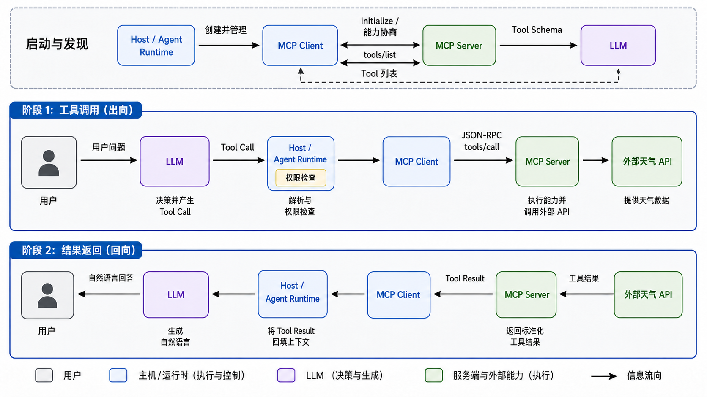

---
tags:
  - MCP
  - Agent
  - LLM
  - Tool-Calling
aliases:
  - Model Context Protocol
  - MCP 工作流程
---

# MCP 原理、调用链与最小实现

> [!abstract] 本文目标
> 本文从一个贯穿始终的天气查询例子出发，解释 MCP 在 Agent 系统中的位置：它解决什么问题，Host、Client、Server、LLM 与 Agent Runtime 分别负责什么，系统为什么决定调用工具，协议层如何完成调用，以及工具结果如何重新进入模型上下文。最后给出一个与当前官方 Python SDK v2 接口一致的最小服务端和测试客户端。

## 1. 为什么需要 MCP

假设一个 Agent 需要同时访问天气 API、数据库、文件系统和 GitHub。没有统一协议时，每接入一种能力，应用都要自行处理：

- 工具名称、参数和返回值如何描述；
- 本地进程、HTTP 服务等不同连接方式；
- 能力发现、错误表示和生命周期；
- 身份验证、授权确认与结果回填。

这会让 Agent Runtime 逐渐堆满各类专用适配代码。MCP（Model Context Protocol，模型上下文协议）的核心价值，是在 AI 应用与外部能力之间提供一套标准接口，使不同 Server 能够用统一方式被连接、发现和调用。

最重要的边界是：**MCP 不负责推理“现在是否应该调用工具”**。它主要标准化能力的描述、发现、传输、调用和结果表示。是否把工具交给模型、是否允许执行、如何循环以及何时停止，仍由 Host、Agent Runtime 和模型共同决定。

可以把 MCP 理解为 Agent 的标准化 I/O 能力层，而不是 Agent 本身，也不是某一个具体 Tool。

## 2. 五个角色必须分开

| 角色 | 核心职责 | 不负责什么 |
| --- | --- | --- |
| 用户 | 提出目标，必要时确认高风险操作 | 不直接构造协议消息 |
| LLM | 根据用户问题与 Tool Schema 产生回答或结构化 Tool Call | 不亲自执行 Python、HTTP 或数据库操作 |
| Host / Agent Runtime | 管理上下文、模型调用、连接、权限、循环、错误与结果回填 | 不等于 MCP 协议本身 |
| MCP Client | 在 Host 内与一个 MCP Server 建立会话，完成协商并发送协议消息 | 不负责独立做业务推理 |
| MCP Server | 暴露 Tools、Resources、Prompts，并调用函数、API 或数据库实现能力 | 通常看不到完整对话，也不应跨越 Host 的安全边界 |

官方架构采用 Host–Client–Server 模型：一个 Host 可以创建多个 Client，而一个 Client 通常与一个特定 Server 保持一条隔离连接。Server 可以是本地子进程，也可以是远程服务。



*图 1：MCP 天气工具从启动发现、模型决策、Runtime 执行到结果回填的完整路径。阅读重点是：LLM 只产生 Tool Call；Host / Agent Runtime 做解析、权限检查和循环控制；MCP Client 与 Server 负责标准化通信；Server 才真正调用外部 API。AI 生成示意图。*

## 3. Server 暴露的三类基础能力

### 3.1 Tools：可执行能力

Tool 表示可以被调用的函数，例如查询天气、写文件、创建 Issue 或发送邮件。Tool 定义至少包含名称、描述和输入 JSON Schema，也可以包含输出 Schema 与行为注解。

Tools 通常是 **model-controlled**：Host 可以把工具描述提供给模型，由模型提出调用建议。但“模型提出调用”不等于“系统必须执行”；Host 仍应执行参数校验、授权和安全策略。

### 3.2 Resources：可读取的上下文

Resource 表示由 URI 标识的数据，例如项目文件、数据库 Schema 或公司政策。它更接近“给模型补充什么上下文”，通常由应用选择、读取和放入上下文，而不是让模型执行一个副作用操作。

### 3.3 Prompts：可复用的交互模板

Prompt 是 Server 提供的预定义提示模板，例如代码审查、报告总结或数据库分析模板。它通常由用户在界面中主动选择，因此官方将其概括为 **user-controlled**。

三者的快速区分是：

- Resource：给我一份上下文；
- Tool：替我执行或查询某项能力；
- Prompt：按一个可复用模板开始交互。

## 4. 连接建立后先发生什么

工具调用并不是连接建立后的第一条消息。完整流程首先需要初始化和能力协商：

1. Host 创建 MCP Client，并连接到目标 Server。
2. Client 与 Server 协商协议版本，交换各自支持的 capabilities。
3. 如果 Server 声明支持 Tools，Client 才可以调用 `tools/list`。
4. Server 返回当前可用 Tool 的名称、描述和输入 Schema。
5. Host 将适合当前用户、权限和任务的 Tool Schema 转换成模型 API 所需格式，再交给 LLM。

能力发现回答的是“这个 Server 能做什么”，并不回答“当前问题是否应该使用它”。后一问题发生在模型决策和 Host 策略层。

以天气工具为例，`tools/list` 的返回可以抽象为：

```json
{
  "name": "get_weather",
  "description": "查询指定城市的当前天气",
  "inputSchema": {
    "type": "object",
    "properties": {
      "city": {
        "type": "string"
      }
    },
    "required": ["city"]
  }
}
```

Schema 很重要，因为模型不仅需要知道工具名，还需要理解工具的适用场景、参数含义和约束。名称或描述含糊，会直接降低工具选择与参数生成的可靠性。

## 5. 系统为什么决定调用天气工具

用户问“天津现在天气怎么样？”时，模型通常同时看到：

- 用户问题与必要的对话上下文；
- `get_weather` 等可用 Tool 的描述和 Schema；
- Host 设置的系统指令与调用限制。

模型可能判断：问题需要实时数据，模型参数中的知识无法保证时效性，而 `get_weather` 的描述与输入结构正好匹配。因此模型不直接编造天气，而是返回结构化 Tool Call：

```json
{
  "name": "get_weather",
  "arguments": {
    "city": "天津"
  }
}
```

这里发生的是**决策输出**，不是工具执行。真正的执行者是 Host / Agent Runtime：它读取 Tool Call，检查工具是否在允许列表中，校验参数，必要时请求用户确认，然后调用对应 MCP Client。

因此，“为什么调用”可以拆为两层：

1. 模型层：当前任务需要外部实时能力，并选择了匹配的 Tool；
2. Host 层：该 Tool 对当前用户可见、参数合法、权限允许，因而批准执行。

## 6. 协议层如何调用

Runtime 调用客户端的高层接口：

```python
result = await client.call_tool(
    "get_weather",
    {"city": "天津"},
)
```

在协议层，它对应一个 JSON-RPC 2.0 请求，概念上如下：

```json
{
  "jsonrpc": "2.0",
  "id": 12,
  "method": "tools/call",
  "params": {
    "name": "get_weather",
    "arguments": {
      "city": "天津"
    }
  }
}
```

Server 根据工具名称找到处理函数，校验输入，执行本地函数或下游 API，并把结果转换为 MCP Tool Result。MCP 规定的是消息语义和数据结构；函数内部怎样获得天气数据，属于具体 Server 的实现。

## 7. Tool Result 如何被使用

Python SDK 中一次工具调用的结果常见三个观察入口：

- `content`：内容块列表，适合回填给模型；可包含文本、图片、音频、资源链接或嵌入资源；
- `structured_content`：符合输出 Schema 的 JSON 数据，适合应用程序直接读取；
- `is_error`：工具调用是否以工具错误结束。

天气结果可能同时具有机器可读和模型可读两种形式：

```json
{
  "city": "天津",
  "temperature_c": 31,
  "condition": "晴"
}
```

Runtime 通常不会把原始结果直接当作最终回复，而是将 Tool Call 与 Tool Result 按模型 API 的消息格式回填上下文，再次调用 LLM。模型据此生成“天津当前约 31°C，天气晴”这样的自然语言回答。

因此，一个最基础的工具循环通常经历两次模型调用：第一次决定直接回答还是调用工具；工具执行后，第二次根据结果生成最终回复。如果第二次模型又提出新的 Tool Call，Runtime 可以继续循环，但必须设置调用次数、超时、权限和停止条件。

> [!warning] 工具错误与协议错误不是一回事
> Server 内部的业务失败通常通过 Tool Result 的 `is_error` 表达，使模型能够读取错误信息并重试或改变方案。连接断开、非法 JSON-RPC 等协议层问题则需要 Client / Runtime 按异常路径处理。应用在读取 `structured_content` 前应先检查 `is_error`。

## 8. 两种常见传输方式

### stdio

Client 启动本地 Server 子进程，通过标准输入和标准输出交换逐行 JSON-RPC 消息。它适合本机工具和桌面应用。Server 的标准输出只能写协议消息，普通日志应写到标准错误，否则会破坏通信。

### Streamable HTTP

Server 作为独立 HTTP 服务运行，Client 通过一个 MCP Endpoint 发送请求，并可选使用 SSE 接收流式消息。它适合远程服务和多 Client 场景。远程部署还需要认真处理来源校验、身份认证、会话标识和授权范围。

传输方式只改变消息怎样到达，`tools/list`、`tools/call` 等协议语义保持一致。

## 9. 当前 Python SDK v2 的最小 Server

下面使用假数据，目的是隔离 MCP 自身的机制，不把天气 API 密钥、网络错误等无关变量混进第一个例子。当前官方 Python SDK v2 要求 Python 3.10 及以上。

安装依赖：

```bash
pip install "mcp[cli]"
```

服务端：

```python
# weather_server.py
from typing import TypedDict

from mcp.server.fastmcp import FastMCP


class WeatherData(TypedDict):
    city: str
    temperature_c: int
    condition: str


mcp = FastMCP(
    name="WeatherServer",
    instructions="提供城市天气查询能力",
)


@mcp.tool()
def get_weather(city: str) -> WeatherData:
    """查询指定城市的当前天气。"""
    fake_weather = {
        "天津": {"temperature_c": 31, "condition": "晴"},
        "北京": {"temperature_c": 30, "condition": "多云"},
    }

    if city not in fake_weather:
        raise ValueError(f"暂无 {city} 的天气数据")

    return {"city": city, **fake_weather[city]}


if __name__ == "__main__":
    mcp.run()
```

`@mcp.tool()` 将普通 Python 函数注册为 MCP Tool。函数名与文档字符串用于生成 Tool 元数据，类型注解用于生成输入和输出 Schema。这里返回 `TypedDict`，SDK 会提供结构化结果并按生成的输出 Schema 进行验证。

## 10. 先不用 LLM，直接验证 Client–Server

先把协议链路与模型决策分开测试，能更快定位问题。下面使用 v2 支持的进程内 Client；它不打开端口，也不创建子进程，适合单元测试。

```python
# test_client.py
import asyncio

from mcp import Client

from weather_server import mcp


async def main() -> None:
    async with Client(mcp) as client:
        tools = await client.list_tools()
        for tool in tools.tools:
            print(tool.name)
            print(tool.description)
            print(tool.input_schema)

        result = await client.call_tool(
            "get_weather",
            {"city": "天津"},
        )

        if result.is_error:
            print("工具调用失败：", result.content)
            return

        print("模型可读内容：", result.content)
        print("程序可读数据：", result.structured_content)


asyncio.run(main())
```

这个测试证明了能力发现、Schema 生成、工具调用和结果返回能够工作，但它还不是完整 Agent：工具名称和参数仍由代码写死，没有模型参与选择。

## 11. 加入 LLM 后的 Agent Loop

不同模型供应商对 Tool Schema 和 Tool Result 消息的具体字段不同，因此下面保留为供应商无关的骨架。关键不是某个 SDK 的字段名，而是控制权流动：

```python
messages = [{"role": "user", "content": user_input}]

while True:
    # 1. Runtime 把可用 MCP Tool Schema 转成模型所需格式。
    response = await llm.chat(
        messages=messages,
        tools=tools_for_llm,
    )

    # 2. 模型不需要工具，循环结束。
    if not response.tool_calls:
        return response.text

    # 3. Runtime 逐个处理模型提出的 Tool Call。
    messages.append(response.as_assistant_message())

    for call in response.tool_calls:
        validate_tool_name(call.name)
        validate_arguments(call.name, call.arguments)
        await request_confirmation_if_needed(call)

        result = await mcp_clients[call.server_id].call_tool(
            call.name,
            call.arguments,
        )

        # 4. 按模型 API 要求保留 call_id，并把结果回填上下文。
        messages.append(
            to_model_tool_result_message(
                call_id=call.id,
                result=result,
            )
        )
```

在这段循环中：

- LLM 决定“建议调用哪个 Tool、参数是什么”；
- Runtime 决定“是否批准、如何执行、是否重试、何时停止”；
- MCP Client 把高层调用编码为标准协议消息；
- MCP Server 执行具体能力并返回标准结果。

## 12. MCP 与普通 Function Calling 的区别

Function Calling 主要描述模型怎样输出一个结构化函数调用；MCP 主要描述应用怎样连接外部能力，并完成发现、调用和结果交换。二者位于相邻但不同的层次，经常配合使用：

| 问题 | Function Calling | MCP |
| --- | --- | --- |
| 模型怎样表达“我要调用工具” | 核心关注点 | 不规定模型供应商的输出格式 |
| 工具有哪些、Schema 如何取得 | 通常由应用静态提供 | 通过 Server 能力与 `tools/list` 发现 |
| 怎样连接工具提供方 | 通常由应用自定义 | 提供 Client–Server 协议与标准传输 |
| 调用和返回格式 | 模型 API 各自定义 | 使用 MCP 的 `tools/call` 与 Tool Result |
| Resources、Prompts 等能力 | 通常不覆盖 | MCP 的 Server primitives |

MCP 并没有消除模型的 Function Calling，也没有替代 Runtime。典型系统是：Host 从 MCP Server 发现 Tool，把它们转换为模型 API 的 Tool Schema；模型返回 Tool Call；Host 再通过 MCP Client 执行。

## 13. 安全边界与工程限制

1. **Server 与返回值都不能默认可信**：Tool 描述、注解和结果可能错误或恶意，Host 应执行允许列表、Schema 校验与内容隔离。
2. **高风险 Tool 需要人在回路中**：写文件、发消息、付款、删除数据等操作应在执行前显示清晰信息并请求确认。
3. **最小权限**：只向 Server 和模型暴露完成任务所需的资源、工具与凭据，不应把完整对话或其他 Server 的数据自动共享出去。
4. **防止无限循环**：限制工具轮数、并发数、超时、结果大小和总成本。
5. **业务幂等性**：Runtime 重试可能造成重复写入；具有副作用的 Tool 应使用幂等键或明确的去重策略。
6. **版本与能力不能硬猜**：以初始化协商出的协议版本和 capabilities 为准，不要仅根据 Server 名称假设它支持某项功能。

## 14. 一条可复习的完整主线

以“天津现在天气怎么样”为例，系统真实发生的是：

1. Host 创建 MCP Client 并连接 Weather MCP Server；
2. Client 与 Server 初始化、协商版本和能力；
3. Client 通过 `tools/list` 获得 `get_weather` 的描述与 Schema；
4. Host 筛选并把 Tool Schema 提供给 LLM；
5. LLM 根据用户问题产生 `get_weather(city="天津")` 的 Tool Call；
6. Host 校验名称、参数和权限，并决定允许执行；
7. MCP Client 发送 `tools/call` JSON-RPC 请求；
8. MCP Server 执行函数并调用天气数据源；
9. Tool Result 经 Client 返回 Host；
10. Host 将结果回填模型上下文；
11. LLM 生成自然语言答案，Host 返回给用户。

其中第 4～6 步解释“为什么与是否调用”，第 7～9 步解释“MCP 怎样完成调用”，第 10～11 步解释“返回结果怎样继续被模型使用”。

## 15. 结论

MCP 的工程意义不是让协议替 Agent 思考，而是为 Agent 的外部能力层建立统一边界。模型负责提出工具使用意图，Host / Agent Runtime 负责控制、授权和循环，MCP Client 与 Server 负责可协商、可发现、可调用的标准通信，Server 背后的函数和外部系统负责真正执行。

掌握这条边界后，Tools、Resources、Prompts、stdio、Streamable HTTP 以及不同语言 SDK 都可以放回同一个框架中理解，而不会把“模型决策”“Runtime 执行”和“协议通信”混为一谈。

## 后续学习建议

建议从当前的静态代码骨架继续走向可观察、可测试且具备安全边界的完整 Host：

1. **先实际运行 stdio Server 与 Client**：记录初始化、能力协商、`tools/list`、`tools/call` 和错误结果，确认高层 SDK 调用与协议消息一一对应。
2. **扩展 Resources 与 Prompts**：在同一 Server 中加入一个只读 Resource 和一个 Prompt，比较三类 primitive 的控制者、数据流和适用场景。
3. **实现真正的模型工具循环**：接入一个支持 Function Calling 的模型，保留 Tool Call ID、参数校验、最大轮数、超时和错误回填，验证“模型建议”与“Host 批准执行”的边界。
4. **再迁移到 Streamable HTTP**：学习远程连接、会话、认证、授权范围和多 Client 并发，并为写操作加入明确的用户确认。
5. **建立协议级测试与可观测性**：覆盖未知 Tool、错误参数、Server 超时、断线重连、重复请求和幂等性，同时记录调用耗时与审计事件。

## 参考资料

- [MCP 官方架构说明](https://modelcontextprotocol.io/specification/2025-06-18/architecture)
- [MCP Server primitives 概览](https://modelcontextprotocol.io/specification/2025-06-18/server/index)
- [MCP Tools 规范](https://modelcontextprotocol.io/specification/2025-06-18/server/tools)
- [MCP 传输规范](https://modelcontextprotocol.io/specification/2025-06-18/basic/transports)
- [MCP 官方 Python SDK v2 文档](https://py.sdk.modelcontextprotocol.io/)
- [MCP 官方 Python SDK 仓库](https://github.com/modelcontextprotocol/python-sdk)
