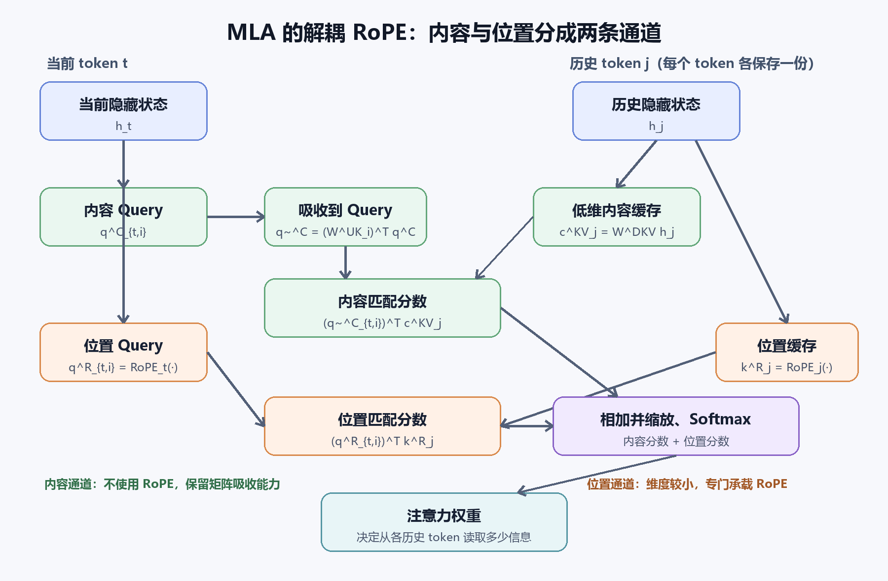

# MLA 多头潜在注意力详解

## 1. 主题与资料

MLA（Multi-head Latent Attention，多头潜在注意力）是一种面向大语言模型高效推理的注意力机制。它由 DeepSeek-V2 系统提出，随后继续用于 DeepSeek-V3 等模型。

MLA 要解决的核心问题是：在自回归生成过程中，传统多头注意力需要为每个历史 token、每一层、每个注意力头保存完整的 Key 和 Value。上下文越长、并发请求越多，KV Cache 对显存容量和显存带宽的压力就越大。

主要资料：

- DeepSeek-AI, [DeepSeek-V2: A Strong, Economical, and Efficient Mixture-of-Experts Language Model](https://arxiv.org/abs/2405.04434), 2024。
- DeepSeek-AI, [DeepSeek-V3 Technical Report](https://arxiv.org/abs/2412.19437), 2024。
- DeepSeek-AI, [DeepSeek-V3 官方 MLA 推理实现](https://github.com/deepseek-ai/DeepSeek-V3/blob/main/inference/model.py)。
- DeepSeek-AI, [FlashMLA Kernel Deep Dive](https://github.com/deepseek-ai/FlashMLA/blob/main/docs/20250422-new-kernel-deep-dive.md)。

本文重点不是复述整篇 DeepSeek-V2 论文，而是解释 MLA 的计算逻辑，尤其是以下三个彼此关联的设计：

1. Key 和 Value 的联合低秩压缩；
2. Key、Value 上投影矩阵的吸收；
3. 为保留矩阵吸收而设计的解耦 RoPE。

---

## 2. MLA 试图解决什么问题

### 2.1 自回归生成与 KV Cache

在第 $t$ 个生成步骤，模型需要让当前 token 的 Query 与位置 $1$ 到 $t$ 的历史 Key 计算匹配程度，再依据匹配权重读取相应的 Value。

历史 token 的 Key 和 Value 在生成后续 token 时不会变化，因此推理系统通常将它们缓存起来，而不是每一步重新计算。这就是 KV Cache。

设：

- $L$ 为缓存的序列长度；
- $n_h$ 为注意力头数；
- $d_h$ 为每个头的 Key 和 Value 维度。

传统多头注意力在每层、每条序列中需要缓存的元素数量约为：

$$2Ln_hd_h$$

其中系数 $2$ 分别对应 Key 和 Value。实际显存占用还要乘以层数、batch size 和单个数值的字节数。

### 2.2 MQA 和 GQA 的已有思路

在 MLA 之前，MQA（Multi-Query Attention）和 GQA（Grouped-Query Attention）已经通过共享 Key、Value 来减少缓存：

| 机制 | Query 头 | KV 组 | 基本思路 |
|---|---:|---:|---|
| MHA | $n_h$ | $n_h$ | 每个 Query 头拥有独立的 Key 和 Value |
| GQA | $n_h$ | 少于 $n_h$ | 一组 Query 头共享一组 Key 和 Value |
| MQA | $n_h$ | $1$ | 所有 Query 头共享同一组 Key 和 Value |
| MLA | $n_h$ | 一份潜在表示 | 各头共享低维信息源，但保留各自的读取投影 |

MQA 和 GQA 直接减少 KV 头数。MLA 则选择另一条路线：不缓存各头展开后的完整 Key 和 Value，而是缓存生成它们所需的共享低维表示。

---

## 3. 符号与输入隐藏状态

设第 $t$ 个 token 进入当前 MLA 层时的隐藏状态为：

$$\mathbf h_t\in\mathbb R^d$$

$\mathbf h_t$ 不是单纯的原始 Token Embedding，而是第 $t$ 个 token 在当前 Transformer 层入口处的上下文化表示。

在第一层附近，它主要来自 Token Embedding 及模型的输入处理；在更深层，它来自此前 Transformer 层对该 token 的更新。因此它已经包含前面层所整合的上下文信息。

但要注意：$\mathbf h_t$ 仍然是位置 $t$ 对应的一个向量，并不是整段历史的唯一压缩状态。MLA 会分别处理每个 token：

$$\mathbf h_1\rightarrow\mathbf c_1^{KV},\quad \mathbf h_2\rightarrow\mathbf c_2^{KV},\quad \ldots,\quad \mathbf h_t\rightarrow\mathbf c_t^{KV}$$

所以 MLA 仍然为每个历史 token 保留一份缓存，只是每份缓存变得更小。

---

## 4. KV 联合低秩压缩

### 4.1 从隐藏状态得到 KV 潜在表示

MLA 首先把当前 token 的隐藏状态投影到一个低维潜在空间：

$$\mathbf c_t^{KV}=W^{DKV}\mathbf h_t$$

其中：

- $W^{DKV}$ 是 KV 的降维投影矩阵；
- 上标 $D$ 表示 down-projection；
- $\mathbf c_t^{KV}\in\mathbb R^{d_c}$ 是第 $t$ 个 token 的 KV 潜在表示；
- 通常 $d_c$ 远小于所有注意力头完整 Key 和 Value 的总维度。

例如，若：

$$\mathbf h_t\in\mathbb R^{5120},\qquad d_c=512$$

则：

$$W^{DKV}\in\mathbb R^{512\times5120}$$

这一计算把当前 token 的高维层表示压缩为一个 512 维的、专门服务于 Key 和 Value 的潜在表示。

### 4.2 从同一潜在表示生成各头的 Key 和 Value

对第 $i$ 个注意力头，内容 Key 和 Value 可以写为：

$$\mathbf k_{t,i}^{C}=W_i^{UK}\mathbf c_t^{KV}$$

$$\mathbf v_{t,i}=W_i^{UV}\mathbf c_t^{KV}$$

其中：

- $U$ 表示 up-projection；
- $W_i^{UK}$ 是第 $i$ 个头的内容 Key 上投影；
- $W_i^{UV}$ 是第 $i$ 个头的 Value 上投影。

所有头共享同一份 $\mathbf c_t^{KV}$，但不同头拥有不同的上投影矩阵。因此，“共享潜在表示”并不意味着所有头最终使用完全相同的 Key 和 Value。

直观上，可以把 $\mathbf c_t^{KV}$ 看作一份压缩原始档案。不同注意力头通过自己的读取规则，从同一份档案中恢复各自关心的特征。

### 4.3 为什么称为联合低秩压缩

把全部内容 Key 和 Value 拼接起来，可以把投影关系写成：

$$\begin{bmatrix}\mathbf k_t^C\\\mathbf v_t\end{bmatrix}=\begin{bmatrix}W^{UK}\\W^{UV}\end{bmatrix}\mathbf c_t^{KV}=\begin{bmatrix}W^{UK}\\W^{UV}\end{bmatrix}W^{DKV}\mathbf h_t$$

原本从 $\mathbf h_t$ 直接产生所有 Key、Value 的大矩阵，被分解成两个较小矩阵的乘积。复合矩阵的秩受到潜在维度 $d_c$ 的限制：

$$\mathrm{rank}\left(\begin{bmatrix}W^{UK}\\W^{UV}\end{bmatrix}W^{DKV}\right)\le d_c$$

因此，MLA 隐含的结构假设是：所有头的 Key 和 Value 虽然总维度很大，但真正需要跨生成步骤保存的信息，可以被组织进一个较低维的共享子空间。

这与 LoRA 都使用低秩分解，但目的不同：LoRA 主要用于参数高效微调；MLA 的低秩结构则是注意力架构本身的一部分，主要服务于推理缓存和内存访问效率。

---

## 5. 矩阵吸收：为什么不必真正恢复完整 Key 和 Value

只把 Key、Value 压缩后再在每一步完整解压，虽然减少了缓存，却会增加额外计算。MLA 更关键的技巧是利用矩阵乘法结合律，把上投影移到计算的另一侧。

### 5.1 Key 上投影吸收到 Query

第 $t$ 个 token 在头 $i$ 上的内容 Query 记为 $\mathbf q_{t,i}^{C}$。它与历史位置 $j$ 的内容 Key 的匹配分数为：

$$s_{t,j,i}^{C}=\sum_r q_{t,i,r}^{C}k_{j,i,r}^{C}$$

代入 $\mathbf k_{j,i}^{C}=W_i^{UK}\mathbf c_j^{KV}$ 后，可以利用矩阵结合律，把 $W_i^{UK}$ 移到 Query 一侧。定义：

$$\widetilde{\mathbf q}_{t,i}^{C}=(W_i^{UK})^{\mathsf T}\mathbf q_{t,i}^{C}$$

原来的内容匹配分数便可等价改写为：

$$s_{t,j,i}^{C}=\sum_r\widetilde q_{t,i,r}^{C}c_{j,r}^{KV}$$

这意味着，推理时不必为所有历史 token 恢复各头的完整内容 Key。系统只需将当前 Query 变换一次，然后直接读取缓存中的潜在向量。

### 5.2 Value 上投影延后到加权求和之后

设注意力权重为 $a_{t,j,i}$，第 $i$ 个头的输出为：

$$\mathbf o_{t,i}=\sum_{j\le t}a_{t,j,i}\mathbf v_{j,i}$$

代入 $\mathbf v_{j,i}=W_i^{UV}\mathbf c_j^{KV}$：

$$\mathbf o_{t,i}=\sum_{j\le t}a_{t,j,i}W_i^{UV}\mathbf c_j^{KV}=W_i^{UV}\left(\sum_{j\le t}a_{t,j,i}\mathbf c_j^{KV}\right)$$

因此可以先在低维潜在空间中对历史信息加权求和，再做一次 Value 上投影。Value 上投影还可以继续与注意力输出投影组合。

由此，优化后的 MLA 不需要在解码时把全部历史 Key 和 Value完整展开后再读取。

---

## 6. RoPE 前置知识

RoPE（Rotary Position Embedding，旋转位置编码）通过与位置相关的旋转矩阵，把位置信息加入 Query 和 Key。

设某一位置 $t$ 的旋转矩阵为 $R_t$，则旋转后的 Query 和 Key 分别为：

$$\widehat{\mathbf q}_t=R_t\mathbf q_t$$

$$\widehat{\mathbf k}_j=R_j\mathbf k_j$$

两者的匹配会包含组合矩阵 $R_t^{\mathsf T}R_j$。RoPE 的结构使这个组合主要取决于相对位置 $j-t$：

$$R_t^{\mathsf T}R_j=R_{j-t}$$

因此，模型不仅能够判断“这个历史 token 的内容是否相关”，还能够感知“它位于当前 token 前方多远”。

---

## 7. 标准 RoPE 为什么破坏 MLA 的矩阵吸收

### 7.1 不使用 RoPE 时，上投影是固定矩阵

内容 Key 为：

$$\mathbf k_{j,i}^{C}=W_i^{UK}\mathbf c_j^{KV}$$

$W_i^{UK}$ 对所有历史位置 $j$ 都相同，因此它能够被预先吸收到当前 Query 中。对一个新 Query，只需要完成一次吸收变换，便可以与所有历史潜在向量进行匹配。

### 7.2 直接对完整 Key 使用 RoPE 后，上投影与位置耦合

如果直接旋转完整内容 Key，则：

$$\widehat{\mathbf k}_{j,i}^{C}=R_jW_i^{UK}\mathbf c_j^{KV}$$

此时，有效变换不再只是固定的 $W_i^{UK}$，而是：

$$R_jW_i^{UK}$$

因为 $R_j$ 随历史位置 $j$ 变化，所以：

$$R_1W_i^{UK}\ne R_2W_i^{UK}\ne\cdots\ne R_tW_i^{UK}$$

如果强行把它移到 Query 一侧，得到的 Query 变换也会依赖历史位置 $j$。于是当前 Query 不能只变换一次，而必须针对每个历史位置分别变换，这会破坏矩阵吸收原本的效率优势。

### 7.3 不能简单交换 RoPE 与上投影的顺序

一般情况下：

$$R_jW_i^{UK}\ne W_i^{UK}R_j$$

矩阵乘法不满足交换律。另外，潜在空间维度 $d_c$ 与内容 Key 维度通常不同，二者处于不同向量空间。因而不能简单改成“先在潜在空间应用同一个 RoPE，再恢复 Key”。

问题的本质可以概括为：

> MLA 希望内容 Key 的上投影与历史位置无关，从而把它吸收到 Query；标准 RoPE 却把上投影和每个历史 token 的位置旋转绑定在了一起。

---

## 8. 解耦 RoPE 的核心设计

MLA 的解决方法不是取消 RoPE，而是把内容匹配和位置匹配拆到两个不同的特征子空间中。

对第 $i$ 个注意力头，逻辑上的 Query 和 Key 分别由两部分拼接：

$$\mathbf q_{t,i}=\begin{bmatrix}\mathbf q_{t,i}^{C}\\\mathbf q_{t,i}^{R}\end{bmatrix}$$

$$\mathbf k_{j,i}=\begin{bmatrix}\mathbf k_{j,i}^{C}\\\mathbf k_j^{R}\end{bmatrix}$$

其中：

- 上标 $C$ 表示 content，即内容通道；
- 上标 $R$ 表示 rotary，即使用 RoPE 的位置通道；
- 内容通道不使用 RoPE，保持可压缩、可吸收；
- 位置通道维度较小，专门负责相对位置信号。

这不是把同一个向量复制两份，而是通过不同投影生成两个处于不同特征子空间的表示。

*图 1：MLA 解耦 RoPE 的计算结构。绿色路径是保持可吸收的内容通道；橙色路径是应用 RoPE 的位置通道。两部分分数相加后共同决定注意力权重。AI 生成示意图，仅用于解释本文讨论的计算关系，不是原论文图。*

### 8.1 内容通道

历史位置 $j$ 的内容 Key 来自 KV 潜在表示：

$$\mathbf k_{j,i}^{C}=W_i^{UK}\mathbf c_j^{KV}$$

内容通道不应用 RoPE，因此仍可定义吸收后的 Query：

$$\widetilde{\mathbf q}_{t,i}^{C}=(W_i^{UK})^{\mathsf T}\mathbf q_{t,i}^{C}$$

内容分数可直接通过当前 Query 与历史潜在缓存得到：

$$s_{t,j,i}^{C}=\sum_r\widetilde q_{t,i,r}^{C}c_{j,r}^{KV}$$

这一通道回答的是：

> 历史位置 $j$ 所包含的内容，对当前头 $i$ 正在寻找的信息是否有用？

### 8.2 Query 的位置通道

设未旋转的位置 Query 为：

$$\overline{\mathbf q}_{t,i}^{R}=W_i^{QR}\mathbf c_t^Q$$

应用当前位置 $t$ 的 RoPE：

$$\mathbf q_{t,i}^{R}=R_t\overline{\mathbf q}_{t,i}^{R}$$

不同注意力头可以拥有不同的位置 Query 投影 $W_i^{QR}$，所以各头仍然可以学习不同的位置偏好。

### 8.3 Key 的位置通道

未旋转的位置 Key 可以直接从隐藏状态生成：

$$\overline{\mathbf k}_j^{R}=W^{KR}\mathbf h_j$$

再应用历史位置 $j$ 的 RoPE：

$$\mathbf k_j^{R}=R_j\overline{\mathbf k}_j^{R}$$

这里通常写作 $\mathbf k_j^R$，没有头下标 $i$，因为所有注意力头共享这一份位置 Key。这样每个历史 token 只需缓存一份较小的位置向量，而不需要为每个头分别缓存。

位置分数为：

$$s_{t,j,i}^{R}=\sum_r q_{t,i,r}^{R}k_{j,r}^{R}$$

继续展开 RoPE 后，其中包含：

$$R_t^{\mathsf T}R_j=R_{j-t}$$

所以这一通道能够表达相对位置关系。

### 8.4 为什么拼接会得到两个分数之和

内容与位置被放在拼接向量的不同维度区间中。因此两者整体匹配时，结果自然等于两个子空间分数相加：

$$s_{t,j,i}=s_{t,j,i}^{C}+s_{t,j,i}^{R}$$

加入缩放后，可以写成：

$$s_{t,j,i}=\frac{\sum_r\widetilde q_{t,i,r}^{C}c_{j,r}^{KV}+\sum_rq_{t,i,r}^{R}k_{j,r}^{R}}{\sqrt{d_C+d_R}}$$

随后沿历史位置 $j$ 应用 Softmax：

$$a_{t,j,i}=\mathrm{softmax}_j(s_{t,j,i})$$

第一个分数主要判断内容相关性，第二个分数提供位置关系。二者最终共同决定当前 Query 应当从哪个历史 token 读取多少信息。

“解耦”指的是两类信号通过不同通道产生，并不意味着它们在最终决策中互不影响；它们会在 Softmax 之前相加，共同竞争注意力权重。

---

## 9. 解码时的完整计算流程

假设模型正在处理位置 $t$，对每个注意力头 $i$，主要过程如下。

### 9.1 生成当前 Query

从当前层输入 $\mathbf h_t$ 生成内容 Query 和位置 Query。位置 Query 应用 $R_t$，内容 Query 不应用 RoPE。

### 9.2 吸收内容 Key 上投影

计算：

$$\widetilde{\mathbf q}_{t,i}^{C}=(W_i^{UK})^{\mathsf T}\mathbf q_{t,i}^{C}$$

这个变换对当前 Query、当前头只需进行一次，不随历史位置 $j$ 改变。

### 9.3 读取两类历史缓存

系统读取历史位置 $1$ 到 $t$ 的：

$$\{\mathbf c_1^{KV},\mathbf c_2^{KV},\ldots,\mathbf c_t^{KV}\}$$

以及：

$$\{\mathbf k_1^R,\mathbf k_2^R,\ldots,\mathbf k_t^R\}$$

### 9.4 计算内容分数与位置分数

对每个历史位置 $j$，分别计算内容匹配和位置匹配，然后将两者相加、缩放并进行 Softmax。

### 9.5 在潜在空间聚合 Value 信息

得到权重后，可以直接在低维潜在空间聚合：

$$\mathbf z_{t,i}=\sum_{j\le t}a_{t,j,i}\mathbf c_j^{KV}$$

之后再通过 Value 上投影和最终输出投影得到注意力层输出。

这一流程与 DeepSeek-V3 官方优化实现对应：实现中分别保存低维 `kv_cache` 和位置 `pe_cache`，内容分数直接在潜在空间计算，然后在低维空间对 Value 信息进行加权聚合。

---

## 10. KV Cache 节省量

传统 MHA 每个 token、每层需要缓存的元素数量约为：

$$2n_hd_h$$

优化后的 MLA 主要缓存：

$$d_c+d_R$$

其中：

- $d_c$ 是每个 token 的 KV 潜在维度；
- $d_R$ 是共享位置 Key 的维度。

以常见的示意配置为例：

$$n_h=128,\qquad d_h=128,\qquad d_c=512,\qquad d_R=64$$

传统 MHA 每个 token、每层缓存：

$$2\times128\times128=32768$$

MLA 每个 token、每层缓存：

$$512+64=576$$

二者比例约为：

$$\frac{576}{32768}\approx1.76\%$$

即在这个注意力配置的理论维度比较中，单 token、单层缓存约缩小 56.9 倍。论文中的整体缓存降幅可能使用不同模型和系统口径，不能直接把这个理论比例当成所有部署中的实际降幅。

---

## 11. MLA 没有解决的问题

### 11.1 缓存仍随序列长度增长

MLA 并没有把整段历史压成一个固定向量。长度为 $L$ 时，缓存复杂度仍然是：

$$O\left(L(d_c+d_R)\right)$$

它优化的是每个历史 token 需要保存多少信息，而不是消除历史 token 数量这一维度。

### 11.2 全局注意力仍需访问历史 token

MLA 仍属于全局 token 注意力。Prefill 阶段的基础注意力关系仍接近二次复杂度；解码阶段也仍需让当前 Query 访问历史 token 的潜在缓存。

因此 MLA 的主要收益集中在：

- 降低 KV Cache 容量；
- 降低解码时的内存读取压力；
- 支持更大的 batch 或更长上下文；
- 为高吞吐推理释放显存空间。

### 11.3 低秩表示存在信息瓶颈

当 $d_c$ 远小于完整 Key、Value 总维度时，潜在空间构成了真实的信息瓶颈。MLA 并不是数学意义上的无损压缩。

模型必须在训练过程中学会：

- 哪些内容应写入 $\mathbf c_t^{KV}$；
- 不同注意力头如何用各自的投影读取共享潜在表示；
- 如何在表达能力与缓存效率之间取得平衡。

DeepSeek-V2 的实验结果说明该结构在其训练配置中能够保持较强效果，但这不意味着任意模型都可以在不重新训练或适配的情况下无损替换为 MLA。

---

## 12. MLA 与 KDA 的关系

MLA 和 KDA 都在处理长序列效率问题，但它们保留历史信息的方式不同。

| 特性 | MLA | KDA |
|---|---|---|
| 历史表示 | 每个 token 保存一份潜在缓存 | 将历史更新进固定大小的递归状态 |
| 缓存是否随长度增长 | 是，线性增长 | 通常不随序列长度增长 |
| 是否保留逐 token 全局访问 | 是 | 通常不能直接逐 token 回看 |
| 主要优势 | 降低每个 token 的缓存，同时保留全局检索 | 以固定状态处理极长序列 |
| 主要风险 | 上下文继续增长时缓存仍会增长 | 历史信息可能在状态更新中被覆盖或遗忘 |

因此，在 KDA 与 MLA 混合的结构中，两者可以承担互补角色：KDA 高效更新大部分序列信息，MLA 则周期性地提供对具体历史 token 的全局访问能力。

---

## 13. 核心理解

MLA 不是简单地“把 KV 维度变小”，而是让三项设计共同工作：

1. 使用共享低维潜在变量联合表示所有头的 Key 和 Value；
2. 利用矩阵结合律，把 Key 和 Value 上投影移出历史缓存读取路径；
3. 把 RoPE 位置通道从内容通道中分离，避免位置旋转破坏矩阵吸收。

最终可以概括为：

$$\mathrm{MLA}=\text{共享低维内容缓存}+\text{小型位置缓存}+\text{各头独立读取方式}$$

解耦 RoPE 最核心的结果是：

$$\text{总注意力分数}=\text{潜在空间内容分数}+\text{RoPE 位置分数}$$

内容通道不旋转，因而能够压缩并进行矩阵吸收；位置通道维度较小，单独应用 RoPE，继续提供相对位置信息。这样，MLA 在保留多头表达差异和全局 token 访问能力的同时，大幅降低了自回归推理所需的 KV Cache。

---

## 14. 局限与待继续理解的问题

- 潜在维度 $d_c$ 应如何选择，才能在模型质量和缓存效率之间达到最佳平衡？
- 共享潜在空间中的信息是否会自然形成不同语义方向，不同头又如何产生分工？
- 解耦 RoPE 将位置通道限制在较小维度后，对不同长度外推方法有何影响？
- 在具体硬件上，潜在空间计算增加的算力开销和缓存带宽节省如何平衡？
- MLA、稀疏注意力、线性注意力和递归状态模型在超长上下文中应如何组合？

这些问题需要结合消融实验、推理内核实现和后续研究继续分析，不能仅由结构公式直接得出答案。
