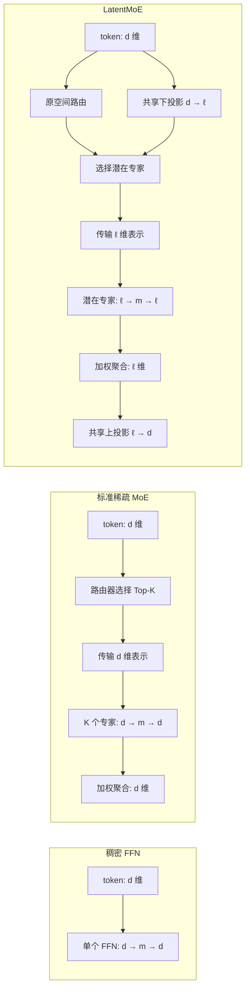

# MoE 与 LatentMoE：从条件计算到潜在空间专家

## 一句话理解

MoE（Mixture of Experts，混合专家模型）用路由器为每个 token 选择少量专家，让模型在拥有巨大总参数量的同时，只激活其中一小部分；LatentMoE 则进一步把路由专家的计算与跨设备传输放进低维潜在空间，用节省下来的成本增加专家总数和每个 token 激活的专家数。

LatentMoE 最核心的思想可以概括为：

> 保持 Transformer 主干隐藏维度不变，把真正昂贵的专家计算与通信搬到低维潜在空间，再把节省的预算用于更丰富的专家组合。

## 1. 术语范围与同名概念

本文中的 **LatentMoE** 指 NVIDIA 团队于 2026 年提出的论文 *LatentMoE: Toward Optimal Accuracy per FLOP and Parameter in Mixture of Experts*。

需要与两个相近名称区分：

- **Mixture of Latent Experts（MoLE）**：2025 年提出的相关参数化方法，同样包含共享低维投影和潜在空间专家，并研究如何将预训练 MoE 转换为 MoLE。
- **Multi-Head LatentMoE**：后续工作，进一步从多头潜在表示和并行策略角度优化训练通信。

本文重点讲解 2026 年 LatentMoE 论文中的架构和设计逻辑。

## 2. 从稠密 FFN 开始

Transformer 层通常由 Attention、Feed-Forward Network（FFN）、归一化和残差连接组成。设一个 token 的隐藏表示为：

$$\mathbf{x}\in\mathbb{R}^{d}$$

其中 $d$ 是 Transformer 的隐藏维度。一个简单的 FFN 为：

$$\mathrm{FFN}(\mathbf{x})=W_2\phi(W_1\mathbf{x})$$

其中：

$$W_1\in\mathbb{R}^{m\times d},\qquad W_2\in\mathbb{R}^{d\times m}$$

$m$ 是 FFN 中间维度，通常明显大于 $d$；$\phi$ 是非线性激活函数。

现代大语言模型经常使用 SwiGLU：

$$\mathrm{FFN}(\mathbf{x})=W_{\mathrm{down}}\left[\mathrm{SiLU}(W_{\mathrm{gate}}\mathbf{x})\odot W_{\mathrm{up}}\mathbf{x}\right]$$

其中 $\odot$ 表示逐元素乘法。忽略偏置时，这类 FFN 的参数量近似为：

$$P_{\mathrm{FFN}}\approx 3dm$$

稠密模型的特点是：每个 token 都会使用同一套 FFN 参数。增加 FFN 宽度或模型深度虽然能增加容量，但也会增加每个 token 的计算量。

由此产生一个核心矛盾：

- 更多参数通常意味着更强的知识容量和表达能力；
- 稠密模型中，更多参数也意味着更多计算和更高推理成本。

我们希望模型拥有很大的总参数量，但处理一个 token 时只使用其中一部分。这就是**条件计算**，MoE 是它最成功的实现之一。

## 3. MoE 的基本结构

一个 MoE 层包含 $N$ 个专家：

$$E_1,E_2,\ldots,E_N$$

每个专家通常是结构相同、参数独立的 FFN：

$$E_i(\mathbf{x})=W_2^{(i)}\phi(W_1^{(i)}\mathbf{x})$$

MoE 还包含一个路由器，又称门控网络。路由器根据输入决定应该调用哪些专家。

如果执行全部专家，稠密混合可以写成：

$$\mathbf{y}=\sum_{i=1}^{N}p_i(\mathbf{x})E_i(\mathbf{x})$$

其中 $p_i(\mathbf{x})$ 是第 $i$ 个专家的权重，并满足：

$$p_i(\mathbf{x})\geq 0,\qquad \sum_{i=1}^{N}p_i(\mathbf{x})=1$$

但执行全部专家无法节省计算，所以现代大语言模型通常采用稀疏 MoE：每个 token 只激活 $K$ 个专家，且 $K\ll N$。

## 4. Top-K 路由

### 4.1 计算路由分数

路由器首先计算每个专家的分数：

$$\mathbf{s}=W_r\mathbf{x}$$

其中：

$$W_r\in\mathbb{R}^{N\times d},\qquad \mathbf{s}\in\mathbb{R}^{N}$$

再通过 Softmax 得到路由概率：

$$p_i(\mathbf{x})=\frac{\exp(s_i)}{\sum_{j=1}^{N}\exp(s_j)}$$

### 4.2 选择专家

定义得分最高的 $K$ 个专家索引为：

$$\mathcal{T}_K(\mathbf{x})=\mathrm{TopK}(\mathbf{p}(\mathbf{x}))$$

MoE 输出为：

$$\mathbf{y}=\sum_{i\in\mathcal{T}_K(\mathbf{x})}\widetilde{p}_i(\mathbf{x})E_i(\mathbf{x})$$

$\widetilde{p}_i$ 是选中专家的混合权重。不同实现可能直接使用原权重、对 Top-K 权重重新归一化，或采用 sigmoid 分数等其他方式。

### 4.3 数值例子

假设有四个专家，路由器输出：

$$\mathbf{p}(\mathbf{x})=[0.10,0.55,0.05,0.30]$$

使用 Top-2 时，选中 $E_2$ 和 $E_4$。若对选中权重重新归一化：

$$\widetilde{p}_2=\frac{0.55}{0.55+0.30}\approx0.647$$

$$\widetilde{p}_4=\frac{0.30}{0.55+0.30}\approx0.353$$

最终输出为：

$$\mathbf{y}=0.647E_2(\mathbf{x})+0.353E_4(\mathbf{x})$$

另一个 token 可以选择完全不同的专家。因此，同一个序列中的不同 token 也可能经过不同的参数路径。

## 5. 总参数与激活参数

理解 MoE 时必须区分**总参数量**和**每 token 激活参数量**。

如果每个专家有 $P_E$ 个参数，共有 $N$ 个专家，则专家总参数量为：

$$P_{\mathrm{total,expert}}=NP_E$$

如果每个 token 只激活 $K$ 个专家，则其专家激活参数量约为：

$$P_{\mathrm{active,expert}}=KP_E$$

对输入维度为 $d$、中间维度为 $m$ 的 SwiGLU 专家，可粗略写成：

$$P_{\mathrm{total,expert}}\propto Ndm$$

$$P_{\mathrm{active,expert}}\propto Kdm$$

因此：

- 增加 $N$ 主要增加模型总容量，不直接增加单 token 专家计算量；
- 增加 $K$ 会增加单 token 专家计算和通信；
- 增加 $m$ 会增加单个专家的参数和计算；
- 增加 $d$ 会影响专家、Transformer 主干和通信。

当一个模型被描述为“总参数 200B、激活参数 20B”时，不是说它只有 20B 参数，而是一个 token 的前向传播只会使用大约 20B 参数。

## 6. MoE 在 Transformer 中的位置

现代 Transformer MoE 通常不是复制整个模型，而是用 MoE 替换部分或全部 FFN。

普通 Pre-Norm Transformer 层可写为：

$$\mathbf{h}'=\mathbf{h}+\mathrm{Attention}(\mathrm{Norm}(\mathbf{h}))$$

$$\mathbf{h}_{\mathrm{out}}=\mathbf{h}'+\mathrm{FFN}(\mathrm{Norm}(\mathbf{h}'))$$

MoE Transformer 将第二式中的 FFN 换成 MoE：

$$\mathbf{h}_{\mathrm{out}}=\mathbf{h}'+\mathrm{MoE}(\mathrm{Norm}(\mathbf{h}'))$$

Attention 通常仍是稠密模块，稀疏化的主要对象是参数量很大的 FFN。

## 7. 专家是否等于“数学专家”或“编程专家”

“专家”是架构名称，不代表设计者预先指定每个专家的领域。训练开始时，各专家通常只是随机初始化的同构 FFN。

训练过程中形成如下反馈：

1. 路由器把某些 token 发给某些专家；
2. 被选中的专家接收相应梯度；
3. 专家逐渐适应自己经常接收的输入；
4. 路由器也逐渐学习哪些输入更适合哪些专家。

专家可能偏向某些语言、代码、数字模式、标点、语法结构或抽象特征，但它们不一定是人类能够清晰命名的独立知识模块。

更准确的理解是：

> MoE 专家是输入相关的参数子网络，而不必是人类语义中的专业领域专家。

## 8. 路由训练的难点

### 8.1 专家坍缩

如果某个专家在训练早期因为随机波动暂时表现更好，路由器可能给它更多 token。它获得更多梯度后会学习得更快，路由器随后更加偏爱它：

$$\text{更多 token}\rightarrow\text{更多梯度}\rightarrow\text{专家更强}\rightarrow\text{更多 token}$$

这可能导致少数专家拥挤，而其他专家几乎不被使用，形成专家坍缩或负载失衡。

### 8.2 Top-K 的离散性

Top-K 选择是离散操作。实践中，被选中专家的混合权重可以接收梯度，但专家索引本身通常被视为分段常数；未选中的专家得不到当前 token 的专家梯度。

这会使路由学习比普通稠密矩阵更不平滑、更容易出现高方差。

### 8.3 路由器过度自信

如果路由 logits 不断增大，Softmax 可能趋于：

$$p_i\approx1,\qquad p_{j\ne i}\approx0$$

这会加剧专家坍缩，并可能产生数值稳定性问题。

## 9. 负载均衡损失

MoE 的训练目标通常包括语言模型损失、负载均衡损失和路由稳定性损失：

$$\mathcal{L}_{\mathrm{total}}=\mathcal{L}_{\mathrm{LM}}+\lambda_{\mathrm{balance}}\mathcal{L}_{\mathrm{balance}}+\lambda_z\mathcal{L}_z$$

对于一个包含 $T$ 个 token 的 batch，定义专家 $i$ 的实际路由比例为：

$$f_i=\frac{\text{分配给专家 }i\text{ 的 token 数}}{T}$$

定义路由器给专家 $i$ 的平均概率为：

$$P_i=\frac{1}{T}\sum_{t=1}^{T}p_i(\mathbf{x}_t)$$

Switch Transformer 中一种典型辅助损失为：

$$\mathcal{L}_{\mathrm{balance}}=N\sum_{i=1}^{N}f_iP_i$$

理想状态下，各专家在 batch 层面的使用量接近：

$$f_i\approx\frac{1}{N},\qquad P_i\approx\frac{1}{N}$$

另一类 Router Z-loss 用于限制路由 logits 的绝对大小：

$$\mathcal{L}_z=\frac{1}{T}\sum_{t=1}^{T}\left(\log\sum_i\exp(s_i(\mathbf{x}_t))\right)^2$$

均衡损失太弱会导致负载失衡，太强则可能迫使路由器牺牲语义匹配来追求形式上的均匀。因此它是在路由质量与系统负载之间的权衡。

## 10. 专家容量与 token 溢出

一个 batch 中有 $T$ 个 token，每个 token 选择 $K$ 个专家，总专家分配数为 $TK$。理想均衡时，每个专家平均收到：

$$\frac{TK}{N}$$

设容量因子为 $c_{\mathrm{factor}}>1$，每个专家的容量可以定义为：

$$C=\left\lceil c_{\mathrm{factor}}\frac{TK}{N}\right\rceil$$

如果某个专家收到的 token 超过容量，不同实现可能丢弃溢出路由、尝试第二选择、通过残差绕过，或者接受动态的不均衡计算。

容量因子越大，token 越不容易溢出，但需要更多显存和通信缓冲区，硬件利用率也可能下降。

## 11. Top-1 与 Top-2 路由

### Top-1

每个 token 只选择一个专家：

$$\mathbf{y}=E_{i^*}(\mathbf{x})$$

其优点是计算和通信量低、实现简单；缺点是专家组合能力较弱，错误路由时没有第二专家补偿。Switch Transformer 的重要贡献之一就是使用更简单的 Top-1 路由，将稀疏模型扩展到很大规模。

### Top-K

当 $K>1$ 时，多个专家共同处理一个 token：

$$\mathbf{y}=\sum_{i\in\mathcal{T}_K}\widetilde{p}_iE_i(\mathbf{x})$$

这可以增强组合表达能力、减轻单个错误路由的影响，但专家计算和通信通常都随 $K$ 增长。LatentMoE 的重要目标之一，就是让更大的 $K$ 在真实系统上变得可负担。

## 12. 细粒度专家与共享专家

### 12.1 细粒度专家

可以把少数大专家拆成更多小专家。如果把专家总数和激活数同时放大 $q$ 倍：

$$N'=qN,\qquad K'=qK$$

并相应缩小每个专家，就有可能保持总计算近似不变，同时获得更灵活的专家组合。

从 $N$ 个专家中选择 $K$ 个，理论组合数为：

$$\binom{N}{K}$$

例如从 8 个专家中选 2 个只有：

$$\binom{8}{2}=28$$

而从 32 个小专家中选 8 个有：

$$\binom{32}{8}=10,518,300$$

这个数字不能被理解为模型真的学到了同等数量的独立技能，但可以说明条件计算路径的组合空间大幅增加。

### 12.2 共享专家

许多 token 都需要基础语法、常见词汇和通用特征变换。如果所有路由专家重复学习这些知识，会造成冗余。于是可以加入始终激活的共享专家：

$$\mathbf{y}=\sum_{i\in\mathcal{T}_K(\mathbf{x})}p_iE_i(\mathbf{x})+\sum_{j=1}^{S}E_j^{\mathrm{shared}}(\mathbf{x})$$

共享专家学习通用能力，路由专家则更专注于差异化特征。DeepSeekMoE 是“细粒度专家 + 共享专家”的代表性工作。

## 13. MoE 的真实系统瓶颈

从公式看，只要 $K\ll N$，MoE 就能以较低的单 token 计算获得很大的总参数容量。但 FLOPs 并不是全部成本。

### 13.1 权重存储

即使一个 token 只使用少量专家，全部专家参数仍需保存在显存中、分布在多张 GPU 上，或从更慢的存储层加载。因此稀疏激活不会自动减少模型的总存储需求。

### 13.2 内存带宽

在低并发、低延迟推理中，每个专家一次可能只处理少量 token，加载的专家权重无法被充分复用。GPU 计算单元可能等待权重从 HBM 搬入，系统进入内存带宽受限状态，而不是计算受限状态。

### 13.3 跨设备 All-to-All 通信

大型 MoE 通常采用专家并行：不同 GPU 保存不同专家。路由后需要把 token 发到目标专家所在设备，完成计算后再把输出返回并聚合。

如果有 $T$ 个 token、每个激活 $K$ 个专家、隐藏维度为 $d$，通信量大致满足：

$$V_{\mathrm{comm}}\propto TKd$$

这个关系揭示了关键问题：专家并行的通信成本与隐藏维度 $d$ 直接相关，而缩小 FFN 中间维度 $m$ 并不能直接缩小路由时传输的 token 向量。

## 14. 从标准 MoE 到 LatentMoE

标准 MoE 中，token 以完整的 $d$ 维表示发给专家：

$$E_i:\mathbb{R}^{d}\rightarrow\mathbb{R}^{d}$$

对于 SwiGLU 专家，单个专家参数量近似为：

$$P_E^{\mathrm{standard}}\approx3dm$$

每个 token 激活 $K$ 个专家，专家计算近似为：

$$C_{\mathrm{active}}^{\mathrm{standard}}\propto3Kdm$$

通信量近似为：

$$V_{\mathrm{comm}}^{\mathrm{standard}}\propto Kd$$

LatentMoE 提出一个问题：完整的 $d$ 维残差表示对 Transformer 主干很重要，但路由专家是否也必须在完整的 $d$ 维空间中计算？

其答案是：可以让主干保持 $d$ 维，只把专家分支压缩到更小的潜在维度 $\ell$。

## 15. LatentMoE 的核心结构

定义：

$$\ell<d$$

先使用共享下投影，将 token 从 $d$ 维压缩到 $\ell$ 维：

$$\mathbf{z}=W_{\downarrow}\mathbf{x}$$

其中：

$$W_{\downarrow}\in\mathbb{R}^{\ell\times d},\qquad \mathbf{z}\in\mathbb{R}^{\ell}$$

路由专家完全在潜在空间中运行：

$$E_i:\mathbb{R}^{\ell}\rightarrow\mathbb{R}^{\ell}$$

其 SwiGLU 权重形状变为：

$$W_{\mathrm{FC1}}^{(i)},W_{\mathrm{gate}}^{(i)}\in\mathbb{R}^{m\times\ell}$$

$$W_{\mathrm{FC2}}^{(i)}\in\mathbb{R}^{\ell\times m}$$

聚合专家输出后，使用共享上投影返回原始隐藏维度：

$$\mathbf{y}=W_{\uparrow}\left(\sum_{i\in\mathcal{T}_K(\mathbf{x})}p_iE_i(W_{\downarrow}\mathbf{x})\right)$$

其中：

$$W_{\uparrow}\in\mathbb{R}^{d\times\ell}$$

架构演化与数据流如下：

*图 1：从稠密 FFN、标准稀疏 MoE 到 LatentMoE 的结构演化。LatentMoE 保留 $d$ 维主干和路由输入，但将专家通信与计算放到 $\ell$ 维潜在空间。来源：根据论文结构整理的可编辑示意图。*

## 16. 路由仍然基于原始隐藏表示

LatentMoE 原论文中的路由概率仍由原始 $d$ 维 token 计算：

$$\mathbf{p}'=\mathrm{Softmax}(W'_r\mathbf{x})$$

其中：

$$W'_r\in\mathbb{R}^{N'\times d}$$

因此：

- 路由决策基于完整的 $d$ 维表示；
- 发给专家的是压缩后的 $\ell$ 维表示；
- 专家计算与输出聚合发生在潜在空间；
- 聚合结果最后映射回 $d$ 维。

所以 LatentMoE 更准确的描述是：

> 原空间决策，潜在空间传输和专家计算。

这避免了先压缩再路由可能丢失专家选择所需信息的问题。

## 17. 为什么不直接缩小整个模型的隐藏维度

如果把整个 Transformer 的隐藏维度从 $d$ 降到 $\ell$，会同时压缩 Attention、残差流、KV 投影和所有稠密层，可能损害模型的整体表示能力。

LatentMoE 只在 MoE 分支内部引入：

$$d\rightarrow\ell\rightarrow d$$

主干残差流仍保持 $d$ 维。因此它将两种职责分开：

- 完整隐藏空间保存全局、高维表示；
- 潜在空间负责更便宜的条件计算。

## 18. 压缩比例与成本变化

定义潜在压缩比例：

$$\alpha=\frac{d}{\ell}$$

例如：

$$d=4096,\qquad \ell=1024,\qquad \alpha=4$$

潜在专家参数量近似为：

$$P_E^{\mathrm{latent}}\approx3\ell m$$

所以单个潜在专家相对于标准专家缩小约 $\alpha$ 倍：

$$\frac{P_E^{\mathrm{standard}}}{P_E^{\mathrm{latent}}}\approx\frac{d}{\ell}=\alpha$$

在相同 Top-K 下，专家通信向量也从 $d$ 维缩小为 $\ell$ 维：

$$V_{\mathrm{latent}}\approx\frac{1}{\alpha}V_{\mathrm{standard}}$$

LatentMoE 把省下来的预算用于两种不同目标。

## 19. 效率型 LatentMoE：$\ell$-MoE$_{\mathrm{eff}}$

效率型版本的目标是保持标准 MoE 的准确率，同时减少推理成本。

设置：

$$N'=\alpha N,\qquad K'=K$$

由于单个专家缩小了 $\alpha$ 倍，专家总参数量近似不变：

$$N'\ell m=(\alpha N)\ell m=Ndm$$

但每 token 激活专家数没有增加，所以激活专家计算下降为原来的约 $1/\alpha$：

$$K'\ell m=K\ell m=\frac{1}{\alpha}Kdm$$

通信量也下降为：

$$K'\ell=K\ell=\frac{1}{\alpha}Kd$$

因此效率型版本具有以下特点：

- 专家总数增加 $\alpha$ 倍；
- Top-K 保持不变；
- 总专家参数量近似不变；
- 每 token 专家计算下降；
- 专家通信量下降；
- 目标是以更低成本匹配标准 MoE 的效果。

## 20. 准确率型 LatentMoE：$\ell$-MoE$_{\mathrm{acc}}$

准确率型版本的目标是在推理成本近似不变时提高模型效果。

设置：

$$N'=\alpha N,\qquad K'=\alpha K$$

总专家参数量仍近似不变：

$$N'\ell m=(\alpha N)\ell m=Ndm$$

每 token 专家计算也近似不变：

$$K'\ell m=(\alpha K)\ell m=Kdm$$

通信量近似不变：

$$K'\ell=(\alpha K)\ell=Kd$$

但模型同时获得：

- $\alpha$ 倍的专家总数；
- $\alpha$ 倍的每-token激活专家数；
- 更细粒度、更丰富的专家组合。

这构成 LatentMoE 最关键的等价变换：

$$\boxed{\ell=\frac{d}{\alpha},\qquad N'=\alpha N,\qquad K'=\alpha K}$$

## 21. 数字例子

假设标准 MoE 使用：

$$d=4096,\qquad m=1536,\qquad N=128,\qquad K=8$$

选择：

$$\ell=1024,\qquad \alpha=4$$

### 标准 MoE

- 专家总数：128；
- 每 token 激活专家：8；
- 专家输入输出维度：4096；
- 通信规模与 $8\times4096=32768$ 成正比。

### 效率型 LatentMoE

$$N'=512,\qquad K'=8,\qquad \ell=1024$$

通信规模与：

$$8\times1024=8192$$

成正比，是标准 MoE 的四分之一；专家总参数量则近似保持不变。

### 准确率型 LatentMoE

$$N'=512,\qquad K'=32,\qquad \ell=1024$$

通信规模与：

$$32\times1024=32768$$

成正比，与标准 MoE 近似相同，但专家数和每-token专家组合都显著增加。

## 22. LatentMoE 为什么可能提高准确率

### 22.1 非线性计算预算

若每个专家的中间维度为 $m$，每个 token 激活 $K$ 个专家，那么有效的非线性单元预算可粗略理解为：

$$U_{\mathrm{eff}}\propto Km$$

效率型 LatentMoE 保持 $K$ 和 $m$ 不变，因此没有直接减少这部分非线性预算。准确率型将 $K$ 增加到 $\alpha K$，使每个 token 可组合更多专家中的非线性单元。

### 22.2 组合稀疏性

从 $N$ 个专家中选择 $K$ 个，可能的专家集合数量为：

$$\binom{N}{K}$$

同时增加 $N$ 和 $K$ 会迅速扩大条件计算路径的组合空间。直觉上，标准 MoE 是从少量较大的积木中选几块，而 LatentMoE 是从更多较小的积木中选更多块。

不过，组合数只是表达能力的理论直觉，不代表模型一定会学习到同等数量的独立能力。实际效果还取决于路由、专家分化、潜在维度和训练数据。

## 23. 潜在维度不能无限缩小

下投影：

$$W_{\downarrow}:\mathbb{R}^{d}\rightarrow\mathbb{R}^{\ell}$$

在 $\ell<d$ 时必然舍弃一部分方向。论文用任务所需的最低有效特征秩 $r_{\mathrm{eff}}$ 描述保留任务信息所需的自由度。

应满足：

$$\ell\geq r_{\mathrm{eff}}$$

如果：

$$\ell<r_{\mathrm{eff}}$$

任务相关信息无法全部保留，模型质量可能快速下降。因此 LatentMoE 不是“潜在维度越小越好”，而是在不破坏任务信息的前提下寻找尽可能小的 $\ell$。

## 24. 共享投影的优势与限制

所有路由专家共享 $W_{\downarrow}$ 和 $W_{\uparrow}$，这意味着它们在统一的潜在坐标空间中工作。

优势包括：

- 投影参数只保存一份；
- 所有专家接收统一大小的潜在向量；
- 便于通信、分发与聚合；
- 共享投影可以提取通用基础特征。

限制包括：

- 不同专家不能各自选择完全独立的输入子空间；
- 所有路由专家都受共享潜在空间容量限制；
- 一旦下投影丢失某些信息，后续专家无法恢复；
- 共享上投影也会约束专家输出返回原空间的方式。

因此 LatentMoE 隐含了一个重要假设：专家条件计算真正需要的有效维度显著小于 Transformer 主干隐藏维度。

## 25. 潜在路由专家与原维度共享专家

LatentMoE 可以保留在原始 $d$ 维空间工作的共享专家。形式可写为：

$$\mathrm{LatentMoE}(\mathbf{x})=W_{\uparrow}\left[\sum_{i\in\mathcal{T}_{K'}}p_iE_i(W_{\downarrow}\mathbf{x})\right]+\sum_{j=1}^{S}E_j^{\mathrm{shared}}(\mathbf{x})$$

由此形成两类路径：

- 完整维度的通用专家路径；
- 低维度的条件专家路径。

再加上 Transformer 的残差连接，即使 MoE 分支经过潜在压缩，原始高维表示仍可以沿残差主干传播。

## 26. LatentMoE 对系统瓶颈的作用

### 26.1 低延迟推理

潜在专家的大矩阵从与 $d$ 相关变成与 $\ell$ 相关。在相同专家数和 Top-K 下，单个专家的权重加载量约按 $d/\ell$ 的比例下降。这对小 batch、内存带宽受限的交互式推理尤其重要。

### 26.2 高吞吐推理

标准 MoE 传输 $d$ 维 token，LatentMoE 传输 $\ell$ 维潜在表示。在相同 $K$ 下，All-to-All 通信量可下降约 $\alpha$ 倍；或者将 $K$ 增加到 $\alpha K$，仍使通信量近似不变。

### 26.3 准确率/FLOP 与准确率/参数

传统 MoE 常强调 Accuracy per FLOP，但 LatentMoE 论文同时强调 Accuracy per Parameter。原因是现实部署还受到显存容量、HBM 带宽、权重加载、跨 GPU 通信和模型切分开销约束。

低 FLOPs 并不自动等于低延迟。如果模型需要频繁搬运巨量权重，它仍可能很慢。

## 27. 论文实验结果

LatentMoE 论文进行了多个规模的预训练实验，包括：

- 约 16B 总参数、2B 激活参数的消融研究；
- 约 95B 总参数、8B 激活参数的扩展实验；
- Transformer MoE；
- Mamba-Attention 混合架构；
- 最长超过 1T token 的训练研究。

论文在约 95B 总参数模型上报告了以下结果：

| 模型 | 激活参数 | 总参数 | MMLU-Pro | MMLU | Code | Math | Commonsense |
|---|---:|---:|---:|---:|---:|---:|---:|
| 标准 MoE | 8.47B | 94.4B | 29.26 | 58.95 | 40.33 | 64.39 | 74.32 |
| $\ell$-MoE$_{\mathrm{acc}}$ | 8.44B | 94.8B | 34.91 | 62.23 | 41.50 | 64.88 | 75.18 |
| $\ell$-MoE$_{\mathrm{eff}}$ | 5.62B | 94.8B | 34.75 | 61.06 | 40.68 | 63.61 | 73.72 |

这些数字是原论文在特定训练方案和评测集合上的报告结果。作者据此认为：

- 效率型版本可用更少激活参数匹配或接近基线；
- 准确率型版本在近似相同推理成本下优于标准 MoE；
- 论文更推荐准确率型配置用于推进准确率—推理成本的 Pareto 前沿。

## 28. 应谨慎理解的地方

### 28.1 论文较新

LatentMoE 论文于 2026 年 1 月提交，现有主要证据来自作者团队。其普适性仍需要更多独立复现、不同硬件和不同训练配方的验证。

### 28.2 FLOPs 不等于实际速度

LatentMoE 增加了共享下投影和上投影。实际端到端性能还取决于：

- 投影和专家算子能否高效融合；
- batch size 与序列长度；
- 专家矩阵大小；
- GPU kernel 效率；
- Expert Parallel 规模；
- 网络拓扑、量化格式和负载均衡。

因此“成本近似不变”是结构和渐近层面的判断，不代表所有硬件上的实际延迟完全相同。

### 28.3 超大模型服务结果包含建模预测

论文针对万亿参数级模型给出吞吐—延迟前沿模拟，并报告标准 MoE 匹配其估计准确率时可能产生约 1.24～3.46 倍预计减速。这部分属于 projected serving performance，不应被误读为所有工作负载上的实测加速。

### 28.4 最佳潜在维度可能因层和任务而异

浅层、深层和不同任务可能需要不同的有效特征秩。统一使用同一个 $\ell$ 未必最终最优。逐层潜在维度、动态压缩和多头潜在空间都是值得继续研究的方向。

## 29. 与相近方法的区别

### 29.1 普通低秩分解

低秩分解通常将一个已有矩阵近似为：

$$W\approx AB$$

LatentMoE 则是在共享投影之间执行路由、通信和多个非线性专家，并重新配置专家总数 $N$ 与激活数 $K$，并非简单对每个专家分别执行矩阵分解。

### 29.2 LoRA

LoRA 常写为：

$$W'=W+BA$$

它主要用于参数高效微调，原始权重通常仍存在。LatentMoE 是预训练架构设计，目标同时涉及参数、激活计算、权重带宽和分布式通信。

### 29.3 Mixture of Latent Experts（MoLE）

MoLE 同样使用共享低维投影和潜在专家，并研究预训练 MoE 的转换。LatentMoE 更强调硬件—软件协同设计，以及利用压缩比例执行：

$$N\rightarrow\alpha N$$

和：

$$K\rightarrow\alpha K$$

以扩大专家组合。

### 29.4 Multi-Head LatentMoE

Multi-Head LatentMoE 进一步把潜在表示分成多个头，并提出 Head Parallel，目标是降低训练中的专家并行通信成本，使流量更均衡、通信更确定。它属于 LatentMoE 之后的系统扩展，而不是本文所讲核心架构的同义名称。

## 30. 技术演化主线

可以用下面的路线记住 MoE 到 LatentMoE 的演化：

1. **稠密 FFN**：所有 token 使用同一套参数，参数容量与计算成本同步增长。
2. **稀疏 MoE**：拥有很多专家，每个 token 只选择少量专家，解耦总参数与激活计算。
3. **Switch Transformer**：使用 Top-1 路由，降低计算、通信和实现复杂度。
4. **细粒度 MoE 与共享专家**：增加小专家组合的灵活性，并让共享专家承载通用知识。
5. **LatentMoE**：保留 $d$ 维主干，将专家计算与通信移入 $\ell$ 维潜在空间，用节省的成本增加 $N$，并可进一步增加 $K$。

## 31. 复习总结

标准 MoE 的关键关系是：

$$\text{总专家参数}\propto Ndm$$

$$\text{每 token 专家计算}\propto Kdm$$

$$\text{专家通信}\propto Kd$$

准确率型 LatentMoE 使用：

$$\ell=\frac{d}{\alpha},\qquad N'=\alpha N,\qquad K'=\alpha K$$

从而得到：

$$N'\ell m=Ndm$$

$$K'\ell m=Kdm$$

$$K'\ell=Kd$$

也就是总专家参数、每-token专家计算和通信量都近似保持不变，同时获得更多、更细粒度的专家组合。

最重要的理解不是“LatentMoE 增加了两个投影矩阵”，而是它重新分配了 MoE 的预算：

> 从单个专家的完整输入输出维度，转向更多小专家和更多每-token专家组合。

可以将最终结构记为：

$$\boxed{\text{完整维度主干}+\text{低维专家空间}+\text{更多专家}+\text{更丰富组合}}$$

## 32. 待进一步讨论的问题

1. Top-K 的离散选择具体如何反向传播，路由器为什么仍能学习？
2. All-to-All 在专家并行中具体经历了哪些张量重排和设备通信？
3. 如何从模型配置估算总参数、激活参数、FLOPs 和通信量？
4. 潜在维度 $\ell$ 是否应该逐层变化？如何估计 $r_{\mathrm{eff}}$？
5. 更多专家组合是否真的对应更强的专家专门化？应如何通过路由统计和消融实验验证？
6. LatentMoE 与量化、Expert Parallel、Tensor Parallel 结合时，端到端瓶颈会如何变化？
7. Multi-Head LatentMoE 如何使通信成本不再随激活专家数 $K$ 线性增加？

## 参考资料

1. Noam Shazeer et al. [Outrageously Large Neural Networks: The Sparsely-Gated Mixture-of-Experts Layer](https://arxiv.org/abs/1701.06538), ICLR 2017.
2. William Fedus, Barret Zoph, Noam Shazeer. [Switch Transformers: Scaling to Trillion Parameter Models with Simple and Efficient Sparsity](https://www.jmlr.org/papers/v23/21-0998.html), JMLR 2022.
3. Barret Zoph et al. [ST-MoE: Designing Stable and Transferable Sparse Expert Models](https://arxiv.org/abs/2202.08906), 2022.
4. Damai Dai et al. [DeepSeekMoE: Towards Ultimate Expert Specialization in Mixture-of-Experts Language Models](https://arxiv.org/abs/2401.06066), 2024.
5. Zehua Liu et al. [Beyond Standard MoE: Mixture of Latent Experts for Resource-Efficient Language Models](https://arxiv.org/abs/2503.23100), 2025.
6. Venmugil Elango et al. [LatentMoE: Toward Optimal Accuracy per FLOP and Parameter in Mixture of Experts](https://arxiv.org/abs/2601.18089), 2026.
7. Chenwei Cui et al. [Multi-Head LatentMoE and Head Parallel: Communication-Efficient and Deterministic MoE Parallelism](https://arxiv.org/abs/2602.04870), 2026.
