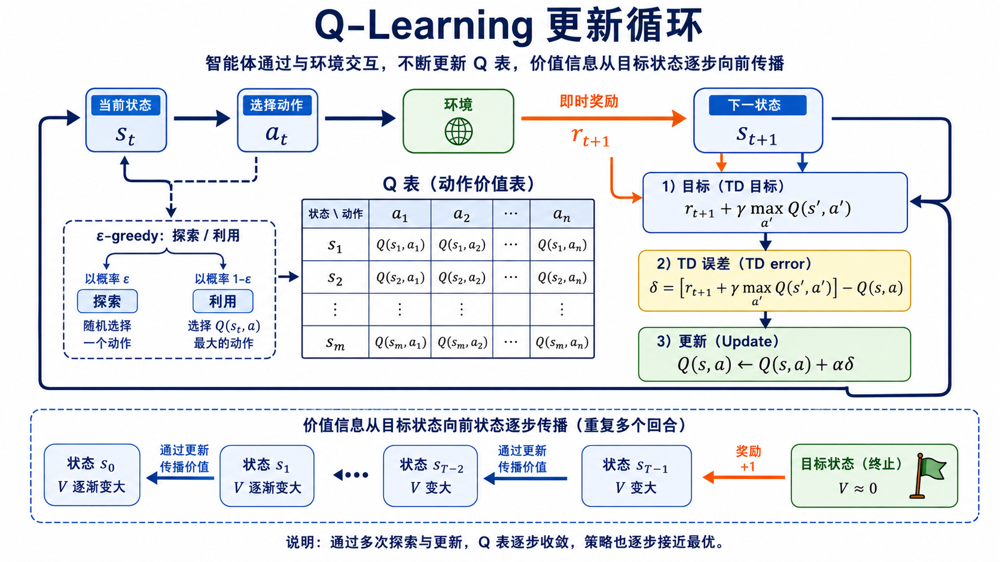

# Q-Learning：从 Bellman 最优方程到 TD 更新

## 学习目标与主线

Q-Learning 是一种**无模型、基于价值的强化学习方法**：智能体不需要预先知道环境如何转移，也不直接记住一条固定策略，而是通过反复交互估计每个“状态—动作”组合的长期价值，最后选择价值最大的动作。

这篇笔记要回答三个相互连接的问题：

1. 一个动作为什么不能只看眼前奖励？
2. 为什么最优动作价值满足“即时奖励 + 下一状态的最优未来价值”？
3. 一开始所有价值都未知时，怎样用一次次经验逐步逼近这个目标？

主线是：**回报 → 动作价值 → Bellman 最优方程 → TD 目标与 TD 误差 → 局部更新 → 多回合的价值传播 → 探索与利用 → 适用边界**。



*图：Q-Learning 的更新闭环。智能体从环境得到真实的一步结果，再用下一状态的当前价值估计构造 TD 目标并更新 Q 表；经过多个回合，靠近目标的高价值信息逐步影响更早的状态。AI 生成示意图，用于解释算法流程。*

## 1. 问题：在每个状态该做什么

强化学习研究的是序列决策：智能体在时刻 $t$ 观察状态 $s_t$ ，选择动作 $a_t$ ，环境返回奖励 $r_{t+1}$ 和下一状态 $s_{t+1}$ 。策略 $\pi(a \mid s)$ 规定在状态 $s$ 下如何选择动作。

目标不是让单步奖励最大，而是最大化从当前时刻起的折扣累计回报：

$$G_t = \sum_{k=0}^{\infty}\gamma^k r_{t+k+1} = r_{t+1} + \gamma r_{t+2} + \gamma^2 r_{t+3} + \cdots$$

其中 $\gamma \in [0,1)$ 是折扣因子。它既表达“较远的奖励通常更不确定或较不重要”，也让无限时域的回报保持有限。

以走迷宫为例：每走一步奖励为 $-1$ ，到达终点奖励为 $+10$ 。一个动作即使立刻获得 $+5$ ，若随后进入死路，仍可能不如一个即时奖励为 $0$ 、却能通向终点的动作。因此，算法必须评估“现在这样做之后，未来还能获得什么”。

## 2. 为什么学习 Q，而不是只学习状态价值

在给定策略 $\pi$ 时，状态价值和动作价值分别为：

$$V^{\pi}(s) = \mathbb{E}_{\pi}[G_t \mid S_t=s]$$

$$Q^{\pi}(s,a) = \mathbb{E}_{\pi}[G_t \mid S_t=s, A_t=a]$$

$V^{\pi}(s)$ 回答“我处于这个状态总体有多好”； $Q^{\pi}(s,a)$ 则回答“我处于该状态且现在执行这个动作有多好”。只有 $V(s)$ 时，仍须额外知道各动作会把状态带向哪里，才能决定下一步；有了每个动作的 $Q(s,a)$ ，选择动作可以直接写成：

$$\pi(s) = \arg\max_a Q(s,a)$$

这就是 Q-Learning 选择动作价值函数的直接收益：学好价值后，贪心策略几乎免费得到。

在有限且离散的状态、动作空间里，Q 可以存为 Q 表：行是状态，列是动作，单元格是该组合当前估计的长期价值。初始时可令所有单元格为 $0$ ，这不是“真实价值为零”，而是“智能体尚无经验时的初始化”。

## 3. 从长期回报到 Bellman 最优方程

最优动作价值定义为所有策略中可获得的最大动作价值：

$$Q^{\ast}(s,a) = \max_{\pi} Q^{\pi}(s,a)$$

回报可拆开第一步：

$$G_t = r_{t+1} + \gamma G_{t+1}$$

当智能体在状态 $s$ 执行动作 $a$ 后到达随机的下一状态 $s'$ ，第一项 $r$ 已由这次交互真实给出；剩余部分的最佳做法，是在 $s'$ 选择最优动作。因此：

$$Q^{\ast}(s,a) = \mathbb{E}[r + \gamma \max_{a'} Q^{\ast}(s',a') \mid s,a]$$

这就是 **Bellman 最优方程**。它不是把整条轨迹倒着计算，而是一个自洽条件：当前最优价值应等于“一步真实结果”加上“从下一状态开始的最优未来价值”。期望符号来自环境转移和奖励可能具有随机性。

## 4. 无法直接求解时：从经验构造 TD 目标

如果已知环境的转移概率和奖励分布，可以把 Bellman 方程写成一组方程求解；但 Q-Learning 不需要这些模型。每次交互只采样到一个四元组：

$$ (s_t, a_t, r_{t+1}, s_{t+1}) $$

它以单次样本替代上节方程中的期望，并用当前 Q 表估计未来部分，得到 **TD 目标**：

$$y_t = r_{t+1} + \gamma \max_{a'} Q(s_{t+1},a')$$

终止状态没有后续动作，因此其未来项取 $0$ 。这里必须分清： $r_{t+1}$ 是已发生的真实观测， $\max_{a'} Q(s_{t+1},a')$ 是对剩余未来的当前预测。

旧估计与新目标的差是 **时序差分误差**：

$$\delta_t = y_t - Q(s_t,a_t)$$

它表示“这次经验所暗示的价值”相对于“原先判断”的高估或低估。若 $\delta_t>0$ ，说明原估计偏低；若 $\delta_t<0$ ，说明原估计偏高。

## 5. Q-Learning 更新式及其含义

Q-Learning 不把当前单元格直接替换成目标，而是朝目标移动一部分：

$$Q(s_t,a_t) \leftarrow Q(s_t,a_t) + \alpha\delta_t$$

将 TD 误差代回：

$$Q(s_t,a_t) \leftarrow Q(s_t,a_t) + \alpha[r_{t+1}+\gamma\max_{a'}Q(s_{t+1},a')-Q(s_t,a_t)]$$

$\alpha \in (0,1]$ 是学习率。 $\alpha=1$ 时，当前估计直接改为本次 TD 目标；较小的 $\alpha$ 则更平滑，能降低随机奖励和偶然轨迹带来的波动。更新式的本质是：

> 预测 → 经验 → 预测误差 → 纠正。

### Bootstrapping：尚未走完未来就开始学习

Q-Learning 在刚得到一步转移后，就用当前估计的 $Q(s_{t+1},a')$ 来补上未来，而不是等整个回合结束。这叫 **bootstrapping（自举）**。它使学习可以在线进行，但也意味着目标本身依赖尚不准确的估计。

这一点区分了 TD 方法和 Monte Carlo 方法：Monte Carlo 等回合结束后使用完整的实际回报 $G_t$ ；Q-Learning 使用一步奖励加当前的未来估计，通常更及时、样本效率更高，但会引入自举估计的偏差。

### 可运行的核心实现

下面的实现刻意不依赖 Gym、NumPy 或深度学习框架。它假定动作编号为 `0` 到 `num_actions - 1` ，环境只需提供 `reset()` 和 `step(action)` 两个方法；其中 `step` 返回 `下一状态, 奖励, 是否终止` 。`LineWorld` 只是一个可直接运行的最小环境，用来验证训练循环，不是 Q-Learning 的必要组成部分。

```python
from collections import defaultdict
import random


class LineWorld:
    """四格线性环境：动作 0 向左，动作 1 向右；抵达最右端得到 +10。"""

    num_actions = 2
    n_states = 4

    def reset(self):
        self.state = 0
        return self.state

    def step(self, action):
        if action == 1:
            self.state = min(self.state + 1, self.n_states - 1)
        else:
            self.state = max(self.state - 1, 0)

        terminated = self.state == self.n_states - 1
        reward = 10.0 if terminated else -1.0
        return self.state, reward, terminated


def train_q_learning(
    env,
    num_actions,
    episodes=1_500,
    max_steps=100,
    alpha=0.1,
    gamma=0.9,
    epsilon=1.0,
    epsilon_decay=0.995,
    epsilon_min=0.05,
    seed=0,
):
    """返回 q[state][action]；状态必须是可哈希对象。"""
    rng = random.Random(seed)
    q = defaultdict(lambda: [0.0] * num_actions)

    for _ in range(episodes):
        state = env.reset()

        for _ in range(max_steps):
            # 行为策略：以 epsilon 的概率探索，否则利用当前 Q 表。
            if rng.random() < epsilon:
                action = rng.randrange(num_actions)
            else:
                best_value = max(q[state])
                best_actions = [a for a, value in enumerate(q[state]) if value == best_value]
                action = rng.choice(best_actions)  # 并列最大值时随机打破平局

            next_state, reward, terminated = env.step(action)

            # 目标策略：无论本次行为动作如何，都评价下一状态的最大 Q 值。
            best_next_q = 0.0 if terminated else max(q[next_state])
            td_target = reward + gamma * best_next_q
            td_error = td_target - q[state][action]
            q[state][action] += alpha * td_error

            state = next_state
            if terminated:
                break

        epsilon = max(epsilon_min, epsilon * epsilon_decay)

    return q


env = LineWorld()
q = train_q_learning(env, num_actions=env.num_actions)

for state in range(env.n_states - 1):
    best_action = max(range(env.num_actions), key=lambda action: q[state][action])
    print(f"state={state}, Q={q[state]}, greedy_action={best_action}")
```

这段代码中，`q[state][action]` 对应 $Q(s_t,a_t)$ ；`best_next_q` 对应 $\max_{a'}Q(s_{t+1},a')$ ；`td_target` 和 `td_error` 分别对应 TD 目标 $y_t$ 与 TD 误差 $\delta_t$ 。因此最关键的一行：

```python
q[state][action] += alpha * td_error
```

与本节的更新公式完全一致。注意 `best_next_q` 总取最大值，而不是取下一次实际采样的动作价值；这正是实现中体现 Q-Learning **off-policy** 特性的地方。若改成实际执行的下一动作的 Q 值，就会接近 SARSA 的更新方式。

## 6. 手算：价值如何逐步向早期状态传播

考虑一条确定性链：

```text
S0 --a0, 0--> S1 --a1, 0--> S2 --a2, +10--> Terminal
```

取 $\alpha=1$ 、 $\gamma=0.9$ ，并把所有 Q 值初始化为 $0$ 。第一回合到达终点时：

$$Q(S2,a2) \leftarrow 10 + 0.9 \times 0 = 10$$

同一回合里，若更新 $S1$ 时 $Q(S2,a2)$ 尚未包含终点信息，则 $Q(S1,a1)$ 可能仍是 $0$ 。下一次到达 $S1$ 后：

$$Q(S1,a1) \leftarrow 0 + 0.9 \times 10 = 9$$

再经过后续回合，到达 $S0$ 时：

$$Q(S0,a0) \leftarrow 0 + 0.9 \times 9 = 8.1$$

从效果看，终点奖励仿佛从 $S2 \rightarrow S1 \rightarrow S0$ 向前传播；但**真实执行顺序始终是沿环境正向交互**。它并不是神经网络中对同一条计算图执行一次反向传播，而是多次局部 TD 更新让后继状态的价值逐渐影响前驱状态。

## 7. 探索与利用：ε-greedy 是数据获取，不是 Bellman 更新

若始终选择当前 Q 值最大的动作，称为 **利用（exploitation）**：

$$a_t = \arg\max_a Q(s_t,a)$$

但初始 Q 值来自很少的经验。某动作目前较低，可能只是因为尝试次数太少；若从不再选它，智能体便没有机会发现它实际更好。常用的 $\epsilon$-greedy 行为策略是：

$$a_t = \begin{cases} \text{随机动作}, & \text{概率 } \epsilon \\ \arg\max_a Q(s_t,a), & \text{概率 } 1-\epsilon \end{cases}$$

它大多数时候利用现有知识，少数时候随机探索。实践中常让 $\epsilon$ 随训练逐步下降：早期需要较多覆盖来获得信息，后期已有较可靠价值估计时再更多利用。

把探索类比为“避免局部最优”可以帮助直觉理解，但不应混为一谈。连续优化中的局部最优是已知目标函数在参数空间的几何性质；这里更准确的风险是**采样不足导致对某些状态—动作组合缺乏信息**。 $\epsilon$-greedy 解决的是探索—利用权衡，而不是 Bellman 方程的求解步骤。

## 8. 为什么 Q-Learning 是 off-policy

上节的 $\epsilon$-greedy 是产生数据的 **行为策略**：它有时会随机执行非贪心动作。可 Q-Learning 的 TD 目标始终使用：

$$\max_{a'} Q(s_{t+1},a')$$

也就是假设下一状态选择最贪心动作所对应的目标策略。学习目标策略与采样行为策略可以不同，因此 Q-Learning 是 **off-policy**。

与之对照，SARSA 的目标使用实际执行的下一动作 $a_{t+1}$ ：

$$Q(s_t,a_t) \leftarrow Q(s_t,a_t) + \alpha[r_{t+1}+\gamma Q(s_{t+1},a_{t+1})-Q(s_t,a_t)]$$

因此 SARSA 是 on-policy：它评价并改进当前包含探索的同一策略。Q-Learning 追求“若之后总按贪心策略行动会怎样”，SARSA 则把真实会发生的探索风险一并计入价值。

## 9. 收敛直觉与成立条件

在有限的 MDP 中，表格型 Q-Learning 有经典收敛保证；直觉上，每个状态—动作对被持续访问，TD 更新就会反复纠正其 Bellman 误差，最终稳定在 Bellman 最优方程的唯一解 $Q^{\ast}$ 。常见条件包括：

- 每个相关的状态—动作对被访问无穷多次；
- 学习率满足随机逼近条件，例如 $\sum_t \alpha_t=\infty$ 且 $\sum_t \alpha_t^2<\infty$ ；
- 奖励有界，且折扣因子满足 $0\leq\gamma<1$ ；
- 环境满足马尔可夫性质，问题的状态和动作空间是有限的表格设置。

这些是理论条件，不等于“只要运行就必然成功”。如果探索过早停止、状态表示遗漏关键信息、学习率设置不当或环境持续变化，学到的 Q 值都可能不可靠。

## 10. 局限、最大化偏差与 DQN 的位置

Q 表需要为每个状态—动作对存一个值。当状态是高维连续观测（例如图像）或组合空间极大时，表格会遭遇维度灾难：既存不下，也难以覆盖。DQN 用神经网络 $Q_\theta(s,a)$ 近似 Q 表，才使 Q-Learning 能处理更复杂的输入；它仍继承“TD 目标 + 自举 + 最大化”的核心结构。

但 DQN 还会带来新的稳定性问题：训练网络与构造目标都依赖不断变化的估计。经验回放用于打散相关样本，目标网络用于减慢目标漂移。另一个问题是 **最大化偏差**：对含噪估计取最大值会偏向被高估的动作。Double DQN 用一个网络选动作、另一个网络评价该动作，缓解这种系统性高估。

## 11. 复习：六个公式与一条因果链

最值得熟练掌握的六个表达式是：

$$G_t = r_{t+1}+\gamma r_{t+2}+\gamma^2r_{t+3}+\cdots$$

$$Q^{\pi}(s,a) = \mathbb{E}_{\pi}[G_t \mid S_t=s,A_t=a]$$

$$Q^{\ast}(s,a)=\max_{\pi}Q^{\pi}(s,a)$$

$$Q^{\ast}(s,a)=\mathbb{E}[r+\gamma\max_{a'}Q^{\ast}(s',a')\mid s,a]$$

$$\delta_t=r_{t+1}+\gamma\max_{a'}Q(s_{t+1},a')-Q(s_t,a_t)$$

$$Q(s_t,a_t)\leftarrow Q(s_t,a_t)+\alpha\delta_t$$

把它们连起来：长期回报定义了“好”；动作价值让“好”能够落到具体选择；Bellman 最优方程把长期问题拆成一步真实结果和未来最优估计；TD 误差衡量两者与旧判断的差；更新式把差写回 Q 表； $\epsilon$-greedy 则保证算法有机会收集足够全面的经验。

## 后续学习建议

1. 从 Bellman 期望方程严格推到 Bellman 最优方程，弄清 $\max$ 出现的逻辑。
2. 用同一个有风险环境逐步手算 Q-Learning 与 SARSA，比较 on-policy 和 off-policy。
3. 对比 Dynamic Programming、Monte Carlo 与 TD：是否需要模型、是否采样、是否自举。
4. 再学习 DQN、经验回放、目标网络与 Double DQN，理解它们分别在解决表格法无法扩展、训练目标不稳定和最大化偏差的问题。
