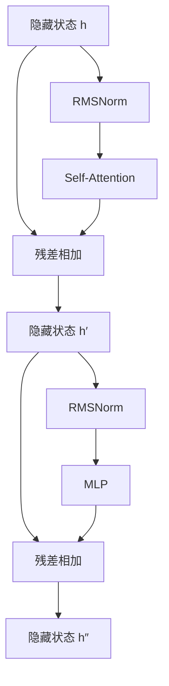

# RMSNorm：从公式、直觉到 Transformer 实践

> [!note] 名称说明
> “RSMNorm”通常是 **RMSNorm** 的误写。RMSNorm 的全称是 **Root Mean Square Layer Normalization**，中文一般译为“均方根层归一化”。本文统一使用 RMSNorm。

## 一句话理解

RMSNorm 是 LayerNorm 的简化形式：它**不减去输入均值，只根据输入向量的均方根调整整体尺度**，从而让深层网络中的中间表示保持相对稳定。

可以先记住这组对比：

> LayerNorm = 重新居中 + 重新缩放  
> RMSNorm = 只做重新缩放

## 1. 为什么神经网络需要归一化

设 Transformer 中一个 token 的隐藏向量为：

$$
\mathbf{x}=[x_1,x_2,\ldots,x_d]
$$

其中 $d$ 是隐藏维度，例如 4096。经过连续的线性变换、注意力、非线性函数和残差相加后，中间激活值的尺度可能不断改变：

- 数值过大时，可能造成数值溢出或梯度爆炸；
- 数值过小时，可能造成梯度消失；
- 不同层的输入尺度剧烈变化，会增加优化难度；
- 注意力、MLP 与残差分支之间可能出现尺度失衡。

归一化层相当于网络中的“尺度校准器”。它并不负责学习语义，而是帮助后续模块在比较稳定的数值范围内工作。

## 2. 从均方根 RMS 开始

向量 $\mathbf{x}$ 的均方根定义为：

$$
\operatorname{RMS}(\mathbf{x})
=
\sqrt{\frac{1}{d}\sum_{i=1}^{d}x_i^2}
$$

计算过程是：逐元素平方、求平均、再开平方。

例如：

$$
\mathbf{x}=[1,2,3,4]
$$

则：

$$
\operatorname{RMS}(\mathbf{x})
=\sqrt{\frac{1^2+2^2+3^2+4^2}{4}}
=\sqrt{7.5}
\approx2.739
$$

RMS 描述的是向量的整体数值幅度。它与欧几里得范数的关系为：

$$
\operatorname{RMS}(\mathbf{x})
=\frac{\|\mathbf{x}\|_2}{\sqrt d}
$$

因此，从几何上看，RMSNorm 与“把向量调整到固定半径附近”密切相关。

## 3. RMSNorm 的公式

RMSNorm 通常定义为：

$$
\operatorname{RMSNorm}(\mathbf{x})_i
=
\gamma_i
\frac{x_i}{
\sqrt{\frac{1}{d}\sum_{j=1}^{d}x_j^2+\epsilon}}
$$

写成向量形式：

$$
\mathbf{y}
=
\boldsymbol{\gamma}\odot
\frac{\mathbf{x}}
{\sqrt{\operatorname{mean}(\mathbf{x}^2)+\epsilon}}
$$

各符号的含义如下：

- $d$：被归一化维度的大小；
- $\epsilon$：防止分母为零、改善数值稳定性的小常数；
- $\boldsymbol{\gamma}$：可学习的逐元素缩放参数，通常初始化为全 1；
- $\odot$：逐元素乘法。

整个数据流可以表示为：


### 为什么归一化之后还要乘以 $\gamma$

如果只有归一化，所有特征都会被限制到相近尺度。但模型可能希望某些维度更重要、某些维度更弱。可学习参数 $\gamma_i$ 允许模型在保持整体尺度稳定的同时，重新学习每个特征的适当幅度。

原始形式以及 PyTorch 的 `torch.nn.RMSNorm` 通常只有缩放参数 $\gamma$，没有 LayerNorm 常见的偏置参数 $\beta$。

## 4. 一个完整的数值例子

仍取：

$$
\mathbf{x}=[1,2,3,4]
$$

忽略很小的 $\epsilon$，已知：

$$
\operatorname{RMS}(\mathbf{x})\approx2.739
$$

归一化结果为：

$$
\frac{\mathbf{x}}{\operatorname{RMS}(\mathbf{x})}
\approx[0.365,0.730,1.095,1.461]
$$

若 $\boldsymbol{\gamma}=[1,1,1,1]$，这就是最终输出。

这个结果的均值不为 0，方差也不一定为 1；但它的均方根约为 1：

$$
\sqrt{\frac{0.365^2+0.730^2+1.095^2+1.461^2}{4}}
\approx1
$$

这揭示了 RMSNorm 真正控制的量：**输出在乘以 $\gamma$ 之前的均方值，而不是均值或方差。**

## 5. RMSNorm 与 LayerNorm 的关系

### 5.1 LayerNorm

LayerNorm 首先计算均值和方差：

$$
\mu=\frac{1}{d}\sum_{i=1}^{d}x_i
$$

$$
\sigma^2=\frac{1}{d}\sum_{i=1}^{d}(x_i-\mu)^2
$$

然后执行：

$$
\operatorname{LayerNorm}(\mathbf{x})_i
=
\gamma_i\frac{x_i-\mu}{\sqrt{\sigma^2+\epsilon}}+\beta_i
$$

### 5.2 RMSNorm

RMSNorm 跳过求均值和减均值：

$$
\operatorname{RMSNorm}(\mathbf{x})_i
=
\gamma_i\frac{x_i}
{\sqrt{\frac{1}{d}\sum_jx_j^2+\epsilon}}
$$

二者的关键区别如下：

| 特性 | LayerNorm | RMSNorm |
|---|---:|---:|
| 计算并减去均值 | 是 | 否 |
| 尺度依据 | 标准差 | 均方根 |
| 可学习缩放 $\gamma$ | 通常有 | 通常有 |
| 可学习偏置 $\beta$ | 通常有 | 通常没有 |
| 输出均值约为 0 | 是 | 否 |
| 控制整体幅度 | 是 | 是 |
| 对整体平移不敏感 | 是 | 否 |
| 对正比例缩放不敏感 | 是 | 近似是 |
| 常见参数量 | $2d$ | $d$ |

### 5.3 两者为什么经常表现接近

注意：

$$
\operatorname{RMS}(\mathbf{x})^2
=\frac{1}{d}\sum_i x_i^2
=\operatorname{Var}(\mathbf{x})+\mu^2
$$

因此：

$$
\operatorname{RMS}(\mathbf{x})
=\sqrt{\operatorname{Var}(\mathbf{x})+\mu^2}
$$

当输入均值接近 0 时：

$$
\operatorname{RMS}(\mathbf{x})
\approx\sqrt{\operatorname{Var}(\mathbf{x})}
$$

此时 RMSNorm 和 LayerNorm 使用的尺度因子很接近。RMSNorm 原论文的核心假设就是：在许多网络中，LayerNorm 的“重新居中”能力可能不是必需的，只保留“重新缩放”也能达到相近效果。

## 6. 两种重要的不变性

### 6.1 对整体平移的反应

令：

$$
\mathbf{x}'=\mathbf{x}+c\mathbf{1}
$$

例如把 $[1,2,3]$ 变成 $[101,102,103]$。

LayerNorm 会减去均值，所以忽略数值误差时：

$$
\operatorname{LN}(\mathbf{x}+c\mathbf{1})
=\operatorname{LN}(\mathbf{x})
$$

RMSNorm 不减均值，一般有：

$$
\operatorname{RMSNorm}(\mathbf{x}+c\mathbf{1})
\ne\operatorname{RMSNorm}(\mathbf{x})
$$

因此 RMSNorm 会保留一定的整体偏移信息。

### 6.2 对整体缩放的反应

令：

$$
\mathbf{x}'=a\mathbf{x},\quad a>0
$$

忽略 $\epsilon$ 时：

$$
\operatorname{RMS}(a\mathbf{x})
=a\operatorname{RMS}(\mathbf{x})
$$

因此：

$$
\frac{a\mathbf{x}}{\operatorname{RMS}(a\mathbf{x})}
=\frac{\mathbf{x}}{\operatorname{RMS}(\mathbf{x})}
$$

也就是说，RMSNorm 基本消除了输入整体正比例放大的影响。严格来说，当 $\epsilon\ne0$ 时这是近似不变；若 $a<0$，输出方向还会发生符号翻转。

## 7. RMSNorm 为什么有助于训练

### 7.1 稳定激活尺度

无论输入近似为 $[1,2,3]$ 还是 $[100,200,300]$，RMSNorm 后的结果都接近相同。后续的注意力层和 MLP 因而能接收到尺度更稳定的输入。

### 7.2 减少深层网络中的尺度漂移

深层网络包含大量矩阵乘法、非线性变换与残差累加。每层很小的尺度变化可能在几十层以后显著累积。RMSNorm 在关键位置重新校准幅度，可以缓解这种漂移。

### 7.3 隐式调节更新尺度

如果某层权重整体放大，输出 $\mathbf{x}$ 也随之放大，RMSNorm 会用同步增大的 RMS 将其除掉。前向输出因此不会同比例增大；反向传播中的梯度尺度也会相应变化。原论文将这一性质描述为一种隐式的学习率适应能力。

### 7.4 计算形式更简单

LayerNorm 需要处理均值、中心化、方差、缩放和偏移；RMSNorm 主要处理平方均值、倒数平方根和缩放。

二者的渐进复杂度都是 $O(d)$。RMSNorm 的优势是减少了一部分操作，而不是从复杂度上降低一个数量级。原论文在当时的若干模型与硬件环境中报告了约 7%～64% 的运行时间减少，但现代 GPU 上的实际收益取决于张量形状、数值精度、融合内核、编译器和内存带宽，不能直接套用该数字。

## 8. 梯度与几何直觉

先忽略 $\gamma$，定义：

$$
r=\sqrt{\frac{1}{d}\sum_i x_i^2+\epsilon},
\qquad z_i=\frac{x_i}{r}
$$

可得：

$$
\frac{\partial z_i}{\partial x_j}
=\frac{\delta_{ij}}{r}-\frac{x_ix_j}{d r^3}
$$

其中 $\delta_{ij}$ 是克罗内克符号。若上游梯度为 $\mathbf{g}$，则输入梯度为：

$$
\frac{\partial L}{\partial\mathbf{x}}
=\frac{\mathbf{g}}{r}
-\frac{\mathbf{x}}{r^3}
\operatorname{mean}(\mathbf{g}\odot\mathbf{x})
$$

加入 $\gamma$ 时，可先令 $\mathbf{u}=\mathbf{g}\odot\boldsymbol{\gamma}$，再用 $\mathbf{u}$ 替换上式中的 $\mathbf{g}$。

梯度包含两个作用：

1. 用 $1/r$ 根据输入整体尺度调整梯度；
2. 减去一部分沿输入向量径向的梯度。

当 $\epsilon\approx0$ 时，可以把 RMSNorm 近似理解为：网络更关注如何改变向量的**方向和特征间相对比例**，而不是单纯把整个向量等比例放大。

## 9. RMSNorm 在 Transformer 中的位置

假设隐藏状态形状为：

$$
[B,T,D]
$$

其中 $B$ 是批量大小，$T$ 是序列长度，$D$ 是隐藏维度。RMSNorm 通常只沿最后一个维度 $D$ 计算，即每个 token 的隐藏向量独立归一化：

$$
\mathbf{x}_{b,t,:}
\longrightarrow
\operatorname{RMSNorm}(\mathbf{x}_{b,t,:})
$$

它不会混合不同 batch 样本，也不会混合不同 token，更不会使用整个训练集的运行统计量。

在 Pre-Norm Transformer 中，典型结构为：



对应公式为：

$$
\mathbf{h}'
=\mathbf{h}
+\operatorname{Attention}(\operatorname{RMSNorm}(\mathbf{h}))
$$

$$
\mathbf{h}''
=\mathbf{h}'
+\operatorname{MLP}(\operatorname{RMSNorm}(\mathbf{h}'))
$$

需要区分两个独立的设计问题：

- **RMSNorm 或 LayerNorm**：选择哪种归一化函数；
- **Pre-Norm 或 Post-Norm**：把归一化层放在子层之前还是之后。

## 10. PyTorch 实现

### 10.1 使用内置模块

```python
import torch
import torch.nn as nn

x = torch.randn(2, 8, 4096)

norm = nn.RMSNorm(
    normalized_shape=4096,
    eps=1e-6,
    elementwise_affine=True,
)

y = norm(x)

print(x.shape)  # torch.Size([2, 8, 4096])
print(y.shape)  # torch.Size([2, 8, 4096])
```

这里会对每一个长度为 4096 的 token 向量单独归一化。

### 10.2 手写实现

```python
import torch
import torch.nn as nn


class SimpleRMSNorm(nn.Module):
    def __init__(self, hidden_size, eps=1e-6):
        super().__init__()
        self.eps = eps
        self.weight = nn.Parameter(torch.ones(hidden_size))

    def forward(self, x):
        input_dtype = x.dtype

        # 低精度训练中，先用 float32 计算平方均值更稳定
        x_float = x.float()
        mean_square = x_float.pow(2).mean(dim=-1, keepdim=True)
        normalized = x_float * torch.rsqrt(mean_square + self.eps)

        return normalized.to(input_dtype) * self.weight
```

核心计算只有一行：

```python
x * torch.rsqrt(x.pow(2).mean(dim=-1, keepdim=True) + eps)
```

其中 `rsqrt(a)` 表示 $1/\sqrt a$。

## 11. RMSNorm、LayerNorm 与 BatchNorm

| 方法 | 统计范围 | 是否依赖 batch | 常见应用 |
|---|---|---:|---|
| BatchNorm | 同一特征在多个样本上的统计量 | 是 | CNN、视觉模型 |
| LayerNorm | 单个样本内部的特征维度 | 否 | Transformer、RNN |
| RMSNorm | 单个样本内部的特征幅度 | 否 | Transformer、大语言模型 |

BatchNorm 在训练时使用当前 batch 的统计量，推理时一般使用保存的运行均值和运行方差。LayerNorm 与 RMSNorm 对每个样本或 token 独立计算，因此不依赖 batch size，训练和推理阶段的核心计算方式也相同。

## 12. 局限与工程注意事项

### 12.1 无法直接消除均值漂移

RMSNorm 不减均值。如果某种网络结构确实需要抑制隐藏向量的整体偏移，LayerNorm 可能更合适。

### 12.2 不能随意替换已训练模型中的 LayerNorm

RMSNorm 是模型架构的一部分，并非无条件的升级。把已训练模型中的 LayerNorm 直接换成 RMSNorm，会改变网络函数，通常不能保证输出和性能不变。是否适合需要结合初始化、残差结构、优化器和训练过程验证。

### 12.3 理论操作更少不代表一定更快

现代框架会使用融合内核和编译优化，归一化操作也可能受内存带宽而非算术量限制。真实性能应在目标硬件、精度和张量形状上测试。

### 12.4 低精度下注意平方运算

FP16 直接计算 $x_i^2$ 时，大数可能溢出，小数可能损失精度。手写实现时常先转为 FP32 计算平方均值，再转回输入类型；使用框架原生算子时，则应遵循对应版本的数值语义。

### 12.5 $\epsilon$ 会影响严格的不变性

$\epsilon$ 是数值稳定性所必需的，但它也意味着缩放不变性不是数学上的绝对成立。不同模型或框架使用的 $\epsilon$ 可能不同，复现模型时应以其配置为准。

## 13. 常见误区

> [!warning] RMSNorm 不会让输出均值变成 0
> 因为它没有减去均值。

> [!warning] RMSNorm 不保证输出方差为 1
> 它控制的是 $\operatorname{mean}(z_i^2)\approx1$，而不是 $\operatorname{mean}((z_i-\bar z)^2)=1$。

> [!warning] RMSNorm 不是在整个 batch 上归一化
> Transformer 中通常是对每个 token 的隐藏维度独立计算。

> [!warning] RMSNorm 并非没有可学习参数
> 它通常有逐特征缩放参数 $\gamma$，只是不一定有偏置 $\beta$。

> [!warning] RMSNorm 不保证一定比 LayerNorm 快很多
> 理论操作更简单，实际收益则依赖实现、硬件与工作负载。

## 14. 复习总结

RMSNorm 的完整过程可以压缩为三步：

1. 计算均方根尺度：

   $$
   r=\sqrt{\operatorname{mean}(\mathbf{x}^2)+\epsilon}
   $$

2. 用输入除以该尺度：

   $$
   \hat{\mathbf{x}}=\frac{\mathbf{x}}{r}
   $$

3. 乘以可学习参数：

   $$
   \mathbf{y}=\boldsymbol{\gamma}\odot\hat{\mathbf{x}}
   $$

最重要的理解是：

> RMSNorm 只控制向量的整体幅度，不把均值移动到 0。它基本消除了向量长度的影响，使网络更关注隐藏表示的方向和各特征之间的相对关系。

## 15. 延伸思考

1. 当隐藏向量的均值很大时，RMSNorm 与 LayerNorm 的输出会出现多大差异？
2. 为什么 Pre-Norm Transformer 的残差主干能够帮助梯度传播？
3. 在 FP16、BF16 和 FP32 下，$\epsilon$ 应如何选择？
4. 如果 $\gamma$ 在不同维度差异很大，“归一化后 RMS 为 1”是否仍然成立？
5. 在相同模型上，RMSNorm 的理论运算减少能否转化为端到端训练加速？

## 参考资料

1. Biao Zhang, Rico Sennrich. [Root Mean Square Layer Normalization](https://arxiv.org/abs/1910.07467), NeurIPS 2019.
2. Jimmy Lei Ba, Jamie Ryan Kiros, Geoffrey E. Hinton. [Layer Normalization](https://arxiv.org/abs/1607.06450), 2016.
3. PyTorch Documentation. [`torch.nn.RMSNorm`](https://docs.pytorch.org/docs/stable/generated/torch.nn.RMSNorm.html).

