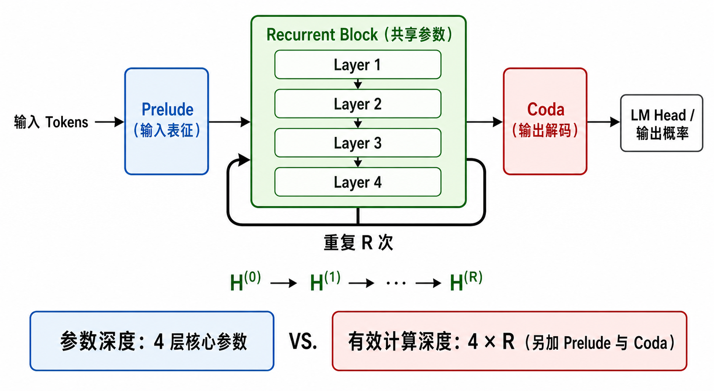

# Recurrent Depth Transformer 详解

## 一句话结论

Recurrent Depth（循环深度）的核心，是把同一组 Transformer 层沿“网络深度方向”反复执行，使模型在参数量不随循环次数增长的情况下，用更多前向计算换取更深的隐藏状态变换。

它拆开了过去常被绑定在一起的两个量：

- **参数深度**：模型实际保存了多少组不同参数的层；
- **计算深度**：一次前向传播实际执行了多少层计算。

因此最简洁的概括是：

> 固定的共享参数 + 可变的循环次数 = 可调的计算深度。

但必须同时记住：循环次数增加会提高 FLOPs 和延迟，效果也不保证单调改善。Recurrent Depth 是“以计算换能力”，不是免费扩容。

## 1. 从普通网络的深度说起

对于一个三层神经网络，隐藏状态依次更新为：

$$h_1=f_1(x),\qquad h_2=f_2(h_1),\qquad h_3=f_3(h_2)$$

这里的“深度为 3”表示输入经历了三次连续变换。普通的 $L$ 层 Transformer 也一样：

$$H^{(0)}=\mathrm{Embed}(X)$$

$$H^{(l)}=T_{\theta_l}\left(H^{(l-1)}\right),\qquad l=1,2,\ldots,L$$

$$p(y\mid x)=\mathrm{softmax}\left(W_{\mathrm{LM}}H^{(L)}\right)$$

符号含义：

- $X=(x_1,x_2,\ldots,x_n)$：长度为 $n$ 的输入 token 序列；
- $H^{(l)}\in\mathbb{R}^{n\times d}$：第 $l$ 层输出的隐藏状态；
- $d$：隐藏维度；
- $T_{\theta_l}$：第 $l$ 个 Transformer 层，参数为 $\theta_l$；
- $W_{\mathrm{LM}}$：把隐藏状态映射到词表 logits 的输出矩阵。

标准 Transformer 的关键特征是，不同层通常使用不同参数：

$$\theta_1\ne\theta_2\ne\cdots\ne\theta_L$$

要让模型经历更多层计算，通常需要再增加一组新参数。

## 2. Recurrent Depth 改变了什么

Recurrent Depth 不再依次使用 $T_{\theta_1},T_{\theta_2},\ldots$，而是重复使用同一个共享变换 $F_\theta$：

$$H^{(r+1)}=F_\theta\left(H^{(r)}\right),\qquad r=0,1,\ldots,R-1$$

于是：

$$H^{(R)}=F_\theta^{\circ R}\left(H^{(0)}\right)$$

其中 $F_\theta^{\circ R}$ 表示函数复合 $R$ 次，不是数值意义上的 $R$ 次幂。循环的每一轮都使用同一组参数 $\theta$，但处理的是上一轮更新后的隐藏状态。

如果循环核心内部包含 $L_R$ 个 Transformer 层，并循环 $R$ 次，那么核心部分的有效计算深度为：

$$D_{\mathrm{core}}=L_R\,R$$

如果架构还包含 $L_P$ 层 Prelude 和 $L_C$ 层 Coda，则完整有效深度为：

$$D_{\mathrm{effective}}=L_P+L_R\,R+L_C$$

例如核心有 4 层、循环 8 次，则核心执行了 $4\times 8=32$ 层计算，但模型只保存这 4 层核心参数。Prelude 和 Coda 的层数还需另行计入，不能把整个模型简单说成“只有 4 层”。

*图：Recurrent Depth Transformer 的参数复用与有效计算深度。阅读重点是绿色核心只有一份参数，却被循环执行 $R$ 次。AI 生成示意图。*

## 3. 更准确的 Prelude–Core–Coda 架构

“把输入直接反复送入同一个层”足以解释基本思想，但真实模型可以更精细。Huginn 工作使用了三个功能阶段：

1. **Prelude $P$**：把输入 token 转换成适合循环计算的输入表征；
2. **Recurrent Core $R_\theta$**：反复更新潜在状态，参数在各轮间共享；
3. **Coda $C$**：把最终潜在状态解码为下一个 token 的概率。

其宏观过程可写为：

$$e=P(x)$$

$$s_0\sim\mathcal{N}\left(0,\sigma^2I\right)$$

$$s_i=R_\theta(e,s_{i-1}),\qquad i=1,2,\ldots,r$$

$$p=C(s_r)$$

这里：

- $x\in V^n$：输入 token 序列，$V$ 是词表；
- $e\in\mathbb{R}^{n\times h}$：Prelude 产生的输入表征；
- $s_i\in\mathbb{R}^{n\times h}$：第 $i$ 轮循环后的潜在状态；
- $h$：隐藏维度；
- $r$：本次前向传播实际使用的循环次数；
- $p\in\mathbb{R}^{n\times |V|}$：输出 token 的概率分布。

这个公式比 $H^{(r+1)}=F_\theta(H^{(r)})$ 多出一个重要细节：**原始输入表征 $e$ 在每一轮都会重新注入核心**。因此每轮更新同时依赖“问题是什么”和“目前算到哪里”，而不是让状态在脱离输入的情况下自行演化。

Huginn-3.5B 的层数配置为 $(L_P,L_R,L_C)=(2,4,2)$。当核心循环 32 次时：

$$D_{\mathrm{effective}}=2+4\times32+2=132$$

它只保存 8 个实际 Transformer 层的参数，但一次前向可以展开成 132 层计算。这里的“有效深度”只描述执行链长度，不意味着它在表达能力、训练结果或行为上自动等同于一个拥有 132 组独立参数的标准 Transformer。

## 4. 每轮循环内部发生什么

为了看清“循环的是隐藏状态，不是 token”，可以用一个简化的 Pre-Norm Transformer 层表示共享核心。设第 $r$ 轮的输入为 $H^{(r)}$：

$$Q=\mathrm{LN}(H^{(r)})W_Q,\qquad K=\mathrm{LN}(H^{(r)})W_K,\qquad V=\mathrm{LN}(H^{(r)})W_V$$

$$A=\mathrm{softmax}\left(\frac{QK^T}{\sqrt{d_k}}+M_{\mathrm{causal}}\right)V$$

$$\widetilde{H}^{(r)}=H^{(r)}+AW_O$$

$$H^{(r+1)}=\widetilde{H}^{(r)}+\mathrm{FFN}\left(\mathrm{LN}(\widetilde{H}^{(r)})\right)$$

其中：

- $W_Q,W_K,W_V,W_O$：共享核心中注意力模块的参数；
- $d_k$：单个注意力头的 key 维度；
- $M_{\mathrm{causal}}$：因果遮罩，阻止当前位置看到未来 token；
- $\mathrm{FFN}$：前馈网络；
- $H^{(r+1)}$：本轮结束后的新潜在状态。

完成这一轮后，$H^{(r+1)}$ 不会立刻变成新的自然语言推理 token，而是继续送进同一个共享核心，得到 $H^{(r+2)}$。只有最后的状态才经 Coda 和 LM Head 解码。

实际 Huginn 使用的归一化顺序、输入拼接适配器、RMSNorm 与 gated SiLU MLP 比上述教学公式更具体；上式用于说明循环机制，不应当当作所有 Recurrent-Depth Transformer 的唯一实现。

## 5. 为什么这种归纳偏置可能适合组合推理

许多组合问题都可以写成“反复应用同一类状态转移规则”。例如：

$$s_{t+1}=\mathrm{Father}(s_t)$$

若 $s_0=\text{Alice}$，连续应用三次相同规则，就能沿 Alice → Bob → Charlie → David 完成三跳关系组合。

普通 Transformer 更像：

$$f_3\left(f_2\left(f_1(x)\right)\right)$$

而 Recurrent Depth 更像：

$$f\left(f\left(f(x)\right)\right)$$

这种共享算子提供了一种接近迭代算法的归纳偏置：模型可能学会“继续更新当前状态”，而不是让某个固定编号的层专门承担某个固定步骤。

这只是架构直觉，并不证明模型必然学到了人类可解释的算法。受控任务中的深度外推结果支持“共享迭代有利于某些组合泛化”，但能否扩展到开放域语言推理，还取决于训练数据、初始化、任务结构和停止机制。

## 6. 它与 RNN 的区别

两者都共享参数并反复更新隐藏状态，但循环所沿的轴不同。

RNN 通常沿序列或时间方向循环：

$$h_t=f_\theta(h_{t-1},x_t)$$

其中 $t$ 表示新的时间步或 token 位置。

Recurrent Depth 沿网络深度方向循环：

$$H_{r+1}=F_\theta(H_r,X)$$

其中 $r$ 表示对同一输入执行的第几轮潜在计算；$H_r$ 往往仍覆盖整段序列。它不是读入一个新 token 后才循环，而是在输出下一个 token 之前，让整段隐藏表示继续演化。

因此可以把 Recurrent Depth 看成一种“以深度迭代为时间轴”的隐藏状态动力系统，但不要据此把它和传统逐 token RNN 当成同一种架构。

## 7. 它与 Chain-of-Thought 的区别

### 7.1 显式 token 推理

Chain-of-Thought（CoT）通过生成更多中间 token 增加计算：

$$y_1\rightarrow y_2\rightarrow\cdots\rightarrow y_T\rightarrow\text{答案}$$

中间过程进入上下文，可以被人阅读、监督、修改，也会增加序列长度和 KV Cache。

### 7.2 潜在深度推理

Recurrent Depth 在输出 token 之前增加隐藏空间计算：

$$H^{(0)}\rightarrow H^{(1)}\rightarrow\cdots\rightarrow H^{(R)}\rightarrow\text{答案}$$

额外计算主要表现为循环核心的更多前向执行，而不是更多可见文本。因此它常被称为 latent reasoning，也有人用“纵向 CoT”帮助建立直觉。

不过，“纵向 CoT”只能作为类比。一次 recurrence 只是一次新的潜在状态变换，并不保证对应一个清晰、离散、可翻译成人类语言的推理步骤。对 Huginn-3.5B 的 probing 研究只发现了有限且不稳定的可解释 latent CoT 证据，不同循环层和解码探针甚至会给出不一致的解释。

### 7.3 三条 test-time scaling 路线

可以把推理时扩展粗略分为三条互补路线：

| 路线 | 增加什么 | 优势 | 主要代价或限制 |
|---|---|---|---|
| Token scaling | 更多推理 token | 可读、可监督、可接入 RL | 序列更长，KV Cache 增长，受语言表达约束 |
| Depth scaling | 更多潜在循环 | 参数不随循环增长，不必输出全部中间过程 | 难解释、停止困难、可能 overthinking |
| System scaling | 更多模型—工具—环境交互 | 可获取外部信息并验证结果 | 系统复杂，延迟与错误传播增加 |

三者并不互斥。一个 Agent 可以在每次调用内部使用 recurrent depth，同时输出部分 CoT 或结构化计划，并在调用之间使用工具验证。

## 8. 训练：为什么不能只在推理时随便多循环

### 8.1 固定循环次数的问题

如果训练始终使用 $R=4$，模型可能形成依赖绝对轮次的策略，例如“第 4 轮收尾”。推理时突然改为 $R=10$，额外循环可能继续改写已经正确的状态，导致性能下降。

因此，架构上“可以循环任意多次”不等于训练后“任意增加循环都有效”。是否能外推，必须由实验验证。

### 8.2 Dynamic Recurrence

一种重要训练方法是对每个训练样本或微批次随机采样循环次数：

$$r\sim\Lambda$$

训练目标为：

$$\mathcal{L}(\theta)=\mathbb{E}_{x\sim\mathcal{D}}\mathbb{E}_{r\sim\Lambda}\left[\ell\left(m_\theta(x,r),x'\right)\right]$$

其中：

- $\mathcal{D}$：训练数据分布；
- $\Lambda$：训练循环次数的分布；
- $m_\theta(x,r)$：以 $r$ 次循环处理输入 $x$ 后的模型输出；
- $x'$：下一 token 目标序列；
- $\ell$：通常为 next-token cross-entropy；
- 外层期望覆盖训练样本，内层期望覆盖不同计算深度。

Huginn 采用重尾的 log-normal Poisson 采样，使模型大多看到中等循环次数，偶尔看到明显更深的展开。受控多跳实验也发现，在相同最大训练循环预算下，动态循环通常能更有效地利用可外推范围，并对 overthinking 更稳健；但这些结果依赖具体任务与初始化，不能直接推广为普适定律。

### 8.3 梯度如何穿过循环

循环在训练时被展开，参数 $\theta$ 在各轮共享。最终损失对共享参数的梯度，会汇总每个循环位置的贡献：

$$\frac{\partial\mathcal{L}}{\partial\theta}=\sum_{r=1}^{R}\frac{\partial\mathcal{L}}{\partial H^{(R)}}\frac{\partial H^{(R)}}{\partial H^{(r)}}\frac{\partial H^{(r)}}{\partial\theta}$$

这和 BPTT 的数学结构相似：虽然参数只有一份，但反向传播需要沿展开后的计算链传递。循环很深时会带来三类问题：

- 激活保存和反向计算成本随展开深度增加；
- 连续 Jacobian 相乘可能造成梯度消失或爆炸；
- 状态更新可能失稳、坍缩，或者过早停在对任务无用的固定模式。

Huginn 为控制内存，只对最后 $k$ 个循环做截断反向传播，主实验取 $k=8$；同时使用特定归一化与初始化稳定大规模训练。另一项受控工作则报告 LayerScale、接近恒等映射的循环初始化有助于稳定 20 步以上的深循环。这些是具体实现的工程选择，不属于 Recurrent Depth 定义本身。

## 9. 推理时增加循环与深度外推

训练循环上限为 $R_{\mathrm{train}}$ 后，推理时可以尝试更大的 $R_{\mathrm{test}}$：

$$R_{\mathrm{test}}>R_{\mathrm{train}}$$

如果共享核心学到的是可重复应用的状态转移，它可能在更多轮次下解决训练时没有覆盖的更深组合问题。这称为 depth extrapolation。

受控多跳组合实验表明：

- 增加训练时循环次数通常能提高模型可学到的组合深度；
- 对已经学会组合规则的模型，增加推理时循环可以拓展部分 OOD 推理深度；
- 动态循环训练有助于利用这一范围；
- 结果受初始化、随机种子、训练课程和数据是否存在捷径影响；
- 外推范围有限，并非 $R$ 越大就能无限解决更深问题。

尤其要警惕数据捷径：若答案能由关系序列的短后缀猜出，模型可能看似完成几十跳组合，实际没有逐步检索中间实体。可靠实验需要让每一步关系都真正影响最终答案，并通过因果分析排除捷径。

## 10. Overthinking：算得更久为什么可能变差

循环次数增加后，准确率常呈现先升后降：

$$R\uparrow\quad\not\Rightarrow\quad\mathrm{Accuracy}\uparrow$$

可能出现：

$$R=8\ \text{较好},\qquad R=16\ \text{更好},\qquad R=32\ \text{反而变差}$$

这类现象被称为 overthinking。受控实验观察到，正确答案相对最强竞争答案的 logit margin 往往先增大、达到峰值，再随额外循环持续下降。直观上，模型已经得到合适状态后仍被迫更新，正确表征可能被逐渐破坏。

Dynamic Recurrence 能缓解这一问题，但不能保证彻底消除。更根本的问题是：模型什么时候应该停止？

## 11. Adaptive Halting

固定给所有样本相同的 $R$ 会浪费简单问题的计算，也可能让已解决问题过度迭代。Adaptive Halting 希望让模型按样本难度决定何时停止。

一种输出分布判据是：相邻两轮预测变化已经很小，而且当前预测足够确定：

$$\mathrm{KL}\left(p_r\,\|\,p_{r-1}\right)<\varepsilon_{\mathrm{KL}}\qquad\text{且}\qquad H(p_r)<H_{\mathrm{thresh}}$$

其中：

- $p_r$：第 $r$ 轮解码出的输出分布；
- $\mathrm{KL}(p_r\|p_{r-1})$：相邻两轮分布变化；
- $H(p_r)$：当前分布的熵，用来衡量不确定性；
- $\varepsilon_{\mathrm{KL}}$ 与 $H_{\mathrm{thresh}}$：停止阈值。

仅凭“变化很小”就停止可能过早，因为模型也可能稳定在一个高熵、没有把握的状态。因此受控实验把低 KL 和低熵同时作为条件。但这种规则仍需要阈值调节，也没有证明适用于所有开放域任务；学习式 halting 仍是重要研究方向。

## 12. 与 Universal Transformer 和 ALBERT 的关系

### Universal Transformer

Universal Transformer 很早就提出沿深度重复应用共享变换，并结合迭代计算与动态停止。因此 Recurrent Depth 并非从零出现的新思想，而是共享深度变换这一家族的现代延伸。

现代 Recurrent Depth 工作把重点进一步放在：训练结束后，把循环次数作为 test-time compute 的可调预算，并研究 latent reasoning、深度外推和大规模语言模型训练。

### ALBERT

ALBERT 也跨层共享参数，但主要目标是降低参数冗余和内存占用。参数共享是共同技术手段，关注点却不同：

- ALBERT 重点是“用更少参数实现固定层数的编码器”；
- Recurrent Depth 重点是“让共享核心成为可重复执行、可调计算深度的过程”。

因此，不能看到“层间参数共享”就自动把一个模型归类为现代 recurrent-depth test-time scaling 模型。

## 13. 能力、成本与证据边界

### 已得到较强支持的结论

- 共享核心可以让参数深度与计算深度分离；
- Huginn-3.5B 展示了十亿参数规模的 recurrent-depth 预训练，并在一些基准上随循环计算增加而改善；
- 受控组合任务显示，增加推理循环可以在一定范围内支持深度外推；
- 动态循环、合适初始化和归一化对稳定训练及外推很重要；
- 过多循环可能导致 overthinking，因此需要停止机制。

### 不能由现有结果直接推出的结论

- 每一轮循环都对应一个可解释的人类推理步骤；
- 同样 FLOPs 下，Recurrent Depth 普遍优于所有标准 Transformer 或显式 CoT；
- 参数量不变意味着推理成本不变；
- 在合成多跳任务上能外推，就必然能在开放域数学、规划和现实知识推理上同样外推；
- 只要把普通 Transformer 的若干层机械重复，就会自然获得稳定 latent reasoning。

尤其是 Huginn 的“相当于 50B 参数模型的计算负载”，描述的是某些循环设置下的计算量类比，不是说 3.5B 模型已经普遍达到 50B 模型的能力。

## 14. 最终心智模型

可以把标准 Transformer 想成一栋由许多不同楼层组成的楼：要继续加深，通常要新建楼层并加入新参数。

Recurrent Depth 更像一组可反复乘坐的“计算电梯”：核心参数只保存一份，隐藏状态每循环一次就再接受一轮加工。这样模型知道多少（参数容量）和模型愿意算多久（计算深度）不再完全绑定。

但这台电梯并不会自动知道目的地。训练必须让每轮更新具有可复用性，初始化与归一化要保证深循环稳定，推理时还需要判断何时停止。最终能力来自架构、训练分布、优化方法和计算预算的共同作用，而不是“循环”二字本身。

## 参考资料

1. [共享对话：Recurrent-Depth Transformer 讲解](https://chatgpt.com/share/6a831ba1-6b2c-83e8-9024-cacfc188c567)
2. Geiping et al., [Scaling up Test-Time Compute with Latent Reasoning: A Recurrent Depth Approach](https://arxiv.org/abs/2502.05171), 2025.
3. Kohli et al., [Loop, Think, & Generalize: Implicit Reasoning in Recurrent-Depth Transformers](https://arxiv.org/abs/2604.07822), 2026.
4. Lu et al., [Latent Chain-of-Thought? Decoding the Depth-Recurrent Transformer](https://arxiv.org/abs/2507.02199), 2025.
5. Chen, [Thinking Deeper, Not Longer: Depth-Recurrent Transformers for Compositional Generalization](https://arxiv.org/abs/2603.21676), 2026.
6. Dehghani et al., [Universal Transformers](https://arxiv.org/abs/1807.03819), 2018.
