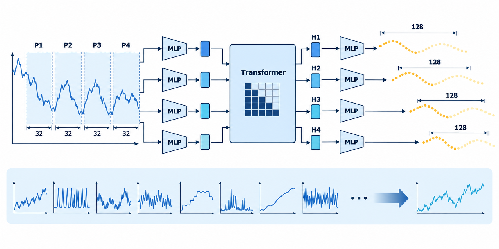

# TimesFM：从时间序列基础模型到零样本预测

## 学习目标与路线

TimesFM（Time Series Foundation Model）把“先在海量数据上预训练，再直接迁移到新任务”的基础模型范式带到时间序列预测中。本文聚焦最初的 TimesFM-1：它把连续数值切成 patch，使用 decoder-only Transformer 建模历史，再以每个位置的隐藏状态直接预测一段未来轨迹。

这篇笔记依次回答四个问题：传统预测为什么难以跨数据集复用、连续数值如何成为 Transformer token、`input_patch_len=32` 与 `output_patch_len=128` 为什么不必相等，以及单变量模型的 zero-shot 泛化从何而来。最后给出一个与公式和张量形状对应的最小教学实现。

> 范围说明：本文解释的是 2024 年的 TimesFM-1 架构与学习思路，而不是当前 TimesFM-3 的实现。TimesFM-3 已扩展到多变量目标和协变量；不能把后者的能力倒推到 TimesFM-1。

## 1. 从单任务预测到时间序列基础模型

给定已观察的历史序列 $y_{1:L}$ ，预测未来 $H$ 个点：

$$\hat y_{L+1:L+H}=f_\theta(y_{1:L})$$

传统 ARIMA、ETS 或 Prophet 往往为一条序列或一个数据集重新估计参数；深度全局模型虽然能共享同类数据的参数，换到新领域时仍常需再训练或微调。TimesFM 的目标不同：在大量异构序列上预训练一次，使参数 $\theta$ 保存可复用的时间动态先验，再将从未见过的新序列直接作为 context 输入。

这并不意味着模型“理解了电力、销量或金融”的领域语义。它主要学习的是趋势、周期、均值回归、局部突变、噪声与长程重复等统计动态。因此，zero-shot 是“面对目标数据集不做任务专属训练”，不是“不需要历史数据”或“对所有领域必然准确”。

## 2. Patch：连续时间点如何成为 token

文本已有词或子词 token，时间序列只有连续数值。TimesFM-1 将相邻 $p$ 个原始点组成一个输入 patch：

$$P_j=(y_{(j-1)p+1},\ldots,y_{jp}),\quad P_j\in\mathbb{R}^{p}$$

原始模型中 $p=32$ 。一个长度为 256 的 context 因而形成 8 个 token，而不是 256 个 token。其收益有两层：输入 MLP 可先提取一个局部窗口的形状；Transformer 的注意力长度从 256 降为 8，注意力矩阵规模相应从 $256^2$ 降至 $8^2$ 。

输入 patch 通过残差 MLP 投影到模型维度并叠加位置编码：

$$t_j=f_{\mathrm{in}}(P_j)+\mathrm{PE}_j,\quad t_j\in\mathbb{R}^{d}$$

TimesFM-1 主模型使用 $d=1280$ 。需要注意：patch 是模型的表示单位，并不改变原始数据的采样频率。



*图：32 个原始点构成一个输入 token；因果 Transformer 在 token 级别聚合历史；每个位置经共享输出头生成一条 128 点的未来轨迹。下方表示多样时间模式预训练后面对新序列的 zero-shot 推理。AI 生成示意图，用于解释结构，不是论文原图。*

## 3. Patched decoder：细看历史，大块预测未来

TimesFM-1 的关键不是让输入与输出 patch 对称。它使用：

| 对象 | 长度 | 含义 |
|---|---:|---|
| 输入 patch | 32 | 32 个历史原始点编码为 1 个 Transformer token |
| 输出 patch | 128 | 一个隐藏状态直接输出 128 个未来原始预测值 |
| 自回归步长 | 128 | 每轮预测向未来推进的原始时间点数 |

输出头将每个隐藏状态映射为未来 $h$ 个数值，其中 $h=128$ ：

$$\hat Y_{jp+1:jp+h}=f_{\mathrm{out}}(o_j),\quad f_{\mathrm{out}}:\mathbb{R}^{d}\rightarrow\mathbb{R}^{h}$$

这里的 128 是 **128 个独立原始预测值**，不是把 128 点压缩为一个汇总值。因此，它改变的是自回归解码的步长，而不是预测结果的时间分辨率。

为什么不把输出也设为 32？较小的输出块通常降低单轮直接预测难度；但预测长 horizon 时，模型必须反复将自己的预测作为下一轮输入，造成 rollout 误差传播。较大的输出块减少了 rollout 次数，却让一轮内较远的位置更难直接预测。可将这种折中概括为：

$$E(P)=E_{\mathrm{direct}}(P)+E_{\mathrm{rollout}}(P)$$

其中 $P$ 是输出块长度。通常 $P$ 增大时直接预测难度上升，而 $\lceil H/P\rceil$ 降低、递归误差的机会变少；两者谁占主导取决于数据、模型和预测 horizon。**128 并不在理论上必然优于 32，而是原始模型通过实验选择的结构超参数。**

推理时若需要预测 300 个点，模型先产生 128 点，再将这 128 点并入 context 产生下一块，第三轮只保留所需的前 44 点。这是按块自回归，不是一次直接生成任意长的预测。

## 4. Causal attention：每个位置只能使用过去

令 $T=[t_1,\ldots,t_N]$ 为输入 token。每层自注意力计算：

$$\mathrm{Attention}(Q,K,V)=\mathrm{softmax}\left(\frac{QK^\top}{\sqrt{d_k}}+M\right)V$$

其中 $Q=TW_Q$ 、 $K=TW_K$ 、 $V=TW_V$ 。因果掩码 $M$ 的上三角为 $-\infty$ ：

$$M_{ij}=\begin{cases}0,&j\le i\\-\infty,&j>i\end{cases}$$

因此第 $i$ 个隐藏状态只依赖 $P_1,\ldots,P_i$ ：

$$o_i=\mathrm{Transformer}(t_1,\ldots,t_i)$$

如果 $o_i$ 能看到 $P_{i+1}$ ，而它又被训练来预测 $P_i$ 后的未来，就会发生 future leakage。因果掩码使每个位置都对应一个合法的“截至当前时刻的历史状态”。注意力的单位是 patch，不是单个原始点：它可学习“当前的 32 点局部模式”应更关注哪些较早的局部模式，从而整合趋势、周期和长程重复。

## 5. 一次前向传播如何并行产生多个监督任务

设原始序列长度为 512，输入 patch 长度为 32，则可以得到 16 个 token。一次带因果掩码的 Transformer 前向传播输出：

$$o_1,o_2,\ldots,o_{16}$$

每个合法位置都由同一个输出头监督：

$$o_i\rightarrow\hat y_{32i+1:32i+128}$$

例如，$o_1$ 使用前 32 点预测第 33 至 160 点；$o_2$ 使用前 64 点预测第 65 至 192 点。靠近序列结尾、未来不足 128 点的位置不参与该损失。于是同一条训练序列在一次 forward 中同时提供多个不同 context length 的“历史到未来”任务；这里的“并行”是张量计算上的所有位置同时出 loss，而不是启动多个独立模型。

对有效位置集合 $\mathcal{I}$ ，点预测的简化目标可写为：

$$\mathcal{L}=\frac{1}{|\mathcal{I}|h}\sum_{i\in\mathcal{I}}\sum_{k=1}^{h}(\hat y_{ip+k}-y_{ip+k})^2$$

原始 TimesFM-1 的核心是 point forecast。概率预测可另行增加分位数头，但不应与本节的 MSE 教学目标混为一谈。

## 6. 最小核心代码：patch、因果解码与全位置损失

下面代码是教学版，而非 Google 官方训练代码。它省略分布式训练、残差 MLP 的具体细节、缺失值处理和预训练数据管线，但保留与上述公式一致的三个核心：`[B, T]` 序列切为 `[B, N, 32]` patch、因果 Transformer 得到所有位置隐藏状态、每个有效位置同时预测后续 128 点。

```python
import torch
import torch.nn as nn
import torch.nn.functional as F


class PatchDecoder(nn.Module):
    def __init__(self, patch_len=32, horizon=128, d_model=1280,
                 nhead=16, num_layers=20):
        super().__init__()
        self.patch_len = patch_len
        self.horizon = horizon
        self.in_proj = nn.Sequential(
            nn.Linear(patch_len, d_model), nn.GELU(), nn.Linear(d_model, d_model)
        )
        layer = nn.TransformerEncoderLayer(
            d_model=d_model, nhead=nhead, dim_feedforward=4 * d_model,
            batch_first=True, norm_first=True
        )
        self.decoder = nn.TransformerEncoder(layer, num_layers=num_layers)
        self.out_proj = nn.Sequential(
            nn.Linear(d_model, d_model), nn.GELU(), nn.Linear(d_model, horizon)
        )

    def forward(self, x):
        # x: [batch, time]; 先在每条序列上完成标准化。
        mean = x.mean(dim=1, keepdim=True)
        std = x.std(dim=1, keepdim=True).clamp_min(1e-6)
        x_norm = (x - mean) / std

        batch, time = x_norm.shape
        n_tokens = time // self.patch_len
        patches = x_norm[:, :n_tokens * self.patch_len].view(
            batch, n_tokens, self.patch_len
        )
        tokens = self.in_proj(patches)  # [B, N, d_model]
        states = self.decoder(tokens, is_causal=True)  # 位置 i 不能看 i 之后
        pred_norm = self.out_proj(states)  # [B, N, 128]
        return pred_norm * std.unsqueeze(-1) + mean.unsqueeze(-1)


def all_positions_mse(model, series):
    # series: [B, T]；只对未来 128 点存在的 token 位置计算损失。
    pred = model(series)
    _, n_tokens, horizon = pred.shape
    p = model.patch_len
    starts = (torch.arange(n_tokens, device=series.device) + 1) * p
    index = starts[:, None] + torch.arange(horizon, device=series.device)
    valid = index[:, -1] < series.size(1)
    target = series[:, index[valid]]  # [B, valid_positions, 128]
    return F.mse_loss(pred[:, valid], target)
```

该实现中，`is_causal=True` 对应因果掩码；`pred[:, valid]` 与所有可获得真值的未来窗口对齐。运行前需要安装 PyTorch；本文仅核对了代码结构、张量形状与损失索引的一致性，尚未把它作为 TimesFM-1 的训练复现实验。

## 7. 单变量 zero-shot 为何可能，又为何有限

不同领域常共享归一化后的动态形状。例如销售、流量和电力的绝对量级不同，但都可能存在日周期、上升趋势或局部冲击。标准化将关注点从绝对值转为相对动态：

$$\tilde y_t=\frac{y_t-\mu}{\sigma}$$

输入 MLP 将一个 patch 的局部形状映射为表示；注意力则学习这些局部形状在时间上的关系。经过大规模、多来源、真实与合成序列的预训练，参数可形成一个时间模式先验：

$$p_\theta(Y_{\mathrm{future}}\mid Y_{\mathrm{past}})$$

面对新序列时，context 像 prompt 一样提供当前的动态状态；模型无需知道它叫“CPU 利用率”还是“销量”，也能将当前形状与已学到的规律组合。这是单变量 zero-shot 的合理来源。

但只用历史自身存在信息上限。若冰淇淋销量会受到已知的未来高温、促销和节假日影响，仅依据历史销量无法利用这些未来协变量：

$$p(Y_{\mathrm{future}}\mid Y_{\mathrm{past}})\ne p(Y_{\mathrm{future}}\mid Y_{\mathrm{past}},C_{\mathrm{future}})$$

后一项在协变量确实有预测信息时通常更有条件。TimesFM-3 的多变量目标、历史协变量和已知未来协变量，正是对这一边界的扩展，而非对 TimesFM-1 单变量能力的否定。

## 8. 局限、使用边界与复习主线

- TimesFM-1 的基础能力是单变量、点预测；它不能凭空获知未来天气、促销或节假日。
- 大 output patch 减少递归步数，却不能保证在每个数据集上都比小 patch 更准；需用严格的时间切分回测比较。
- zero-shot 是很强的起点，不是替代领域数据质量检查、季节性基线、置信区间评估和业务约束的理由。
- patch 级注意力擅长跨局部窗口建模，但单个 patch 内过细的时间点关系先由输入 MLP 压缩；patch 长度本身是信息瓶颈与效率之间的选择。

可以用一条线复习全文：**连续数值先被切为 patch token；因果 Transformer 让每个位置只总结合法历史；共享预测头为所有有效位置并行生成 128 点未来窗口；大规模预训练把跨领域可复用的动态模式写入参数，从而使新单变量序列能够 zero-shot 预测，同时仍受信息来源的限制。**

## 参考资料

1. Das, A. et al. [A decoder-only foundation model for time-series forecasting](https://arxiv.org/abs/2310.10688), ICML 2024.
2. Google Research. [A decoder-only foundation model for time-series forecasting](https://research.google/blog/a-decoder-only-foundation-model-for-time-series-forecasting/), 2024.
3. Google Research. [Time series foundation models can be few-shot learners](https://research.google/blog/time-series-foundation-models-can-be-few-shot-learners/), 2025.
4. Google Research. [TimesFM-3: A zero-shot foundation model for multivariate forecasting](https://www.research.google/blog/timesfm-3-a-zero-shot-foundation-model-for-multivariate-forecasting/), 2026.
