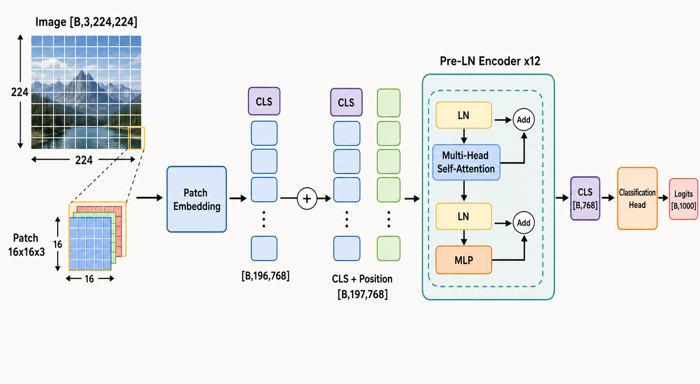

# Vision Transformer：从图像 Patch 到全局视觉表示

## 资料与学习目标

- 相关论文：[An Image is Worth 16x16 Words: Transformers for Image Recognition at Scale](https://arxiv.org/abs/2010.11929)
- 主题：标准 Vision Transformer（ViT）图像分类流程
- 目标：理解一张二维图像怎样变成 token 序列，各模块为什么存在，张量形状如何变化，以及如何用 PyTorch 写出与公式对应的核心模型。

本文合并了原对话的两轮讲解。第二轮主要澄清“通道是否参与 Patch 数量计算”和“一个 Patch 为什么是一个 token”，相关内容已经融合进 Patch 与 Token 小节，不再重复展开。

## 一句话理解 ViT

ViT 先把图像按空间位置切成固定大小的 Patch，把每个 Patch 映射成一个向量 token，再用 Transformer Encoder 建模所有 Patch 之间的关系，最后用全局表示完成分类。

$$\mathrm{Image}\rightarrow\mathrm{Patch}\rightarrow\mathrm{PatchEmbedding}\rightarrow\mathrm{CLS+Position}\rightarrow\mathrm{TransformerEncoder}\rightarrow\mathrm{Prediction}$$

它真正完成的转换不是“把图片交给 Transformer”这么简单，而是：

$$\mathrm{spatial\ image}\rightarrow\mathrm{token\ sequence}\rightarrow\mathrm{contextualized\ tokens}\rightarrow\mathrm{global\ representation}$$



> 图：标准 ViT 图像分类的信息流。重点观察 Patch Embedding 前后的形状、`CLS + Position` 后增加的序列长度，以及 Encoder 内部两个 Pre-LN 残差子层。AI 生成示意图，仅用于解释结构，不是原论文图或实验结果。

## 1. 为什么要把图片切成 Patch

设一批 RGB 图像采用 PyTorch 的通道优先格式：

$$X\in\mathbb{R}^{B\times C\times H\times W}$$

其中：

- $B$：batch size；
- $C$：通道数，RGB 图像中 $C=3$；
- $H,W$：图像高度和宽度；
- $P$：正方形 Patch 的边长；
- $D$：Transformer 的隐藏维度；
- $N$：每张图像的 Patch 数量。

如果直接把每个像素当成 token，一张 $224\times224$ 图像会产生 $50176$ 个 token。Self-Attention 需要构造 $N\times N$ 的注意力矩阵，其主要复杂度近似为：

$$O(N^2D)$$

逐像素处理会让注意力矩阵包含约 $2.5\times10^9$ 个元素。ViT 因此选择中间粒度：一个局部空间区域对应一个视觉 token。

当 $H=W=224$、$P=16$ 时，Patch 数量为：

$$N=\frac{H}{P}\times\frac{W}{P}=\frac{224}{16}\times\frac{224}{16}=14\times14=196$$

这里最容易混淆的是通道维度。Patch 切分只发生在 $H$ 和 $W$ 两个空间维度，因此不是 $14\times14\times3$ 个 Patch。每一个 Patch 自身都包含完整的 RGB 通道：

$$\mathrm{Patch}_i\in\mathbb{R}^{P\times P\times C}=\mathbb{R}^{16\times16\times3}$$

所以，一个 Patch 内有：

$$P^2C=16\times16\times3=768$$

个原始像素值。通道数决定每个 Patch 的内容维度，而不决定 Patch 的数量。

## 2. 一个 Patch 怎样成为一个 Token

“一个 Patch 是一个 token”并不意味着一个 Patch 被压缩成一个标量。Transformer 中的一个 token 是一个向量。

第 $i$ 个 Patch 先被展平：

$$x_p^i\in\mathbb{R}^{P^2C}$$

再通过可学习的线性投影矩阵：

$$E\in\mathbb{R}^{P^2C\times D}$$

得到视觉 token：

$$z_i=x_p^iE,\qquad z_i\in\mathbb{R}^{D}$$

所有 Patch 组成的序列为：

$$Z_{patch}\in\mathbb{R}^{B\times N\times D}$$

因此，“196 个 token”的完整含义是 $196$ 个 $D$ 维向量，而不是 196 个数。当 $D=768$ 时，单张图像对应的张量是 $196\times768$。

### 为什么还要做线性投影

展平后的 $P^2C$ 维向量仍由原始 RGB 值组成。线性层学习的是从像素坐标空间到模型特征空间的映射：

$$\mathbb{R}^{P^2C}\rightarrow\mathbb{R}^{D}$$

即使在 ViT-B/16 中恰好有 $P^2C=D=768$，投影前后的数字维度相同，语义也不同：前者是原始像素值，后者是可供 Transformer 使用的学习表示。把 $D$ 改成 512 时，这一点会更直观：

$$196\times768\rightarrow196\times512$$

### 为什么代码中常用卷积实现

实际实现通常用下面的卷积同时完成“不重叠切块”和“线性投影”：

```python
nn.Conv2d(
    in_channels=3,
    out_channels=D,
    kernel_size=P,
    stride=P,
)
```

- `kernel_size=P`：每次覆盖一个 $P\times P$ 空间区域，并自动读取全部 $C$ 个输入通道；
- `stride=P`：每次移动一个 Patch 的宽度，因此相邻区域不重叠；
- `out_channels=D`：用 $D$ 个卷积核把每个 Patch 投影为 $D$ 维特征。

形状变化为：

$$[B,3,224,224]\rightarrow[B,D,14,14]\rightarrow[B,D,196]\rightarrow[B,196,D]$$

这与分别执行 `patchify -> flatten -> linear` 在运算意义上等价，但实现更高效。

## 3. 分类 Token 与位置编码

### 分类 Token

ViT 在 Patch 序列开头加入一个可学习的分类 token：

$$[x_{class};z_1;z_2;\cdots;z_N]$$

序列长度由 $N$ 变成 $N+1$。在 ViT-B/16 中，196 个 Patch 加一个分类 token，共 197 个 token。

`CLS` 初始时不包含图像内容，但它会在每一层 Self-Attention 中读取其他 token 的信息。经过多层交互后，它成为面向分类任务学习到的全局图像表示。它不是固定的平均池化，而是一个参与注意力计算、由任务目标共同训练的信息汇聚节点。

### 位置编码

Self-Attention 本身对输入排列具有置换等变性：如果只重新排列 token，注意力不会凭空知道每个 Patch 原本位于左上、中央还是右下。因此需要给每个序列位置加入位置信息。

标准 ViT 使用可学习的位置嵌入：

$$E_{pos}\in\mathbb{R}^{1\times(N+1)\times D}$$

Encoder 的输入为：

$$Z_0=[x_{class};x_p^1E;x_p^2E;\cdots;x_p^NE]+E_{pos}$$

当输入为 $224\times224$、Patch 为 $16\times16$、$D=768$ 时：

$$Z_0\in\mathbb{R}^{B\times197\times768}$$

位置向量与内容向量相加后，shape 不变。模型可以在后续训练中联合利用“这里有什么”和“它大约在哪里”。

## 4. Transformer Encoder 的模块边界

原始 ViT Encoder 采用 Pre-LN。第 $l$ 层包含两个残差子层：

$$Z_l'=Z_{l-1}+\mathrm{MSA}(\mathrm{LN}(Z_{l-1}))$$

$$Z_l=Z_l'+\mathrm{MLP}(\mathrm{LN}(Z_l'))$$

这两个公式对应三类不同职责：

| 模块 | 主要作用 | 是否在 token 之间交换信息 |
|---|---|---|
| LayerNorm | 对每个 token 的特征维度做归一化，稳定训练 | 否 |
| Multi-Head Self-Attention | 根据内容动态汇聚其他 token 的信息 | 是 |
| MLP | 对每个 token 的内部特征做非线性变换 | 否 |
| Residual | 保留旧表示并改善深层梯度传播 | 不单独产生信息交换 |

可以把 Attention 和 MLP 的边界记成：

- Attention：token 与 token 之间的“横向交流”；
- MLP：每个 token 内部的“纵向加工”。

### LayerNorm

对一个 $D$ 维 token $x$，均值和方差为：

$$\mu=\frac{1}{D}\sum_{i=1}^{D}x_i,\qquad\sigma^2=\frac{1}{D}\sum_{i=1}^{D}(x_i-\mu)^2$$

归一化并进行可学习的仿射变换：

$$y_i=\gamma_i\frac{x_i-\mu}{\sqrt{\sigma^2+\epsilon}}+\beta_i$$

LayerNorm 独立处理每个样本、每个 token 的最后一个特征维度，不依赖 batch 内其他样本。

### Scaled Dot-Product Attention

输入 $Z\in\mathbb{R}^{B\times T\times D}$，其中 $T=N+1$。通过三个线性映射得到：

$$Q=ZW_Q,\qquad K=ZW_K,\qquad V=ZW_V$$

单个注意力头计算：

$$\mathrm{Attention}(Q,K,V)=\mathrm{softmax}\left(\frac{QK^T}{\sqrt{d_k}}\right)V$$

- Query：当前 token 想寻找什么；
- Key：当前 token 可以被怎样匹配；
- Value：被关注时真正提供的内容；
- $QK^T$：任意两个 token 的匹配分数，shape 为 $T\times T$；
- $\sqrt{d_k}$：控制点积随维度增大而变大的尺度，避免 Softmax 过早饱和；
- Softmax：把每一行分数归一化成当前 Query 对所有 Key 的权重；
- 乘以 $V$：按权重汇聚其他 token 的内容。

Self-Attention 让左上角 Patch 在一层内就能直接读取右下角 Patch，这是它与局部卷积的重要差异。但“可以全局交互”不等于每个头必然学习到人类可解释的对象关系，具体模式由数据和训练目标决定。

### Multi-Head Self-Attention

将 $D$ 维表示分成 $h$ 个注意力头，每头维度通常为：

$$d_k=\frac{D}{h}$$

各个头在不同的可学习子空间中独立计算注意力，再拼接并投影：

$$\mathrm{MSA}(Z)=\mathrm{Concat}(head_1,\ldots,head_h)W_O$$

ViT-B 常用 $D=768$、$h=12$，所以每个头的维度为 64。不同头可能形成不同关联模式，但“边缘头”“颜色头”等名字只是可能的事后解释，不是人为固定的职责。

### MLP

MLP 对序列中的每个 token 使用同一套参数，常把通道维度扩张到 $4D$ 后再压回 $D$：

$$\mathrm{MLP}(x)=W_2\,\mathrm{GELU}(W_1x+b_1)+b_2$$

典型形状为：

$$D\rightarrow4D\rightarrow D$$

它不会混合不同 token 的位置维度；跨区域信息交换已经由 Attention 完成。

## 5. 从输入到输出的完整形状链

以 ViT-B/16 和 ImageNet 1000 类分类为例：

| 阶段 | 操作 | 输出 shape |
|---|---|---|
| 输入 | RGB 图像 | `[B, 3, 224, 224]` |
| Patch 投影 | `Conv2d(3, 768, 16, 16)` | `[B, 768, 14, 14]` |
| 展平空间网格 | `flatten(2)` | `[B, 768, 196]` |
| 转为序列 | `transpose(1, 2)` | `[B, 196, 768]` |
| 加入 `CLS` | 序列首部拼接 | `[B, 197, 768]` |
| 加位置编码 | 逐元素相加 | `[B, 197, 768]` |
| Encoder 乘 12 | Attention 与 MLP | `[B, 197, 768]` |
| 取 `CLS` | `x[:, 0]` | `[B, 768]` |
| 分类头 | `Linear(768, 1000)` | `[B, 1000]` |

Encoder 内部保持 $[B,T,D]$ 不变，变化的是每个 token 所包含的信息。随着层数增加，Patch token 由局部像素区域的表示逐渐变成融合全局上下文的表示。

## 6. 核心 PyTorch 代码

下面是一份与上述公式和 shape 对应的最小完整实现。它保留 ViT 的核心路径，省略数据增强、DropPath、混合精度、训练循环和位置编码插值等工程功能。

```python
import torch
from torch import nn


class PatchEmbedding(nn.Module):
    """[B, C, H, W] -> [B, N, D]"""

    def __init__(self, image_size=224, patch_size=16,
                 in_channels=3, embed_dim=768):
        super().__init__()
        if image_size % patch_size != 0:
            raise ValueError("image_size must be divisible by patch_size")

        self.grid_size = image_size // patch_size
        self.num_patches = self.grid_size ** 2
        self.projection = nn.Conv2d(
            in_channels=in_channels,
            out_channels=embed_dim,
            kernel_size=patch_size,
            stride=patch_size,
        )

    def forward(self, x):
        x = self.projection(x)   # [B, D, H/P, W/P]
        x = x.flatten(2)         # [B, D, N]
        x = x.transpose(1, 2)    # [B, N, D]
        return x


class EncoderBlock(nn.Module):
    """Pre-LN Transformer Encoder block."""

    def __init__(self, embed_dim=768, num_heads=12,
                 mlp_ratio=4.0, dropout=0.0):
        super().__init__()
        hidden_dim = int(embed_dim * mlp_ratio)

        self.norm1 = nn.LayerNorm(embed_dim)
        self.attention = nn.MultiheadAttention(
            embed_dim=embed_dim,
            num_heads=num_heads,
            dropout=dropout,
            batch_first=True,
        )

        self.norm2 = nn.LayerNorm(embed_dim)
        self.mlp = nn.Sequential(
            nn.Linear(embed_dim, hidden_dim),
            nn.GELU(),
            nn.Dropout(dropout),
            nn.Linear(hidden_dim, embed_dim),
            nn.Dropout(dropout),
        )

    def forward(self, x):
        # Z' = Z + MSA(LN(Z))
        normalized = self.norm1(x)
        attention_output, _ = self.attention(
            normalized, normalized, normalized,
            need_weights=False,
        )
        x = x + attention_output

        # Z_next = Z' + MLP(LN(Z'))
        x = x + self.mlp(self.norm2(x))
        return x


class VisionTransformer(nn.Module):
    def __init__(self, image_size=224, patch_size=16,
                 in_channels=3, num_classes=1000,
                 embed_dim=768, depth=12, num_heads=12,
                 mlp_ratio=4.0, dropout=0.0):
        super().__init__()
        self.patch_embedding = PatchEmbedding(
            image_size=image_size,
            patch_size=patch_size,
            in_channels=in_channels,
            embed_dim=embed_dim,
        )

        num_patches = self.patch_embedding.num_patches
        self.cls_token = nn.Parameter(torch.zeros(1, 1, embed_dim))
        self.position_embedding = nn.Parameter(
            torch.zeros(1, num_patches + 1, embed_dim)
        )
        self.input_dropout = nn.Dropout(dropout)

        self.blocks = nn.Sequential(*[
            EncoderBlock(
                embed_dim=embed_dim,
                num_heads=num_heads,
                mlp_ratio=mlp_ratio,
                dropout=dropout,
            )
            for _ in range(depth)
        ])

        self.final_norm = nn.LayerNorm(embed_dim)
        self.classifier = nn.Linear(embed_dim, num_classes)
        self._initialize_parameters()

    def _initialize_parameters(self):
        nn.init.trunc_normal_(self.cls_token, std=0.02)
        nn.init.trunc_normal_(self.position_embedding, std=0.02)
        nn.init.trunc_normal_(self.classifier.weight, std=0.02)
        nn.init.zeros_(self.classifier.bias)

    def forward_features(self, images):
        x = self.patch_embedding(images)  # [B, N, D]
        batch_size = x.shape[0]

        cls = self.cls_token.expand(batch_size, -1, -1)
        x = torch.cat((cls, x), dim=1)     # [B, N+1, D]
        x = self.input_dropout(x + self.position_embedding)

        x = self.blocks(x)                 # [B, N+1, D]
        x = self.final_norm(x)
        return x[:, 0]                     # [B, D]

    def forward(self, images):
        cls_representation = self.forward_features(images)
        return self.classifier(cls_representation)


if __name__ == "__main__":
    model = VisionTransformer()
    images = torch.randn(2, 3, 224, 224)
    logits = model(images)
    print(logits.shape)  # torch.Size([2, 1000])
```

### 代码与数学公式的对应关系

| 代码 | 数学含义 |
|---|---|
| `Conv2d(kernel_size=P, stride=P)` | $x_p^iE$，同时完成切块与线性投影 |
| `torch.cat((cls, x), dim=1)` | $[x_{class};x_p^1E;\ldots;x_p^NE]$ |
| `x + position_embedding` | 加入 $E_{pos}$ |
| `attention(normalized, normalized, normalized)` | Self-Attention 中 $Q,K,V$ 都来自同一序列 |
| `x + attention_output` | $Z_l'=Z_{l-1}+\mathrm{MSA}(\mathrm{LN}(Z_{l-1}))$ |
| `x + mlp(norm2(x))` | $Z_l=Z_l'+\mathrm{MLP}(\mathrm{LN}(Z_l'))$ |
| `x[:, 0]` | 取最终 `CLS` 全局表示 |
| `classifier(cls_representation)` | 将全局表示映射到类别 logits |

训练分类模型时通常直接把 logits 和整数类别标签交给交叉熵损失：

```python
criterion = nn.CrossEntropyLoss()
labels = torch.tensor([3, 8])
loss = criterion(logits, labels)
loss.backward()
```

`CrossEntropyLoss` 接收未经过 Softmax 的 logits；不需要先手动调用 `softmax`。

## 7. Patch 大小的核心权衡

Patch size 决定视觉 token 的粒度。对固定分辨率图像：

$$N=\frac{HW}{P^2}$$

注意力计算量随 $N^2$ 增长，因此可近似看出它对 Patch 边长具有很强的反比关系：

$$N^2=\frac{H^2W^2}{P^4}$$

- 较大的 Patch：token 少、计算便宜，但细粒度空间信息更容易丢失；
- 较小的 Patch：细节丰富，但序列更长，Attention 的时间和显存开销迅速增加。

以 $224\times224$ 输入为例：

| Patch size | 网格 | Token 数（不含 `CLS`） | 注意力矩阵边长 |
|---|---:|---:|---:|
| 32 | $7\times7$ | 49 | 49 |
| 16 | $14\times14$ | 196 | 196 |
| 8 | $28\times28$ | 784 | 784 |

ViT-B/16 中的 `/16` 就表示 Patch size 为 16；`B` 表示 Base 规模，典型配置为 12 层、隐藏维度 768、12 个注意力头。

## 8. ViT 与 CNN 的关键差异

| 维度 | CNN | 标准 ViT |
|---|---|---|
| 基本单元 | 像素局部邻域 | Patch token |
| 交互范围 | 从局部卷积逐层扩大感受野 | 每层允许任意 token 直接交互 |
| 权重共享 | 卷积核跨空间共享 | Attention/MLP 跨 token 共享投影规则 |
| 视觉先验 | 强局部性、平移等变等 | 显式视觉先验较弱 |
| 数据需求 | 较强先验有利于较小数据集 | 原始 ViT 通常更依赖大规模预训练 |
| 主要瓶颈 | 深层卷积和特征图计算 | Self-Attention 的序列二次复杂度 |

“全局 Attention”不意味着 ViT 在任何规模的数据上都会优于 CNN。原始 ViT 的局部结构先验较弱，需要从数据中学习边缘、纹理、部件和空间关系；这既提供了扩展潜力，也带来更高的数据和训练要求。

## 9. 局限、假设与容易误解的地方

### 输入尺寸与位置编码

最小代码把可学习位置编码的长度固定为训练时的 $N+1$。如果推理图像分辨率变化，Patch 数也会变化，不能直接相加；实际模型通常对二维 Patch 网格的位置编码做插值，或采用其他位置表示。

### Patch 边界会造成早期信息分割

非重叠 Patch Embedding 在第一步就把图像划成固定网格。跨 Patch 边界的细节需要在后续层中重新建立联系。更小 Patch、重叠 Patch 或分层结构可以缓解这一问题，但会改变计算量或模型结构。

### Attention 权重不等于完整解释

Attention 矩阵描述某一层、某一头中的加权汇聚关系，但不能单独证明模型“因为某个区域而做出预测”。解释模型行为还需要结合多层传播、Value 向量、MLP、残差路径和独立验证方法。

### `CLS` 不是唯一的池化方式

标准 ViT 使用 `CLS`，但视觉模型也可以使用 Patch token 的平均池化或其他聚合方法。`CLS` 的优势是让模型学习一个任务相关的汇聚查询，而不是简单固定平均；最终效果仍需实验比较。

### 分类准确率不等于通用视觉理解

分类头只优化给定标签空间中的预测。较高分类准确率不能直接推出定位、分割、生成、因果理解或分布外鲁棒性同样较强。

## 10. 复习主线

先记住形状：

$$[B,3,224,224]\rightarrow[B,196,768]\rightarrow[B,197,768]\rightarrow[B,768]\rightarrow[B,1000]$$

再记住职责：

1. Patch：在空间粒度与注意力成本之间折中。
2. Patch Embedding：把每个 $P\times P\times C$ 像素块映射成一个 $D$ 维视觉 token。
3. Position Embedding：补充 Patch 的序列位置和间接空间位置。
4. `CLS`：提供可学习的全局信息汇聚节点。
5. Self-Attention：让不同图像区域交换信息。
6. Multi-Head：在多个可学习子空间中并行建模关系。
7. MLP：加工每个 token 的内部特征。
8. Residual 与 LayerNorm：稳定深层信息和梯度传播。
9. Classification Head：把全局表示映射到任务标签。

最后用一句话检查自己是否真的理解：

> ViT 中的 196 表示 token 的数量；每个 token 都是一个 $D$ 维向量。RGB 的 3 个通道属于每个 Patch 的内部内容，不会把 Patch 数量再乘以 3。

## 11. 下一步学习问题

- 用 4 个 Patch、每个 token 3～4 维的数值例子，手算 $Q$、$K$、$V$、$QK^T$、Softmax 和加权求和。
- 比较 `CLS` 与 mean pooling 在信息汇聚方式上的区别。
- 研究位置编码怎样把一维 token 顺序与二维 Patch 网格关联起来。
- 比较标准 ViT、DeiT、Swin Transformer、MAE 和 DINO 对数据效率、局部性或训练目标的改进。
