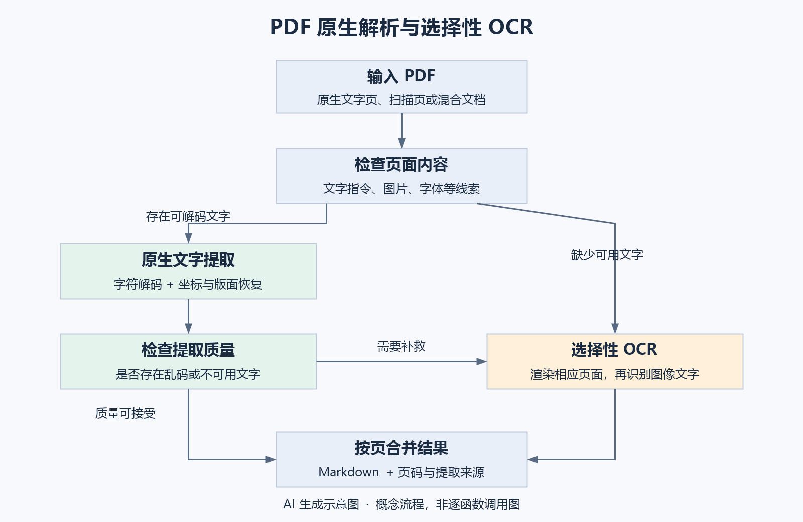

# pdf-inspector：PDF 原生解析与选择性 OCR

## 1. 学习主题与核心认识

**pdf-inspector 是 Firecrawl 开源的 Rust PDF 检测与提取工具，采用 MIT 许可证，提供 Python、Node.js、Rust 和命令行等使用方式。** 它可以检查 PDF 中的文字与图片信息，直接提取可用的原生文字，并恢复部分版面结构、输出 Markdown。[1]

理解这个工具，首先需要区分两件事：**直接解析文件中的文字数据**，以及**通过 OCR 从图像中识别文字**。OCR 是 Optical Character Recognition，即光学字符识别。

有些 PDF 已经保存了可解码的文字，直接解析就能获取内容；另一些 PDF 主要保存扫描或拍照得到的图片，需要从像素中识别文字。将所有页面都转换为图片再识别，会对原本可以直接读取的页面增加不必要的工作。

pdf-inspector 值得关注的思路是：**先利用 PDF 已有的信息，检查其是否可用，再对需要补救的页面选择 OCR。** 本笔记以一份包含文字正文和扫描附件的报告为例，介绍其原理、技术组成和能力边界，不展开源码算法或部署步骤。

## 2. 外观相似的 PDF，内部内容可能不同

PDF 是一种页面描述格式，可以同时容纳文字、图片和矢量图形。两个页面看起来相同，不意味着内部保存的数据相同。

| 内容形式 | 常见来源 | 获取文字的方法 |
| --- | --- | --- |
| 原生文字与绘制信息 | Word 导出、网页打印、论文排版 | 解析文字编码、字体和位置 |
| 页面图片 | 拍照或扫描后生成 PDF | 通常需要 OCR |
| 文字页与图片页混合 | 合并文件、带扫描附件的报告 | 按页面选择处理路径 |
| 图片加隐藏文字层 | 已经过 OCR 的扫描件 | 可尝试读取已有文字层，但需检查质量 |

例如，在 Word 中输入“中文”并导出 PDF，文件中通常仍保留文字编码、字体及位置。如果把写有“中文”的纸拍照后放进 PDF，文件主要保存的是照片的像素和压缩数据。

这里的区别不是“图片没有编码”。**图片也以编码数据存储；关键在于保存的是可还原字符的信息，还是描述视觉外观的图像数据。**

### 2.1 字符、字形与像素

以汉字“中”为例：

- **字符**：抽象的文字身份，即“这是一个中”。
- **字形**：字体如何画出这个字，例如宋体和黑体具有不同形状。
- **像素**：字形最终显示或拍摄后形成的颜色点阵。

原生文字提取利用字符编码及字体映射；OCR 则根据视觉形状推测字符。两者获取信息的起点不同。

还有一种特殊情况：文字被转换为矢量轮廓，也称“文字转曲”。它放大后仍然清晰，但内部可能只剩曲线和填充，没有可解码的文字。因此，**放大不模糊并不能证明文字可直接提取**。[2]

### 2.2 直接提取文字不是新发明

已有 PDF 库早就支持原生文字提取，pypdf 官方文档也明确区分原生 PDF、扫描 PDF 和带 OCR 文字层的 PDF。[3]

OCR 本身是图像识别方法；是否把所有 PDF 都先渲染为图片，是处理流程的选择。pdf-inspector 的主要价值在于把检测、提取、版面恢复和选择性 OCR 组织成方便使用的工具，而不是首次提出“PDF 可以直接读取文字”。

## 3. 整体流程：先解析，再对问题页面补救

假设一份报告有 100 页，其中 90 页是软件导出的正文，10 页是扫描附件。合理的处理方式是先解析正文，对扫描附件进行 OCR，再按页合并结果。



*图 1：AI 生成示意图。展示原生提取与选择性 OCR 的两条处理路径；“质量检查”强调有文字数据不等于提取结果可靠。图中是用于理解的流程概括，不是逐个源码函数的调用图。*

工具需要回答两个问题：

1. **页面中有没有可用的文字信息？** 检查文字显示指令、图片、字体等特征。
2. **提取出来的文字是否可靠？** 检查解码问题、疑似乱码等信号。

项目区分文字型、扫描型、图像为主和混合型文档，并返回需要 OCR 的页面等诊断信息。类别是根据文件特征推断的结果，不能绝对还原文档的制作历史；分类置信分数也不能视为文字提取准确率。[2]

当前项目还提供可选的选择性 OCR 集成。原生提取无需 OCR 模型；实际路由到 OCR 的页面则需要相应的页面渲染器、识别运行时和模型。因此，“无需 OCR”主要描述原生文字解析路径，而不是所有 PDF 都能完全绕过 OCR。[4]

## 4. 关键技术概览

### 4.1 内容流解析：读取页面的绘制指令

PDF 通常不按文章的自然阅读顺序保存完整正文，而是描述怎样画出页面。页面的**内容流（Content Stream）**中包含设置字体、移动位置、显示文字、绘制图形和调用图片等操作。

下面是简化的教学示例：

```text
BT
/F1 12 Tf
72 720 Td
(Hello PDF) Tj
ET
```

它大致表示：开始绘制文字，使用 F1 字体和 12 号字，移动到指定位置，显示 `Hello PDF`，结束文字绘制。

解析器需要持续记录当前字体、字号、位置、间距和变换；遇到文字显示指令时，结合这些状态生成文字项。这个过程可以用**状态机**来理解：读取操作、更新状态、产生结果。项目的内容流模块采用这一类处理方式。[5]

真实 PDF 的一句话可能被拆成多个片段，甚至逐字定位，因此还需要后续的合并与版面分析。

### 4.2 字体映射：将内部编号还原为文字

PDF 内部的文字编码不一定直接等于 Unicode。某个编号可能只是特定字体中的字形索引。阅读器能找到字形并画对页面，而文字提取器还需要知道该字形对应哪个字符。

**ToUnicode CMap** 可以理解成字体中的“文字对照表”，用于将内部代码映射到 Unicode 字符。pdf-inspector 实现了相关映射解析。[6]

映射缺失或错误时，页面可能显示正常，但复制或提取出来的内容却是乱码。这解释了为什么“存在文字显示指令”并不等于“文字可正确读取”，也解释了原生文字页面有时仍需要 OCR 补救。

### 4.3 版面恢复：把文字片段组织成阅读顺序

读出字符之后，还要恢复行、段落和栏目。对于双栏论文，简单按页面高度排序，可能把左右栏的行交错输出；正确的顺序通常是先读完左栏，再读右栏。

项目利用文字位置进行分栏和分行，其中包括统计页面横向的文字覆盖情况，寻找持续的空白栏间隙；还使用简化的 XY-cut 方法作为后备划分策略。XY-cut 可以直观理解为利用足够大的空白间隔切分页面区域。[7]

这些方法主要利用几何规律，不必依赖模型才能工作。但跨栏标题、侧栏、脚注和报纸式布局会增加判断难度。

### 4.4 标题与表格恢复：从排版线索推断结构

PDF 不一定明确记录“这是二级标题”或“这是表格第三列”，工具需要从排版中寻找线索。

| 对象 | 可利用的线索 | 主要限制 |
| --- | --- | --- |
| 标题 | 字号、加粗、出现频率及行的排版 | 大字号或粗体也可能属于正文装饰 |
| 有边框表格 | 矩形、边框及网格关系 | 绘图或背景可能产生干扰 |
| 无边框表格 | 文字反复出现的行列对齐 | 目录、表单和列表也可能具有类似排列 |

标题分析会利用字体统计；表格检测则同时使用绘图信息与文字对齐规则。[8][9]

矩形表格检测中使用的**并查集（Union-Find）**是一种经典分组算法：如果 A 与 B 相关、B 与 C 相关，就可以将三者归入同一组，用于形成候选表格区域。这里不需要深入算法实现，只需理解它帮助程序把分散图形聚合起来。[10]

有些带标签的 PDF 还保存了明确的结构树，包括标题、段落、表格等角色；项目提供读取结构元素的接口。利用明确标签与根据外观推断结构，是两种不同的信息来源。[11]

### 4.5 质量检查与路由：选择适合的处理方式

“得到一个字符串”不能作为处理成功的唯一标准。一页正文可能只提取出页码，字符映射也可能产生乱码。工具需要根据内容和质量信号决定是否补救。

**路由**在这里指选择后续处理路径，例如原生解析或 OCR。项目会合并检测阶段与提取阶段发现的问题，记录相关页面的 OCR 原因。[12]

按页保留提取来源也很有价值：后续检查能够知道某页使用了原生提取、OCR 或融合结果。当前接口提供相关来源信息。[11]

区域级处理是更细的一种方向，但不能把当前自动按页 OCR 路由直接理解成自动识别任意图片区域。对于本工具的入门学习，掌握按页选择路径即可。

## 5. 如何理解性能与宣传描述

邮件中的几个描述需要结合条件阅读。

- **约 54% 的 PDF 不需要 OCR**：这是项目介绍给出的比例，不能直接推广到所有资料集合。软件导出的报告与历史扫描档案，会有不同的原生文字占比。
- **约 20 毫秒检测**：描述快速检测阶段，不等于整份文档提取或 OCR 的耗时。
- **200 份 PDF 不到 5 秒**：项目公布的基准对应特定语料、硬件、版本和配置，且关闭了 OCR，不能视为扫描件处理速度或所有工具的普遍排名。[1]
- **保留公式**：提取数学字符与上下标，不等于可靠恢复任意复杂公式的 LaTeX 结构。分式、矩阵和积分需要额外恢复数学关系，不能仅凭宣传描述认定其效果。

Rust 适合实现高效的文件解析核心，但“无需 OCR”的根本原因是 PDF 已有可用的文字信息。换成其他语言实现，仍然可以采用同样的处理思路。

## 6. 适用范围与能力边界

pdf-inspector 适合作为文档处理流程中的前置解析器，尤其适用于具有原生文字的报告、论文、发票和业务文档。输出的结构化文字可以继续用于搜索、摘要和检索增强生成（RAG）。

实际使用时，仍应区分三层能力：

1. **内容解析**：恢复字符及其位置。
2. **版面和结构恢复**：恢复阅读顺序、标题、列表和表格。
3. **语义理解**：解释论点、业务规则、图表含义或数学关系。

原生提取主要解决前两层问题，不会自动理解全部文档。纯扫描内容、损坏字体映射、复杂表格、复杂公式以及图像中的信息，仍需要补充识别或人工检查。

本笔记依据官方文档、部分源码与概念讲解整理，未在本地安装工具，也未用实际 PDF 验证解析质量。源码和接口会随版本变化；具体应用效果需要以真实文件为准。

## 7. 复习主线

理解 pdf-inspector，保留以下四点即可：

- **PDF 外观与内部表示不是一回事**：文字、图片和矢量轮廓可以产生相近外观。
- **直接提取与 OCR 的信息起点不同**：前者解析已有文字，后者从视觉形状识别字符。
- **读出字符之后还需要恢复结构**：坐标、字体、边框和对齐关系用于重建可读内容。
- **处理路径应由内容与质量决定**：优先利用已有信息，对问题页面补救，并保留来源。

其工程价值在于组织好已有的解析与识别技术，减少不必要的识别工作，同时让处理结果更方便后续使用和检查。

## 参考资料

资料核对日期：2026-09-29。链接指向官方项目或文档，仓库主分支内容可能继续更新。

1. [Firecrawl：pdf-inspector 项目介绍与基准](https://github.com/firecrawl/pdf-inspector)
2. [PDF 分类与 OCR 诊断源码](https://github.com/firecrawl/pdf-inspector/blob/main/src/detector.rs)
3. [pypdf：PDF 文字提取与不同文档类型](https://pypdf.readthedocs.io/en/stable/user/extract-text.html)
4. [pdf-inspector：OCR 运行环境说明](https://github.com/firecrawl/pdf-inspector/blob/main/docs/ocr-runtime.md)
5. [PDF 内容流解析源码](https://github.com/firecrawl/pdf-inspector/blob/main/src/extractor/content_stream.rs)
6. [ToUnicode 字符映射源码](https://github.com/firecrawl/pdf-inspector/blob/main/src/tounicode.rs)
7. [分栏、分行与阅读顺序源码](https://github.com/firecrawl/pdf-inspector/blob/main/src/extractor/layout.rs)
8. [字体与标题分析源码](https://github.com/firecrawl/pdf-inspector/blob/main/src/markdown/analysis.rs)
9. [启发式表格检测源码](https://github.com/firecrawl/pdf-inspector/blob/main/src/tables/detect_heuristic.rs)
10. [矩形表格检测与并查集源码](https://github.com/firecrawl/pdf-inspector/blob/main/src/tables/detect_rects.rs)
11. [Python API 与返回类型说明](https://github.com/firecrawl/pdf-inspector/blob/main/docs/python.md)
12. [提取流程与文字质量检查源码](https://github.com/firecrawl/pdf-inspector/blob/main/src/lib.rs)
