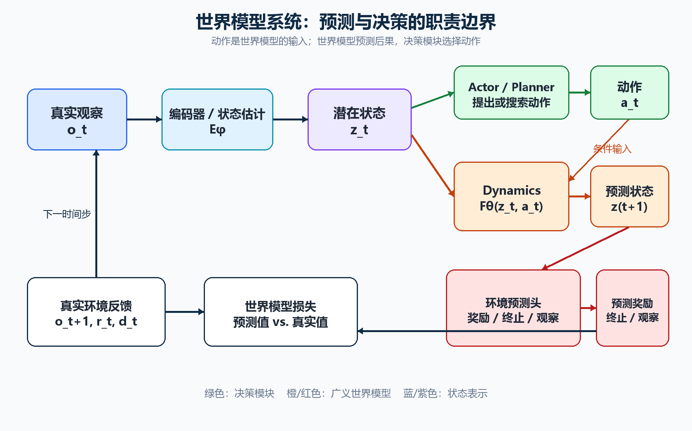
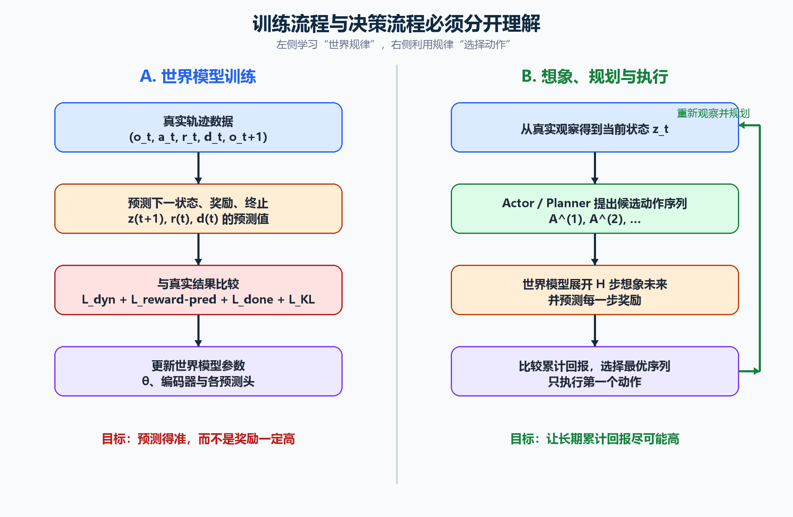
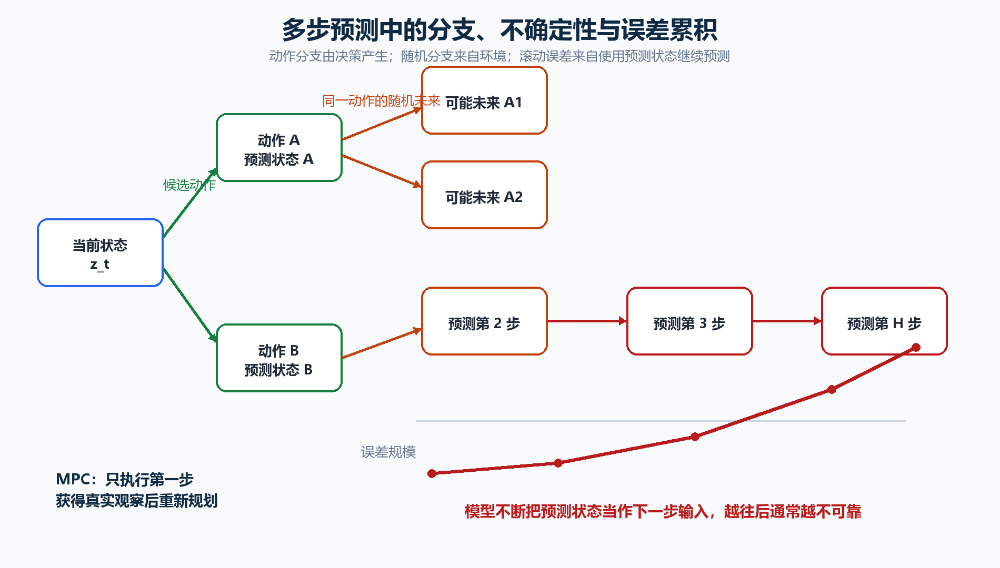

---
aliases:
  - World Model
  - 世界模型详解
tags:
  - 人工智能
  - 世界模型
  - 强化学习
  - 表示学习
---

# 世界模型（World Model）详解

## 阅读目标

世界模型相关资料容易把环境建模、强化学习、规划、视频生成和表示学习混在一起。理解这一主题的关键不是记住某一种网络，而是始终区分下面四个问题：

1. **现在的世界是什么状态？**——状态表示或状态估计。
2. **采取某个动作后会发生什么？**——世界模型中的动态预测。
3. **这个结果对任务而言好不好？**——奖励函数或奖励模型。
4. **综合长期结果，现在应该怎么做？**——Actor、Critic 与 Planner。

最重要的结论是：

> 世界模型负责预测“做了某个动作后会发生什么”；奖励模型负责评价“这个结果好不好”；规划器负责比较“哪个方案更好”；策略负责决定“现在采取什么动作”。

因此，**世界模型训练的主要目标是把世界预测准确，而策略与规划的目标才是让长期回报尽可能高**。

## 一、世界模型的定义与本质

世界模型是智能体内部对环境运行规律的近似模型。它根据当前状态、动作和必要的历史信息，预测环境下一步或未来多步可能发生的变化。

最基础的状态转移模型是：

$$p(s_{t+1}\mid s_t,a_t)$$

其中，$s_t$ 是时刻 $t$ 的环境状态，$a_t$ 是智能体执行的动作，$s_{t+1}$ 是动作执行后的下一状态。

在工程实践中，世界模型还可能同时预测奖励、终止信号和下一观察：

$$p(s_{t+1},r_t,d_t,o_{t+1}\mid s_t,a_t)$$

这里统一约定：$r_t$ 和 $d_t$ 都是执行 $a_t$、从 $s_t$ 转移到 $s_{t+1}$ 时产生的结果。

世界模型的本质可以从三个角度理解：

- **环境预测器**：学习世界怎样随时间和动作变化。
- **内部模拟器**：不必在真实环境中执行，就可以先预测不同动作的后果。
- **可预测结构的压缩表示**：不需要复制真实世界全部细节，只需保留支持预测和决策的信息。

因此，世界模型不等于“逼真的视频生成器”。视频生成可以是世界模型的输出形式，但画面逼真并不自动意味着动作后果、物体永久性、碰撞规律和长程因果关系都是正确的。

## 二、为什么需要世界模型

### 2.1 提高真实交互的样本效率

无模型强化学习直接从真实环境试错学习策略。对于机器人、自动驾驶和工业控制，这会面临成本高、速度慢、危险动作不能随便尝试、极端情况难以覆盖等问题。

世界模型先从真实轨迹学习环境规律，再在内部生成“想象轨迹”。策略可以在这些想象轨迹上训练，从而减少真实环境交互。

### 2.2 支持多步规划

一个动作是否有价值，往往要在很多步之后才能判断。例如机器人抓杯子，需要先接近、避障、调整姿态、闭合夹爪，最后才能看到任务是否成功。

世界模型允许智能体预测不同动作序列：

$$A^{(i)}=(a_t^{(i)},a_{t+1}^{(i)},\ldots,a_{t+H-1}^{(i)})$$

再比较每条预测轨迹的长期结果。

### 2.3 进行反事实推演

真实世界在一个时间点只能执行一个动作，因此只能观察一条真实轨迹。世界模型可以回答没有真正发生的反事实问题：

- 如果汽车继续加速会怎样？
- 如果改为刹车会怎样？
- 如果机器人从另一侧抓取会怎样？

### 2.4 处理高维、部分可观测的环境

真实输入可能是图像、视频、激光雷达、音频、触觉和本体传感器。这些观察既高维，又不等于完整环境状态。世界模型需要把观察压缩为内部状态，并利用历史推断当前看不见的信息。

## 三、基础变量和符号

| 符号                      | 含义                                |
| ----------------------- | --------------------------------- |
| $t$                     | 当前时间步                             |
| $o_t$                   | 时刻 $t$ 实际获得的观察，例如图像或传感器数据         |
| $s_t$                   | 环境完整真实状态，通常不能被智能体直接观测             |
| $z_t$                   | 从观察中提取的潜在状态，即模型内部的压缩表示            |
| $h_t$                   | 保存历史信息的确定性记忆状态                    |
| $a_t$                   | 时刻 $t$ 执行的动作                      |
| $r_t$                   | 执行 $a_t$ 后得到的真实环境奖励               |
| $d_t$                   | 终止标记，通常 $d_t=1$ 表示轨迹结束            |
| $c_t$                   | 继续标记，通常 $c_t=1-d_t$               |
| $H$                     | 向未来展开的步数，即预测或规划时域                 |
| $\gamma$                | 折扣因子，控制远期奖励的权重                    |
| $\hat{x}$               | 模型对变量 $x$ 的预测值                    |
| $\theta$                | 动态模型或广义世界模型的参数                    |
| $\phi$                  | 编码器或策略的参数，需结合具体公式判断               |
| $\psi$                  | 奖励模型或价值模型的参数，需结合上下文判断             |
| $\lambda_i$             | 不同损失项的加权系数                        |
| $\pi(a\mid z)$          | 策略在状态 $z$ 下选择动作 $a$ 的概率           |
| $V(z)$                  | 从状态 $z$ 出发的预期长期累计回报               |
| $p_\theta$              | 模型预测的概率分布，常用于动态先验                 |
| $q_\phi$                | 看到真实观察后推断的概率分布，常用于后验              |
| $\mathbb{E}[\cdot]$     | 对随机变量求期望                          |
| $\arg\max$              | 找出使目标函数最大的输入                      |
| $D_{\mathrm{KL}}(q\|p)$ | 衡量两个概率分布差异的 KL 散度                 |
| $\mathrm{sg}(x)$        | stop-gradient：前向使用 $x$，反向传播不更新该路径 |

必须特别区分：

$$s_t\neq o_t\neq z_t$$

以自动驾驶为例：$s_t$ 是道路中所有物体的完整物理状态；$o_t$ 是摄像头、雷达等传感器实际测到的信息；$z_t$ 是模型根据当前与历史观察推断出的内部表示。

## 四、完整系统的模块边界

*图 1：世界模型、状态表示和决策模块的职责边界。绿色部分负责提出或选择动作，橙色和红色部分根据给定动作预测后果，蓝色与紫色部分负责把真实观察转换成内部状态。AI 生成示意图。*

### 4.1 编码器与状态估计器

编码器把高维观察压缩为潜在状态：

$$z_t=E_\phi(o_t)$$

如果当前一帧不足以确定完整状态，就必须结合历史：

$$z_t=E_\phi(o_{\leq t},a_{<t})$$

编码器要保留的不是所有像素细节，而是对未来预测和任务决策有用的信息，例如物体位置、速度、遮挡前状态、可操作性和危险程度。

### 4.2 动态模型

动态模型是狭义世界模型的核心。确定性形式为：

$$\hat z_{t+1}=F_\theta(z_t,a_t)$$

概率形式为：

$$\hat z_{t+1}\sim p_\theta(z_{t+1}\mid z_t,a_t)$$

概率形式允许同一个状态和动作对应多个合理未来。例如行人面对同样的车辆动作，仍可能向左、向右或停下。

### 4.3 奖励函数与奖励模型

奖励回答的是“结果对任务而言好不好”，而不是“世界模型预测得准不准”。一般形式为：

$$r_t=R(s_t,a_t,s_{t+1})$$

奖励可能有三种来源：

1. **人工规则**：到达目标加分、碰撞扣分、能耗扣分。
2. **环境直接返回**：游戏分数、任务成功标记等。
3. **学习得到的奖励模型**：从真实奖励数据或人类偏好中学习。

在想象轨迹中，真实环境没有被执行，因此需要奖励预测：

$$\hat r_t=R_\psi(z_t,a_t,\hat z_{t+1})$$

### 4.4 终止或继续模型

终止模型预测轨迹是否已经结束：

$$\hat d_t=P_\eta(d_t=1\mid z_t,a_t)$$

也可以预测继续概率：

$$\hat c_t=P_\eta(c_t=1\mid z_t,a_t)$$

如果没有这一模块，模型可能在已经撞车、死亡或任务完成之后继续生成虚假未来和奖励。

### 4.5 Actor、Planner 与 Critic

Actor 根据当前状态直接产生动作或动作分布：

$$a_t\sim\pi_\xi(a_t\mid z_t)$$

Planner 则提出多个候选动作或动作序列，调用世界模型预测其后果，再进行比较。Planner 可以是树搜索、随机采样、Cross-Entropy Method、动态规划或模型预测控制，而不一定是神经网络。

Critic 估计长期价值：

$$V_\nu(z_t)=\mathbb{E}\left[\sum_{k=0}^{\infty}\gamma^k r_{t+k}\right]$$

Actor 回答“现在采取什么动作”，Planner 回答“候选方案中哪个更好”，Critic 回答“从这个状态继续下去长期值多少”。

## 五、狭义世界模型与广义世界模型

狭义世界模型只指状态转移：

$$p_\theta(z_{t+1}\mid z_t,a_t)$$

广义世界模型还可能包含观察、奖励和终止预测：

$$p_\theta(z_{t+1},o_{t+1},r_t,d_t\mid z_t,a_t)$$

两种口径都可以使用，但必须在文章或论文中先确认作者的定义。即使采用广义定义，Actor 和 Planner 通常仍属于世界模型之外的决策模块。

更稳妥的层级是：

$$\text{完整智能体}=\text{世界模型}+\text{Actor/Planner}+\text{Critic}$$

## 六、训练数据是什么

世界模型最典型的数据是交互轨迹：

$$\tau=(o_1,a_1,r_1,d_1,o_2,a_2,r_2,d_2,\ldots,o_T)$$

训练时常把轨迹切分成转移样本：

$$\mathcal D=\{(o_t,a_t,r_t,d_t,o_{t+1})\}$$

数据可以来自：

- 随机策略探索；
- 已有策略或人类示范；
- 游戏和机器人模拟器；
- 真实机器人与自动驾驶传感器；
- 在线交互过程中不断扩充的经验回放池；
- 没有显式动作标签的视频，此时需要额外学习潜在动作或只建模自然动态。

数据覆盖范围决定了世界模型的可靠范围。如果训练数据没有覆盖某些高速、碰撞、新场景或新动作组合，模型在这些分布外状态上的预测不能被默认信任。

## 七、世界模型的训练与决策流程

*图 2：左侧使用真实轨迹和预测误差训练世界模型，右侧利用已经学到的环境规律展开未来、比较长期回报并执行动作。两侧目标不同，更新的参数也不同。AI 生成示意图。*

### 7.1 训练世界模型：学习世界规律

第一步，从真实观察推断潜在状态：

$$z_t=E_\phi(o_t)$$

第二步，根据当前状态和真实动作预测下一状态：

$$\hat z_{t+1}=F_\theta(z_t,a_t)$$

第三步，把真实下一观察编码成训练目标：

$$z_{t+1}=E_\phi(o_{t+1})$$

第四步，比较预测与真实结果并更新世界模型。训练目标是预测准确，而不是要求样本中的奖励必须为正。

### 7.2 想象、规划与执行：利用世界规律选择动作

Planner 或 Actor 从当前潜在状态提出候选动作序列：

$$A^{(i)}=(a_t^{(i)},a_{t+1}^{(i)},\ldots,a_{t+H-1}^{(i)})$$

世界模型沿每个序列向未来展开：

$$\hat z_{t+k+1}^{(i)}=F_\theta(\hat z_{t+k}^{(i)},a_{t+k}^{(i)})$$

预测回报可以写为：

$$\hat G_t^{(i)}=\sum_{k=0}^{H-1}\gamma^k\hat r_{t+k}^{(i)}+\gamma^H V(\hat z_{t+H}^{(i)})$$

前半部分是规划时域内的预测奖励，最后一项用 Critic 估计规划时域之外的剩余价值。Planner 选择：

$$A^*=\arg\max_{A^{(i)}}\hat G_t^{(i)}$$

在模型预测控制中，通常只执行最优序列的第一个动作：

$$a_t=a_t^{*,0}$$

然后获得新的真实观察，再重新进行规划。这样可以不断用真实环境修正世界模型的滚动误差。

## 八、RSSM 中的确定性状态、随机状态、先验与后验

Dreamer 一类世界模型常使用循环状态空间模型 RSSM，同时维护确定性历史状态 $h_t$ 和随机潜在状态 $z_t$。

确定性状态负责汇总历史：

$$h_t=f_\theta(h_{t-1},z_{t-1},a_{t-1})$$

训练时，模型可以看到当前真实观察，因此使用后验：

$$q_\phi(z_t\mid h_t,o_t)$$

想象未来时看不到尚未发生的真实观察，只能使用动态先验：

$$p_\theta(z_t\mid h_t)$$

KL 损失让先验接近后验：

$$L_{\mathrm{KL}}=D_{\mathrm{KL}}\left(q_\phi(z_t\mid h_t,o_t)\|p_\theta(z_t\mid h_t)\right)$$

直观上，这一项要求“只根据历史猜出的状态分布”接近“看到真实观察后推断出的状态分布”。否则模型可能在训练时依赖真实观察，却在没有未来观察的想象阶段迅速漂移。

## 九、世界模型的损失函数

世界模型没有统一损失。典型广义损失可以写为：

$$L_{\mathrm{WM}}=\lambda_oL_{\mathrm{obs}}+\lambda_zL_{\mathrm{dyn}}+\lambda_rL_{\mathrm{reward-pred}}+\lambda_dL_{\mathrm{done}}+\lambda_{\mathrm{KL}}L_{\mathrm{KL}}+\lambda_{\mathrm{reg}}L_{\mathrm{reg}}$$

### 总损失公式中的符号说明

上式表示：训练世界模型时，不只检查一种预测结果，而是把多个训练目标加权后形成一个标量损失。优化器最终最小化的是这个总损失。

| 符号 | 名称 | 具体含义 |
|---|---|---|
| $L_{\mathrm{WM}}$ | 世界模型总损失 | 所有世界模型训练目标的加权和。它是优化器实际用于更新世界模型参数的整体目标，数值越小通常表示模型在当前定义的训练任务上拟合得越好。下标 $\mathrm{WM}$ 是 World Model 的缩写。 |
| $\lambda_o$ | 观察损失权重 | 控制观察重建或观察预测在总损失中的影响程度。下标 $o$ 表示 observation。 |
| $L_{\mathrm{obs}}$ | 观察损失 | 衡量预测观察 $\hat o_t$ 与真实观察 $o_t$ 的差异。它可以是图像像素均方误差、离散图像 token 的交叉熵，也可以是观察负对数似然。 |
| $\lambda_z$ | 动态损失权重 | 控制潜在状态预测在总损失中的影响程度。下标 $z$ 表示 latent state，即潜在状态。 |
| $L_{\mathrm{dyn}}$ | 动态预测损失 | 衡量动态模型预测的下一潜在状态 $\hat z_{t+1}$ 与由真实下一观察得到的目标状态 $z_{t+1}$ 之间的差异。下标 $\mathrm{dyn}$ 是 dynamics 的缩写。 |
| $\lambda_r$ | 奖励预测损失权重 | 控制奖励预测准确性对共享表示和世界模型参数的影响。下标 $r$ 表示 reward。 |
| $L_{\mathrm{reward-pred}}$ | 奖励预测损失 | 衡量预测奖励 $\hat r_t$ 与真实奖励 $r_t$ 的差异。这里惩罚的是“奖励有没有预测准确”，而不是“奖励值是否足够高”。 |
| $\lambda_d$ | 终止预测损失权重 | 控制终止或继续预测在总损失中的影响程度。下标 $d$ 表示 done。 |
| $L_{\mathrm{done}}$ | 终止预测损失 | 衡量模型对轨迹终止标记 $d_t$ 的预测是否正确，通常使用二元交叉熵。若模型预测继续概率 $c_t$，这一项也可能写成 $L_{\mathrm{continue}}$。 |
| $\lambda_{\mathrm{KL}}$ | KL 损失权重 | 控制动态先验与观察后验对齐的强度。权重过小可能导致想象状态与真实观察状态不一致，过大则可能压制潜在表示中的有效信息。 |
| $L_{\mathrm{KL}}$ | KL 散度损失 | 衡量后验 $q_\phi(z_t\mid h_t,o_t)$ 与先验 $p_\theta(z_t\mid h_t)$ 的差异，使模型在没有未来真实观察时仍能从历史预测合理状态。 |
| $\lambda_{\mathrm{reg}}$ | 正则项权重 | 控制正则化约束的影响程度。下标 $\mathrm{reg}$ 是 regularization 的缩写。 |
| $L_{\mathrm{reg}}$ | 正则化损失 | 不是某一个固定公式，而是额外的稳定性约束，例如参数权重衰减、潜在表示方差约束、协方差约束、熵约束或防止表示坍塌的损失。 |

所有 $\lambda$ 都是非负权重超参数，通常由研究者设定，而不是模型从训练数据中自动学习。它们有三个作用：

1. 平衡不同损失项的数值尺度。例如图像重建误差可能远大于二元终止损失，直接相加会让前者完全支配训练。
2. 调整不同训练目标对共享表示的影响。例如增加 $\lambda_r$，会促使潜在状态保留更多与任务奖励有关的信息。
3. 启用或关闭某类目标。令某个权重为零，就相当于不使用对应损失。

加号表示这些损失在同一次优化中被汇总，但不代表每一种世界模型都必须包含全部六项。例如：

- 不重建像素的表示式世界模型可以不使用 $L_{\mathrm{obs}}$；
- 环境没有奖励标签时，可以不使用 $L_{\mathrm{reward-pred}}$；
- 非概率的确定性动态模型可能不使用 $L_{\mathrm{KL}}$；
- 没有 episode 终止概念的数据可以不使用 $L_{\mathrm{done}}$。

如果把批次和时间维度显式写出来，总损失通常还会对样本和时间步求平均：

$$L_{\mathrm{WM}}=\frac{1}{BT}\sum_{b=1}^{B}\sum_{t=1}^{T}\left(\lambda_oL_{\mathrm{obs}}^{(b,t)}+\lambda_zL_{\mathrm{dyn}}^{(b,t)}+\lambda_rL_{\mathrm{reward-pred}}^{(b,t)}+\lambda_dL_{\mathrm{done}}^{(b,t)}+\lambda_{\mathrm{KL}}L_{\mathrm{KL}}^{(b,t)}+\lambda_{\mathrm{reg}}L_{\mathrm{reg}}^{(b,t)}\right)$$

其中，$B$ 是一个训练批次中的轨迹或序列数量，$T$ 是每段训练序列包含的时间步数，$b$ 是批次样本编号，$t$ 是序列内部的时间步编号，上标 $(b,t)$ 表示该损失来自第 $b$ 个样本的第 $t$ 个时间步。

如果用 $\Theta_{\mathrm{WM}}$ 统一表示编码器、Dynamics 和各预测头的全部可训练参数，那么训练目标可以写成：

$$\Theta_{\mathrm{WM}}^*=\arg\min_{\Theta_{\mathrm{WM}}}\mathbb{E}_{\tau\sim\mathcal D}\left[L_{\mathrm{WM}}(\tau;\Theta_{\mathrm{WM}})\right]$$

其中，$\Theta_{\mathrm{WM}}^*$ 表示训练完成后得到的最优参数，$\mathcal D$ 是真实交互轨迹数据集，$\tau$ 是从数据集采样的一段轨迹，$\mathbb{E}$ 表示对不同训练轨迹求期望，$\arg\min$ 表示寻找能使总损失最小的参数。

### 9.1 观察重建损失

如果需要还原图像或传感器观察：

$$\hat o_t=D_\rho(z_t)$$

可以使用均方误差：

$$L_{\mathrm{obs}}=\|o_t-\hat o_t\|_2^2$$

也可以最大化条件似然：

$$L_{\mathrm{obs}}=-\log p_\rho(o_t\mid z_t)$$

重建损失有助于保留观察信息，但可能迫使模型花费能力预测光照、纹理和随机背景等与决策无关的细节。

### 9.2 潜在动态预测损失

如果直接预测表示：

$$L_{\mathrm{dyn}}=\|\hat z_{t+1}-\mathrm{sg}(z_{t+1})\|_2^2$$

停止梯度可以防止目标表示被预测器随意拖动。不过仅使用表示距离可能出现表示坍塌，即所有输入都被编码成同一个常量，因此还需要目标编码器、方差约束、协方差约束、对比学习或其他防坍塌设计。

### 9.3 奖励预测损失

连续奖励可使用：

$$L_{\mathrm{reward-pred}}=(\hat r_t-r_t)^2$$

这项损失衡量的是奖励预测是否准确，而不是奖励本身是否高。真实奖励为 $-100$、预测奖励为 $-99.9$ 时，奖励预测损失仍然很小。

### 9.4 终止预测损失

对于二值终止标记，可以使用二元交叉熵：

$$L_{\mathrm{done}}=-d_t\log\hat d_t-(1-d_t)\log(1-\hat d_t)$$

### 9.5 自回归与扩散式损失

如果状态或视频被离散为 token，自回归模型使用：

$$L_{\mathrm{AR}}=-\sum_t\log p_\theta(x_{t+1}\mid x_{\leq t},a_{\leq t})$$

如果使用扩散模型预测未来，常见噪声预测损失为：

$$L_{\mathrm{diff}}=\mathbb{E}\left[\|\epsilon-\epsilon_\theta(z_\tau,\tau,c)\|_2^2\right]$$

其中 $\tau$ 是扩散噪声时间步，$c$ 是当前状态、动作、历史帧、地图或文本等条件。

## 十、Actor 与 Critic 的损失不属于世界预测损失

Actor 希望最大化累计回报。写成最小化问题时：

$$L_{\mathrm{Actor}}=-\mathbb{E}[G_t]$$

如果加入策略熵以鼓励探索：

$$L_{\mathrm{Actor}}=-\mathbb{E}[G_t+\alpha\mathcal H(\pi(\cdot\mid z_t))]$$

Critic 则希望价值估计接近回报目标：

$$L_{\mathrm{Critic}}=\left(V_\nu(z_t)-\mathrm{sg}(G_t^{\mathrm{target}})\right)^2$$

三类训练目标必须分开：

| 训练对象 | 它要解决的问题 | 主要优化目标 | 通常更新的参数 |
|---|---|---|---|
| 世界模型 | 世界会发生什么 | 预测状态、观察、奖励和终止是否准确 | 编码器、Dynamics、预测头 |
| Actor | 应该采取什么动作 | 长期累计回报是否更高 | 策略参数 |
| Critic | 当前状态长期值多少 | 价值估计是否接近回报目标 | 价值网络参数 |

在实现中可以把它们写成一个形式上的总目标，但梯度往往被有意阻断，使 Actor 的目标不会随意修改世界模型。否则 Actor 与世界模型可能通过内部表示共同“作弊”，而不是更加符合真实环境。

## 十一、多步预测、多种未来与长程问题

*图 3：绿色分支表示 Planner 尝试不同动作，橙色分支表示同一动作也可能对应多个随机未来；红色曲线表示滚动预测中误差通常随预测长度增加。MPC 通过只执行第一步并重新观察真实环境降低风险。AI 生成示意图。*

### 11.1 多步预测

多步预测是沿同一条动作序列递归展开：

$$z_t\rightarrow\hat z_{t+1}\rightarrow\hat z_{t+2}\rightarrow\cdots\rightarrow\hat z_{t+H}$$

### 11.2 候选动作导致的分支

Planner 主动提出不同动作序列：

$$A^{(1)},A^{(2)},A^{(3)}$$

这些分支来自智能体的选择空间。

### 11.3 环境随机性导致的分支

即使给定同一个动作，未来也可能不唯一：

$$z_{t+1}\sim p_\theta(z_{t+1}\mid z_t,a_t)$$

这些分支来自环境的不确定性。它与“Planner 尝试多个动作”是两种不同来源的多种未来。

### 11.4 长程依赖

长程依赖是“当前预测是否需要记住较早信息”。例如杯子被遮挡后，模型仍需保留它之前的位置：

$$o_{t-k}\rightarrow h_t\rightarrow\hat z_{t+1}$$

它主要考验记忆与状态估计。

### 11.5 长程误差

长程误差是“连续预测很多步后，误差是否不断累积”。第二步开始，动态模型使用自己的预测作为输入：

$$\hat z_{t+2}=F_\theta(\hat z_{t+1},a_{t+1})$$

如果第一步已经有误差，后续预测就从错误状态出发。预测越远，通常越不可靠。

长程依赖和长程误差彼此相关，但不能混为一谈：前者讨论模型是否记住过去，后者讨论模型向未来滚动时是否逐渐漂移。

## 十二、预测准确与结果好坏的关键反例

假设世界模型准确预测：

> 汽车继续加速会撞上障碍物，奖励为 $-100$。

由于预测与真实结果一致，世界模型损失很低：

$$L_{\mathrm{WM}}\approx0$$

但该动作的长期回报很差：

$$G_t\ll0$$

因此 Actor 或 Planner 应避免这个动作。

这说明同一个预测结果可以同时满足：

- 对世界模型而言是**预测成功**；
- 对决策模块而言是**动作失败**。

所以不能把“奖励低”直接解释为“世界模型训练损失高”，也不能额外构造一个笼统的“动作是否正确损失”。在强化学习中，动作是否合适通常由长期回报间接定义，而不是由每个状态下的标准答案标签定义。

## 十三、世界模型与动态规划、路径规划的关系

传统规划往往假设状态转移规则已经给定：

$$s_{t+1}=f(s_t,a_t)$$

例如棋类规则、网格移动规则或已知物理方程。规划器不需要从数据学习 $f$，只需用它搜索动作。

真实机器人通常不知道完整物理规律，因此从数据学习近似函数：

$$\hat s_{t+1}=f_\theta(s_t,a_t)$$

通过训练得到：

$$\theta^*=\arg\min_\theta\sum_t D\left(f_\theta(s_t,a_t),s_{t+1}\right)$$

两类公式看起来相似，是因为都描述“当前状态与动作怎样产生下一状态”。区别在于转移函数的来源：

- 传统规划中的 $f$ 由规则、程序或物理方程给定；
- 世界模型中的 $f_\theta$ 从数据学习，只是真实环境的近似；
- Planner 使用给定的 $f$ 或学到的 $f_\theta$ 搜索动作。

路径规划只是世界模型可以支持的一类下游任务。现实机器人还要预测抓取、接触、摩擦、遮挡和物体交互，因此世界模型的范围通常比几何路径搜索更广。

## 十四、生成式与表示式世界模型

### 14.1 生成式世界模型

生成式模型预测完整观察：

$$\hat o_{t+1}=D_\rho(\hat z_{t+1})$$

优点是未来可以直接可视化，也可以作为视频模拟器；缺点是需要预测大量与控制无关的细节，而且视觉逼真不保证物理和因果正确。

### 14.2 表示式世界模型

表示式模型主要预测抽象潜在表示：

$$\hat z_{t+1}\approx z_{t+1}$$

它可以忽略随机纹理和光照，更关注物体、关系、运动和任务语义，但难以直接观察模型学到了什么，也需要防止表示坍塌。

JEPA 类方法体现了在抽象表示空间预测目标的思路。需要注意，单图像 I-JEPA 本身主要是表示学习架构；若要成为用于控制的动作条件世界模型，还需要时间动态、动作输入、奖励或任务评价以及决策机制。

这两个方向并非互斥。一个系统可以同时预测潜在状态、奖励、终止信号，并解码部分观察用于训练或检查。

## 十五、经典结构的演进

### 15.1 经典 World Models：V、M、C

经典结构通常概括为：

$$\mathrm{V}+\mathrm{M}+\mathrm{C}$$

- $\mathrm{V}$：视觉模型，使用 VAE 等方法把图像压缩成潜在状态。
- $\mathrm{M}$：记忆或动态模型，使用循环网络预测潜在状态随动作的变化。
- $\mathrm{C}$：控制器，根据潜在状态和记忆状态选择动作。

它的重要思想是：策略可以使用世界模型的内部状态行动，甚至可以在动态模型生成的“梦境环境”中训练。

### 15.2 Dreamer：RSSM 与想象式 Actor-Critic

Dreamer 类系统通常包含：

- RSSM 动态模型；
- 观察、奖励与继续预测头；
- Actor；
- Critic；
- 在潜在空间中展开的想象轨迹。

它不需要显式搜索大量动作树，而是用 Actor 在世界模型中产生动作，并利用想象回报训练 Actor 与 Critic。

### 15.3 JEPA：在表示空间预测

JEPA 不要求恢复目标区域的每一个像素，而是预测目标区域或未来的抽象表示。这种思路试图让模型把能力集中在可预测、语义化的信息上，而不是不可预测的低层细节。

## 十六、模型利用与分布外风险

Planner 会主动寻找世界模型预测回报最高的区域。如果模型在训练数据之外错误地预测“速度越高奖励无限增加”，Planner 就可能选择极端动作来利用这个错误。

这称为模型利用或模型偏差利用。它不是奖励模型和规划器“联合产生恶意”，而是优化器发现了预测模型的漏洞。

常见缓解方法包括：

- 限制规划动作范围；
- 缩短想象长度；
- 使用多个世界模型估计不确定性；
- 对分布外状态或高不确定状态施加惩罚；
- 使用保守目标；
- 更频繁地回到真实环境获取观察；
- 用新策略访问到的数据持续更新经验池和世界模型。

## 十七、二维小车示例

假设小车状态为坐标：

$$s_t=(x_t,y_t)$$

动作集合为：

$$a_t\in\{\text{上},\text{下},\text{左},\text{右}\}$$

动态模型预测：

$$\hat s_{t+1}=F_\theta(s_t,a_t)$$

奖励规则为：

$$r_t=\begin{cases}10,&\text{到达目标位置}\\-5,&\text{撞到障碍物}\\-0.1,&\text{普通移动}\end{cases}$$

Planner 可以尝试“右、右、上”和“上、右、右”等动作序列，用世界模型预测每条路径，再计算：

$$\hat G_t=\sum_{k=0}^{H-1}\gamma^k\hat r_{t+k}$$

最终选择预测回报最高的序列，只执行第一步，再根据真实新位置重新规划。

现实世界模型仍遵循同一逻辑，只是：

- 坐标状态变成高维潜在状态；
- 手写规则变成神经网络动态模型；
- 唯一确定未来变成概率分布；
- 上下左右变成连续机器人控制；
- 坐标观察变成图像、视频和多模态传感器。

## 十八、阅读世界模型论文时的检查清单

面对一篇新的世界模型论文，可以依次回答：

1. 输入是原始观察、潜在 token，还是显式状态？
2. 是否显式使用动作作为条件？动作是已知标签还是潜在变量？
3. 预测的是像素、离散 token、连续表示还是概率分布？
4. 模型是否同时预测奖励和终止？
5. 使用什么历史记忆机制处理部分可观测性？
6. 训练时后验能看到什么，想象时先验能看到什么？
7. 世界模型损失、Actor 损失和 Critic 损失分别更新哪些参数？
8. 多种未来来自不同候选动作，还是环境本身的随机性？
9. 模型采用显式 Planner、MPC，还是想象式 Actor-Critic？
10. 如何处理长程误差、模型利用和分布外预测？
11. 评价指标测量的是画面质量、状态预测、不确定性校准，还是实际控制成功率？

## 十九、最终总结

世界模型可以定义为：

> 一个从交互轨迹中学习环境内部状态及其转移规律的模型。它把高维观察转换成可预测的潜在状态，根据当前状态和给定动作预测未来状态、奖励及终止结果，使智能体能够在内部模拟未来、比较动作并减少真实环境中的试错。

整个系统可以压缩成四层：

$$o_{\leq t},a_{<t}\rightarrow z_t$$

第一层回答“现在的世界是什么状态”。

$$z_t,a_t\rightarrow\hat z_{t+1},\hat r_t,\hat d_t$$

第二层回答“采取这个动作会发生什么”。

$$\hat z_{t+k},\hat r_{t+k}\rightarrow\hat G_t$$

第三层回答“这条未来轨迹长期来看有多好”。

$$a_t^*=\arg\max_a\mathbb E[G_t]$$

第四层回答“现在应该采取什么动作”。

最值得反复记忆的边界是：

> **世界模型学习世界规律；奖励定义任务偏好；策略利用奖励学习行动；规划器借助世界模型比较未来。**

## 后续学习建议

建议沿“可运行的潜在动态模型 → 决策算法 → 不确定性与现实部署”继续：

1. **实现一个最小 RSSM**：在简单控制环境中分别打印确定性状态、随机状态、先验、后验、奖励预测和终止预测，验证训练路径与想象路径使用的信息不同。
2. **深入 Dreamer 的想象式 Actor-Critic**：把世界模型损失、Actor 损失和 Critic 损失的梯度边界画清楚，并比较它与显式 MPC/CEM 规划的计算方式。
3. **研究模型不确定性和 model exploitation**：尝试模型集成、分布外检测、悲观价值估计或短视野重规划，观察为何预测误差会被 Planner 主动放大。
4. **比较生成式与表示式路线**：以视频扩散世界模型和 JEPA 类表示预测为代表，比较它们在画面生成、控制充分性和长程一致性上的不同目标。
5. **最后进入真实机器人或具身任务**：重点关注多传感器状态估计、动作延迟、安全约束和 sim-to-real，而不仅是离线视频预测质量。

## 参考资料

1. David Ha, Jürgen Schmidhuber. [World Models](https://arxiv.org/abs/1803.10122), 2018.
2. Danijar Hafner et al. [Learning Latent Dynamics for Planning from Pixels](https://arxiv.org/abs/1811.04551), 2019.
3. Danijar Hafner et al. [Dream to Control: Learning Behaviors by Latent Imagination](https://arxiv.org/abs/1912.01603), 2019.
4. Danijar Hafner et al. [Mastering Diverse Domains through World Models](https://arxiv.org/abs/2301.04104), 2023.
5. Mahmoud Assran et al. [Self-Supervised Learning from Images with a Joint-Embedding Predictive Architecture](https://arxiv.org/abs/2301.08243), 2023.
