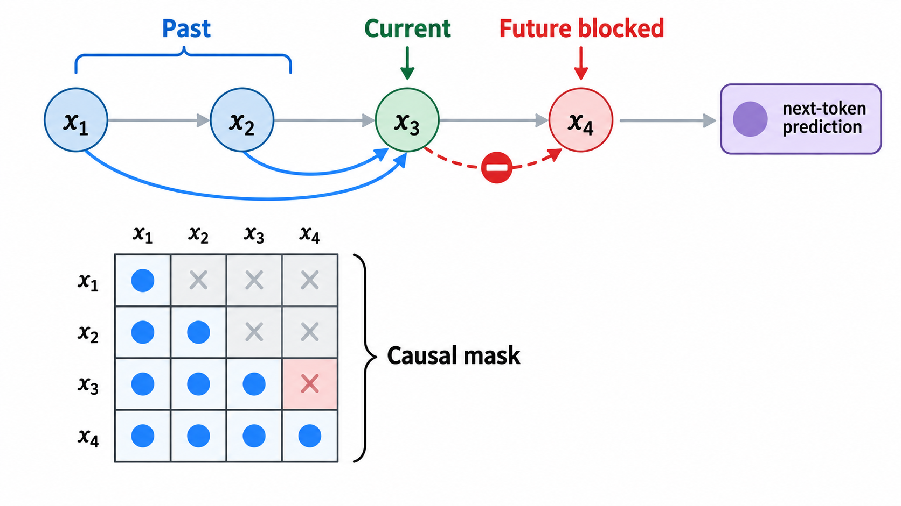

# 因果注意力机制详解

## 学习目标与主线

因果注意力（causal attention）是自回归 Transformer 的核心约束：在位置 $t$ 计算表示时，模型只能使用当前位置及其之前的信息，不能读取未来位置。它解决的是序列生成或预测中的**未来信息泄露**问题。

这篇笔记沿着“普通自注意力为何不满足预测要求 → 因果掩码如何改变计算 → 为什么训练可以并行而生成不能 → 如何落到代码”这条主线展开。读完后，应能写出因果掩码、判断一个注意力层是否泄露未来，并理解它在训练与推理阶段的不同表现。

## 1. 从序列概率到信息访问约束

给定离散序列 $x_1, x_2, \ldots, x_T$ ，自回归模型将联合概率分解为：

$$P(x_1, x_2, \ldots, x_T) = P(x_1) P(x_2 \mid x_1) \cdots P(x_T \mid x_1, x_2, \ldots, x_{T - 1})$$

其中 $x_{<t}$ 表示位置 $t$ 之前的全部元素。实际训练常让位置 $t$ 的隐藏状态预测下一个元素，即学习 $P(x_{t+1} \mid x_{\leq t})$ 。无论采用哪一种等价的移位记法，关键都相同：用于预测的表示不能含有目标本身或更晚位置的信息。

例如，要根据“今天 天气”预测下一个词，模型可以利用这两个已知词，但不能在内部提前读取正确答案。时间序列预测也完全相同：时刻 $t$ 的特征不得使用 $t+1$ 及之后的观测。

这里的“因果”指**信息的时间方向**，而不是因果推断中“干预导致结果变化”的因果关系。它表达的是“过去可以影响未来，未来不能反向提供信息”。

## 2. 普通自注意力为什么会泄露未来

令输入嵌入矩阵为 $X \in \mathbb{R}^{T \times d_{\mathrm{model}}}$ 。一层注意力先得到查询、键和值：

$$Q = XW_Q, \quad K = XW_K, \quad V = XW_V$$

其中 $Q, K \in \mathbb{R}^{T \times d_k}$ ， $V \in \mathbb{R}^{T \times d_v}$ 。未加限制的缩放点积注意力为：

$$\mathrm{Attention}(Q,K,V) = \mathrm{softmax}\left(\frac{QK^\top}{\sqrt{d_k}}\right)V$$

令分数矩阵为 $S = QK^\top / \sqrt{d_k}$ 。其第 $t$ 行包含位置 $t$ 对所有键位置的打分。因此，普通自注意力中位置 $t$ 可以访问从 $1$ 到 $T$ 的所有元素，包括未来的 $t+1, \ldots, T$ 。

这对理解整段文本很有用，却不适合按时间生成。例如，如果位置 $3$ 在训练时直接利用位置 $4$ 的内容来预测位置 $4$ ，损失会看起来很低，但推理时位置 $4$ 尚未生成，模型也就失去了这条捷径。

## 3. 因果掩码如何工作

因果掩码是一个 $T \times T$ 的下三角可见性矩阵。以长度 $4$ 为例，在加到分数前可写作：

$$M = \begin{bmatrix}0 & -\infty & -\infty & -\infty \\ 0 & 0 & -\infty & -\infty \\ 0 & 0 & 0 & -\infty \\ 0 & 0 & 0 & 0\end{bmatrix}$$

带掩码的注意力为：

$$\mathrm{CausalAttention}(Q,K,V) = \mathrm{softmax}\left(\frac{QK^\top}{\sqrt{d_k}} + M\right)V$$

被遮住位置加上 $-\infty$ 后，softmax 中对应的指数项为零，因此注意力权重也为零。第 $t$ 行只会对列 $1$ 到 $t$ 分配概率质量。

| 查询位置 | 可见位置 | 不可见位置 |
| --- | --- | --- |
| 1 | 1 | 2 到 4 |
| 2 | 1 到 2 | 3 到 4 |
| 3 | 1 到 3 | 4 |
| 4 | 1 到 4 | 无 |

从矩阵角度看，掩码只允许主对角线及其下方的元素参与 softmax；上三角元素永远没有权重。注意，主对角线通常是可见的：位置 $t$ 可以使用自己的输入嵌入；预测下一个元素则由输出标签的右移来保证。



图：因果注意力的可见性与未来信息阻断。位置 $x_3$ 可以汇总 $x_1, x_2, x_3$ 的信息，但通往 $x_4$ 的未来连接被因果掩码阻断。AI 生成示意图，用于解释下三角可见性约束。

## 4. 多层网络为什么仍然不会泄露

仅第一层加掩码并不足够；每一层自注意力都必须是因果的。原因可以用归纳法说明。

第一层满足：

$$h_t^{(1)} = f_1(x_{\leq t})$$

假设第 $l-1$ 层的每个位置 $i$ 只依赖 $x_{\leq i}$ 。第 $l$ 层中位置 $t$ 只能聚合 $h_1^{(l-1)}, \ldots, h_t^{(l-1)}$ ，而这些状态的输入范围都不超过 $x_{\leq t}$ 。故：

$$h_t^{(l)} = f_l(x_{\leq t})$$

由此，任意深度的最终状态 $h_t^{(L)}$ 都不含未来信息。这也解释了为什么残差连接、前馈网络和层归一化不会破坏因果性：它们只在同一位置上变换已有状态，并不引入新的未来位置连接。

## 5. 训练并行，生成串行

因果约束不等于训练必须逐个位置计算。训练时，完整的目标序列已知，可以一次性计算整个 $QK^\top$ 矩阵、一次性施加掩码，并同时得到所有位置的预测。以输入 $[x_1,x_2,x_3,x_4]$ 为例，同一次前向传播可并行产生：

$$h_1 \rightarrow x_2, \quad h_2 \rightarrow x_3, \quad h_3 \rightarrow x_4$$

损失通常是各位置交叉熵的平均或求和：

$$\mathcal{L} = -\frac{1}{T-1}\sum_{t=1}^{T-1}\log P_\theta(x_{t+1} \mid x_{\leq t})$$

推理时却不同。未来元素尚不存在，必须先采样或选择 $\hat{x}_{t+1}$ ，把它追加到上下文，再计算下一个位置。因此生成顺序是串行的。实际系统常缓存历史的键和值（KV cache），避免每一步重复计算旧 token 的投影；缓存优化了速度，但不改变自回归依赖顺序。

## 6. 与其他注意力模式的边界

| 模式 | 一个位置可见的信息 | 典型用途 |
| --- | --- | --- |
| 双向自注意力 | 左右两侧全部位置 | 表征学习、分类、填空 |
| 因果自注意力 | 当前及左侧历史 | 自回归文本或序列生成 |
| 编码器—解码器注意力 | 编码器可双向；解码器内部因果 | 条件生成、翻译 |

是否使用因果掩码取决于任务的信息条件，而不是 Transformer 的固定属性。若任务在预测时本来就能获得完整序列，强制因果性会无谓丢弃右侧上下文；若任务是预测未来，不加因果掩码则会造成训练—推理不一致。

## 7. 核心代码：最小因果自注意力实现

下面的实现显式构造掩码，便于对照公式。输入形状为 `(batch, time, dim)`；输出形状相同。实际工程中也可调用框架提供的因果注意力算子，但其逻辑仍是相同的下三角可见性约束。

```python
import math
import torch
from torch import nn


class CausalSelfAttention(nn.Module):
    def __init__(self, dim: int, num_heads: int) -> None:
        super().__init__()
        if dim % num_heads != 0:
            raise ValueError("dim must be divisible by num_heads")

        self.num_heads = num_heads
        self.head_dim = dim // num_heads
        self.qkv = nn.Linear(dim, 3 * dim, bias=False)
        self.out = nn.Linear(dim, dim, bias=False)

    def forward(self, x: torch.Tensor) -> torch.Tensor:
        # x: (B, T, D)
        batch_size, time_steps, dim = x.shape
        q, k, v = self.qkv(x).chunk(3, dim=-1)

        # (B, T, D) -> (B, H, T, Dh)
        def split_heads(tensor: torch.Tensor) -> torch.Tensor:
            return tensor.view(batch_size, time_steps, self.num_heads, self.head_dim).transpose(1, 2)

        q, k, v = map(split_heads, (q, k, v))
        scores = (q @ k.transpose(-2, -1)) / math.sqrt(self.head_dim)

        # True 表示允许访问；上三角的未来位置会被填成负无穷。
        visible = torch.ones(time_steps, time_steps, device=x.device, dtype=torch.bool).tril()
        scores = scores.masked_fill(~visible, float("-inf"))
        weights = torch.softmax(scores, dim=-1)
        context = weights @ v

        # (B, H, T, Dh) -> (B, T, D)
        context = context.transpose(1, 2).contiguous().view(batch_size, time_steps, dim)
        return self.out(context)
```

代码中的 `scores` 形状为 `(B, H, T, T)` 。最后两个维度分别对应查询位置和键位置；`visible` 的形状为 `(T, T)` ，会自动广播到批次和多头维度。最值得检查的一行是 `tril()`：它保留下三角，从而使第 $t$ 行无法访问大于 $t$ 的列。

可以用如下断言检查掩码本身，而不需要训练模型：

```python
time_steps = 4
visible = torch.ones(time_steps, time_steps, dtype=torch.bool).tril()
assert visible.tolist() == [
    [True, False, False, False],
    [True, True, False, False],
    [True, True, True, False],
    [True, True, True, True],
]
```

## 8. 常见误解与检查清单

1. **因果注意力不等于因果推断。** 它限制信息访问方向，不能仅凭这一结构说明变量间存在现实世界的因果关系。
2. **掩码不是把未来输入从张量中删除。** 训练时整个序列仍可一次输入；掩码是在每个查询位置的权重归一化之前屏蔽未来列。
3. **只在第一层加掩码不够。** 每层自注意力都需要同样的可见性规则。
4. **训练并行不意味着生成并行。** 标签已知时可并行计算所有损失；生成时下一个 token 尚未知，只能按步骤扩展上下文。
5. **序列对齐必须正确。** 若使用位置 $t$ 的输出预测下一个元素，训练标签必须右移一位；否则即使掩码正确，也可能把错误的目标对齐到隐藏状态。

## 9. 结论

因果注意力的本质可以浓缩为：

$$h_t = f(x_{\leq t}), \quad \hat{x}_{t+1} = g(h_t)$$

它用下三角掩码把普通自注意力的“任意位置互相访问”改为“历史流向未来”，从而让训练阶段和真实生成阶段遵守相同的信息边界。完整序列上的矩阵计算使训练保持并行，而未来未知这一事实使生成仍然自回归。理解这一区别，是分析任何生成式 Transformer 的注意力实现、标签对齐和推理性能的基础。
