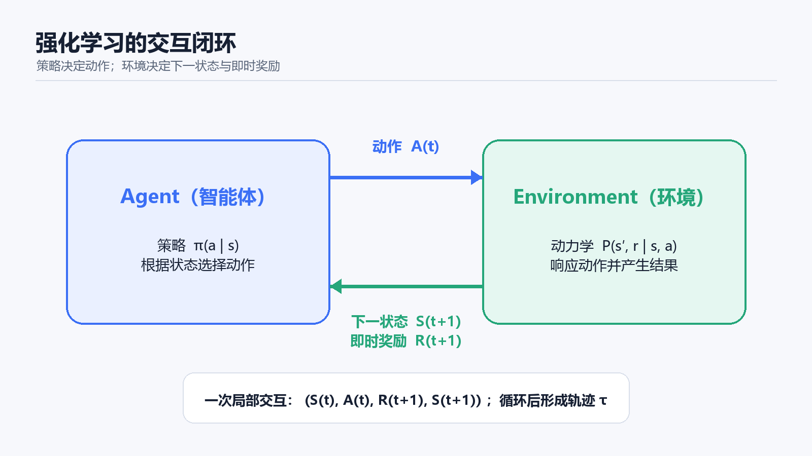
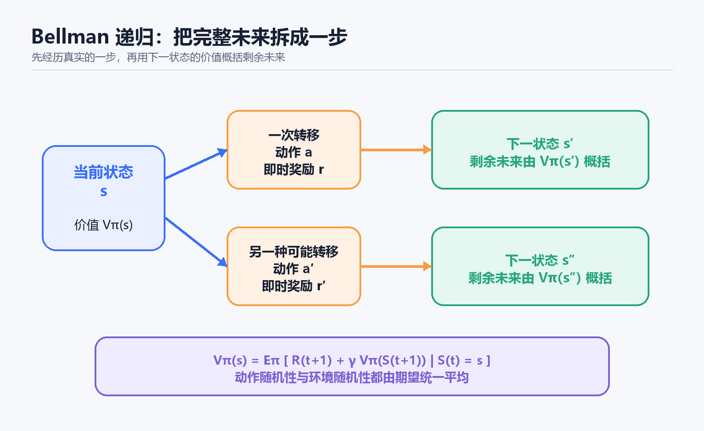
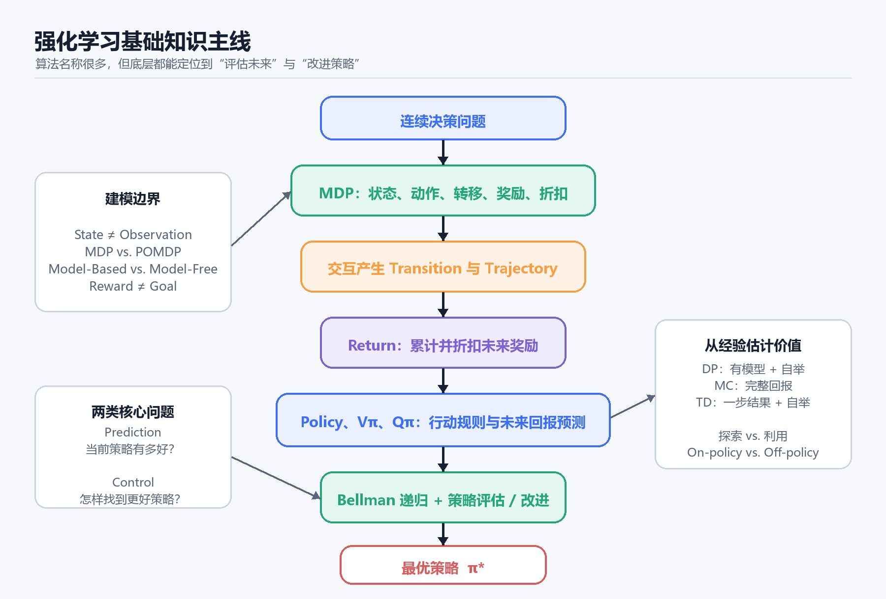

# 强化学习基础：从 MDP 到 Bellman 方程

## 今天学习的内容是什么

强化学习（Reinforcement Learning，RL）研究的是**序列决策**：智能体没有每一步的标准答案，只能通过与环境交互获得奖励，并学习一套能够最大化长期收益的行为策略。

这类问题的难点不在于“当前哪个动作的奖励最高”，而在于当前动作会改变后续状态、可选动作和未来数据；真正好的动作甚至可能先付出代价，经过很多步以后才带来收益。因此，强化学习必须同时处理长期后果、延迟奖励、探索未知行为以及策略改变数据分布等问题。

学习这些基础概念，是因为 Q-learning、DQN、Policy Gradient、Actor-Critic、PPO 等算法虽然形式不同，却都在回答同一组底层问题：如何描述决策环境，如何评价未来，如何从交互经验中学习，以及如何改进策略。本文暂不深入某个具体算法，而是沿着下面的主线建立统一骨架：

> 连续决策 → MDP → 交互数据 → Reward 与 Return → Policy、V 与 Q → Bellman 递归 → 策略评估与改进 → 经典学习方式的分岔。

全文使用一个随机迷宫作为贯穿示例：智能体从起点出发，可选择上、下、左、右；普通移动获得负奖励，撞墙受到更大惩罚，到达终点获得正奖励。动作有时会因地面打滑而偏离预期方向。

## 强化学习为什么不同于监督学习

监督学习通常面对固定数据集中的映射 $x \rightarrow y$ ，每个样本都有标签，可以直接比较预测 $\hat y$ 与正确答案 $y$ 。强化学习没有人逐步告诉智能体“此时应该向右”，环境只在动作执行后返回结果。

强化学习还存在一个更深的区别：**策略会改变自己看到的数据**。迷宫策略总往左走，收集到的经验就集中在左侧区域；策略改为往右走，状态访问分布也会变化。因此训练不是“在固定数据上拟合”，而是一个闭环：

> Policy 决定动作 → 动作决定访问的状态 → 新数据更新 Policy → 更新后的 Policy 又产生不同数据。

## 智能体与环境的交互闭环

在时刻 $t$ ，智能体接收状态 $S_t$ ，按照策略选择动作 $A_t$ 。环境执行动作后，返回即时奖励 $R_{t+1}$ 和下一状态 $S_{t+1}$ ：

$$A_t \sim \pi(\cdot \mid S_t), \qquad (S_{t+1},R_{t+1}) \sim p(\cdot,\cdot \mid S_t,A_t)$$

> 图 1：强化学习的基本交互闭环。阅读重点是职责边界：Policy 属于 Agent，决定怎么行动；状态转移和奖励由 Environment 产生。AI 生成示意图。

一次局部交互记录称为 transition：

$$\left(S_t,A_t,R_{t+1},S_{t+1}\right)$$

很多 transition 首尾相接形成轨迹（trajectory）：

$$\tau = \left(S_0,A_0,R_1,S_1,A_1,R_2,\ldots\right)$$

如果任务从开始运行到终止，例如一局游戏、一次抓取或一次迷宫，完整过程称为 episode。没有自然终点、理论上可以持续运行的交通控制或服务器调度属于 continuing task。

## 用 MDP 描述连续决策环境

### MDP 的五个组成部分

Markov Decision Process（MDP）通常写成：

$$\mathcal{M}=\left(\mathcal{S},\mathcal{A},P,R,\gamma\right)$$

各部分职责如下：

| 符号 | 含义 | 在迷宫中的例子 |
|---|---|---|
| $\mathcal{S}$ | 状态空间，所有可能状态的集合 | 所有可到达网格及必要的环境信息 |
| $\mathcal{A}$ | 动作空间 | 上、下、左、右 |
| $P$ | 状态转移模型 | 向右后 80% 右移、10% 不动、10% 左滑 |
| $R$ | 奖励机制 | 普通移动 -1、撞墙 -5、到达终点 +20 |
| $\gamma$ | 折扣因子 | 控制远期奖励的权重与有效时间尺度 |

环境的完整一步动态可以写成联合概率：

$$p(s',r \mid s,a)=P(S_{t+1}=s',R_{t+1}=r \mid S_t=s,A_t=a)$$

它回答的是：已知当前状态 $s$ 和动作 $a$ ，下一状态 $s'$ 与奖励 $r$ 会以什么概率共同出现。Policy 并不决定世界如何变化；它只决定 Agent 选择什么动作。

### Markov 性不是“过去没有影响”

Markov Property 的准确含义是：给定当前状态和动作以后，过去不再为预测下一步提供额外信息。

$$P(S_{t+1} \mid S_t,A_t,S_{t-1},A_{t-1},\ldots)=P(S_{t+1} \mid S_t,A_t)$$

过去当然影响当前状态；关键是相关历史已经被压缩进 $S_t$ 。例如只知道汽车当前位置通常不足以预测下一秒位置，若把速度也加入状态， $S_t=(x_t,v_t)$ ，状态才更接近对未来充分的信息摘要。因此，Markov 性在很大程度上取决于如何定义状态。

### State 与 Observation 的边界

State 是对环境真实情况、且足以支持未来预测和决策的信息描述；Observation 是 Agent 通过传感器实际获得的局部信息。二者不一定相等：

$$O_t \neq S_t$$

如果 observation 足以恢复 state，可以使用完全可观测 MDP；如果摄像头、雷达或局部视野只能提供部分信息，问题更接近 POMDP。此时 Agent 常利用历史构造内部状态：

$$H_t=f(H_{t-1},O_t,A_{t-1})$$

RNN、Transformer、belief state 或 World Model 的 latent state 都可以承担这种“压缩历史、补足当前观测”的角色，但内部状态只是对真实状态的估计，不应与环境的真实 state 混为一谈。

### Policy 与环境共同产生轨迹

一条有限轨迹在策略 $\pi$ 下出现的概率为：

$$p_\pi(\tau)=p(S_0)\prod_{t=0}^{T-1}\pi(A_t \mid S_t)P(S_{t+1} \mid S_t,A_t)$$

其中 $p(S_0)$ 决定从哪里开始， $\pi$ 决定 Agent 怎么行动， $P$ 决定环境如何响应。这条公式直接说明，轨迹不是单独由 Agent 或环境产生，而是二者共同作用的结果。

## 从即时奖励到长期目标

### Reward 与 Return 必须分开

Reward $R_{t+1}$ 是一次 transition 的即时评价；Return $G_t$ 则把从当前时刻开始的整段未来压缩成一个数：

$$G_t=\sum_{k=0}^{\infty}\gamma^kR_{t+k+1}$$

迷宫中的某一步即时奖励可能为 0，但如果它把 Agent 带到终点附近，其长期价值仍然可能很高。反过来，一个动作立即获得 +10，却在之后导致 -100，也不是好决策。因此强化学习最大化的不是单步 reward，而是长期 return 的期望。

### 折扣因子的三重作用

$\gamma \in [0,1]$ 决定远期奖励的衰减速度。它至少有三种作用：

1. 表达时间偏好： $\gamma$ 越小越关注近期结果，越接近 1 越重视长期结果。
2. 在奖励有界且 $\gamma<1$ 时，使无限时域的 return 有界。
3. 改变有效决策时间尺度，一个常用直觉是：

$$H_{\mathrm{eff}}\approx\frac{1}{1-\gamma}$$

例如 $\gamma=0.9$ 对应大约 10 步的主要影响范围， $\gamma=0.99$ 对应大约 100 步。这不是硬边界，而是理解衰减尺度的近似。

需要特别注意： $\gamma$ 并非无害的计算技巧，它会改变策略偏好。一步后得到 10 与一百步后得到 20，在 $\gamma=1$ 和 $\gamma=0.9$ 下可能对应不同的最优选择。若 episode 必然有限， $\gamma=1$ 也可以是合理设定。

### Return 的递归关系

从定义展开：

$$G_t=R_{t+1}+\gamma R_{t+2}+\gamma^2R_{t+3}+\cdots$$

提取第一项后，括号中的剩余部分正好是 $G_{t+1}$ ，于是得到：

$$G_t=R_{t+1}+\gamma G_{t+1}$$

这条关系是 Bellman 思想的起点：完整未来可以拆成“一步真实结果 + 剩余未来”。它也使终点奖励能够逐步向前传播，为早期状态和动作提供学习信号。

### 信用分配、奖励稀疏与奖励设计

如果一盘棋只在最后给出胜负奖励，Agent 需要判断几十步之前的哪些动作应当为结果负责，这就是信用分配问题（Credit Assignment Problem）。未来奖励传播得越远，归因越困难。

稀疏奖励只在完成任务时提供反馈，目标清晰但学习信号少；密集奖励通过接近目标、节省能耗等中间指标提供更多反馈，却可能扭曲真正目标。例如“接近终点就奖励”可能使 Agent 不愿暂时远离终点绕过障碍。

因此 Reward Function 不是被动评分表，而是在数学上定义 Agent 学什么。理想关系是“最大化奖励能够实现真实目标”；若二者不一致，Agent 可能通过遮挡传感器等意外方式取得高奖励，却没有完成任务，这就是 Reward Hacking 或 specification gaming。

### 整体优化目标

策略的整体表现可写为：

$$J(\pi)=\mathbb{E}_{\tau\sim\pi}[G_0]$$

环境和策略都可能具有随机性，所以单次高回报不能证明策略优秀，需要比较期望表现。强化学习的目标是：

$$\pi^{*}=\arg\max_\pi J(\pi)=\arg\max_\pi\mathbb{E}_{\tau\sim\pi}\left[\sum_{t=0}^{\infty}\gamma^tR_{t+1}\right]$$

这里优化的是覆盖所有相关状态的策略 $\pi$ ，不是只解决当前一步的动作 $a$ 。

## Policy、状态价值与动作价值

### Policy：回答“怎么行动”

随机策略 $\pi(a \mid s)$ 给出状态 $s$ 下动作 $a$ 的概率，满足 $\sum_a\pi(a \mid s)=1$ 。确定性策略也可以写成 $a=\pi(s)$ 。强化学习最终学习的是从状态到行为规则的映射，而不是一个固定动作。

### 状态价值：预测从当前位置出发的未来

状态价值函数定义为：

$$V^{\pi}(s)=\mathbb{E}_\pi[G_t \mid S_t=s]$$

它表示从状态 $s$ 出发，之后一直按照策略 $\pi$ 行动时，未来 return 的期望。上标 $\pi$ 不能随意忽略，因为同一个十字路口在“走向终点”和“走向陷阱”两种策略下价值完全不同。Value 不是状态的固有属性，而是 Environment、Reward 与 Policy 共同决定的预测量。

### 动作价值：预测先做某个动作的未来

动作价值函数定义为：

$$Q^{\pi}(s,a)=\mathbb{E}_\pi[G_t \mid S_t=s,A_t=a]$$

它把第一步动作固定为 $a$ ，此后再按照 $\pi$ 行动。 $Q^{\pi}$ 比 $V^{\pi}$ 多了动作维度，因而能够直接比较当前状态下的候选动作。

### V 与 Q 的关系

在状态 $s$ 下，Policy 会先选择动作。依据全期望公式，对不同动作的 $Q$ 按策略概率加权，就得到 $V$ ：

$$V^{\pi}(s)=\sum_a\pi(a \mid s)Q^{\pi}(s,a)$$

连续动作空间中，求和改为积分：

$$V^{\pi}(s)=\int\pi(a \mid s)Q^{\pi}(s,a)\,da$$

反过来， $Q$ 可以由当前奖励和下一状态的 $V$ 表示：

$$Q^{\pi}(s,a)=\mathbb{E}\left[R_{t+1}+\gamma V^{\pi}(S_{t+1}) \mid S_t=s,A_t=a\right]$$

所以三者分别回答：Policy 说明“我要怎么做”， $V^{\pi}$ 说明“按照当前策略，我所在的状态长期有多好”， $Q^{\pi}$ 说明“我现在先做这个动作，长期有多好”。

## Bellman 方程：用递归表达长期价值

### 从定义推到期望方程

推导从两个已知关系开始：

$$V^{\pi}(s)=\mathbb{E}_\pi[G_t \mid S_t=s]$$

$$G_t=R_{t+1}+\gamma G_{t+1}$$

将第二式代入第一式，并使用下一状态下 return 的条件期望就是 $V^{\pi}(S_{t+1})$ ，得到：

$$V^{\pi}(s)=\mathbb{E}_\pi\left[R_{t+1}+\gamma V^{\pi}(S_{t+1}) \mid S_t=s\right]$$

> 图 2：Bellman backup 将完整未来拆成一步奖励与下一状态价值，并对策略选择和环境结果的随机性求期望。AI 生成示意图。

### 为什么完整公式有两层求和

离散 MDP 中的完整 Bellman Expectation Equation 为：

$$V^{\pi}(s)=\sum_a\pi(a \mid s)\sum_{s',r}p(s',r \mid s,a)\left[r+\gamma V^{\pi}(s')\right]$$

第一层 $\sum_a\pi(a \mid s)$ 对 Agent 可能选择的动作求平均；第二层 $\sum_{s',r}p(s',r \mid s,a)$ 对环境可能产生的下一状态与奖励求平均；括号中的 $r+\gamma V^{\pi}(s')$ 衡量每一种结果的一步回报与剩余未来价值。

动作价值的期望方程为：

$$Q^{\pi}(s,a)=\sum_{s',r}p(s',r \mid s,a)\left[r+\gamma\sum_{a'}\pi(a' \mid s')Q^{\pi}(s',a')\right]$$

Bellman 方程不是单个状态的一条孤立公式，而是一组相互依赖的联立方程。有限状态空间中可以写为：

$$V^{\pi}=R^{\pi}+\gamma P^{\pi}V^{\pi}$$

若逆矩阵存在，则：

$$V^{\pi}=(I-\gamma P^{\pi})^{-1}R^{\pi}$$

这说明环境模型完全已知时，策略评估可以成为线性代数问题；真实任务中 $P$ 和 $R$ 往往未知，才需要从采样经验中估计价值。

### 期望方程与最优方程

Bellman Expectation Equation 评价一个固定策略，所以对动作按 $\pi$ 加权平均。Bellman Optimality Equation 寻找理论上最好的行为，所以把动作平均替换为最大值：

$$V^{*}(s)=\max_a\sum_{s',r}p(s',r \mid s,a)\left[r+\gamma V^{*}(s')\right]$$

最优动作价值满足：

$$Q^{*}(s,a)=\sum_{s',r}p(s',r \mid s,a)\left[r+\gamma\max_{a'}Q^{*}(s',a')\right]$$

Bellman Optimality Equation 是最优价值应满足的数学关系；Q-learning 则是在环境模型未知时，用采样数据逼近这条关系的一种算法。二者不能混为一谈。

## 从价值评估走向策略改进

### Prediction 与 Control

Prediction 或 Policy Evaluation 的问题是：给定策略 $\pi$ ，求 $V^{\pi}$ 或 $Q^{\pi}$ ，判断当前策略有多好。

Control 的问题是：寻找能够最大化 $J(\pi)$ 的最优策略 $\pi^{*}$ 。一种经典思路是在两个过程之间反复循环：

> Policy Evaluation → 得到 Value → Policy Improvement → 得到更好的 Policy → 再次 Evaluation。

这套抽象称为 Generalized Policy Iteration（GPI）。评估与改进不一定严格轮流完成，也可以同时、近似地进行；很多强化学习算法都可以视为 GPI 的不同实现。

如果已知 $Q^{\pi}(s,a)$ ，最直接的贪心改进是让新策略选择当前 $Q$ 最大的动作：

$$\pi'(s)=\arg\max_a Q^{\pi}(s,a)$$

不过只利用当前已知最佳动作会遗漏未知但更好的行为，因此策略改进必须同时面对探索与利用的矛盾。

## 基础方法为什么会分成不同路线

> 图 3：强化学习基础知识的依赖关系。主干从 MDP、轨迹和 Return 推进到价值函数、Bellman 与 GPI；左右分支标出建模边界和从经验估计价值的主要选择。AI 生成示意图。

### Model-Based 与 Model-Free

Model-Based 方法显式拥有或学习环境模型 $\hat P$ 和 $\hat R$ ，因而可以在内部预测未来并进行 planning。World Model 可以看作学习环境动力学与相关信号的一种现代实现。

Model-Free 方法不显式建立可用于预测状态转移的模型，而是直接学习 $V$ 、 $Q$ 或 $\pi$ 。它并非完全不了解环境，而是把环境规律压缩进价值或策略，而不是回答“下一状态是什么”。

Learning 是从实际或离线经验中获取模型、价值或策略；Planning 是利用已有模型推演候选未来。Model-Based RL 往往将二者结合。

### Dynamic Programming、Monte Carlo 与 TD

三类经典价值估计方式的差异如下：

| 方法 | 需要环境模型 | 等待 episode 结束 | 使用自举 | 学习目标 |
|---|---:|---:|---:|---|
| Dynamic Programming | 是 | 否 | 是 | 对已知转移的期望 backup |
| Monte Carlo | 否 | 是 | 否 | 完整真实 return $G_t$ |
| Temporal Difference | 否 | 否 | 是 | $R_{t+1}+\gamma V(S_{t+1})$ |

Bootstrapping（自举）是用一个价值估计更新另一个价值估计。TD 使用真实的一步奖励和估计的下一状态价值，因此能够在线学习；MC 等整条 episode 完成后用真实 return 更新，不依赖下一状态的价值估计。

在常见条件下，MC 目标对当前价值估计的依赖较少，但完整轨迹带来较高方差；TD 因自举可能引入偏差，但通常方差更低。这里的“低偏差、高方差”是帮助理解的总体倾向，不是对所有算法和数据条件都无条件成立的定理。

### On-policy 与 Off-policy

行为策略 $\mu$ 负责和环境交互并产生数据，目标策略 $\pi$ 是真正要评价或改进的策略。

- On-policy： $\mu=\pi$ ，用当前学习的策略收集数据并更新它自己。
- Off-policy： $\mu\neq\pi$ ，用其他行为策略产生的数据学习目标策略。

Off-policy 能复用旧策略、人类或离线数据，样本效率更高，但行为分布与目标分布不同会产生 distribution mismatch，需要额外校正或更谨慎的学习方法。

### Exploration 与 Exploitation

Exploitation 选择当前已知最佳动作以获得收益；Exploration 尝试尚不确定的动作以获取信息。如果始终贪心，Agent 可能永远发现不了尚未尝试的更优动作；如果始终探索，又会持续付出不必要代价。

ε-greedy 是最简单的折中：以 $1-\epsilon$ 的概率选择当前 $Q$ 最大的动作，以 $\epsilon$ 的概率随机探索。它只是解决探索问题的一种方式，entropy bonus、UCB、Thompson sampling 和 intrinsic motivation 也在回答同一个问题：为了长期获得更好的信息，现在是否值得尝试一个看起来并非最优的动作。

## 容易混淆的概念对照

| 概念 | 它回答的问题 | 不应混同为 |
|---|---|---|
| Reward | 这一步反馈是多少？ | 长期价值 |
| Return | 从现在开始累计能得到多少？ | 单步奖励 |
| Policy | Agent 应该怎么行动？ | 环境转移规律 |
| Environment Model | 世界在动作后如何变化？ | Agent 的行为策略 |
| $V^{\pi}(s)$ | 按当前策略，这个状态长期值多少？ | 状态的固有属性 |
| $Q^{\pi}(s,a)$ | 先做该动作、再按当前策略行动，长期值多少？ | 只评价即时动作 |
| Bellman Equation | 价值如何由一步结果与未来价值递归定义？ | 某个具体学习算法 |
| Prediction | 当前策略有多好？ | 寻找最优策略 |
| Control | 怎样找到更好的策略？ | 只计算一个固定策略的价值 |
| Goal | 人真正希望系统实现什么？ | Reward 规格本身 |

## 总结：强化学习基础的统一认识

强化学习不是简单的“做对加分、做错扣分”，而是在随机的序列决策环境中，通过交互数据学习一套最大化长期期望回报的策略。MDP 描述世界；Policy 决定 Agent 怎么行动；Environment 与 Policy 共同产生 trajectory；Reward 经折扣累积成 Return； $V^{\pi}$ 与 $Q^{\pi}$ 预测未来 Return；Bellman 方程把完整未来递归拆成一步结果与剩余价值；Policy Evaluation 与 Policy Improvement 则共同推动策略走向更优。

基础层最值得保留的两个表达式是：

$$\pi^{*}=\arg\max_\pi\mathbb{E}_{\tau\sim\pi}\left[\sum_{t=0}^{\infty}\gamma^tR_{t+1}\right]$$

$$\text{当前长期价值}=\text{一步即时奖励}+\text{折扣后的未来长期价值}$$

完成这层地基后，再学习算法时应先判断它在解决什么问题：是在估计 Value、改进 Policy、学习 Model、处理探索，还是缓解采样与训练稳定性问题。Value-Based 路线可继续按 Dynamic Programming → Monte Carlo → TD → SARSA/Q-learning → DQN 学习；Policy-Based 路线可继续按 Policy Gradient → REINFORCE → Actor-Critic → PPO 学习。
