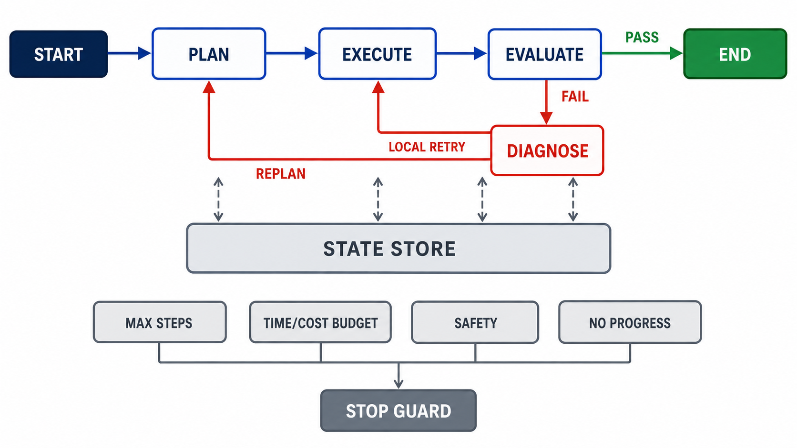

# 循环图工程：从状态演化到反馈控制

## 这篇笔记学习什么

“循环图工程”不是一个已经具有统一定义的标准学术术语。本文把它作为一个**学习性统称**，指 Agent 工程中两类思想的结合：

- **Loop Engineering**：让智能执行体能够持续观察、行动、获得反馈并修正；
- **Graph-based Orchestration**：用显式的节点、边、状态和路由规则组织整个执行过程。

它要解决的不是“怎样画一张图”，而是下面这个更根本的问题：

> 当任务目标相对稳定，但执行路径事先未知，而且执行中可能失败、返工、重规划或等待人工决策时，怎样把任务组织成一个可观察、可约束、最终能够停止的状态演化过程？

学习它的价值在于：真实 Agent 很少只沿一条固定流水线运行。测试结果可能推翻原计划，工具调用可能失败，新增信息可能要求换路线。循环图把这些隐含在大量 `if` 和 `while` 中的控制逻辑显式化，使系统更容易理解、检查和治理。

本文只建立基础理论框架，依次讨论：状态、状态转换、控制流、循环类型、反馈与进展、终止约束，以及它与状态机、控制论和强化学习的关系。具体框架、持久化实现、并发调度和 MCP 不在本文范围内。

## 从线性流程到循环图

### 线性流水线适合路径已知的任务

传统流水线可以抽象为：

$$Input \rightarrow Process \rightarrow Output$$

例如，数据依次经过读取、清洗、统计和导出。它通常假设：

1. 执行路径可以提前确定；
2. 每一步的输入输出较稳定；
3. 流程主要向前推进，完成后退出。

有向无环图（Directed Acyclic Graph，DAG）可以增加分支、并行与汇合，但仍然不允许沿边回到祖先节点。因此，DAG 很适合依赖关系明确的批处理任务，却不天然表达“失败后回去修正”。

### Agent 的后续观察可能推翻先前判断

考虑一个自动编程 Agent：

```text
理解需求 → 制订计划 → 编写代码 → 运行测试 → 评价结果
```

如果测试失败，系统至少有两种可能：

- 只是实现细节有误，应局部修复后重新测试；
- 整体方案有误，应返回规划阶段重新选择路线。

因此，真实路径可能是：

```text
计划 → 实现 → 测试 → 诊断 → 实现 → 测试 → 诊断 → 重新规划 → ……
```

后一步产生的新信息会改变前一步的结论，流程必须允许回边。它不再只是 pipeline，而是一个带环的状态机。

## 核心视角：系统在演化，而不只是节点在运行

把系统在时刻 $t$ 的状态记为 $S_t$ ，采取的动作记为 $A_t$ ，从环境得到的新观察记为 $O_t$ 。一次执行可抽象为：

$$S_{t+1}=F(S_t,A_t,O_t)$$

这个表达式强调：下一状态不只取决于刚执行了哪个节点，还取决于已有历史、实际观察与当前约束。Graph 的作用，是显式规定“在什么状态下，可以进行哪些转换”。

为了同时描述拓扑与运行语义，可以使用一个教学性模型：

$$\mathcal{G}=(V,E,S,R)$$

其中：

- $V$ 是节点集合，每个节点承担某种状态转换；
- $E$ 是允许发生的控制权转移；
- $S$ 是执行过程中共享或传递的状态；
- $R$ 是根据状态选择下一节点的路由规则。

这不是所有框架都采用的正式定义，而是一种便于理解 Agent 执行图的抽象。它提醒我们：执行图不只是拓扑图，还是一套运行规则。



*图：AI 生成示意图。上层展示正常路径与两类回边：局部错误返回执行阶段，方案错误返回规划阶段；中层的 State Store 表示节点围绕同一任务状态工作；下层表示任何循环都必须受步数、时间/成本、安全和无进展检测约束。*

## 第一层：状态——系统当前知道什么、做到哪里、还能做什么

没有状态的重复只是重新抽样，不是基于反馈的改进。例如，连续三次调用同一个生成函数，却没有记录前一次失败原因，等价于：

```text
Generate() → Generate() → Generate()
```

真正的循环需要把失败原因、已有产物和约束带入下一轮。一个抽象状态可以写成：

$$S_t=(G,P_t,O_t,H_t,E_t,C_t)$$

各符号分别表示：

- $G$：Goal，保持相对稳定的任务目标；
- $P_t$：Plan，当前计划或待执行步骤；
- $O_t$：Observation，工具、环境或人的最新反馈；
- $H_t$：History，重要历史与已完成工作；
- $E_t$：Evaluation，错误、评价和质量信号；
- $C_t$：Constraints，权限、预算、截止时间和安全限制。

从工程职责看，状态还可以分为三层：

| 状态层次 | 回答的问题 | 例子 |
|---|---|---|
| 任务状态 | 任务做到哪里了 | 规划中、执行中、等待、失败、完成 |
| 信息状态 | 系统已经知道什么 | 用户目标、搜索结果、测试错误、已有文件 |
| 控制状态 | 当前允许做什么 | 剩余重试次数、是否必须审批、可用工具、预算 |

这个划分很重要：一条错误消息属于信息状态；“还允许重试两次”属于控制状态；“正在诊断”属于任务状态。把三者混在一个字符串中，会让路由和恢复逻辑变得脆弱。

## 第二层：节点——状态转换器，而不是 LLM 的同义词

节点 $T_i$ 可以抽象为：

$$T_i:S_t\rightarrow S_{t+1}$$

它接收当前状态，执行一个职责明确的操作，然后返回状态更新。节点内部可以是 LLM、普通程序、数据库查询、工具调用、人工审批或它们的组合。因此：

> Node 不等于 LLM；Node 是执行图中的一个状态转换边界。

以自动编程 Agent 为例：

- Planner 把“没有可执行方案”的状态转成“具有计划”的状态；
- Coder 根据计划生成或修改代码；
- Tester 产生可复核的测试观察；
- Diagnoser 根据观察判断失败属于实现错误还是方案错误。

好的节点应当有清楚的输入前提、输出变化和失败语义。如果一个节点既规划、又执行、又评价、还自行决定是否结束，那么大部分控制逻辑又被藏回了节点内部，图本身便失去了可解释性。

## 第三层：边与路由——显式表达控制权转移

固定边表示某节点完成后总是执行同一个后继节点。条件边则由当前状态决定去向。若当前节点为 $N_t$ ，可把两个连续步骤写成：

$$S_{t+1}=T_{N_t}(S_t)$$

$$N_{t+1}=R(S_{t+1})$$

第一个函数更新状态，第二个函数选择下一个节点。以评价节点为例：

```text
Evaluate
├─ 达到目标       → END
├─ 实现细节错误   → Fix
├─ 方案层错误     → Plan
├─ 缺少必要信息   → Search / Ask Human
└─ 触发安全限制   → STOP
```

### 数据流与控制流必须分开理解

图中的箭头容易产生歧义：

- **数据流**表示 A 产生的数据被 B 使用；
- **控制流**表示 A 完成后，运行时调度 B。

循环图工程主要显式设计的是控制流；数据则通常经由共享状态、消息或持久化存储传递。真实系统未必只有一个全局可变对象，但“控制路径”和“业务数据”仍应在概念上分开，否则很难判断一条边究竟表示数据依赖还是调度关系。

## 第四层：循环——把反馈转化为下一步行动

最小的有向环是 $A\rightarrow B\rightarrow A$ 。在 Agent 中，环不是一个单一模式，而是一组目的不同的反馈结构。

| 循环类型 | 何时使用 | 状态中必须新增的信息 | 返回位置 |
|---|---|---|---|
| Retry | 方案合理，但发生暂时性执行失败 | 错误、次数、退避信息 | 原操作或其前置节点 |
| Refinement | 结果可用，但质量尚未达标 | 评分、差距、修改建议 | 生成或改写节点 |
| Reflection | 新观察暴露了先前判断的问题 | 观察、归因、修正假设 | 决策节点 |
| Replanning | 当前路线本身不可行 | 失败证据、废弃假设、新约束 | 规划节点 |
| Exploration | 信息不足，需要搜索可行路线 | 假设、证据、已访问空间 | 假设生成或搜索节点 |

这些循环还可归为两大类：

- **局部修正**：目标与总体计划基本不变，只修执行细节；
- **全局修正**：允许改变计划、策略、工具或子目标。

这一区分能避免把所有失败都处理成“再试一次”。若根因是方案错误，机械 retry 只会重复消耗资源；若只是网络抖动，直接全面 replanning 又会浪费已有成果。

## 为什么循环是必要的：用反馈降低不确定性

循环通常来自四类不确定性：

1. **环境不确定性**：API、网页、数据库和外部服务的结果无法提前完全知道；
2. **模型不确定性**：LLM 的推理与生成不保证正确或一致；
3. **信息不完全**：系统开始时尚未获得完成任务所需的全部证据；
4. **计划不确定性**：无法预先知道哪条路线能够达到目标。

因此，循环的本质不是重复，而是：

$$Action\rightarrow Observation\rightarrow Evaluation\rightarrow Correction$$

每一轮都应利用新观察缩小未知空间、修正错误或提高结果质量。如果下一轮看不到上一轮的结果，循环就没有形成闭环。

## 一个贯穿示例：自动编程 Agent

假设目标是“修改一个项目，直到相关测试通过”。最小执行图包含 Plan、Implement、Test、Diagnose 和 End 五类节点。

初始状态可以包含：

```text
goal              用户要求
plan              当前实现方案
changed_files     已修改文件
test_observation  测试输出
failure_class     暂时性错误 / 实现错误 / 方案错误
attempt_count     已尝试次数
budget            剩余时间与成本
status            当前阶段
```

一次典型执行如下：

1. Plan 根据目标建立初始方案；
2. Implement 修改代码，并把变更写入状态；
3. Test 运行验证，产生新的观察；
4. Diagnose 对失败进行分类，而不是立即重试；
5. 实现错误返回 Implement，方案错误返回 Plan，通过则进入 End；
6. 每次转移前，运行时检查安全、预算和无进展条件。

这里最值得注意的是：模型可以提出“下一步应该重试”的语义判断，但真正的控制权转移应由运行时验证后执行。可以把边界概括为：

```text
LLM / Policy 提出结构化意图
            ↓
确定性规则验证意图、权限与约束
            ↓
Graph Runtime 执行被允许的状态转移
```

LLM 不会自己“跳到另一个节点”。它只产生决策数据；调度器才拥有执行能力。这个边界是可控性与安全性的基础。

## 第五层：运行约束——有环之后，怎样保证系统不会失控

### 进展不等于轮数增加

循环是否合法，不代表循环有价值。系统可能在 A 与 B 之间反复切换，却没有更接近目标。可以定义一个任务相关的进展函数：

$$P_t=\mathrm{Progress}(S_t,S_{t+1})$$

进展信号可以是错误数量减少、测试通过率上升、未完成项减少、证据覆盖率提高或评价分数改善。理想循环希望在某个时间窗口内满足 $P_t>0$ ，但对开放式 Agent，这通常只是工程指标，而非数学上可证明的严格单调量。

### 循环可能收敛、振荡或发散

若状态序列逐步逼近目标状态 $S^*$ ，可以写成：

$$S_t\rightarrow S^*$$

但 LLM 是非确定性语义策略，实际系统可能出现：

- **收敛**：错误持续减少，最终达到验收条件；
- **振荡**：在方案 A 与方案 B 之间反复切换；
- **发散**：产物不断变化，却离目标越来越远；
- **停滞**：状态表面更新，关键质量指标没有改善。

因此，“最终收敛”应视为设计目标，而不是循环图自动提供的保证。

### 终止条件必须在循环之外可强制执行

仅依赖模型声称“任务完成”并不可靠。常见终止条件可以表示为：

$$Stop=GoalReached\lor ResourceExhausted\lor Unsafe\lor NoProgress\lor FatalError$$

对应的工程检查包括：

- 目标型：测试通过、约束满足、人工验收；
- 资源型：最大步数、时间上限、成本或 token 预算；
- 安全型：即将执行未授权或高风险动作；
- 进展型：连续多轮没有有效改善，或检测到重复状态；
- 故障型：出现不可恢复错误或关键依赖永久不可用。

终止并不总等于成功。资源耗尽时，系统应返回“未完成、当前产物、失败原因和恢复点”，而不是伪装成已完成。

## 与相关理论的关系和边界

### 与有限状态机的关系

二者都关心状态与允许的转换。传统有限状态机通常具有离散、明确的状态以及确定性转移规则；Agent 状态往往包含文本、工具结果等高维信息，部分转移由概率性模型提出。因此，循环图 Agent 可以借用状态机思想，却不一定是严格意义上的有限状态机。

### 与控制论的关系

二者都有“目标—行动—环境—反馈—修正”的闭环。控制论强调稳定性、误差与反馈；Agent 循环也需要评价当前结果和目标之间的差距。不过，开放式语义任务很难像物理控制系统那样定义连续、可测且平滑的误差，LLM 控制策略也比固定控制器更难分析。

### 与强化学习的关系

强化学习研究策略 $\pi(a\mid s)$ 怎样通过奖励信号被学习出来；循环图工程关注的是已有模型或策略在运行时如何被组织和约束。两者都包含状态、动作、观察和反馈，但循环图本身不等于强化学习，也不要求在线更新模型参数。

### 与 Agent、Graph 和 Harness 的关系

可以使用下面的分层理解：

```text
LLM             提供语义推理与生成能力
Policy          根据状态提出下一步意图
Graph           限定允许存在的执行路径
Runtime/Harness 调度、验证、记录并强制执行约束
Tools/Environment 产生真实世界的结果与观察
```

Graph 的价值不是无条件增加模型能力，而是把模型自由度限制在设计好的动作空间内：

$$A_t\in \mathcal{A}(S_t)\subseteq \mathcal{A}_{all}$$

换句话说，图负责定义“当前允许做什么”，策略只在允许空间内选择下一步。

## Pipeline、DAG 与循环执行图对比

| 特征 | Pipeline | DAG Workflow | Cyclic Execution Graph |
|---|---|---|---|
| 主要路径 | 固定线性 | 可分支、并行、汇合 | 运行时动态选择 |
| 是否允许回边 | 否 | 否 | 是 |
| 失败处理 | 外部异常逻辑 | 独立失败分支 | 可重试、反思、重规划 |
| 状态作用 | 阶段间传值 | 记录任务依赖与结果 | 驱动路由、恢复和停止 |
| 适合任务 | 路径稳定的处理链 | 依赖明确的批处理 | 路径未知、需要反馈的长期任务 |
| 主要风险 | 某步失败导致中断 | 依赖与并发复杂 | 死循环、振荡、成本失控 |

这里不能简单得出“循环图总是更高级”。如果路径已知、步骤确定，pipeline 或 DAG 更简单、更容易验证；只有任务确实需要回退、修正或动态路由时，引入环才有收益。

## 六个需要记住的核心结论

1. 循环图工程的基本对象不是 Prompt，而是随执行演化的 State。
2. Node 是状态转换边界，不是 LLM 的同义词。
3. Edge 表示允许的控制权转移，条件边由状态驱动。
4. Loop 的价值来自反馈；不携带新观察的重复只是随机重试。
5. Graph 通过限制允许路径来约束智能，而不是让模型获得无限自由。
6. 一个可用循环必须能够证明“为什么继续”和“为什么停止”，并监测是否真正产生进展。

## 局限与待深入问题

本文建立的是基础理论地图，仍有几项工程问题没有展开：

- 状态怎样进行模式定义、归并、裁剪与版本迁移；
- checkpoint 怎样支持故障恢复和长时间暂停；
- 并发分支怎样合并状态并处理写冲突；
- 节点怎样做到幂等，重放时怎样避免重复副作用；
- 人工审批、权限和外部工具怎样进入路由规则；
- 怎样构造可靠的评价器、进展指标和无进展检测；
- 怎样用执行轨迹进行调试、评测和安全审计。

这些问题共同决定了一个循环图是“能演示”，还是“能长期可靠运行”。

## 结论

循环图工程可以理解为：通过显式状态、状态转换、条件路由和反馈回路，把路径未知的智能任务限制在一个可观察、可治理的执行空间内，并尝试通过连续反馈逼近目标。

真正的主线不是“图中有一个环”，而是：

```text
状态记录已有事实
→ 节点产生状态变化
→ 路由选择允许的下一步
→ 环把新观察反馈给先前阶段
→ 进展指标判断是否值得继续
→ 终止守卫保证系统最终退出
```

只有这条链条完整，循环才从简单的 `while` 升级为可控的工程结构。

## 延伸阅读

- David Harel, *Statecharts: A Visual Formalism for Complex Systems*, 1987：层次化状态机与复杂系统状态表达的经典来源。<https://doi.org/10.1016/0167-6423(87)90035-9>
- Shunyu Yao et al., *ReAct: Synergizing Reasoning and Acting in Language Models*：展示推理、行动与环境观察交替进行的 Agent 模式。<https://arxiv.org/abs/2210.03629>
- Noah Shinn et al., *Reflexion: Language Agents with Verbal Reinforcement Learning*：讨论利用语言反馈和记忆修正后续尝试的反思式循环。<https://arxiv.org/abs/2303.11366>
