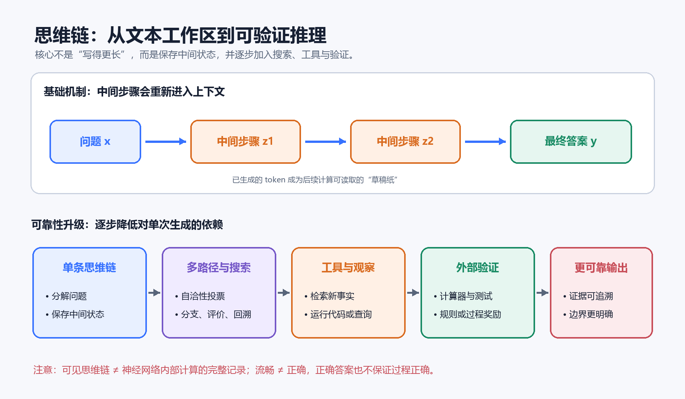

---
aliases:
  - Chain of Thought
  - CoT
tags:
  - 人工智能
  - 大语言模型
  - 推理
created: 2026-08-15
---

# 思维链（Chain of Thought）详解

## 核心结论

思维链（Chain of Thought，CoT）是让语言模型在给出最终答案之前，先生成一系列中间推理步骤的方法。它的主要价值不是让模型“看起来像人一样思考”，而是为复杂任务提供一个可继续读取的**文本工作区**：模型可以在其中分解问题、保存中间结果、逐步推进，并在条件允许时接受检查。

需要始终区分三个概念：

1. 神经网络内部的向量计算；
2. 模型生成的思维链文本；
3. 面向用户整理过的解释。

三者可能相关，但不能简单画等号。尤其是，语言流畅的推理过程并不自动代表正确，也不一定忠实反映答案真正形成的原因。



> 图 1：思维链把中间步骤重新写入上下文，形成可继续计算的文本工作区；自洽性、思维树、工具调用和验证器进一步降低对“单次生成恰好正确”的依赖。AI 生成示意图，用于解释方法之间的关系，不代表论文实验结果。

## 一、什么是思维链

对于一个输入问题 $x$，直接回答可以简化表示为：

$$x \rightarrow y$$

其中 $y$ 是最终答案。思维链则在问题和答案之间引入若干中间步骤：

$$x \rightarrow z_1 \rightarrow z_2 \rightarrow \cdots \rightarrow z_m \rightarrow y$$

这里的 $z_1,z_2,\ldots,z_m$ 可以是条件整理、局部计算、子问题答案、假设或验证结果。

例如：

> 小明有 12 个苹果，又买了原来数量的 1.5 倍，随后送出 8 个。现在有多少个？

一种分步解答是：

1. 原来有 12 个苹果；
2. 新买的数量为 $12\times1.5=18$；
3. 买完共有 $12+18=30$；
4. 送出 8 个后剩余 $30-8=22$。

最终答案是 22 个。这里的每个中间结果都缩小了下一步需要处理的问题范围。

2022 年的经典研究表明，向较大的语言模型展示包含中间推理步骤的示例，可以显著改善部分算术、常识和符号推理任务的表现。这种提示方法被称为 Chain-of-Thought Prompting。

## 二、语言模型如何利用思维链

### 2.1 基础仍然是预测下一个 token

自回归语言模型在生成第 $t$ 个 token 时，估计的是：

$$P(w_t\mid x,w_1,w_2,\ldots,w_{t-1})$$

其中：

- $x$ 是用户输入；
- $w_1,w_2,\ldots,w_{t-1}$ 是已经生成的 token；
- $w_t$ 是下一个待生成 token。

模型并没有因为使用思维链而脱离“预测下一个 token”的基本机制。变化在于：已经生成的中间步骤会成为后续 token 的上下文。

例如，模型生成：

```text
37 × 24
= 37 × (20 + 4)
= 740 + 148
= 888
```

当“740”和“148”已经写入上下文后，后续计算可以直接利用它们。中间文本因此近似于一张不断扩展的草稿纸。

### 2.2 用生成长度换取推理计算

一次生成最终答案时，模型可利用的串行计算过程较短。生成更多有意义的中间 token，则相当于让模型反复执行“读取当前状态—产生新状态”的过程：

```text
读取问题
→ 生成中间结论
→ 把结论重新作为上下文读取
→ 生成下一步结论
→ 得到答案
```

这可以看成一种推理时计算扩展：投入更多生成时间和 token，尝试换取更高的任务正确率。

但生成长度本身不是能力。无意义的重复、错误的中间步骤和冗长措辞只会增加成本，甚至扩大错误传播。

## 三、为什么思维链可能有效

### 3.1 问题分解

复杂问题往往可以拆成多个局部问题：

$$\text{复杂问题}\rightarrow\text{子问题}_1\rightarrow\text{子问题}_2\rightarrow\text{最终答案}$$

模型可能难以直接计算 $37\times24$，但更容易依次完成 $37\times20$、$37\times4$ 和 $740+148$。问题分解降低了每一步的局部难度。

### 3.2 外部化中间状态

中间结果被写进上下文后，不必完全依赖模型在隐藏表示中维持所有状态。这对于以下任务尤其有价值：

- 多位数计算；
- 多跳知识问答；
- 符号状态跟踪；
- 程序执行模拟；
- 多约束规划；
- 需要保存局部结论的证明。

这里的“外部化”是相对于模型内部激活而言：文本仍处于模型上下文中，但已经成为可被后续生成直接注意和引用的显式信息。

### 3.3 引导生成分布

同一个问题存在许多可能的文本续写。直接提问时，模型可能很快进入“给出一个答案”的生成模式；要求先整理条件、列公式并检查，则会把生成路径引向类似教材解答、证明和程序分析的文本模式。

因此，思维链既提供了额外计算空间，也改变了模型更可能选择的生成路径。

### 3.4 提供局部检查点

如果只看到最终答案，很难判断错误发生在哪里。分步过程至少允许检查：

- 是否正确理解题意；
- 是否遗漏条件或加入未经说明的假设；
- 所用公式是否适用；
- 数值代入和局部计算是否正确；
- 下一步是否真的能从上一步推出。

这种可检查性有实用价值，但不意味着思维链完整揭示了模型的内部机制。

## 四、经典思维链方法

### 4.1 少样本思维链

少样本思维链（Few-shot CoT）先向模型提供几个包含推理过程的示例，再让模型模仿这种形式解决新问题：

```text
问题：一盒有 6 支笔，4 盒有多少支？
分析：每盒 6 支，共 4 盒，所以 6 × 4 = 24。
答案：24 支。

问题：一本书每天读 18 页，读 5 天后还剩 30 页，
这本书共有多少页？
分析：……
```

高质量示例应当与目标任务结构相似，包含必要步骤，并明确区分推导和最终答案。示例中的错误也可能被模型模仿，因此示例质量比单纯增加数量更重要。

### 4.2 零样本思维链

零样本思维链（Zero-shot CoT）不提供完整示例，只加入类似“请逐步思考”的指令。早期研究发现，简单加入 “Let’s think step by step” 就能改善当时一些大模型在多步推理基准上的表现。

在实际使用中，更具体的结构化指令通常比泛泛要求“逐步思考”更容易检查：

```text
先列出已知条件和目标，再分步求解。
检查单位、边界条件和算术，最后单独给出答案。
```

### 4.3 自洽性采样

自洽性（Self-Consistency）不只生成一条推理路径，而是采样多条彼此不同的路径，再选择最一致的最终答案：

```text
路径 A → 42
路径 B → 42
路径 C → 37
路径 D → 42
多数结果 → 42
```

如果用 $z$ 表示一条潜在推理路径，那么答案概率可以写为：

$$P(y\mid x)=\sum_z P(y,z\mid x)$$

实际系统无法遍历全部路径，因此采样 $N$ 条路径，用答案出现频率近似选择：

$$\hat{y}=\mathop{\mathrm{arg\,max}}_y\sum_{i=1}^{N}\mathbf{1}\left[f(z_i)=y\right]$$

其中 $f(z_i)$ 表示路径 $z_i$ 得到的答案，$\mathbf{1}[\cdot]$ 是指示函数。

自洽性的优势是减少对单次生成的依赖；代价是需要多次生成，推理更慢、成本更高。如果所有路径共享同一个错误前提，多数投票依然可能得出错误结论。

## 五、思维链能力如何训练

### 5.1 预训练中的基础能力

模型在预训练语料中接触数学解答、教材推导、程序代码、证明、操作说明和论证文本，从中学习分步文本的常见结构。这构成了通过提示激活思维链能力的基础。

### 5.2 有监督微调

训练数据可以直接采用：

$$\left(\text{问题},\text{推理步骤},\text{答案}\right)$$

模型同时学习中间过程和最终答案。主要困难是高质量推理数据成本较高，而且“答案正确”不保证中间步骤正确：过程可能包含跳步、循环论证、偶然抵消的错误，或者依据已知答案反向编造。

### 5.3 自举生成

STaR（Self-Taught Reasoner）的基本循环是：

1. 使用少量示例生成大量候选推理；
2. 保留最终答案正确的样本；
3. 使用筛选后的样本继续微调；
4. 让更新后的模型生成新一轮推理；
5. 重复上述过程。

它说明模型可以利用自身生成的数据提升推理表现，但只按最终答案过滤仍可能保留“答案对、过程错”的轨迹，因此通常还需要更强的验证机制。

### 5.4 结果监督与过程监督

结果监督（Outcome Supervision）只判断最终答案是否正确；过程监督（Process Supervision）则检查每个中间步骤，并指出第一个错误发生在哪里。

```text
结果监督：最终答案 ✓

过程监督：步骤 1 ✓ → 步骤 2 ✓ → 步骤 3 ✗
```

过程监督提供了更细粒度的学习信号。一项针对 MATH 数据集的研究在其实验设置下发现，过程监督训练出的奖励模型优于只监督最终结果的方法。不过，逐步标注的人工成本也更高。

## 六、思维链不等于内部真实思考

### 6.1 三个不同层次

**内部计算**由向量表示、注意力、非线性变换、逐层激活传播和 token 概率计算构成。它不是在网络内部逐字书写自然语言句子。

**生成的思维链**是模型输出的中间文本。它可能参与后续计算，也可能包含对某种解题模式的模仿或事后整理。

**面向用户的解释**主要服务于理解和核查，通常会省略无效尝试、合并重复步骤、补充背景，并重新组织语言。

因此，更准确的关系是：

$$\text{内部计算}\neq\text{生成的思维链}\neq\text{面向用户的解释}$$

### 6.2 忠实性问题

思维链的忠实性（faithfulness）关注：生成的解释是否真正反映了导致最终答案的因素。常见问题包括：

- **事后合理化**：模型先偏向某个答案，再生成一段支持它的过程；
- **遗漏影响因素**：模型受到题目中某个诱导线索影响，却没有在解释中提到它；
- **关键跳步**：使用“显然”跳过真正困难或无效的一步；
- **正确答案配错误过程**：多个错误偶然抵消；
- **错误答案配流畅过程**：语言形式像证明，但逻辑并不成立。

因此，思维链可以作为检查线索，但不能直接被当作神经网络内部决策过程的透明窗口。

## 七、从链式推理到搜索与工具

### 7.1 从简单到复杂

Least-to-Most 方法先显式分解问题，再按依赖关系逐个解决子问题。它适用于组合性强、后一个问题依赖前一个答案的任务。

### 7.2 思维树

普通思维链沿着单一路径向前生成：

```text
A → B → C → 答案
```

思维树（Tree of Thoughts，ToT）则维护多个候选分支：

```text
         ┌→ B1 → C1
问题 A ──┼→ B2 → C2 → 答案
         └→ B3
```

系统可以生成候选步骤、评价分支、保留更有希望的路径，并在必要时回溯。因此，思维树的关键不是“写得更详细”，而是把语言模型嵌入搜索过程。

### 7.3 推理与行动交替

ReAct 将推理和外部行动交替进行：

```text
分析 → 执行动作 → 获得观察 → 更新分析 → 再行动
```

动作可以是搜索资料、运行代码、查询数据库或操作软件。它解决了纯文本思维链的一个根本限制：推理只能重新组合当前已有的信息，而工具能够带回新的事实和可验证结果。

### 7.4 外部验证器

对于数学、代码和结构化任务，可以让模型负责提出候选方案，再由计算器、符号求解器、编译器、单元测试或规则系统检查。此时系统不必完全相信自然语言推理，而是把关键结论交给可执行机制验证。

## 八、什么时候适合使用思维链

思维链比较适合：

- 多步骤数学和逻辑题；
- 算法设计与代码调试；
- 多条件决策和规划；
- 可以逐步验证的科学推导；
- 需要明确假设、证据和不确定性的分析。

它不一定适合：

- 简单事实查询；
- 翻译或短文本改写；
- 一步即可完成的分类；
- 强实时性信息查询；
- 缺少关键外部事实的问题。

例如，“法国首都是哪里”不需要长篇推理。额外步骤只会增加延迟，并给模型制造更多产生错误陈述的机会。

## 九、怎样设计更有效的提示

重点不应是要求模型输出冗长的“全部思考”，而应要求一个结构清晰、可核查、适合当前任务的解答。

### 数学问题

```text
列出已知量、未知量和所用公式，再分步计算。
检查单位、边界条件和算术，最后单独给出答案。
```

### 代码问题

```text
先说明预期行为和实际行为，再根据代码证据定位故障点。
提出最小修改方案，并给出可以验证修复的测试。
```

### 事实研究

```text
把来源支持的事实、合理推断和不确定部分分开。
不要仅凭逻辑补全缺失的现实信息。
```

### 决策分析

```text
先明确目标、约束和评价标准，再逐项比较方案。
指出哪些结论依赖个人偏好，哪些依赖可验证事实。
```

一个实用原则是：

$$\text{可靠推理输出}=\text{结构化}+\text{可验证}+\text{有证据}+\text{明确边界}$$

## 十、如何检查一条思维链

### 10.1 检查前提

- 是否遗漏题目条件？
- 是否偷偷加入题目没有提供的假设？
- 外部事实是否有可靠且足够新的来源？

### 10.2 检查局部推导

对每一步检查：

$$z_i\Rightarrow z_{i+1}$$

即下一步是否真的能由上一步推出，而不是只在语言上衔接自然。

### 10.3 检查精确计算

将关键计算交给计算器、代码、符号求解器、SQL 查询或单元测试。语言模型适合组织问题和提出计算结构，不应被默认视为精确计算器。

### 10.4 使用独立路径复核

应当采用另一种方法重新求解，而不只是让模型阅读原答案后说“检查无误”。同一条链上的错误容易被后续步骤继承，独立解法更可能暴露共同前提之外的问题。

### 10.5 寻找反例和边界

可以继续追问：

```text
这个结论在什么条件下不成立？
能否构造一个反例？
输入为 0、负数、空集合或极端值时会怎样？
```

这通常比泛泛要求“再检查一次”更有效。

## 十一、常见误解

### 误解一：步骤越多，推理越强

真正重要的是每一步是否有效、是否推进了问题。重复改写题目不构成有效推理。

### 误解二：答案正确，过程就正确

错误可能偶然抵消；选择题还可能被猜中。需要分别评价最终结果和中间过程。

### 误解三：过程写出来，就完全可解释

自然语言思维链最多提供一种可读的推理轨迹，不能完整还原分布式神经网络中的内部计算。

### 误解四：思考可以代替事实检索

模型无法仅靠更长的推理可靠地产生它不知道的实时事实。缺少信息时，应检索、调用工具或明确表示无法确认。

### 误解五：让模型自行检查就足够

同一个模型的复核可能重复原有偏差。高可靠性任务应优先使用独立求解、外部工具、规则约束或人工审查。

## 十二、总结

思维链可以被理解为一种语言化的中间计算机制：模型生成中间步骤，再把这些步骤作为新的上下文继续处理。它之所以有用，主要因为它能够分解问题、保存中间状态、引导生成路径，并提供局部检查点。

随着方法的发展，推理系统逐渐从“生成一条链”扩展到：

```text
直接回答
→ 单条思维链
→ 多路径采样与投票
→ 分支搜索与回溯
→ 推理和工具行动交替
→ 外部验证器或过程奖励模型
```

越往后，系统越少依赖一次生成恰好正确，而越多地依靠搜索、反馈、外部信息和可验证计算。

最终需要同时记住思维链的价值和边界：

> 它的价值是给复杂计算提供中间状态；它的风险是流畅的推理文本很容易让人误以为它必然真实、忠实且正确。

## 参考资料

1. Wei, J. et al. [Chain-of-Thought Prompting Elicits Reasoning in Large Language Models](https://arxiv.org/abs/2201.11903), 2022.
2. Kojima, T. et al. [Large Language Models are Zero-Shot Reasoners](https://arxiv.org/abs/2205.11916), 2022.
3. Wang, X. et al. [Self-Consistency Improves Chain of Thought Reasoning in Language Models](https://arxiv.org/abs/2203.11171), 2022.
4. Zelikman, E. et al. [STaR: Bootstrapping Reasoning With Reasoning](https://arxiv.org/abs/2203.14465), 2022.
5. Yao, S. et al. [ReAct: Synergizing Reasoning and Acting in Language Models](https://arxiv.org/abs/2210.03629), 2022.
6. Yao, S. et al. [Tree of Thoughts: Deliberate Problem Solving with Large Language Models](https://arxiv.org/abs/2305.10601), 2023.
7. Lightman, H. et al. [Let's Verify Step by Step](https://arxiv.org/abs/2305.20050), 2023.
8. Lyu, Q. et al. [Faithful Chain-of-Thought Reasoning](https://arxiv.org/abs/2301.13379), 2023.
9. Anthropic. [Reasoning Models Don't Always Say What They Think](https://www.anthropic.com/research/reasoning-models-dont-say-think).
