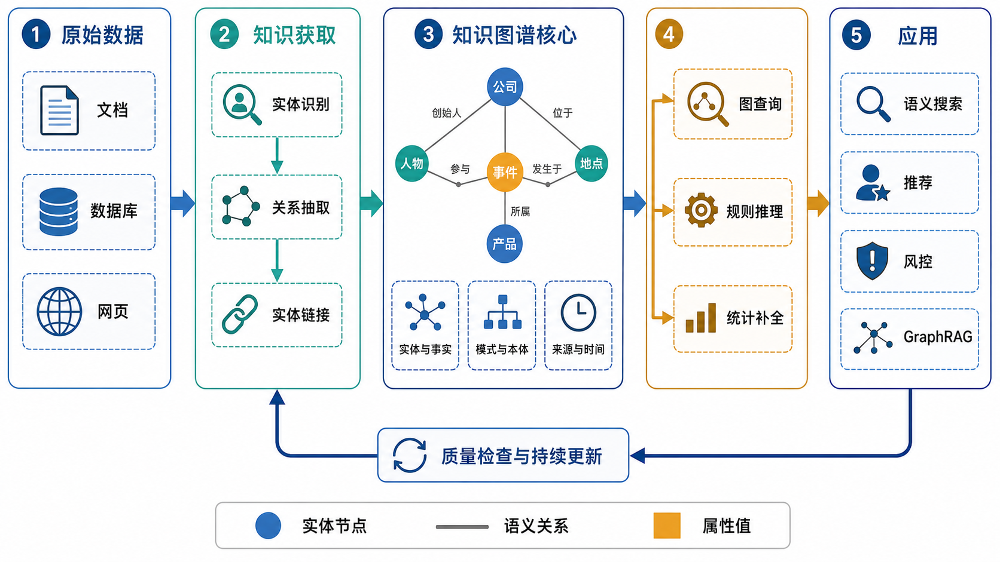

# 知识图谱：从语义建模到查询、推理与补全

## 一、知识图谱要解决什么问题

现实世界中的知识通常分散在文档、网页、业务数据库和人的经验中。传统表格能够很好地保存结构固定的数据，但当对象类型不断增加、关系高度异构、同一实体具有多个名称，或者问题需要跨越多层关系时，只保存孤立记录会越来越难以表达知识之间的联系。

知识图谱（Knowledge Graph，KG）的核心目标是：

> 以实体为中心，把现实对象、概念、事件及其语义关系组织成机器可存储、查询、连接和推理的图结构。

它关注的不只是“有哪些数据”，还要回答：

- 一条记录说的是哪个现实实体？
- 两个实体之间是什么语义关系？
- 哪些实体与关系是合法的？
- 一条事实来自哪里、何时有效、可信程度如何？
- 能否通过路径、规则或统计模型得到新的结论或候选事实？

知识图谱并没有唯一且完全统一的工程定义。不同系统可能采用 RDF、本体、属性图或其他图模型，但高质量知识图谱通常都重视实体身份、关系语义、模式约束、证据来源和持续维护。

## 二、最基本的表示：三元组

知识图谱最基本的事实单元是三元组：

$$\mathrm{Triple}=(h,r,t)$$

也可以写成：

$$h\xrightarrow{r}t$$

其中：

- $h$ 是头实体（head entity），即关系起点；
- $r$ 是关系（relation），也叫谓词；
- $t$ 是尾实体（tail entity）或属性值，即关系终点。

例如：

```text
（图灵，出生于，伦敦）
（图灵，从事领域，计算机科学）
（图灵，出生年份，1912）
（计算机科学，属于，学科）
```

“伦敦”和“计算机科学”可以作为实体继续连接其他知识；`1912` 通常是数字字面量，只承担属性值的角色。

一个简化知识图谱可以形式化为：

$$\mathcal{G}=(\mathcal{E},\mathcal{R},\mathcal{T},\mathcal{L})$$

其中：

- $\mathcal{E}$：实体集合，例如人物、公司、论文和地点；
- $\mathcal{R}$：关系类型集合，例如“任职于”“引用”和“位于”；
- $\mathcal{T}$：事实三元组集合；
- $\mathcal{L}$：字符串、数字、日期等字面量集合。

三元组集合满足：

$$\mathcal{T}\subseteq\mathcal{E}\times\mathcal{R}\times(\mathcal{E}\cup\mathcal{L})$$

这个表达式说明：三元组的主体是实体，客体既可以是另一个实体，也可以是普通属性值。

## 三、知识图谱的整体结构



*AI 生成示意图：展示知识图谱从原始数据、知识获取、核心语义结构，到图查询、规则推理、统计补全和下游应用的完整流程。底部回路强调图谱必须经过质量检查并持续更新；图查询、规则推理和统计补全是三种不同能力。*

知识图谱不是一次抽取后就不再变化的静态文件，而是一个持续运行的知识系统：新数据进入后需要重新进行实体链接、事实融合、冲突检查和版本更新；应用中的错误反馈又会反过来暴露图谱的缺失或错误。

## 四、知识图谱的四个层次

### 1. 身份层：它到底是谁

名称不等于实体身份。“苹果”可能指水果，也可能指 Apple Inc.；“北京大学”“北大”和“Peking University”则可能是同一实体的不同名称。

知识图谱通常为每个实体分配唯一标识，并把名称作为标签或别名：

```text
entity_001
  类型：公司
  中文名：苹果公司
  英文名：Apple Inc.
  别名：Apple
```

因此应当记住：

> 实体由身份标识，而不是由名称标识。

从文本中识别出一个名字只是实体识别；判断它对应图谱中的哪个现实对象，属于实体链接或实体消歧。不同图谱之间寻找等价实体，则通常称为实体对齐。

### 2. 事实层：实体之间是什么关系

裸三元组只能表达最简事实。现实中的关系往往还具有时间、地点、角色、来源和置信度，可以扩展表示为：

$$F=(h,r,t,q,p,c)$$

其中：

- $h$、$r$、$t$：主体、关系和客体；
- $q$：限定信息（qualifier），例如开始时间、结束时间、职位或地点；
- $p$：证据来源（provenance）；
- $c$：置信度或审核状态。

例如：

```text
事实：（张三，任职于，A公司）
开始时间：2022-04
结束时间：2025-06
职位：算法工程师
来源：A公司年度报告
审核状态：已确认
```

时间非常重要。下面两条事实可以同时成立，而不是互相冲突：

```text
（张三，任职于，A公司），有效时间：2022—2024
（张三，任职于，B公司），有效时间：2025年至今
```

### 3. 模式层：允许描述什么

模式层（Schema）规定实体类型、关系类型、属性类型和使用约束。例如：

```text
实体类型：人物、研究者、公司、城市、论文

关系“任职于”：
  主体类型：人物
  客体类型：组织

关系“作者”：
  主体类型：论文
  客体类型：人物
```

有了这些约束，系统就可以发现下面的类型或方向异常：

```text
（某大学，任职于，张三）
```

本体（Ontology）通常比一般模式更强调概念之间的正式语义、逻辑关系和约束，例如子类、逆关系、对称关系和传递关系。工程中并非所有知识图谱都具有严格的 OWL 本体；有些只使用较轻量的标签、关系类型和数据校验规则。

### 4. 证据层：为什么相信这条事实

一条“看起来合理”的三元组不等于已经确认的知识。例如：

```text
（A公司，收购，B公司）
```

还应进一步区分：

- 是计划收购还是已经完成？
- 来源是官方公告、新闻报道还是模型推测？
- 原始证据位于哪份文档、哪一段？
- 事实在什么时间范围内有效？
- 是否经过人工审核？
- 是否存在更权威或更新的冲突来源？

高质量图谱不仅保存结论，还应尽可能保存结论的证据链。

## 五、本体、TBox 与 ABox

可以把本体理解为一个领域的“词汇表加语义规则”，把具体事实理解为使用这套语言写出的句子。

在语义知识表示中，经常区分：

- **TBox（Terminological Box）**：类别、关系、层次和规则；
- **ABox（Assertional Box）**：具体实体及其事实断言。

例如：

```text
TBox：教授是研究者的子类
ABox：张三是一名教授
```

如果使用相应的继承规则，可以推出：

```text
张三是一名研究者
```

常见语义关系包括：

### 子类关系

```text
教授 ──子类──→ 研究者
研究者 ──子类──→ 人物
```

如果张三是一名教授，可以推出张三也是研究者和人物。

### 逆关系

```text
张三 ──任职于──→ A公司
A公司 ──雇用──→ 张三
```

若“雇用”被正式定义为“任职于”的逆关系，其中一条事实可以推导出另一条。

### 对称关系

如果“合作过”被定义为对称关系：

```text
张三 ──合作过──→ 李四
```

可以推出：

```text
李四 ──合作过──→ 张三
```

### 传递关系

在适用的语义下：

```text
实验室 ──位于──→ 某大学
某大学 ──位于──→ 北京
```

可以推出实验室位于北京。但“朋友”通常不具有传递性：张三是李四的朋友、李四是王五的朋友，不能推出张三是王五的朋友。因此，关系是否具有传递性必须由领域语义决定，不能只根据图中存在一条路径就擅自推断。

## 六、开放世界假设

许多基于 RDF/OWL 的知识系统采用开放世界假设（Open World Assumption）：图中没有某条事实，只能表示系统目前不知道，而不能自动推出它为假。

$$\mathrm{not\ known}(P)\neq\mathrm{known}(\neg P)$$

例如图中没有：

```text
（张三，会说，法语）
```

这不等于已经知道“张三不会说法语”。它也可能只是尚未收集到相关信息。

与之相对，许多完整清单式业务数据库使用封闭世界假设：如果某条记录不在完整数据中，就按不存在处理。两种假设没有绝对优劣，应根据场景选择：公共知识通常不完整，开放世界更合理；经过完整盘点的库存系统更适合封闭世界。

## 七、查询、图遍历、规则推理与统计补全

这四种能力必须严格区分。

### 1. 图查询

图查询从已经存储的图中匹配节点、关系或属性。例如：

```text
问题：张三发表了哪些论文？
模式：张三 ←作者─ 论文
```

它主要读取显式存在的事实。

### 2. 图遍历与多跳查询

多跳查询沿一条或多条边寻找路径。例如：

```text
张三
  ←作者─ 论文
  ─作者→ 合作者
  ─任职于→ 大学
```

它可以回答“张三的合作者分别任职于哪些大学”。但走过多条边并不自动构成逻辑推理，它可能只是读取了一条更长的既有路径。

### 3. 规则推理

规则推理根据明确前提和逻辑规则推出新结论。例如：

$$(x,\mathrm{instanceOf},A)\land(A,\mathrm{subClassOf},B)\Rightarrow(x,\mathrm{instanceOf},B)$$

如果已知“张三属于教授”和“教授是研究者的子类”，就可以推出“张三属于研究者”。该结论是否成立取决于前提、规则及采用的逻辑语义。

### 4. 统计补全

知识图谱通常不完整，统计模型可以对缺失的实体或关系进行排序。例如给定：

```text
（张三，任职于，？）
```

模型从候选实体中预测较可能的答案。统计补全产生的是候选事实或可信分数，不是逻辑证明，也不是事实来源。

四者的边界可以概括为：

| 能力 | 主要输入 | 主要输出 | 输出是否等于已证实事实 |
|---|---|---|---|
| 图查询 | 已存储图和查询模式 | 已存在的节点、边、属性 | 取决于原图质量 |
| 多跳遍历 | 已存储图和路径条件 | 已存在的关系路径 | 路径存在不代表任意语义结论成立 |
| 规则推理 | 事实、规则和逻辑语义 | 可演绎的新结论 | 在给定前提和规则下成立 |
| 统计补全 | 训练图、表示模型、候选实体 | 分数或候选排序 | 否，需要证据或审核确认 |

## 八、知识图谱嵌入：以 TransE 为例

知识图谱嵌入（Knowledge Graph Embedding，KGE）把实体和关系映射到低维向量空间，用于链接预测、候选排序和表示学习。

在 TransE 中：

$$\mathbf{e}_h,\mathbf{e}_r,\mathbf{e}_t\in\mathbb{R}^{d}$$

其中：

- $d$：嵌入维度；
- $\mathbf{e}_h$：头实体向量；
- $\mathbf{e}_r$：关系向量；
- $\mathbf{e}_t$：尾实体向量。

TransE 希望真实三元组近似满足：

$$\mathbf{e}_h+\mathbf{e}_r\approx\mathbf{e}_t$$

一种常见距离分数是：

$$f(h,r,t)=\left\|\mathbf{e}_h+\mathbf{e}_r-\mathbf{e}_t\right\|_p$$

距离越小，模型通常认为候选三元组越合理。但这个分数不是：

- 事实为真的校准概率；
- 严格逻辑证明；
- 因果关系；
- 来源可信度；
- 最终业务价值。

它只反映模型从训练图结构中学习到的相对兼容程度。高分候选仍应经过原始证据检查、规则校验或人工审核。

## 九、图神经网络与知识图谱

知识图谱是知识表示和数据结构；图神经网络（Graph Neural Network，GNN）是学习图结构的一类模型。知识图谱可以完全不使用神经网络，也可以作为图神经网络的输入。

关系图神经网络的一般思想是：实体从不同关系类型的邻居接收信息。一个简化表达为：

$$\mathbf{h}_v^{(l+1)}=\sigma\left(\sum_{r\in\mathcal{R}}\sum_{u\in\mathcal{N}_r(v)}\frac{1}{c_{v,r}}\mathbf{W}_r^{(l)}\mathbf{h}_u^{(l)}\right)$$

其中：

- $v$：当前实体；
- $u$：邻居实体；
- $\mathcal{N}_r(v)$：通过关系 $r$ 与 $v$ 相连的邻居集合；
- $\mathbf{h}_u^{(l)}\in\mathbb{R}^{d_l}$：第 $l$ 层中邻居 $u$ 的表示；
- $\mathbf{W}_r^{(l)}\in\mathbb{R}^{d_{l+1}\times d_l}$：关系 $r$ 对应的线性变换；
- $c_{v,r}$：归一化系数；
- $\sigma$：非线性函数。

直觉上，“作者”“引用”和“任职于”传递的信息含义不同，所以不同关系应当采用不同的参数或变换方式。

GNN 输出的实体表示可以用于节点分类、链接预测或推荐，但同样不能自动代替事实证据或形式逻辑。

## 十、RDF 与属性图

知识图谱工程中常见两种表示路线。

### RDF

RDF 使用主体—谓词—客体三元组表示事实，并通过 IRI 标识资源。它强调标准化语义、跨系统链接与互操作，常与 RDFS、OWL 和 SPARQL 配合。

### 属性图

属性图允许节点和边直接携带键值属性。例如：

```text
(张三:Person {age: 35})
  -[:WORKS_AT {start_year: 2022, source: "年报"}]->
(A公司:Company)
```

属性图适合直接表达带有业务属性的节点与关系，常使用 Cypher 等图查询语言。

| 需求 | 常见选择倾向 |
|---|---|
| 标准化语义交换、跨组织数据链接 | RDF |
| 正式本体与逻辑推理 | RDF/RDFS/OWL |
| 业务关系查询和路径分析 | 属性图通常更直接 |
| 边携带较多业务属性 | 属性图通常更方便 |
| 强调全局唯一语义标识 | RDF 更自然 |

这不是“先进与落后”的差别，而是建模重点不同。图数据库是一种存储与查询技术；使用图数据库并不自动意味着已经构建了具有清晰语义和治理机制的知识图谱。

## 十一、知识图谱的构建流程

### 1. 确定目标问题

知识图谱不是实体和关系越多越好。首先应明确希望回答的问题。例如企业风险图谱可能关注股东、法定代表人、投资、诉讼和地址关系，而不需要收集与目标无关的全部互联网信息。

### 2. 设计模式或本体

确定：

- 实体类型；
- 关系类型和方向；
- 属性及其数据类型；
- 关系的定义域和值域；
- 唯一性、时间和基数约束；
- 来源、审核状态和版本字段。

模式设计应服务于目标查询，而不是追求形式上的复杂。

### 3. 知识获取

从结构化、半结构化和非结构化来源获得候选知识，常见任务包括：

- 命名实体识别；
- 实体类型判断；
- 关系和事件抽取；
- 共指消解；
- 实体链接。

### 4. 知识融合与精炼

不同来源可能使用不同名称、模式和时间口径，需要进行：

- 实体消歧与对齐；
- 重复事实合并；
- 模式映射；
- 冲突检测；
- 来源权重与时间有效性判断；
- 约束检查和人工复核。

### 5. 存储、查询与服务

根据需求选择 RDF 三元组库、属性图数据库、关系数据库或混合方案，并通过查询接口、搜索服务、推荐系统或大模型应用提供能力。

### 6. 知识演化

实体会更名，任职关系会结束，来源会被修正，旧事实也可能失效。因此需要增量更新、版本管理、时间建模、删除策略和质量监控。

## 十二、知识图谱质量评价

仅用节点数或三元组数不能评价知识图谱质量。

对于抽取任务，常用准确率、召回率和 F1：

$$P=\frac{TP}{TP+FP}$$

$$R=\frac{TP}{TP+FN}$$

$$F_1=\frac{2PR}{P+R}$$

其中：

- $TP$：正确抽取的目标事实；
- $FP$：被抽取但实际错误的事实；
- $FN$：应抽取但被遗漏的事实；
- $P$：抽取结果中正确事实的比例；
- $R$：目标事实被找回的比例。

但完整的图谱质量还应检查：

- 实体链接准确率；
- 重复实体比例；
- 关系方向错误率；
- 类型与约束违反率；
- 冲突事实比例；
- 来源可追溯率；
- 时间信息完整率；
- 数据新鲜度；
- 关键业务问题的覆盖率；
- 下游任务中的实际效果。

抽取模型的 F1 很高，不代表图谱一定有用；如果它准确抽取了大量无关事实，却无法回答目标问题，工程仍然失败。同样，图谱补全指标较高也不等于所有预测事实都可信。

## 十三、知识图谱与大语言模型

大语言模型与知识图谱的优势互补。

大语言模型擅长：

- 阅读自然语言；
- 识别实体、关系和事件；
- 理解模糊表达；
- 把检索结果组织成自然语言答案。

知识图谱擅长：

- 维持实体身份一致；
- 保存明确关系和时间；
- 进行结构化查询；
- 展示多跳路径；
- 保留来源；
- 应用确定性规则。

一种典型结合流程是：

```text
用户问题
  ↓
大模型识别实体和查询意图
  ↓
查询知识图谱中的实体、关系和证据
  ↓
返回相关子图或路径
  ↓
大模型根据证据生成答案
```

GraphRAG 不是单一、统一的固定算法。通常它表示利用图结构进行检索和组织上下文的一类方法；图可以是实体关系图、文档关系图、社区摘要图或其他任务图。使用知识图谱的 GraphRAG 更强调通过实体与关系获得结构化上下文和多跳证据。

需要警惕以下风险：

- 大模型把“计划加入”错误抽成“已经加入”；
- 两个同名实体被错误合并；
- 图中存在一条路径，却被模型解释成不存在的因果关系；
- 图谱检索结果正确，但模型总结时添加了无证据内容；
- 过时事实没有时间限定，被当作当前事实使用。

理想情况下，应尽量保留：

```text
生成结论 → 图中路径 → 原始事实 → 文档证据
```

## 十四、知识图谱与 Agent 执行图的区别

知识图谱和 Agent 图工程都使用节点与边，但图的语义不同。

| 概念 | 节点 | 边 | 解决的问题 |
|---|---|---|---|
| 知识图谱 | 人物、公司、论文、概念、事件 | 任职于、引用、属于等语义关系 | 世界中有什么，以及彼此是什么关系 |
| Agent 执行图 | Agent、工具、程序步骤、人工审核点 | 执行顺序、条件跳转、失败重试 | 任务如何执行、失败回哪里、何时停止 |

例如：

```text
知识图谱：张三 ──任职于──→ A公司

Agent执行图：抽取文档 → 检查结果
                         ├─合格→ 写入图谱
                         └─不合格→ 返回重新抽取
```

二者可以组合：使用带循环和条件路由的 Agent 执行图构建、检查和维护知识图谱。此时，Agent 图描述“系统怎样工作”，知识图谱描述“系统保存了什么知识”。

## 十五、局限性与常见误区

### 1. 图结构不保证事实正确

错误信息一旦结构化，可能显得比原文更确定，因此必须保存来源、时间和审核状态。

### 2. 路径不等于语义结论

图中存在 `A→B→C`，不能脱离关系类型直接声称 A 与 C 具有某种确定关系。

### 3. 本体并非越复杂越好

过度复杂的模式会提高维护和数据映射成本。应从目标问题和核心关系出发逐步扩展。

### 4. 补全分数不等于真实概率

嵌入模型和 GNN 的输出是依据训练结构得到的候选分数，必须与事实证据、校准和业务阈值区分。

### 5. 不完整性是常态

知识图谱只表示当前收集和建模到的知识，不等于现实世界的完整副本。

### 6. 持续维护通常比首次抽取更难

真实系统需要处理实体变化、冲突来源、时间有效性、版本和删除传播。没有治理与更新机制的知识图谱会迅速过时。

## 十六、复习主线

可以用下面五个问题重建知识图谱的整体理解：

1. **说的是谁？**——实体身份、唯一标识、别名和实体链接。
2. **它与谁有什么关系？**——三元组、属性、事件和限定信息。
3. **允许怎样描述？**——模式、本体、类型和逻辑约束。
4. **为什么相信？**——来源、时间、置信度、审核与版本。
5. **还能得到什么？**——图查询、多跳遍历、规则推理和统计补全。

最重要的边界是：

> 图查询读取已有事实；规则推理在明确语义下演绎结论；统计补全根据结构规律预测候选。三者的输出不能混为一谈。

## 参考资料

1. W3C. [RDF 1.2 Concepts and Abstract Data Model](https://www.w3.org/TR/rdf12-concepts/).
2. Wikidata. [Data model](https://www.wikidata.org/wiki/Help:Data_model).
3. Neo4j. [Graph database concepts](https://neo4j.com/docs/getting-started/appendix/graphdb-concepts/).
4. Zhong, L., Wu, J., Li, Q., Peng, H., & Wu, X. [A Comprehensive Survey on Automatic Knowledge Graph Construction](https://doi.org/10.1145/3618295). ACM Computing Surveys, 2023.
5. Ji, S., Pan, S., Cambria, E., Marttinen, P., & Yu, P. S. [A Survey on Knowledge Graphs: Representation, Acquisition, and Applications](https://doi.org/10.1109/TNNLS.2021.3070843). IEEE Transactions on Neural Networks and Learning Systems, 2022.
6. Bordes, A., Usunier, N., Garcia-Durán, A., Weston, J., & Yakhnenko, O. [Translating Embeddings for Modeling Multi-relational Data](https://proceedings.neurips.cc/paper/2013/hash/1cecc7a77928ca8133fa24680a88d2f9-Abstract.html). NeurIPS, 2013.
