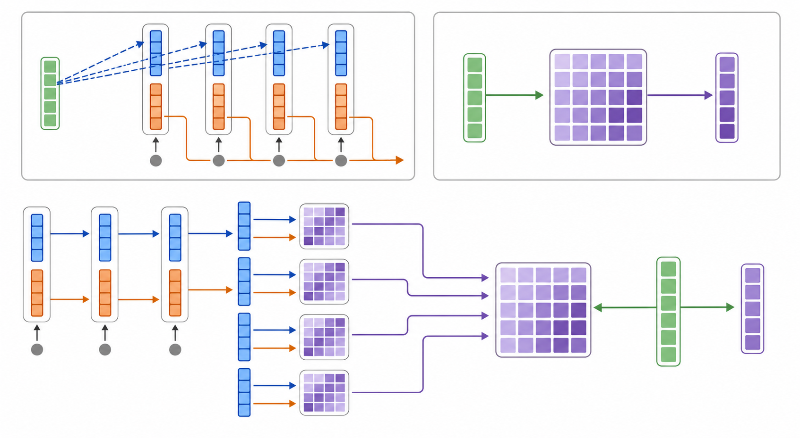

# 线性注意力详解

## 学习目标

这篇笔记回答四个问题：标准注意力为什么随上下文长度变慢？`sim` 是什么？线性注意力怎样把注意力改写为可递推的状态？这种加速交换了什么能力？

本文的“线性注意力”主要指以核特征映射和递推矩阵状态为核心的一类方法。它不等于 FlashAttention，也不等于仅压缩每个 token KV 的 MLA。

## 1. 标准注意力：逐个查询完整历史

对于长度为 $N$ 的序列，每个 token 的隐藏表示会投影为 Query、Key 和 Value：

$$Q\in\mathbb{R}^{N\times d_k},\quad K\in\mathbb{R}^{N\times d_k},\quad V\in\mathbb{R}^{N\times d_v}$$

标准缩放点积注意力为：

$$\mathrm{Attention}(Q,K,V)=\mathrm{softmax}\left(\frac{QK^\top}{\sqrt{d_k}}\right)V$$

其中，第 $i$ 个 token 的输出是所有 Value 的加权平均：

$$o_i=\sum_{j=1}^{N}\alpha_{ij}v_j$$

$$\alpha_{ij}=\frac{\exp(q_i^\top k_j/\sqrt{d_k})}{\sum_{\ell=1}^{N}\exp(q_i^\top k_\ell/\sqrt{d_k})}$$

这里 $q_i$ 问“我正在找什么”，$k_j$ 描述“第 $j$ 条历史信息的索引”，$v_j$ 则是实际可被取回的内容。每一个 $q_i$ 都要与全部 $k_j$ 比较，因此会形成大小为 $N\times N$ 的匹配关系，主要计算量随 $N$ 为 $O(N^2d)$。

在因果语言模型的解码阶段，KV Cache 避免了重复计算历史 token 的 Key、Value，但第 $t$ 步的新 Query 仍需与前 $t$ 个 Key 比较。因此上下文越长，单步生成越慢。

## 2. `sim`：相似度函数到底是什么

`sim` 是 similarity 的简写，表示“相似度函数”。它接收一个 Query 和一个 Key，输出一个分数：

$$\mathrm{sim}(q_i,k_j)\in\mathbb{R}$$

这个分数越大，表示 $q_i$ 与 $k_j$ 越匹配，$v_j$ 在输出中通常就应占更大比重。`sim` 不是唯一固定的公式，而是对一类函数的统称。

标准 Softmax 注意力对应的未归一化相似度为：

$$\mathrm{sim}(q_i,k_j)=\exp\left(\frac{q_i^\top k_j}{\sqrt{d_k}}\right)$$

把 Softmax 权重的分子和分母代回输出：

$$o_i=\sum_j\frac{\mathrm{sim}(q_i,k_j)}{\sum_\ell\mathrm{sim}(q_i,k_\ell)}v_j$$

由于分母不依赖求和下标 $j$，可以提到求和外：

$$\boxed{o_i=\frac{\sum_j\mathrm{sim}(q_i,k_j)v_j}{\sum_j\mathrm{sim}(q_i,k_j)}}$$

这就是讨论中图片里的改写。它没有改变 Softmax 注意力，只是把“归一化后的权重求和”写成“未归一化加权和除以权重总和”。

例如，若两个未归一化相似度为 $2$ 和 $8$，归一化后权重就是 $0.2$ 与 $0.8$，输出为 $0.2v_1+0.8v_2$。分母的作用是把全部非归一化分数变成和为 $1$ 的权重。

## 3. 线性化的关键：可分解的相似度

线性注意力暂时不要求相似度一定是 Softmax，而寻找或近似如下形式：

$$\mathrm{sim}(q,k)=\phi(q)^\top\phi(k)$$

其中，$\phi$ 是把向量映射到 $r$ 维特征空间的特征映射：

$$\phi:\mathbb{R}^{d_k}\rightarrow\mathbb{R}^{r}$$

代入一般注意力形式：

$$o_i=\frac{\sum_j\phi(q_i)^\top\phi(k_j)v_j}{\sum_j\phi(q_i)^\top\phi(k_j)}$$

由于 $\phi(q_i)$ 对求和下标 $j$ 是常量，利用矩阵乘法结合律：

$$o_i=\frac{\phi(q_i)^\top\left(\sum_j\phi(k_j)v_j^\top\right)}{\phi(q_i)^\top\left(\sum_j\phi(k_j)\right)+\varepsilon}$$

定义两个汇总量：

$$S=\sum_j\phi(k_j)v_j^\top,\quad z=\sum_j\phi(k_j)$$

于是：

$$\boxed{o_i=\frac{\phi(q_i)^\top S}{\phi(q_i)^\top z+\varepsilon}}$$

这里 $S\in\mathbb{R}^{r\times d_v}$ 是 Key 特征与 Value 的关联记忆，$z\in\mathbb{R}^{r}$ 用于归一化，$\varepsilon$ 用于避免分母过小。关键变化是：不再先构造 $N\times N$ 的 Query--Key 匹配矩阵，而是先汇总历史，再读取汇总状态。



*图：上方左侧表示标准注意力中一个 Query 分别访问多个历史 Key--Value；上方右侧表示 Query 从单个固定大小矩阵中读取；下方表示线性注意力将每个历史 Key 特征（蓝）与 Value（橙）的外积写入矩阵，再累积成状态。绿色为 Query，紫色为矩阵状态/输出。AI 生成示意图，用于解释计算与记忆结构，并非论文实验图。*

## 4. 因果线性注意力：矩阵状态如何递推

在语言模型中，第 $t$ 个位置只能看到前缀 $1,\ldots,t$。因此可保存前缀状态：

$$S_t=\sum_{j=1}^{t}\phi(k_j)v_j^\top,\quad z_t=\sum_{j=1}^{t}\phi(k_j)$$

新 token 到来时只需更新：

$$S_t=S_{t-1}+\phi(k_t)v_t^\top$$

$$z_t=z_{t-1}+\phi(k_t)$$

然后读取：

$$o_t=\frac{\phi(q_t)^\top S_t}{\phi(q_t)^\top z_t+\varepsilon}$$

这揭示了它与 RNN 的关系：$S_t,z_t$ 是固定尺寸的隐藏状态；每一时刻写入一次、读取一次，不必扫描整段历史。若 $r,d_v$ 固定，单步解码成本不随上下文长度 $t$ 增长，总成本随序列长度近似线性增长。

## 5. 核心代码：一个可递推的因果线性注意力层

下面是用于理解的最小 PyTorch 实现。它采用 $\phi(x)=\mathrm{ELU}(x)+1$，因此 Key 特征与 Query 特征均为正值；这不是精确 Softmax 注意力，而是与本文公式一致的核化线性注意力。为突出递推过程，序列维度使用 Python 循环；实际训练通常会用 scan 或分块 CUDA kernel 将它并行化。

```python
import torch
import torch.nn as nn
import torch.nn.functional as F


class CausalLinearAttention(nn.Module):
    """用于教学的因果核化线性注意力。

    输入 x:     [batch, length, model_dim]
    缓存 state: (S, z)
      S:         [batch, heads, head_dim, head_dim]
      z:         [batch, heads, head_dim]
    输出 y:     [batch, length, model_dim]

    每个注意力头取 r = d_v = head_dim；因此状态 S 的前一维对应
    特征映射 phi(k) 的维度，后一维对应 value 的维度。
    """

    def __init__(self, model_dim: int, num_heads: int, eps: float = 1e-6):
        super().__init__()
        assert model_dim % num_heads == 0
        self.model_dim = model_dim
        self.num_heads = num_heads
        self.head_dim = model_dim // num_heads
        self.eps = eps

        # 一次投影同时得到 Q、K、V；这与普通多头注意力相同。
        self.qkv_proj = nn.Linear(model_dim, 3 * model_dim, bias=False)
        self.out_proj = nn.Linear(model_dim, model_dim, bias=False)

    @staticmethod
    def feature_map(x: torch.Tensor) -> torch.Tensor:
        # phi(x) = ELU(x) + 1，保证特征为正，便于稳定归一化。
        return F.elu(x) + 1.0

    def forward(self, x: torch.Tensor, state=None):
        batch, length, _ = x.shape
        heads, d = self.num_heads, self.head_dim

        qkv = self.qkv_proj(x).view(batch, length, 3, heads, d)
        q, k, v = qkv.unbind(dim=2)                     # 各为 [B, L, H, d]
        q = self.feature_map(q)
        k = self.feature_map(k)

        if state is None:
            # 对长序列或低精度训练，可在这里让 S、z 始终保持 float32。
            S = x.new_zeros(batch, heads, d, d)          # [B, H, r, d_v]
            z = x.new_zeros(batch, heads, d)             # [B, H, r]
        else:
            S, z = state

        outputs = []
        for t in range(length):
            k_t = k[:, t]                                # [B, H, r]
            v_t = v[:, t]                                # [B, H, d_v]
            q_t = q[:, t]                                # [B, H, r]

            # 写入：S_t = S_{t-1} + phi(k_t) v_t^T
            S = S + torch.einsum("bhr,bhv->bhrv", k_t, v_t)
            z = z + k_t                                  # z_t = z_{t-1} + phi(k_t)

            # 读取：phi(q_t)^T S_t / (phi(q_t)^T z_t + eps)
            numerator = torch.einsum("bhr,bhrv->bhv", q_t, S)
            denominator = (q_t * z).sum(dim=-1, keepdim=True)
            outputs.append(numerator / (denominator + self.eps))

        y = torch.stack(outputs, dim=1)                   # [B, L, H, d_v]
        y = y.reshape(batch, length, self.model_dim)
        return self.out_proj(y), (S, z)
```

代码与公式的对应关系如下：

| 数学符号 | 代码变量 | 形状（单头） | 作用 |
| --- | --- | --- | --- |
| $\phi(k_t)$ | `k_t` | `[r]` | 写入地址 |
| $v_t$ | `v_t` | `[d_v]` | 写入内容 |
| $S_t$ | `S` | `[r, d_v]` | Key--Value 关联记忆 |
| $z_t$ | `z` | `[r]` | 归一化状态 |
| $\phi(q_t)$ | `q_t` | `[r]` | 读取地址 |
| $o_t$ | `numerator / denominator` | `[d_v]` | 当前输出 |

### 流式生成时如何复用状态

训练时可以把整段 $x$ 一次传入；自回归生成时，每次只传入长度为 $1$ 的新 token，并将上一步返回的 `state` 再传回去。这样不会保存或重新扫描全部历史 KV：

```python
layer = CausalLinearAttention(model_dim=512, num_heads=8)
state = None

for x_t in generated_token_hidden_states:  # 每个 x_t: [batch, 1, 512]
    y_t, state = layer(x_t, state)
    # y_t 供后续残差、MLP 和词表预测层使用
```

这段实现故意只展示注意力核心，未包含位置编码、残差连接、归一化、MLP、掩码批处理优化或 GLA/Delta Rule 的门控写入。它适合验证公式和理解缓存接口，不应直接当作高性能训练内核。

## 6. 为什么这会节省 KV Cache

标准注意力需要保存所有历史的 $(k_j,v_j)$，缓存大小随 $N$ 增长。递推线性注意力只保存 $S_t$ 和 $z_t$，其尺寸不随历史 token 数增加：

| 项目 | 标准 Softmax 注意力 | 递推线性注意力 |
| --- | --- | --- |
| 历史记忆 | 每个 token 的 Key、Value | 一个矩阵状态 $S_t$ 与向量状态 $z_t$ |
| 历史大小 | 随 $N$ 增长 | 与 $N$ 无关 |
| 单步解码 | 需访问全部历史 KV | 读取固定状态 |
| 读取能力 | 可以重新比较任意历史 token | 从压缩记忆中读取 |

这里必须与 MLA 区分：MLA 是压缩**每个历史 token** 的 KV 表示，因此缓存仍随 $N$ 增长；递推线性注意力是把整个前缀汇总为固定大小状态。

## 7. Softmax 可以被完全线性化吗

标准注意力的相似度是指数点积核：

$$\exp(q^\top k/\sqrt{d_k})$$

它一般不能用小维度、有限维的 $\phi(q)^\top\phi(k)$ 完全精确表示。因此常见路线有两种：

1. **更换核函数。** 例如使用正值特征映射 $\phi(x)=\mathrm{ELU}(x)+1$。这使计算可精确递推，但机制已不再是原始 Softmax 注意力。
2. **近似 Softmax 核。** Performer 使用随机特征近似指数点积核；特征维度越大，通常近似越准确，但状态与计算也越大。

两条路线的共同点是利用可分解形式；差别在于前者改变相似度，后者努力逼近 Softmax 相似度。

## 8. 固定状态的代价：它不是无损压缩

基础线性注意力把任意长历史压进固定大小的 $S_t$。这带来高效推理，也带来有限容量与信息干扰：

- **Key 冲突。** 若两个 Key 在特征空间中相似，它们的 Value 会写入相近位置，读取时可能混合。
- **难以精确逐 token 检索。** 标准注意力能在原始 KV 列表上重新计算针对当前 Query 的权重；线性注意力只能读取被汇总过的状态。
- **简单累加不会主动遗忘。** $S_t=S_{t-1}+\phi(k_t)v_t^\top$ 会一直保留旧内容，旧信息可能干扰新信息。
- **数值稳定性。** 归一化分母需要正值特征、缩放与 $\varepsilon$ 等机制保持稳定。

因此，线性注意力不是“免费得到无限长上下文”，而是用有限、可学习的关联记忆替代逐 token 的完整历史。

## 9. 现代改进：门控与 Delta Rule

### 门控：决定忘记什么

门控线性注意力会让旧状态按数据依赖的门衰减：

$$S_t=G_t\odot S_{t-1}+\phi(k_t)v_t^\top$$

其中 $G_t$ 的元素通常在 $0$ 到 $1$ 之间。接近 $1$ 表示保留旧记忆，接近 $0$ 表示遗忘。门控解决的是不同信息应保存多久的问题。

### Delta Rule：纠正而非只叠加

如果状态已经为某个 Key 存过内容，简单相加可能导致新旧 Value 混在一起。Delta Rule 先读取旧预测：

$$\hat v_t=S_{t-1}^\top k_t$$

再以预测误差更新：

$$S_t=S_{t-1}+\beta_tk_t(v_t-\hat v_t)^\top$$

其中 $\beta_t$ 是写入强度。直觉上，它不是把新 Value 原样加进去，而是仅写入“当前状态尚未表示正确”的误差部分，更接近对已有键值关联进行覆盖或修正。

门控解决大范围的衰减与遗忘，Delta Rule 解决特定 Key 的定向更新；现代模型常尝试将二者结合，并采用分块并行算法来兼顾训练效率和递推推理。

## 10. 容易混淆的概念

| 名称 | 解决的问题 | 与线性注意力的关系 |
| --- | --- | --- |
| FlashAttention | 降低精确 Softmax 注意力的显存访问开销 | 算术复杂度仍是 $O(N^2)$，不是递推线性注意力 |
| Performer | 以随机特征近似 Softmax 核 | 一类核化线性注意力 |
| GLA | 使用数据依赖门控管理递推状态 | 一类门控线性注意力 |
| DeltaNet | 用误差修正代替纯累加写入 | 一类更强的递推线性注意力 |
| MLA | 缩窄每个 token 的 KV Cache | 缓存仍随 $N$ 增长，不是固定状态记忆 |

## 11. 复习时应记住的主线

1. `sim` 是 Query 与 Key 的未归一化匹配分数；标准注意力中它是 $\exp(q^\top k/\sqrt{d_k})$。
2. 图中的一般式只是把 Softmax 加权平均改写为“加权和除以权重总和”。
3. 若 $\mathrm{sim}(q,k)=\phi(q)^\top\phi(k)$，就能先把历史写入 $S$，再由 Query 读取，避免 $N\times N$ 比较。
4. 因果线性注意力可写成固定尺寸矩阵状态的递推式，因此长上下文解码不会随历史长度线性变慢。
5. 固定状态也是瓶颈：它会压缩、混合和遗忘信息；门控与 Delta Rule 是改善记忆管理的关键方向。

## 资料与边界

- Katharopoulos et al., [Transformers are RNNs: Fast Autoregressive Transformers with Linear Attention](https://arxiv.org/abs/2006.16236), 2020：经典核化线性注意力与递推视角。
- Choromanski et al., [Rethinking Attention with Performers](https://arxiv.org/abs/2009.14794), 2020：以随机特征近似 Softmax 核的 Performer/FAVOR+。
- Yang et al., [Gated Linear Attention Transformers with Hardware-Efficient Training](https://arxiv.org/abs/2312.06635), 2023：门控线性注意力与硬件高效训练。
- Yang et al., [Parallelizing Linear Transformers with the Delta Rule over Sequence Length](https://arxiv.org/abs/2406.06484), 2024：Delta Rule 的并行训练。
- Yang et al., [Gated Delta Networks: Improving Mamba2 with Delta Rule](https://arxiv.org/abs/2412.06464), 2024：门控与 Delta Rule 的结合。

本文的复杂度讨论强调对序列长度 $N$ 的渐近变化。实际速度还受隐藏维度、特征维度、GPU 算子、内存访问与实现质量影响；在短上下文上，优化良好的 Softmax/FlashAttention 可能更快。
